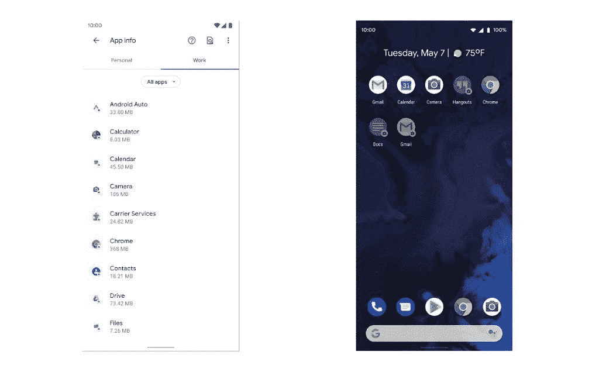

# 独家:谷歌计划放宽安卓企业安全更新推荐

> 原文：<https://www.xda-developers.com/google-android-enterprise-recommended-security-updates-relax/>

根据 IDC*的数据，Android 是智能手机操作系统的主流，而苹果的 iOS 是大多数企业的首选操作系统。原因显而易见:苹果更新其 iOS 设备的时间通常比大多数 Android 设备制造商更新其智能手机的时间长得多，也更一致，iPhones 的配置和管理简单，如果一家公司选择苹果，需要支持的 SKU 也少得多。但企业选择 Android 设备也有原因，包括成本降低和硬件更灵活。为了让 Android 对工作场所更具吸引力，谷歌在 2015 年初推出了“Android for Work”(后来在 2016 年末更名为“Android Enterprise”[)。随后在 2018 年初，谷歌推出了](https://www.xda-developers.com/google-launches-website-for-androids-enterprise-presence/) [Android 企业推荐(AER)计划](https://www.xda-developers.com/google-introduce-android-enterprise-recommended-program/)来认证设备供商业使用。谷歌编纂了一系列要求，设备必须满足这些要求才能成为“安卓企业推荐”，包括最低硬件规格、支持批量部署、解锁设备的可用性、在托管配置文件中运行的应用程序行为的一致性，以及在至少三年内发布 90 天内交付安卓安全更新。*

 *然而，由 Android 开发者@ [deletescape](https://twitter.com/deletescape) 披露并由 *XDA 开发者*审查的文件显示，谷歌正计划放松对 Android 企业推荐设备的安全更新要求。相反，谷歌正在推动供应商在处理安全更新的方式上更加透明。据@deletescape 称，这些文档是在过去 15 天内与供应商共享的。因此，虽然我们不能保证 Android Enterprise Recommended 的这些提议的更改会进入最终的需求列表，但我们至少可以确认 Google 最近已经考虑了这些更改。

目前有 [170 种不同的 Android 设备](https://androidenterprisepartners.withgoogle.com/devices/#!/?aer)是 Android 企业推荐的。 [HMD Global，索尼，摩托罗拉](https://www.xda-developers.com/android-enterprise-recommended-17-devices/)， [OPPO](https://www.xda-developers.com/oppo-find-x2-series-reno3-pro-are-oppos-first-android-enterprise-recommended-smartphones/) ，当然还有[谷歌](https://www.xda-developers.com/google-pixel-3a-xl-arcore-android-enterprise-recommended/)，都提供 AER 的设备。甚至一加也在考虑通过该项目对其设备进行认证。不过，知名消费智能手机品牌并不是唯一销售 Android 企业推荐设备的公司。[来自 Zebra、Honeywell、成膳任等公司的坚固智能手机](https://www.xda-developers.com/rugged-devices-android-enterprise-recommended-5-years-security-updates/)也包括在该计划中，现在[甚至运营商](https://www.xda-developers.com/android-enterprise-recommended-carriers/)也可以直接向企业销售 AER 设备，前提是他们迅速批准安全维护版本。

*Android 10 中的设备配置流程。来源:[杰森·拜顿](https://bayton.org/2019/06/android-enterprise-partner-summit-2019-highlights/)*

进入 AER 所需的[要求列表](https://www.android.com/enterprise/recommended/requirements/)并不广泛——考虑到较低的基本硬件要求，更多的 Android 设备可以进入该列表。甚至 AER 的软件需求也不需要供应商做出很多改变，正如几份谷歌内部文件所概述的那样。其中一份文件概述了供应商如何为工作档案中的应用程序设计图标徽章，在启动器中为工作档案应用程序添加专用标签，在个人和工作档案中分离应用程序的共享目标，预加载某些谷歌应用程序，以及管理跨档案数据通信。另一个文档概述了工作简档启动器选项卡、工作简档快速设置磁贴、工作简档对话框、启动器教育消息、上下文切换和其他系统设计元素的 UX 要求。这些要求旨在促进 Android 企业推荐设备之间可接受的硬件和软件 UX 一致性的最低标准。

 <picture></picture> 

Work profile UX changes in Android 11\. Left: Personal tab and work tab in Settings > App info. Right: Work app icons grayed out when the work profile is paused. Source: Google.

然而，似乎要求设备在每月 [Android 安全公告(ASB)](https://www.xda-developers.com/how-android-security-patch-updates-work/) 后快速获得安全补丁更新对许多供应商来说是一个太高的障碍。

## **谷歌力推安卓企业更新透明推荐**

Android 开发者@ [deletescape](https://twitter.com/deletescape) ，最近分享了一份泄露的[谷歌 Android 11](https://www.xda-developers.com/android-11-best-features-not-required/) 兼容性定义文件草案，获得了一份泄露的新 Android 企业对运行 Android 11 的设备的建议要求草案。在“**设备安全**”部分，我们复制如下，谷歌提议删除 AER 项目的一些要求。根据这些新提出的规则，AER 设备将不再保证在 ASB 后 90 天内收到安全补丁更新。有趣的是，图表中的一行表明，随着向 Android 10 的转移，谷歌实际上将这一要求从 90 天收紧到 30 天，但谷歌仍然没有更新[公开的要求列表](https://www.android.com/enterprise/recommended/requirements/)以反映这一变化。尽管如此，根据提议的变化，这一要求将不再适用于运行 Android 11 的 Android 企业推荐设备。此外，供应商也不再需要为 AER 设备提供 3 年定期安全更新。但是，他们仍然需要提供“紧急安全维护发布”(ESMR)更新，这可能意味着他们只需推出包含关键安全漏洞修复程序的更新。

### Android 10 与 Android 11 的对比——推荐的 Android 企业设备安全要求

| **类别** | **序列号** | **必须/可以** | **属性和实现** | **评论** |
| **问(安卓 10)** | **R(安卓 11)** |
| **设备安全** | 一 | 可能 | 实施 OEM 漏洞奖励计划(VRP) | 实施 OEM 漏洞奖励计划(VRP) |  |
|  | 2 | 可能 | StrongBox 支持 | StrongBox 支持 |  |
|  | 3 | 可能 | 硬件支持的密钥库支持 | 硬件支持的密钥库支持 |  |
|  | 四 | 可能 | [设备 ID 证明支持](https://source.android.com/security/keystore/attestation) | [设备 ID 证明支持](https://source.android.com/security/keystore/attestation) |  |
|  | 5 | 可能 | [密钥证明支持](https://developer.android.com/training/articles/security-key-attestation) | [密钥证明支持](https://developer.android.com/training/articles/security-key-attestation) |  |
|  | 6 |  | 30 天安全更新 | *要求已删除* | 替换为安全透明要求 |
|  | 七 | 必须 | 对紧急安全维护版本的 3 年支持(ESMR) | 对紧急安全维护版本的 3 年支持(ESMR) | 替换为安全透明要求 |
|  | 8 | [基于文件的加密-默认开启。使用 AOSP 实现。](https://source.android.com/security/encryption/file-based) | *要求删除* | 这是对所有设备强制执行的 GMS 要求 | 这是对所有设备强制执行的 GMS 要求 |
| 9 | 9 | 90 天安全更新 | *要求删除* | 替换为安全透明要求 | 替换为安全透明要求 |
| 10 | 10 | 3 年安全更新支持(第三年 5 月，ESMR) | *要求已删除* | 替换为安全透明要求 | 替换为安全透明要求 |
| 11 | 11 | 发布最新的安全补丁级别 | *要求已删除* | 替换为安全透明要求 | 正如图表中所提到的，谷歌提议用新的“透明”要求来取代这些要求。事实上，谷歌正在提议增加一个名为“**安全/操作系统更新透明性**”的新章节新的要求详细说明了要求供应商如何发布信息，如安全维护版本的终止日期、可用的最新安全补丁、设备接收更新的频率、每个更新中包含的修复、设备的发货和计划的软件更新等。有趣的是，谷歌还要求 Android 11 设备在成为 Android 企业推荐设备之前，必须经过 ioXt 联盟的认证测试。ioXt 联盟是一个公司联盟，其目标是提高物联网产品的安全性。其成员包括亚马逊、脸书、谷歌、恩智浦等等。谷歌表示，拥有这一认证将增加透明度，大概是因为它将为企业提供一个关于特定设备安全性的独立指标，而不仅仅是谷歌的保证。 |

推荐 Android 企业版的安全性/操作系统更新透明度(新)要求

### 推荐 Android 企业版的安全性/操作系统更新透明度(新)要求

**类别**

| **序列号** | **必须/可以** | **属性和实现** | **评论** | **问(安卓 10)** |
| **R(安卓 11)** | **安全/操作系统更新透明度** |
| 一 | 必须 | 必须 | 必须在 OEM 网站上发布以下更新信息- SMR 支持结束日期(设备将接收 SMR 的最后日期)-最新可用的安全补丁-设备将接收的更新频率-安全补丁中包含的修复，包括任何 OEM 特定的修复 | 将要求从 SMR 支持更改为 SMR/补丁/更新透明 | 将要求从 SMR 支持更改为 SMR/补丁/更新透明 |
| 2 | 必须 | 必须 | 必须在 OEM 网站上发布以下操作系统信息-设备随附的操作系统-当前主要操作系统版本-设备将收到的所有主要操作系统版本更新 | 将需求从支持更改为透明 g: Pixel 3-已发货 ver - Android 9-当前 Ver - Android 10-预期主要 ver - Android 11 | 将需求从支持更改为透明 g: Pixel 3-已发货 ver - Android 9-当前 Ver - Android 10-预期主要 ver - Android 11 |
| 3 | 必须 | 必须 | 将设备提交给 IoXT 认证 | IoXT 评分增加了透明度 | 众所周知，供应商很难跟上每月安全补丁更新的步伐。出现这种情况有很多很多原因:运营商认证延迟，等待芯片组和其他供应商的补丁，将补丁应用到大量修改的 Android 框架版本和 out-of-tree Linux 内核的困难，等等。一些 Android 用户甚至注意到一些供应商如何未能满足 AER 要求。虽然谷歌的开发努力和许可协议帮助[提高了](https://www.xda-developers.com/oems-getting-better-rolling-out-android-security-patches/)许多设备安全更新的速度，但他们显然无法维持 Android 企业推荐程序当前的安全补丁要求。放宽这些要求以支持更大的透明度将有助于供应商更容易获得该计划，同时也让企业对他们为员工选择的特定设备更有信心。 |

当然，放宽安全补丁更新的提议并不是 Android 11 的 Android 企业推荐计划的唯一变化。谷歌还计划将最低硬件要求从 2GB 内存提高到 3GB 内存，收紧培训要求，并对 UX 的工作档案实施一套新的要求。然而，这些变化中的大部分不会影响知识工作者。企业中的 Android 从早期开始就有了很大的发展。如果你有兴趣了解更多关于它的历史，我推荐你阅读杰森·拜顿的这篇优秀文章[。](https://bayton.org/2020/01/the-decade-that-redefined-android-in-the-enterprise/)

当然，放宽安全补丁更新的提议并不是 Android 11 的 Android 企业推荐计划的唯一变化。谷歌还计划将最低硬件要求从 2GB 内存提高到 3GB 内存，收紧培训要求，并对 UX 的工作档案实施一套新的要求。然而，这些变化中的大部分不会影响知识工作者。企业中的 Android 从早期开始就有了很大的发展。如果你有兴趣了解更多关于它的历史，我推荐你阅读 Jason Bayton 的这篇优秀文章。*