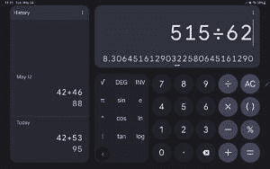

# 谷歌计算器 8.2 为更大的设备带来了更新的用户界面

> 原文：<https://www.xda-developers.com/google-calculator-8-2/>

众所周知，Android 的平板电脑体验在应用支持方面并不是最好的。虽然用户可以利用大量的 Android 应用程序，但针对大型设备的优化并不总是最好的。幸运的是，看起来谷歌自己的应用程序之一计算器已经获得了更新，为平板电脑用户提供了更好的体验。

谷歌 Play 商店的新更新将计算器应用程序更新到 8.2 版本。此次更新带来了一个改进的用户界面，这对于那些大屏幕的用户来说应该会很方便。

在更新之前，计算器应用程序在所有 Android 设备上的体验都是一样的，无论显示屏的大小如何。由此带来的问题是，当处于风景模式时，在大屏幕设备上，应用程序会简单地缩放用户界面，浪费宝贵的屏幕空间。你可以在上图中看到旧的应用程序用户界面。

 <picture></picture> 

Calculator 8.2 via 9to5Google

使用最新版本的应用程序，您可以看到左侧提供了额外的信息，允许用户轻松查看计算的历史。以前也可以这样做，但是需要用户在 UI 上向下滑动，隐藏按键。除了这一显著的变化，还有许多细微的差异，比如能够隐藏高级功能以获得更整洁的外观。当此模式处于活动状态时，按钮也会改变形状，从圆形变为更长的椭圆形。虽然是一个小的更新，新的用户界面应该允许用户更有效地执行计算。当然，如果你只需要一个功能较少的简单计算器，你可以随时将设备转向纵向，以隐藏应用程序的高级功能。

更新后的计算器应用程序版本 8.2 可直接从谷歌 Play 商店获得。当然，它可能在你所在的地区还不可用，但它是一个广泛的版本，最终应该会可用。当然，有可能从第三方网站获得 APK，然后加载它，但这可能没那么严重。本月初，谷歌举行了一年一度的 I/O 开发者大会，展示了即将推出的设备、Android 13 等。你可以在这里查看活动的完整摘要和公告[。](https://www.xda-developers.com/google-io-2022-recap-major-announcements/)

[app box Google play id = com . Google . Android . calculator & HL = en _ US & GL = US]

来源:[谷歌 Play 商店](https://play.google.com/store/apps/details?id=com.google.android.calculator&hl=en_US&gl=US)

Via: [9to5Google](https://9to5google.com/2022/05/24/google-calculator-tablet-update/)