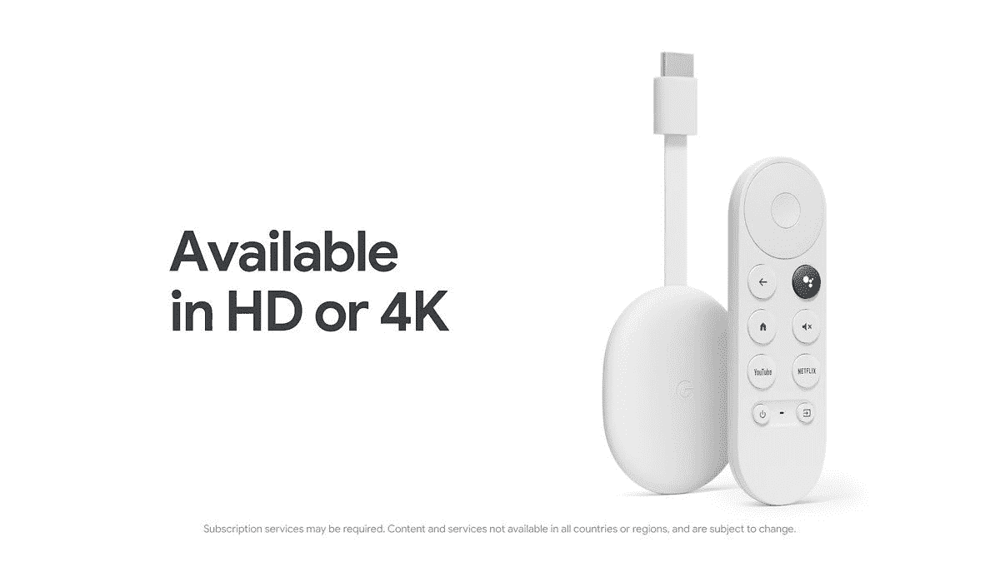

# 谷歌的新 Chromecast 和谷歌电视有一个解锁引导程序的工厂选项

> 原文：<https://www.xda-developers.com/google-chromecast-with-google-tv-hd-bootloader-unlock/>

今天，谷歌宣布了其新的 Chromecast 和谷歌电视，为消费者提供了一个新的负担得起的选择来满足他们的流媒体需求。虽然该设备最初可能不在您的关注范围内，但您可能会对该设备产生新的兴趣，因为我们现在知道它有一个引导加载程序，只需进入选项即可解锁。

据 *AFTVnews* 报道，在通过谷歌电视仔细检查新 Chromecast 的来龙去脉时，该出版物发现设备上的引导加载程序可以解锁。最好的部分是，它不需要任何复杂的步骤，你只需进入开发者选项，切换 OEM 解锁功能，并启用该选项来解锁引导加载程序。这有点令人惊讶，因为 2020 年推出的配有谷歌电视(4K)的老款 Chromecast 没有这个选项。相反，用户不得不依靠漏洞，而[走这条路](https://www.xda-developers.com/chromecast-with-google-tv-bootloader-unlock-exploit/)并不容易，但如果用户有时间和一些耐心，这是可以做到的。

默认情况下，带有谷歌电视的新 Chromecast 可以访问流行的流媒体服务和数千种应用程序。由于其价格，该型号仅支持高清质量，这意味着它没有 4K 功能，也没有杜比全景声。但是，作为交换，谷歌可以将其定价更低，仅售 29.99 美元，这是一笔相当不错的交易。尽管一些最初的 Chromecast 设备依赖于与智能手机的连接，但新型号可以作为一个独立的单元使用，因为它具有谷歌电视功能。此外，设置很容易，遥控器提供谷歌助手支持。

至于解锁引导程序，由于这是一个相对较新的设备，看看社区会想出什么样的东西会很有趣。需要注意的一点是，正如 AFTVnews 所指出的，bootloader 选项可能只是一个错误，可以在未来的更新中进行修补。这种更新可能来自空中，也可能直接来自制造商，这意味着如果这个得到修补，你可能会离开狩猎旧股票。所以，如果你真的感兴趣，尽快买一个可能是个好主意。如果这似乎不适合你，并且你正在寻找其他流媒体选项，请查看我们的指南[了解 2022 年你可以购买的最佳安卓电视盒子和棒。](https://www.xda-developers.com/best-android-tv-box/)

 <picture></picture> 

Chromecast with Google TV (HD) - Snow

##### 带谷歌电视的谷歌 Chromecast(高清)

谷歌最新的流媒体设备售价仅为 29.99 美元。

* * *

**来源** : [AFTVnews](https://www.aftvnews.com/new-chromecast-hd-has-an-unlockable-bootloader-from-the-factory/)

**Via** : [米沙勒·拉赫曼](https://twitter.com/MishaalRahman/status/1573116743828279296)(推特)