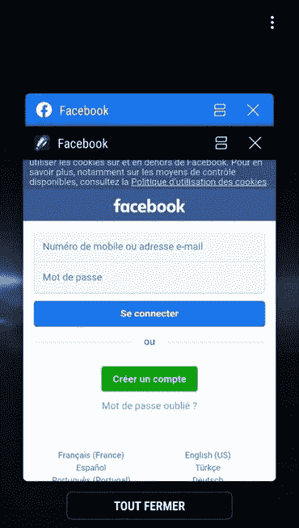

# 谷歌从 Play Store 移除 25 款钓鱼脸书登录凭证应用

> 原文：<https://www.xda-developers.com/google-has-removed-25-apps-from-play-store-for-phishing-facebook-credentials/>

# 谷歌已经从 Play Store 移除了 25 款涉嫌脸书钓鱼的应用

谷歌已经删除了 25 个伪装成壁纸、强光或天气应用的恶意应用，这些应用欺诈性地窃取了用户的脸书身份。

Android 驱动的智能手机和平板电脑数量是 iOS 的五倍多。因此，谷歌 Play 商店上的应用数量远高于苹果的应用商店，这使得安卓的应用审查程序不那么严格。可以预见的是，这使得许多恶意应用更容易通过审查程序，并留在 Play Store 上，直到被举报欺诈。然而，谷歌在[移除恶意应用](https://www.xda-developers.com/antutu-benchmark-removed-google-play-store/)方面确实行动迅速，尤其是当涉及到像网络钓鱼这样的严重指控时。根据最近的一份报告，互联网巨头现在已经关闭了 25 个欺骗用户和记录脸书登录凭证的应用程序。

法国网络安全机构 *Evina* 最近在 5 月份向谷歌报告了 25 个恶意应用程序窃取用户的脸书登录信息。这是通过在实际的脸书登录页面上创建一个虚假的登录页面来实现的。这些应用程序中的合法功能掩盖了恶意元素。Evina 注意到这些应用伪装成谷歌 Play 商店上的壁纸应用、图像和视频编辑器、闪光灯应用、游戏和文件管理器。

 <picture></picture> 

Fake Facebook login page in the overlay; Image courtesy of Evina

这位法国代理人还告诉 ZDNet 说，其中一些恶意应用已经在谷歌 Play 商店上存在一年多了。谷歌在 6 月初验证了这些发现后删除了它们。在从 Play Store 移除应用程序的同时，谷歌还会在用户的智能手机上禁用它们，并通过 [Play Protect](https://www.xda-developers.com/google-play-protect-warning-users-install-apps-targeting-older-android-versions/) 功能通知他们。

谷歌删除的应用列表包括:

| 

应用名称

 | 

包裹

 | 

安装数量

 |
| --- | --- | --- |
| 超级壁纸手电筒 | com.wallpaper .手电筒.指南针 | 500000+ |
| 帕登泰夫 | com.sun.newjbq.beijing.ten | 500000+ |
| 壁纸级别 | com.liapp.level | 100000+ |
| 轮廓层次壁纸 | com.communication.walllevel | 100000+ |
| iPlayer & iWallpaper | com.ldl.videoedit.iwallpapers | 100000+ |
| 视频制作者 | com.androidapp.videosedit.v | 100000+ |
| 彩色壁纸 | com.play.ljj.wallpapercomapss | 100000+ |
| 步数计 | com.baidu.news .计步器 | 100000+ |
| 强力手电筒 | com.meituanybw.flash | 100000+ |
| 超亮手电筒 | com.tqyapp.sb 手电筒 | 100000+ |
| 超级手电筒 | com.superapp .新城 | 100000+ |
| 单人纸牌游戏 | com.game.tqsolitaire | 100000+ |
| 对米德的精确扫描 | com.tqyapp.qr | 50000+ |
| 经典纸牌游戏 | com.card.solitairenew | 50000+ |
| 垃圾文件清理 | 清洁 | 50000+ |
| 合成 Z | com.tqygame.synthetic | 50000+ |
| 文件管理器 | com.smt.filemanager | 50000+ |
| 复合 Z | com.game.hcz | 50000+ |
| 屏幕截图 | com。杨天茜。lww。屏幕编辑 | 10000+ |
| 每日星座壁纸 | com。杨天茜。lww。星座 | 10000+ |
| 武侠读者 | com.wuxia.reader | 10000+ |
| 加上天气 | com.plus .安卓.天气 | 10000+ |
| 动漫动态壁纸 | com.tqyapp .创泰 | 100 |
| 健康计步器 | com.tiantian.lang.tencent | - |
| com.tgyapp.fiction | com.tgyapp.fiction | - |