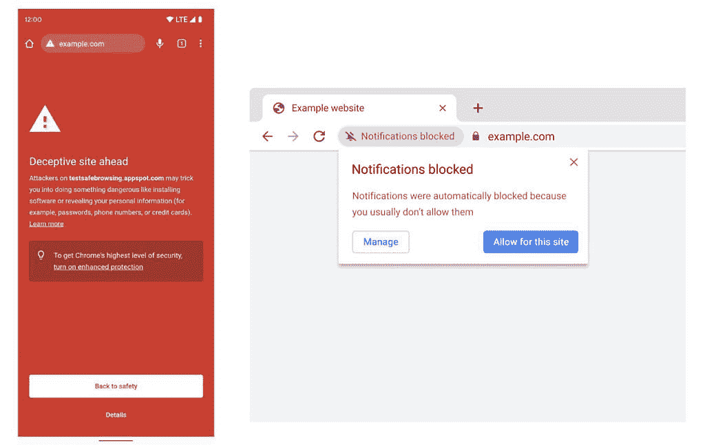
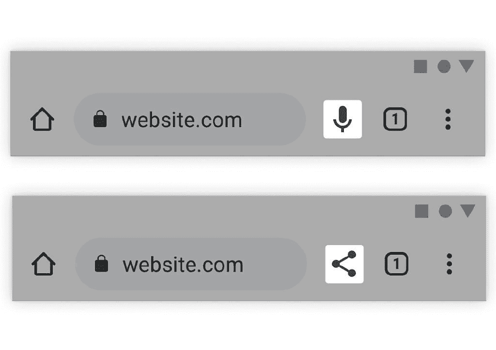

# 谷歌强调新的机器学习功能将转向 Chrome

> 原文：<https://www.xda-developers.com/google-machine-learning-optimizations-chrome/>

谷歌使用机器学习(ML)模型为其几乎所有产品提供大量有用的功能，该公司广受欢迎的浏览器应用谷歌 Chrome 也不例外。Chrome 已经在所有平台上提供了几个 ML 驱动的特性。这些功能包括使视觉障碍者更容易获得网络图像，以及帮助听力障碍者的实时视频字幕。但这些并不是谷歌 Chrome 上唯一的 ML 功能。

在最近的一篇博客文章中，谷歌强调了一些最近发布的 ML 功能，这些功能正在向更多的 Chrome 用户开放。此外，该公司还透露了一些其他新功能，这些功能应该会在未来的版本中提供给用户。

例如，谷歌 Chrome 浏览器中的安全浏览是一个 ML 驱动的功能，当用户试图导航到危险的网站或下载恶意文件时，它会显示警告。它已经存在了一段时间，但谷歌最近推出了一个新的 ML 模型，该模型识别的潜在恶意网站和网络钓鱼攻击是以前模型的 2.5 倍，这使它成为 Chrome 用户更有价值的工具。该功能还可以屏蔽来自网站的潜在恶意通知，Chrome 很快就能完全在设备上做到这一点。

 <picture></picture> 

Left: What you will see if a phishing attempt is detected – Right: Chrome shows permission requests quietly when the user is unlikely to grant them

为此，谷歌计划在 Chrome M102 版本中推出另一款新的 ML 机型。它将帮助浏览器完全在设备上做出上述通知预测。正如该公司指出的:

*“为了进一步改善浏览体验，我们也在改进人们与网络通知的互动方式。一方面，页面通知有助于从您关心的网站发送更新；另一方面，通知权限提示可能会令人讨厌。为了帮助人们在最少干扰的情况下浏览网页，Chrome 会预测何时不太可能授予权限提示，并使这些提示静音。在 Chrome 的下一个版本中，我们将推出一个 ML 模型，让这些预测完全在设备上进行。”*

此外，谷歌正在使用机器学习来改进今年早些时候[推出的旅程功能](https://www.xda-developers.com/chrome-journeys-android-widgets/)。如果你不熟悉的话，谷歌 Chrome 的旅程功能会将你的浏览历史按类别(Chrome 认为是)进行分类，列出给定类别/主题中最重要的页面。

Google now 计划使用 ML 使这些分类的网站在你返回时能以你喜欢的语言显示。该公司已经推出了一个更新的语言识别模型*“来计算页面的语言，以及它是否需要被翻译以符合你的偏好。”*

 <picture></picture> 

The toolbar in Chrome on Android will adapt based on your needs

最后，谷歌计划使用 ML 来实时调整 Chrome 的工具栏，以在任何给定的时刻突出显示对你最有用的操作。正如所附的截图所示，omnibar 旁边的按钮会根据你接下来想要做的事情自动改变——分享网页或进行语音搜索。如果你想知道，Chrome 仍然会给你一个选项，当这个功能在未来的版本中推出时，你可以根据自己的需要定制工具栏。

*如何看待谷歌 Chrome 即将推出的新机器学习功能？请在下面的评论区告诉我们。*