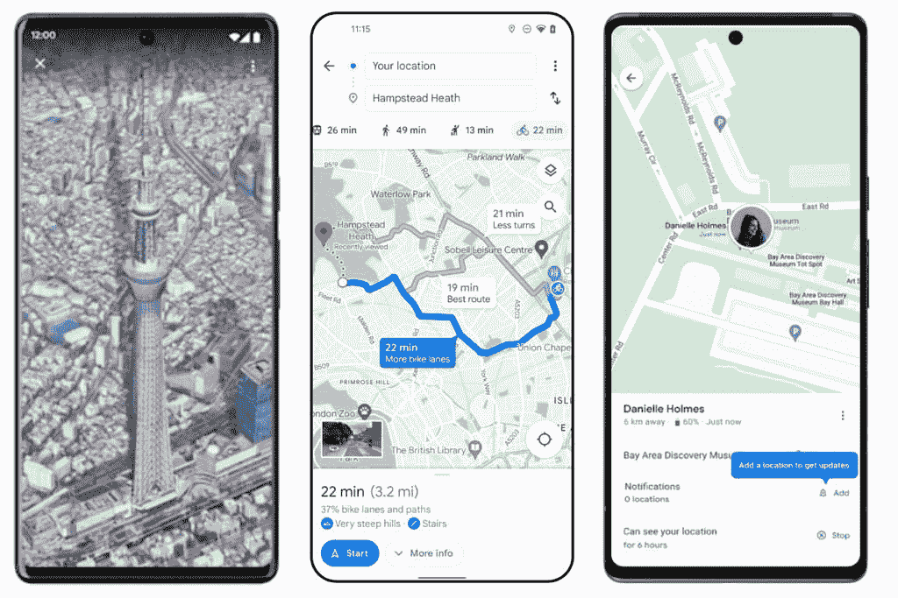

# 新的谷歌地图更新将有利于游客，骑自行车的人，朋友和家人

> 原文：<https://www.xda-developers.com/google-maps-summer-update/>

正值夏季，谷歌地图获得了新的更新，将带来世界上最受欢迎的目的地的鸟瞰图，改善了骑自行车的方向，增强了路线的细节，以及与朋友和家人保持联系的更安全的方式。

## 鸟瞰图

谷歌地图现在将拥有近 100 个热门地标目的地的鸟瞰图。这意味着你可以在去日本旅行之前去看看东京铁塔，甚至在去纽约之前去看看自由女神像。虽然这看起来不错，但谷歌计划通过“ [immersion view](https://www.xda-developers.com/google-maps-immersive-view/) 让它变得更好，但在实现这一目标之前仍有一些工作要做。如果你想看看新的鸟瞰图，一定要去照片区看看详细的地标。

 <picture></picture> 

Aerial view, enhanced bike routing, and location sharing notifications.

## 骑自行车方向

除了热门的地标，骑行方向也在升级，谷歌地图将引入更多细节，如海拔、汽车流量、楼梯，以及你是在斜坡还是下坡骑行。新的更新还会显示你是否会在主干道或地方道路上骑车。谷歌利用人工智能、城市数据、可信任的合作伙伴以及谷歌地图用户的反馈来管理这些数据。考虑到不断上涨的油价迫使一些人骑自行车上下班，这似乎是一个完美的时机。但是出发前一定要去[检查一下空气质量](https://www.xda-developers.com/google-maps-now-lets-you-check-the-air-quality-around-you/)。

## 与关心的人分享

谷歌地图的最后更新是朋友和家人的通知设置。通过共享您的位置，朋友和家人现在可以看到您何时到达以及何时离开某个位置。此功能仅适用于与特定用户共享位置的用户。然后，被邀请的用户将能够设置登记和结账点。用户可以随时选择停止分享他们的位置。这是为了确保隐私仍然得到维护。

* * *

鸟瞰图、地标和位置共享通知正在全球范围内推广到 iOS、Android 和 PC 上的谷歌地图。如果您所在的城市目前有骑行路线，改进的骑行路线更新将在未来几周内推出。

**来源** : [谷歌](https://blog.google/products/maps/three-new-maps-updates-to-help-plan-your-next-adventure/)