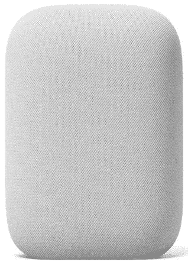

# 谷歌巢音频审查:权力和价格的正确组合

> 原文：<https://www.xda-developers.com/google-nest-audio-review/>

早在 2016 年的 I/O 开发者大会上，谷歌就在最初的谷歌 Home 智能音箱旁边推出了谷歌助手。当时，谷歌助手被视为 Google Now 2.0，这是一种虚拟助手，采用对话式方法进行搜索，由谷歌的人工智能和机器学习提供支持。快进到 2020 年，谷歌助手已经发展成为一个强大的虚拟助手——甚至可以说是最好的。谷歌助手为 Android 上的一些高亮体验提供了动力，它在 Pixel 智能手机上的深度、周到和专注的集成是让它们成为 Pixel 的首要原因。

通过 Google Home 以及后来的 Google Home Mini T1 和 T2 Nest Mini T3，该公司基本上试图将 Google Assistant 体验传递到每个家庭的每个角落。这个想法是鼓励用户毫不费力地与谷歌对话，不需要花太多心思就能完成各种任务。扬声器仅仅是载体，助手才是主要产品。但是随着[谷歌 Home Max](https://www.xda-developers.com/google-home-max-on-sale-us/) 的推出，扬声器终于占据了中心舞台，助手作为一个额外的好处承担了辅助角色。

对于像我这样没有投资于谷歌助手生态系统或任何智能家居生态系统的用户来说，谷歌 home、Home Mini 和 Nest Mini 非常无趣。一个小小的扬声器作为虚拟助手，对我的生活没有任何用处，这种想法不值得投资，即使谷歌不时对这些产品提供可笑的折扣。另一方面，谷歌 Home Max 卖得更好，因为它首先是一个扬声器。但这款音箱从未在我的祖国印度上市，即使上市了，400 美元的价格对我来说也太贵了。这些智能音箱都不够我花血汗钱，老实说，谷歌助手生态系统也是如此。

。bestawarddiv {

浮动:对；

宽度:20%；

边距:1em

边距-顶部:0；

}

当[谷歌推出 Nest Audio](https://www.xda-developers.com/google-nest-audio-google-assistant-smart-speaker-powerful-audio-launch/) 的时候，我绝对被激起了兴趣。这款设备似乎是 Google Home 和 Google Home Max 的中间点，以合理的价格提供了扬声器规格、外观吸引力和智能助理集成的健康组合。谷歌 Nest Audio 在我家已经有大约三周的时间了，所以作为第一次使用谷歌助手的人，我有足够的时间来整理关于 Nest Audio 的一些想法。

## 谷歌巢音频:规格

| 规格 | 谷歌巢音频 |
| --- | --- |
| **建造** |  |
| **尺寸&重量** |  |
| **音频(输入和输出)** |  |
| **语音助手** | 谷歌助手 |
| **控件** | 触摸控制:

*   播放/暂停–点击前端顶部
*   提高音量–点击右前角
*   降低音量–点击左前角)

 |
| **充电** | 30W DC 电源 |
| **连通性** |  |

***关于这篇评论:**谷歌印度给我们发来了粉笔色的 Nest 音频供评论。此评论是在常规使用 20 天后进行的。谷歌对这篇文章的内容没有任何意见。*

* * *

## 谷歌巢音频:设计和建造

谷歌 Nest Audio 有一个离散的外观，这既是一个熟悉的谷歌产品，也不同于我们通常遇到的许多扬声器。它看起来像一个缩小的枕头，有一个扁平的底座和一个直立的扬声器。该设备重 1.18 千克，就其尺寸而言，令人惊讶地沉重和密集。

扬声器盖由耐用的织物制成，谷歌声称这是由回收塑料瓶制成的。整个外壳(即织物、外壳、底座和一些较小的部件)由 70%的回收塑料制成。织物罩位于封闭的笼子框架的顶部，该框架建造牢固且不会弯曲(如果正常处理的话)。这是一个固定的扬声器，所以希望你可以把它放一次就忘了。

*Nest Audio 上的 LED 在设置过程中会发出蓝色的光，当麦克风被禁用时会发出橙色的光，当它正在收听时会发出白色的光。*

设计很简单。正面看起来非常干净，但在织物盖下面，中间有四个 led，顶部有触摸传感器。在背面，只有一个硬件开关用于打开或关闭麦克风输入。还有一个桶型充电针的端口和背面的一个小谷歌“G”标志。仅此而已——设备上没有其他东西——没有开/关开关，没有其他按钮，甚至没有 3.5 毫米输入。甚至盒子里的东西也很简单:你可以得到 Google Nest Audio、30W 桶型充电器和一些文档。

Nest Audio 的简单设计和离散外观使扬声器不显眼地融入您的家具中

Nest Audio 的简单设计和离散外观使扬声器不显眼地融入您的家具中。你可以把它放在其他科技产品旁边，藏在你的书架上，或者放在其他装饰品旁边。如果你隐藏得好，Google Nest 音频最终很少引起注意，当人们注意到它时，它本身看起来很好。

不像家用迷你电脑那样平放并以 360°的方式传播音频，谷歌 Nest 音频是单向的。这个扬声器的位置变得有些重要，即使谷歌声称 Nest Audio 在大多数常见的位置听起来都很棒。在这一点上，我同意，因为 Google Nest 音频放在角落、餐桌或墙边听起来都差不多。只要确保扬声器末端面向您希望音频指向的大致区域，就可以了。请注意，没有 IP 等级或任何防水的说法，所以你最好把它放在远离浴室的地方。我也有点担心随着设备老化，积累灰尘和较小的污渍，织物外观会发生什么变化，但我没有 Nest Audio 足够长的时间来找出答案。

谷歌 Nest Audio 的外观和适用性给我留下了深刻的印象。我家的其他居民没有因为展出这件科技产品而有任何问题，他们也没有抱怨它破坏了他们精心构建的美学。它看起来不像普通的扬声器，没有裸露的金属表面或其他花哨的外观——这就是它在不积极播放音乐时能够融入其中的原因。

## 谷歌巢音频:音质

Google Nest Audio 配有一个 75 毫米低音扬声器和一个 19 毫米高音扬声器用于声音输出，还有 3 个远场麦克风用于语音输入。根据这些规格，谷歌表示，Nest Audio 的音量比最初的谷歌 Home 高 75%，低音强 50%。虽然我没有原始的 Google Home 作为比较，但我可以证明这样一个事实，Google Nest 的音频就其大小而言相当吵，以至于邻居都抱怨过。我的邻居可以证明，这种音量并不以牺牲音质为代价。很抱歉。)

Nest Audio 的低音很强，很明显，我很喜欢。许多印度流行音乐喜欢重低音，而谷歌 Nest Audio 完美地产生了这些声音。我最喜欢的一些曲目，比如巴斯拉尼的努克莱亚的 Laung Gawacha 和 T2 的瑞兹的 Sage，听起来很棒，整个曲目的节拍都非常明显。整个频谱的音频都得到了很好的再现，在高音、中音、低音甚至人声方面都有非常好的表现。虽然我不能说音响发烧友对这款音响感到满意，但在我家听过 Nest 音响的人都没有抱怨过音质。因此，对于普通消费者来说，谷歌的这款智能扬声器做得非常好。

整个频谱中的音频都得到了很好的再现，高音、中音、低音甚至人声都有非常好的表现

谷歌声称，Nest Audio 带有内部智能，可以帮助它适应家庭。有一个媒体均衡器功能，它可以根据您正在收听的内容进行调整，为音乐、播客或助手提供不同的输出。然后是环境智商，它可以让扬声器适应你家里的背景噪音。老实说，这两个特性很难被注意到——我不确定这些特性是“踢”到位了，还是它们总是处于启用状态。很难发现输出中的差异，但音频听起来很棒，即使有很多背景噪声，也能保持清晰。你可以说这些功能就像宣传的那样工作，但是没有简单的方法来判断这些功能是否工作，因为没有设置或切换来检查。也没有办法改变均衡器设置，所以你只能改变扬声器的低音和高音响应。

 <picture></picture> 

These are the only two options present and available as Equaliser Settings

谷歌 Nest Audio 也非常擅长拾取语音命令。麦克风从很远的地方接收指令。我唯一经历过的扬声器费力地拾取我的声音的时候是当它被放在很高的地方，而我离地板很近的时候。除非您计划将扬声器放置在某个高度，否则语音接收应该没有问题。

总的来说，我对谷歌 Nest Audio 的音质非常满意。我目前只有一个单元，但我计划挑选另一个单元，由于扬声器对功能，获得更甜美的立体声设置。

## Google Home 应用

谷歌音箱的一大亮点显然是谷歌助手。要设置扬声器并开始使用助手，您需要 Google Home 应用程序。Google Home 应用程序充当所有智能家居外设的中间人，这些外设本身没有设置界面，允许您设置设备、邀请家庭成员、设置例程、创建多房间播放的扬声器群组，以及管理与音乐、视频、播客等相关的服务。

通过 Google Home 应用程序设置 Nest Audio 的过程相当简单，该应用程序会全程指导您。你需要一个活跃的互联网连接，如果没有，你就不能开始使用扬声器。第一次通过蓝牙将设备与扬声器配对时，您还需要有活跃的互联网连接，尽管后续的蓝牙连接不需要活跃的互联网连接。

除了设置之外，该应用程序还会教你关于设备上的控制和一些使用智能扬声器的方法。

设置完成后，您将看到智能家居设置的概述和一些快速操作。“媒体”按钮向您显示正在播放的媒体，“呼叫总部”功能通过 Google Duo 呼叫您的家庭设备(奇怪的是，当选择该选项时，该应用程序会为我强制关闭)，“广播”让您向扬声器广播音频通知，“例程”让您设置多个指令集以通过一个命令执行，并访问设置。

设备设置包括一系列其他设置，让你设置成人内容过滤器，设置命令反应的停机时间，设置降低音量响应和降低 LED 亮度的夜间模式，甚至允许所有连接的 Android 设备控制播放的媒体。

## 使用智能扬声器

虽然一个演讲者聪明是一件好事，但如果聪明的部分实际上没有用，那就没有什么卖点了。我在这方面的经历有点复杂，我这么说是因为我没有投资谷歌助手生态系统或其他语音助手生态系统。

人们是多种多样的，所以即使我们说同一种语言，我们的口音也会使我们听起来不同。迄今为止，我个人对语音助手的体验一直很糟糕。我的第一语言是印地语，第二语言是乌尔都语，第三语言是英语，其次是法语和马拉地语。当我说英语时(我基本上能流利地说)，我确实有一种典型的印度口音。我家里的其他人并不精通英语，所以在我家里的谈话涉及到一种奇怪的演变的混合印地语和乌尔都语，夹杂着英语和马拉地语的单词。它不仅仅是一种语言。印度很大一部分地区是双语和多语言的，所以我知道这种情况不仅仅是我家的反映。

因此，当世界上其他人对让 Google Now 和 Google Voice Search 这样的语音助手成为他们日常生活的一部分感到兴奋时，我从未如此兴奋过。当然，这种潜力是显而易见的，但让这些语音助手理解我的查询是一个挑战，先于语音助手正确执行查询的能力。这在很大程度上是一件事，需要多次以不同的方式喊同一个命令，最终，只是放弃和无声地做事情。许多功能也针对西方市场进行了调整，在印度等地区无法使用。此外，“智能家居”和“家庭自动化”对于印度城市来说仍然是新兴的概念，通常需要相当大的资金投入和基础设施的改变，这在经济上并不总是可行的。由于所有这一切，我只是没有进入谷歌助手，选择从我的所有设备上完全删除它，因为它几乎没有给我的生活带来任何效用。

Google Nest Audio 是我第一个专用的 Google Assistant 设备，如果不算智能手机和电视的话，它也是家里第一个“智能”配件。因此，虽然 Nest Audio *可以被*用来控制你的智能家居，但你首先需要一个智能家居来做到这一点。

我很高兴看到语音助手的可用性有所提高。由于 Nest Audio 和谷歌助手的功劳，扬声器和语音助手的组合在理解我和我家其他成员通过语音命令发出的指令方面要好得多。这是一股清新的空气，因为大多数命令都得到认可。仍然有一些警告——混合语言中的命令不能被很好地识别(就像一个主要是英语的命令带有一些印地语单词),并且设置[双语仍然限于一些组合](https://www.xda-developers.com/google-assistant-messages-integration-actions-android-go/)(印地语+乌尔都语，或者任何两种印度语都不是有效的组合，但是印地语+英语是)。大体上，我很高兴看到目前在这方面的进展，因为短短几年前的情况令人失望，但仍有一些改进的余地。

让谷歌助手真正有用对我来说仍然是一个有限的案例。在三周的时间里，我的家庭已经默认只向 Nest Audio 发出 YouTube 音乐歌曲命令。这是有道理的，因为它毕竟是一个智能扬声器，音乐播放是它的亮点之一。我想指出的是，实际上来说，我们每天使用 Nest Audio 的目的只是 Nest Audio 实际上可以完成的更大功能中的一小部分。我们有时会让它大声朗读新闻，偶尔会询问天气更新或设置闹钟。有时候，我侄子会问谷歌，狮子或老虎听起来像什么。但总的来说，我们只是说，“嘿，谷歌，玩小鲨鱼(T1)”——在蓝牙扬声器和 Chromecast 音频的时代，我可以说，T2 真的不需要专门的智能扬声器来完成这样的任务。

在这一部分，我不会对 Google Nest 音频做出太苛刻的评价，因为我提到的很多内容都是基于个人的轶事和经验。但是我看到人们用 Google Assistant 谈论智能音箱的时候很少提到这些方面。是的，谷歌助手非常有用，但世界不仅仅是美国和欧洲。如果你在这些地区之外的地区，我建议你在投资智能音箱之前，先评估一下你实际上想从谷歌助手中获得什么样的用途。这是对智能助手状态的一般性评论，而不是对谷歌 Nest Audio 本身的批评。

## 结论:谷歌巢音频足够好，可以买两个

谷歌巢音频做到了它所说的，而且做得很好

尽管我个人对 Nest Audio 的使用相当有限，但我对它的构造和音质印象深刻。我印象深刻的是，我可能只是拿起另一个 Nest 音频单元来创建一个立体声对。这款智能音箱做到了盒子上说的，而且做得非常好。谷歌已经找到了以可承受的价格将智能与好的扬声器相结合的最佳点。在某些地区，如果你同时购买两个单元，交易会变得更好。两个单元的组合还能让你更加灵活地将扬声器放置在家中。如果立体声效果不佳，您还可以创建一个多房间小组，在不同房间同时播放相同的音乐，并让所有人都听起来非常好。这种多功能性是谷歌 Nest Audio 相对于其他更大、可能更好的扬声器的优势，比如谷歌自己的 Home Max。

在印度市场，当谈到谷歌助手驱动的智能扬声器时，没有太多的选择(因为这个类别的划分完全排除了亚马逊的 Alexa 驱动的智能扬声器，因为他们的生态系统)。如果你刚刚开始这一智能扬声器之旅，良好的第一步是谷歌 Nest Mini (₹2,299)和最近推出的[小米 mi 智能扬声器](https://www.xda-developers.com/xiaomi-mi-watch-revolve-mi-band-5-mi-smart-speaker-launched-india/)(排灯节销售的₹2,999)。如果你有一个较大的预算，想要一个非常好的扬声器，你绝对应该得到谷歌巢音频(₹6,999)，因为它听起来很值得它的价格标签。如果这是一个选项，一定要考虑挑选两个单位的立体声系统。

 <picture></picture> 

Google Nest Audio

##### 谷歌巢音频

谷歌巢音频是谷歌最新的智能扬声器，内置谷歌助手。它融合了强大的扬声器系统与正确的智能和伟大的设计。