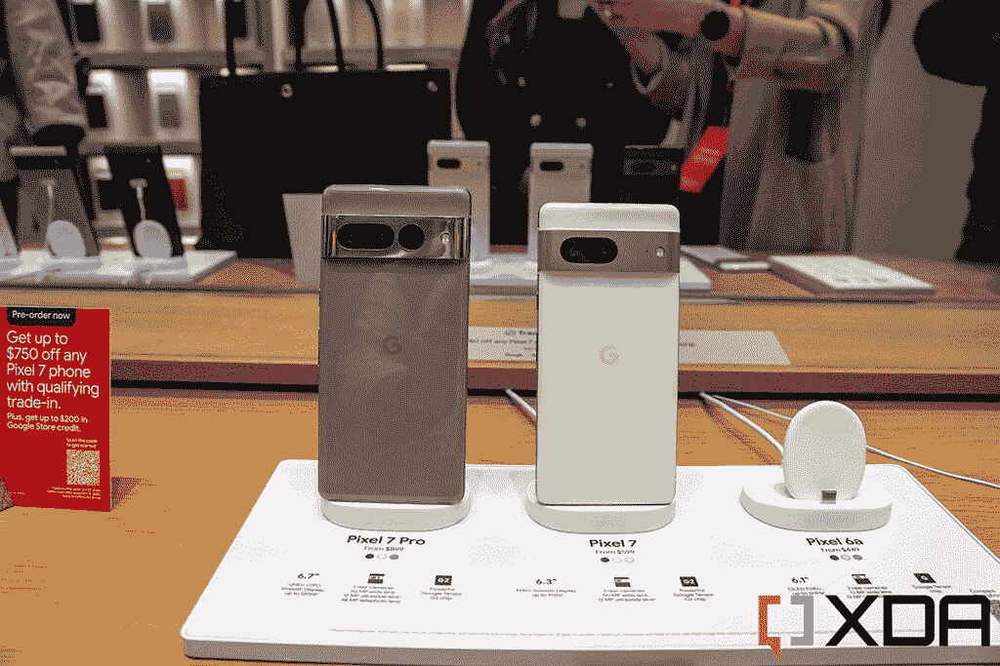

# 好吧谷歌，你真的先做了吗？

> 原文：<https://www.xda-developers.com/google-not-always-first-feature-editorial/>

Google Pixel 7 系列刚刚发布，带来了全新的 Google Tensor G2 SoC、更好的摄像头和更精致的设计。与此同时，该公司还推出了新的软件功能，并对现有功能进行了改进。虽然谷歌的智能手机经常表现出色，但它很难摆脱这样一种感觉，即该公司认为自己的影响力比实际大得多。

这里先说清楚:*很明显，*谷歌做安卓。我不是在诋毁该公司在世界上最大的移动操作系统上的工作。话虽如此，现阶段的 AOSP 是许多原始设备制造商(不仅仅是谷歌)工作的结合，谷歌内部管理 AOSP 的团队也不是制造 Pixel 的团队。事实上，有大量的像素功能根本不在 AOSP，甚至更多的功能在 Pixel 7 系列中出现。

在公司的发布会上，谷歌产品管理副总裁 Brian Rakowski 喜欢抨击其他公司(即苹果)，同时也提醒他们，谷歌是一个创新者。虽然谷歌为 Android 生态系统做了一些伟大的事情，但它似乎肯定高估了这些贡献。

## 谷歌声称，它制作了始终显示和夜间模式摄影

让我吃惊的第一个说法是在主题演讲的早期。Rakowski 接着说，Pixel 一直是智能手机创新的领导者，并说当其他人继续跟随他们的领导时，该公司总是将其视为一种赞美。然后，他使用了 Pixel 2 首次推出的“永远显示”功能，作为其他人效仿谷歌的一个功能。

这种说法有几个错误，第一个错误是，第一部有常亮显示屏的智能手机甚至不是安卓手机...那是 2008 年的诺基亚 6303！即使在 Android 世界，三星也是通过三星 Galaxy S7 首先做到了这一点。谷歌实际上是派对的迟到者，听到谷歌认为它开创了永远在线显示的先河，这很奇怪。

由此看来，该公司似乎也认为，它是第一个增加曝光时间，以改善 Pixel 3 在弱光下的摄影效果。这也不是真的，因为华为之前在华为 P20 Pro 上就是这么做的。

Rakowski 接着说，“这是 Pixel 上第一个开创性功能的惊人记录”——问题是这些功能根本不是 Pixel 上的第一个。

## 在这一点上，指责苹果不支持 RCS 有点像是在开玩笑

后来，Rakowski 对苹果进行了特别的抨击，称“RCS 是消息传递的现代行业标准，并且已经被该行业的大多数人所采用”。然而，任何居住在美国的使用 RCS 的人都会告诉你，尽管这项服务比 SMS 好得多，但它仍然有自己的问题。虽然将 RCS 引入 iPhone 绝对会扩大用户的选择，但它也不是一个完美的标准，我也不会称之为“消息传递的现代行业标准”。

问题似乎是，就像谷歌声称已经做出的其他创新一样，它认为 RCS 是下一个大事件。它*希望*成为先锋，如果 RCS 看到广泛采用，那么它将获得作为先锋的信誉。[不断呼唤苹果](https://www.xda-developers.com/google-calls-out-apple-rcs-again/)不会有任何结果，而且在这一点上看起来有点悲哀。

对于那些不熟悉 RCS(或*丰富的通信服务*)的人来说——可以把它想象成 *SMS 2.0* 。该标准允许两部兼容的手机通过互联网连接共享高质量的媒体。所以，不像短信，你只需要一个 Wi-Fi 连接就可以给别人发短信。它还支持打字指示器、阅读回执和其他丰富的功能。这是一个很棒的概念，但是只要你周围的人也在使用它，你就能从其他的即时通讯软件中获得更好的功能。

## 谷歌是一个创新者，它不需要把一切都归功于自己

 <picture></picture> 

Google Pixel 7 Pro is Hazel color and Google Pixel 7 in Lemongrass color

问题是，谷歌绝对是一个创新者，但它不需要为自己没有做过的事情邀功。它没有创造永远在线的显示器，也没有开创夜间摄影，而且 RCS 的采用充其量也只是参差不齐。它声称拥有这些创造的原因是，这些改进可以被视为对 Android 智能手机生态系统的总体贡献。

谷歌真正创新的地方在于它自己的智能手机上的软件，而这些并不是 AOSP 的一部分。像[现在玩](https://www.xda-developers.com/google-pixel-now-playing-ambient-music-mod-v2-hands-on/)这样的功能，魔法橡皮擦，甚至以[谷歌张量 G2](https://www.xda-developers.com/google-tensor-g2-changes/) 的形式使用自己的芯片组，本身就是创新。不需要故作姿态和哗众取宠地声称，它用自己没有创造的功能启发了这个领域的其他人，对任何了解这些功能历史的人来说，这有点绝望。

谷歌自己在创新方面做得很好，它不需要为自己没有开发的功能邀功。现在播放是我最喜欢的智能手机功能之一，谷歌智能手机上还有很多其他奇妙的功能是*开创的。这些是人们知道并喜爱的功能，也是谷歌实际上创造的功能。*

*   <picture></picture>

    谷歌 Pixel 7 Pro

    ##### 谷歌 Pixel 7 Pro

    Pixel 7 Pro 是谷歌年度顶级旗舰，采用第二代张量 SoC，120Hz LTPO 显示屏，长焦传感器和更大的电池。