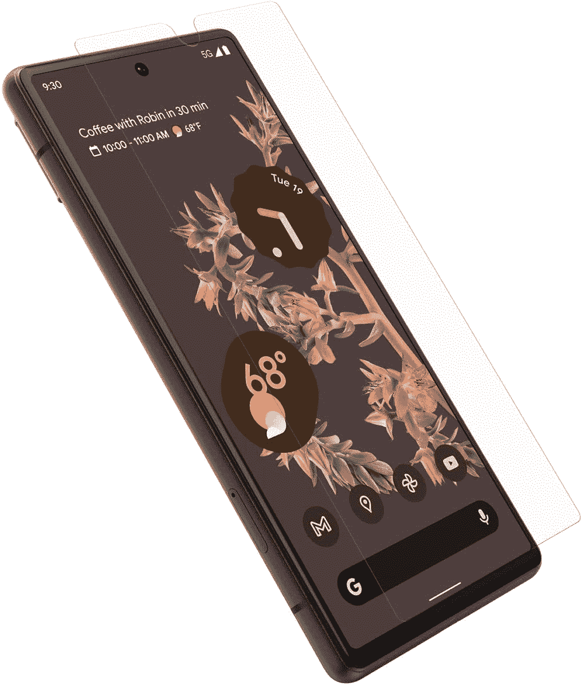

# 谷歌现在表示，谷歌 Pixel 6 系列有“谷歌认证”的屏幕保护器

> 原文：<https://www.xda-developers.com/google-now-says-there-are-made-for-google-certified-screen-protectors-for-the-google-pixel-6-series/>

虽然谷歌的 Pixel 6 和 Pixel 6 Pro 赢得了评论家的好评，但在过去的几天里，也有很多人抱怨其显示屏不足的指纹扫描仪。在许多情况下，用户观察到屏幕保护器的这些问题。鉴于 Pixel 6 和 Pixel 6 Pro 的正面都有 Gorilla Glass Victus 保护，这并不是说它们真的需要屏幕保护器，但如果你想格外小心，你会很高兴知道谷歌现在为 Pixel 6 系列提供了“谷歌制造”认证的保护器。

**[谷歌解释了为什么 Pixel 6 指纹扫描仪有时可能感觉较慢](https://www.xda-developers.com/google-explains-pixel-6-slower-fingerprint-scanner/)**

正如 [*9to5Google*](https://9to5google.com/2021/11/06/pixel-6-screen-protector-fingerprint/) 所发现的，谷歌关于如何“用你的指纹解锁你的 Pixel 手机”的支持页面现在提到了为 Pixel 6 和 Pixel 6 Pro 销售谷歌认证[屏幕保护器的品牌。](https://www.xda-developers.com/best-pixel-6-pro-screen-protectors/)

> 如果您的指纹无法扫描，可能是因为您的屏幕保护。确保你使用的是谷歌认证的屏幕保护。为谷歌认证的 Pixel 6 Pro 和 Pixel 6 品牌有 Zagg，Otterbox 和 Panzerglass。

 <picture></picture> 

Otterbox screen protector

##### OtterBox 像素 6 屏幕保护器

适用于 Pixel 6 的防刮擦和防污薄膜屏幕。

谷歌最近解释了为什么 Pixel 6 上的指纹扫描仪有时会感觉有点迟钝。谷歌表示，Pixel 6 的指纹扫描仪使用了先进的安全算法，有时会导致延迟或需要与传感器进行更直接的接触。

评论者的共识是，Pixel 6 的光学欠显示传感器不如一加 9 Pro 等竞争旗舰产品的传感器快，但也不算太慢。

如果你觉得即使没有屏幕保护，传感器还是很慢，有一个简单的[技巧来加快性能](https://www.xda-developers.com/improve-fingerprint-scanner-of-pixel-6/)。你所要做的就是转到*设置>显示*并切换一个名为“增加触摸灵敏度”的设置许多用户报告说，启用这一设置无疑改善了指纹扫描仪。