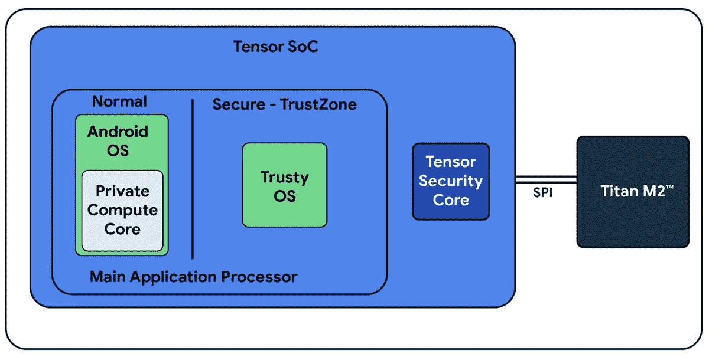

# 谷歌对 Pixel 6 的 Titan 安全芯片进行了彻底改造

> 原文：<https://www.xda-developers.com/google-overhauled-its-titan-security-chip-for-the-pixel-6/>

谷歌 Pixel 6(T1)有一个方面让它有别于目前市面上的其他手机:它使用了谷歌与三星合作设计的定制“张量”片上系统设计。前几代 Pixel 手机已经有一个专用的“泰坦”芯片来处理一些功能，但这个组件在 Pixel 6 上得到了彻底的改造，现在谷歌分享了一些关于它如何变化的细节。

谷歌官方安全博客[周三](https://security.googleblog.com/2021/10/pixel-6-setting-new-standard-for-mobile.html)发布了一篇关于 Pixel 6 中的安全措施的帖子，其中包括一些专门关于泰坦 M2 的信息。它仍然是一个分立的安全芯片，但谷歌已经将其转换为定制的 [RISC-V](https://en.wikipedia.org/wiki/RISC-V) 处理器。“我们转向了内部设计的 RISC-V 处理器，”该公司表示，“具有额外的速度和内存，并使其对高级攻击更具弹性。泰坦 M2TM 已经由一家独立的认证评估实验室根据最严格的漏洞评估标准 AVA _ 凡. 5 进行了测试。”谷歌还提到，泰坦 M2 是为了支持安卓保险箱而建造的，这项技术为安卓的防篡改密钥存储提供了动力。

 <picture></picture> 

Secure environments on the Pixel 6 (Credit: Google)

除了升级的泰坦 M2 芯片，还有谷歌张量安全核心。张量安全内核拥有自己的专用 CPU、ROM、一次性可编程(OTP)存储器、加密引擎(不，不是加密货币)、内部 SRAM 和受保护的 DRAM。它在 Pixel 6 中的主要目的是保护用户数据密钥和维持安全启动——其他一切都由泰坦 M2 处理。

如果你对 Pixel 6 的其他硬件和软件感到好奇，请查看我们的完整[谷歌 Pixel 6 Pro 评测](https://www.xda-developers.com/google-pixel-6-pro-review/)。这是一款令人印象深刻的手机，定制的张量架构似乎在现实世界的使用中得到了回报，但在评论中也有一些问题。

 <picture></picture> 

Google Pixel 6

Pixel 6 配备了谷歌新的张量芯片、现代设计和旗舰相机。

 <picture></picture> 

Google Pixel 6 Pro

Pixel 6 Pro 是较大的兄弟，配有谷歌的新张量芯片、现代设计和额外的远摄相机。