# 谷歌 Pixel 4 和 4 XL 显示屏分析——被严肃的手机制造商超越

> 原文：<https://www.xda-developers.com/google-pixel-4-4-xl-display-analysis/>

2019 年即将结束，大多数智能手机制造商已经展示了他们今年的旗舰手机。谷歌的旗舰产品今年很晚才推出，但在科技界，几个月可能意味着全新一代的硬件能力。

然而，像素并不以其尖端的硬件而闻名，相反，他们喜欢通过有用的优化和漂亮的功能来利用软件来区分自己。对于显示器，软件方面通常局限于校准和主观适应，所以这是我们希望谷歌大放异彩的地方。

## 像素 4 显示审查重点

*   可耻的峰值亮度，比大多数其他手机都要暗
*   与以前的像素模型相比，改进了黑色剪裁，在像素 4 中具有显著意义
*   智能手机中测量的最佳总色彩准确度
*   像素 4 XL 中的对比度/灰度不一致
*   像素 4 中较高的灰度级颜色扩散
*   新颖、流畅的 90Hz 移动显示器
*   像素 4 的最佳视角

XDA 展示 b 级

去年，谷歌从 LG 采购了 Pixel 3 显示屏，同时从三星采购了 Pixel 3 XL 显示屏。谷歌今年继续了同样的面板采购，在 Pixel 4 上安装了 LG 显示屏，而 Pixel 4 XL 则配备了三星显示屏。不幸的是，这两款手机都没有使用当前一代的有机发光二极管面板 Pixel 4 XL 上的三星显示屏与一加 7 Pro 上的显示屏相同，这是最新一代的三星面板，Pixel 4 使用的是华为 Mate 30 Pro 上的相同面板，与三星最新的显示屏相比相形见绌。三星的当代显示面板推广了一种新的蓝色发射器材料，并提高了能效和显示亮度。Pixel 4 设备都没有看到这些好处。

这两种尺寸的显示器像素密度也不同:Pixel 4 的像素密度为每英寸 444 像素(FHD+)，而更大的 Pixel 4 XL 的像素密度为每英寸 537 像素(QHD+)。在我看来，这种差异在阅读文本时是显而易见的。虽然谷歌 Pixel 4 看起来结构清晰，但由于有机发光二极管·彭蒂勒像素排列，我有时可以分辨出文本旁边的红色和绿色。另一方面，谷歌 Pixel 4 XL 看起来非常清晰，无论我离显示器多近，我都无法分辨出彩色边缘。然而，对于大多数人来说，较小像素 4 上的较低分辨率应该不是问题。

**环境质量**

谷歌在 Pixel 4 中实现了一个新的动态显示白平衡系统，称为 AmbientEQ，它使用新的 RGB 环境光传感器来改变显示器的白平衡，使其更接近周围光线的色温。该功能的目标是使显示器看起来更像一个自然反射的表面，就像一张纸。原因在于，我们对任何给定颜色的感知都会随着周围环境的色温而变化。例如，当在一些时尚餐厅温暖、昏暗的环境照明下观看时，智能手机上的白色可能看起来明显更冷。将显示器的白平衡更改为更接近环境照明的白平衡，有助于使您的手机显示器看起来更“自然”和舒适，并有助于它在不同的照明条件下看起来更一致。该功能类似于苹果的 True Tone 功能。然而，谷歌的 AmbientEQ 比 True Tone 微妙得多，在我看来，它远不如 True Tone 有效。AmbientEQ 被限制在 6300 K 和 7450 K 显示色温之间，比 True Tone 的范围窄得多。谷歌之前也在他们的 Home Hub 显示器(现在的 Nest Hub)上实现了 AmbientEQ，它在这方面的表现比在 Pixel 4 上好得多。幸运的是，[我们能够改变 AmbientEQ](https://www.xda-developers.com/google-pixel-4-ambient-eq-tweak/) 的行为，使其对环境照明更加敏感。

**LG 有机发光二极管视角**

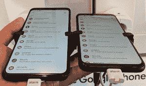

像素 4 XL(左)，像素 4(右)；来源:

[/u/zootia](https://www.reddit.com/r/GooglePixel/comments/djx6r4/fyi_blue_shift_is_still_present_the_p4xl_but_not/)

在 Pixel 4 中，LG 面板的一个不被重视的方面是它的视角——LG OLED 在任何移动有机发光二极管中颜色偏移最小。加上 AmbientEQ 和像素的平板显示器，视角真的有助于改善他们的层压“纸质”外观，因为显示器在不同角度不会改变颜色。然而，我确实希望 Pixel 4 有更高分辨率的显示屏，这将进一步改善纸张错觉。

在中等角度下，Pixel 4 XL 上的视角可以略带蓝色。然而，它与三星最新显示器上的最佳显示器不相上下，这在过去几代中没有太大变化。我有兴趣知道这两个供应商之间的视角差异是在发射器的腔体设计中还是在偏振器堆栈中。

**平滑显示**

最后，谷歌 Pixel 4 的头条新功能是其 90Hz 的“平滑显示”更高的刷新率促进了 UI 流畅性和触摸响应的显著改善，它们有望成为明年移动市场的更大趋势。然而，目前没有移动有机发光二极管支持可变刷新率，我认为在可变刷新率面板可用之前实现更高的刷新率系统是一个错误。目前，高刷新率移动 OLEDs 使用不同刷新率的离散显示模式，并使用软件在较高和较低刷新率显示模式之间切换，以节省电池。不同的显示模式都需要各自的校准表，它们不可能完全匹配。当显示器从一种显示模式切换到另一种显示模式时，这些缺陷可能会被注意到，[谷歌的软件工程师已经承认这是这种基于软件的动态刷新率系统的限制](https://www.xda-developers.com/google-pixel-4-why-90hz-limited-brightness/)。

## **方法论▼**

为了从显示器获得定量的色彩数据，我们将设备特定的输入测试模式放入手机，并使用 X-Rite i1Pro 2 分光光度计测量显示器产生的发射。我们使用的测试模式和设备设置针对各种显示特性和可能改变我们所需测量的潜在软件实现进行了修正。我们主要在 50%的平均像素水平(APL)下测量灰度，其中 50%的显示图案尺寸非常类似于给定白点的 50%的恒定平均相对亮度。我们使用对数-对数空间中亮度读数的斜率的最小平方拟合来导出显示伽马。灰度读数是在最大显示器亮度的 100%、64%、36%、16%和 4%的幅度下获得的，并且被平均以获得指示显示器整体外观的单个读数。这些值分别与显示器亮度的 100%、80%、60%、40%和 20%大致相关。我们现在使用色差度量δ

*ETP* [(ITU-R BT.2124)](https://www.itu.int/dms_pubrec/itu-r/rec/bt/R-REC-BT.2124-0-201901-I!!PDF-E.pdf)

，这是一个

[overall better measure for color differences](https://www.ibc.org/publish/specifying-colour-tolerances-for-hdr-and-wcg-displays-/2449.article)

比δ

*E*

00，这是在我以前的评论中使用的，目前仍在许多其他网站的展示评论中使用。那些还在用δ的

*E*

00 进行颜色误差报告，鼓励使用δ

*EITP*

，作为

[will be detailed in a session](https://2019.smpte.org/home/session/162191/%CE%94eitp-is-now-itu-r-bt.2124-is-the-industry-ready-to-move-on-from-%CE%94e2000)

来自电影电视工程师协会(SMPTE)和肖像显示器协会(CalMan 的所有者)

*EITP*

通常在计算中考虑亮度(强度)误差，因为亮度是完整描述颜色的必要组成部分。然而，由于人类视觉系统分别解释色度和亮度，我们将测试模式保持在恒定亮度，并且在我们的测试模式中不包括亮度(I/强度)误差

*ΔE*

价值观。此外，在评估显示器的性能时，将这两种错误分开是有帮助的，因为就像我们的视觉系统一样，它们属于显示器的不同问题。这样我们可以更彻底地分析和理解显示器的性能。我们的颜色目标基于 ICTCP/ITP 颜色空间，它比 CIE 1976 UCS 具有更好的色调线性，在感知上更均匀。我们的目标在整个 ITP 色彩空间中以 100 cd/m2 的参考白电平以及 100%、75%、50%和 25%饱和度的颜色大致均匀分布。在 100%、64%、36%、16%和 4%的面板背光级别下测量颜色，以评估整个显示器亮度范围内的颜色准确度。对于有机发光二极管显示器，这些颜色是在适当背光强度的最大亮度下测量的。这是因为有机发光二极管显示器主要使用脉宽调制来调节亮度，甚至通过降低电流比例来调节亮度，这相当于以较低的亮度进行渲染

*ETP*

值大约是δ的 3 倍

*E*

相同颜色的 00 值。该度量假设观察者的最关键适应的观看条件，以及测量的δ

*ETP*

色差值为 1.0 表示颜色有明显的差异，小于 1.0 的值表示测量的颜色与完美的颜色没有区别。对于我们的评论，一个δ

*ETP*

小于 3.0 的值是参考显示的可接受的精度水平(根据 ITU-R BT.2124 附录 4.2 建议)，δ

*ETP*

大于 8.0 的值一眼就能看出来(根据经验测试，值(8.0)也与大约 10%的亮度变化相符，这通常是一眼就能注意到亮度差异所需的百分比变化)。HDR 测试模式是针对

[ITU-R BT.2100](https://www.itu.int/dms_pubrec/itu-r/rec/bt/R-REC-BT.2100-2-201807-I!!PDF-E.pdf)

使用感知量化器(ST 2084)。HDR sRGB 图案与 sRGB 原色均匀间隔开，HDR 参考水平白色为 203 cd/m2

[(ITU-R BT.2408)](https://www.itu.int/dms_pub/itu-r/opb/rep/R-REP-BT.2408-2017-PDF-E.pdf)

，并且对于其所有模式，PQ 信号电平为 58%。HDR·P3 图案与 P3 原色均匀隔开，其所有图案的白色电平为 1，000 cd/m2，PQ 信号电平为 75%。所有 HDR 模式都是在 HDR 平均 20% APL 和 20%显示尺寸窗口下测试的。

## **显示配置文件&色域**

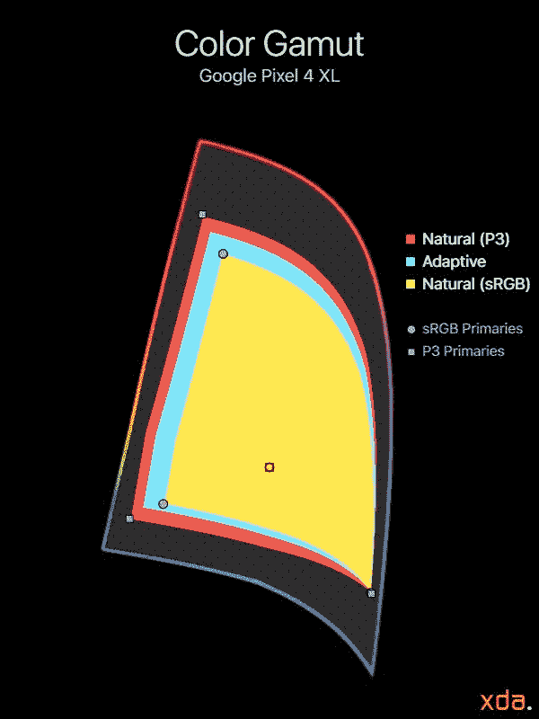

谷歌像素 4 XL 的色域

谷歌 Pixel 4 有三种不同的显示配置:*自适应*、*自然*和*增强*。所有三个配置文件共享相同的白点，相同的传输特性，并且它们都支持 Android 的色彩管理系统。

**自适应**配置文件是谷歌 Pixel 4 的默认显示配置文件。与标准 sRGB 相比，这是一种色彩饱和度扩展配置文件，增加了红色和绿色的活力。更准确地说，红色被测量为大约 10%更饱和，而绿色大约 20%更饱和。红色也稍微变橙色，而绿色看起来稍微偏黄。蓝色的饱和度没有提高，但是调整后的原色会产生稍微亮一点的蓝色调。它的目标是标准的 2.20 伽玛和 D67 (6700 K)白点，就像其他两个配置文件一样。

**更新自适应配置文件**

在以前的 Pixel 设备上，自适应配置文件不支持颜色管理，但在 Pixel 4 中，谷歌更新了自适应配置文件以支持它。新的自适应配置文件现在使用显示器 P3 作为其合成色彩空间，而不是 sRGB 重新映射到更宽的色域。这允许自适应简档最终在不同像素显示器之间保持一致，并且在白点上与自然和增强的显示器简档保持一致。对于前几代像素，情况并非如此。因此，谷歌 Pixel 4 和 Pixel 4 XL 现在都有视觉上相同的自适应配置文件，自然和自适应配置文件共享白点。对于色彩管理的内容，自适应配置文件保持其呈现意图，并以增强的鲜艳度呈现色彩管理的内容。但是，自适应配置文件会在 P3 初选时进行剪辑，并且会剪辑高饱和度的 P3 内容。

**自然**配置文件是遵循行业标准的精确显示配置文件(尽管内部目标是 D67 白点)。这是用于从 Google Pixel 4 显示器中获得最准确颜色的配置文件。

**增强的**配置文件类似于自然配置文件，但它在总色彩饱和度方面略有增强。谷歌表示，我们认为手机等小屏幕上的颜色不够鲜艳，这是他们纳入这一描述的基础。

## **像素 4 亮度**

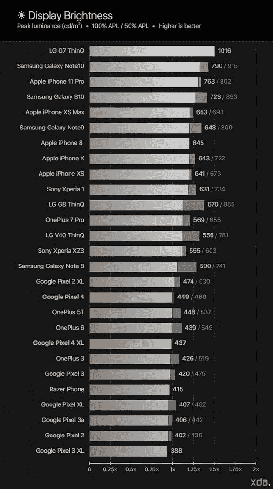

比较亮度图表

历史上，像素设备在显示亮度方面表现平平。今年也不例外。尽管所有其他主要智能手机制造商都显著提高了 OLEDs 的亮度，但谷歌几乎没有任何进步。谷歌今年确实设法增加了最新手机的亮度，从大约 400 尼特增加到 450 尼特，但它仍然是近年来最暗的旗舰智能手机之一。

**缺少高亮度模式**

谷歌目前落后的原因是他们拒绝为他们的系统亮度加入更高功率的亮度状态。此外，谷歌使用的是上一代显示面板，在能效或额定亮度方面无法与三星的最新面板竞争。有趣的是，谷歌在他们的手机中有一个更高亮度的模式，他们可以在 HDR 播放期间进入[(或用 root)](https://www.xda-developers.com/google-pixel-4-high-brightness-mode-fix/) 。但由于可能与电池有关的原因，谷歌不允许他们的手机在正常使用时使用这种额外的亮度。更高亮度模式确实需要更多的电力来驱动——800 尼特峰值亮度状态消耗的电力远远超过 400 尼特亮度状态的两倍——但如果竞争对手能够支持更高的亮度水平*和*比 Pixel 设备保持更好的电池寿命，那么谷歌在这两个部门都严重落后。

当在像素 4’内启用高亮度模式时，它们的显示器接近可接受的亮度水平。600 尼特，这使得谷歌 Pixel 4 显示器的亮度与去年的 OLEDs 显示器相当。但在 2019 年，600 尼特大约是每个主要智能手机公司的基线，而最好的公司都在推动 800 尼特(100% APL)。这些只是谷歌过时面板的限制，因为华为 Mate 30 Pro 和一加 7 Pro 中的相同面板推动了相同的亮度水平——*除了这些手机在正常使用中实际上推动了那些亮度水平。*

**相机取景器电位**

作为一家专注于手机营销和身份识别的公司，谷歌拥有更亮的屏幕将有利于其宣传活动。这可以通过提高取景器的精确度来帮助相机体验。照片的构图是一张好照片的关键因素，这主要取决于你在取景器中看到的东西。谷歌在 Pixel 4 取景器中实现了实时 HDR+,这样你在拍照前看到的东西看起来更接近拍摄和处理的照片。然而，在白天拍摄时，如果显示器亮度不足以准确再现场景，取景器会看起来褪色。这是单反中光学取景器的主要优势之一，它以你眼睛能看到的亮度和对比度显示场景。手机制造商可以改进相机取景器的另一种方法是在相机应用程序中使用绝对 HDR 取景器，这可以将手机显示屏上的相机取景器映射到与场景相同的绝对亮度。

**根据 APL 调整亮度响应**

去年，Pixel 3 XL 中的 DDIC 被调整为将其在较低发射水平(APL)下的亮度限制为全屏白色(100% APL)。虽然这看起来像是一个严重的举动，但实际上这是 OLEDs 的必要步骤，这样它们就可以有一致的伽马校准。较小像素 3 中的 LG 面板对 APL 的亮度响应可变，并且其伽马范围不准确且变化很大。现在，随着 Pixel 4 中新的 LG 面板的出现，它也限制了其较低的发射亮度，因此它应该在伽马校准方面有显著的改进。Pixel 4 XL 面板中的三星面板继续保留了这一特点。

## **像素 4 灰度精度**

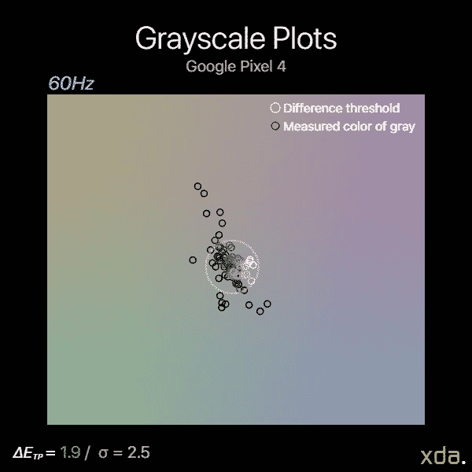

像素 4，60Hz 的灰度图

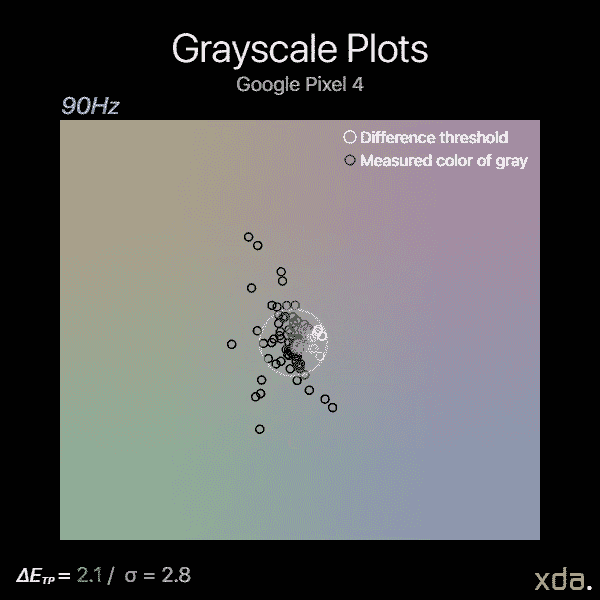

像素 4，90Hz 的灰度图

[caption align = " align center " width = " 400 "]

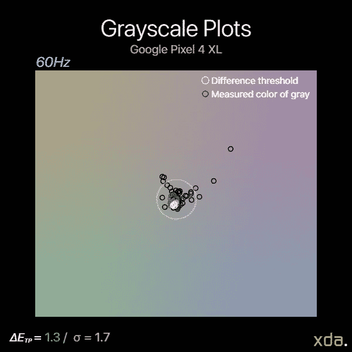

像素为 4 XL，60Hz 的灰度图[/caption]

[caption align = " align center " width = " 400 "]

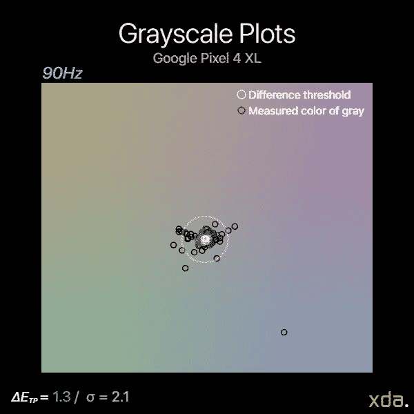

像素为 4 XL，90Hz 的灰度图[/caption]

像素手机显示器在灰度一致性方面也一直很差，经常呈现较暗的颜色和较低的显示亮度。工厂的校准过程只能修复这么多，甚至可能使情况变得更糟。具有一致灰度的显示器通常可归因于严格的有机发光二极管生产公差和显示器生产线上成熟的制造工艺。谷歌素有不为手机硬件提供最佳质量控制的名声，这是有充分理由的。罪魁祸首是谷歌一直在手机中使用的 LG 面板，今年的情况类似。谷歌为较小的 Pixel 4 使用了 LG 面板，尽管这比前几代产品有了明显的改进，但与三星的一些面板相比，它仍然显示出更高的灰度分布。谷歌 Pixel 4 XL 使用了三星面板，并在上面的图中清楚地显示了出色的灰度一致性。然而，与 iPhone 11 Pro 无可挑剔的灰度曲线相比，仍有改进的空间。

**刷新率之间的“闪烁”**

由于 Pixel 4s 的面板没有真正的可变刷新率，谷歌使用单独的显示模式，60Hz 和 90Hz 的显示时间不同(这对于任何不可变刷新率的显示器来说都是正常的)。这导致两种模式的显示特性不同，为了使两种模式看起来相似，需要单独的校准表。然而，在大规模生产中，完美的校准几乎是不可能的。对于 OLEDs，校准失误和信号漂移/变化对于低信号水平下的深色非常明显，类似于弱光下增加的相机噪声。在谷歌 Pixel 4 和 Pixel 4 XL 中，两种刷新率的校准差异在它们较暗的阴影中显而易见。对于这两款手机来说，90Hz 显示模式比 60Hz 显示模式更偏向于蓝绿色。对于深色，这种差异在低亮度下最明显，在 10-20 尼特之间最严重。这种差异是谷歌难以实现自动切换平滑显示系统的原因。请注意，谷歌不是唯一一家存在这一问题的原始设备制造商；在其他高刷新率有机发光二极管面板中，不同刷新率模式之间也存在校准差异，如一加的最新手机或 ROG 手机 II。

## **像素 4 颜色精度**

[caption align = " align center " width = " 400 "]

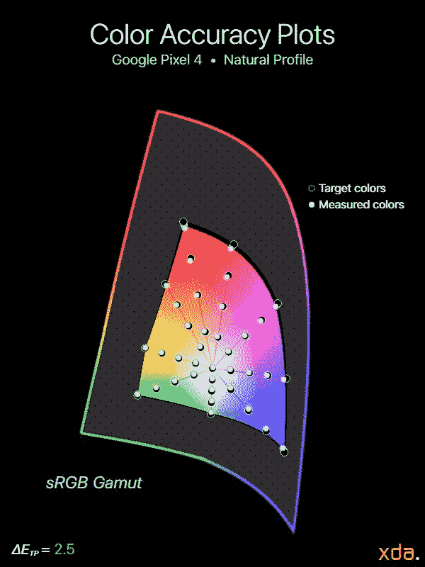

谷歌像素 4 的平均 sRGB 色彩准确度图，自然轮廓[/caption]

[caption align = " align center " width = " 400 "]

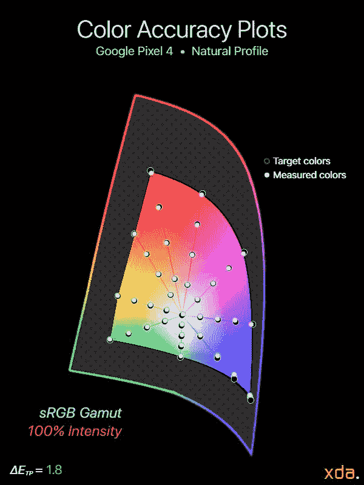

谷歌像素 4 的最大强度 sRGB 色彩准确度图，自然轮廓[/caption]

[caption align = " align center " width = " 400 "]

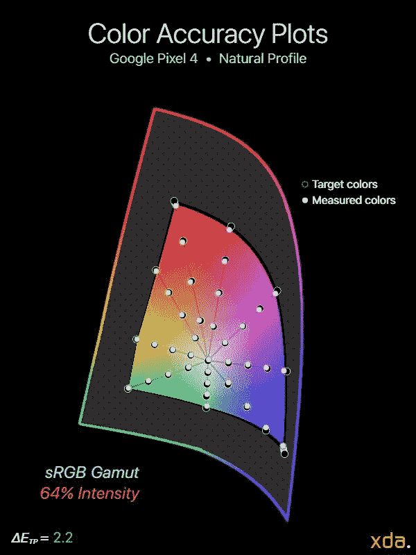

谷歌像素 4 的高强度 sRGB 色彩准确度图，自然轮廓[/caption]

[caption align = " align center " width = " 400 "]

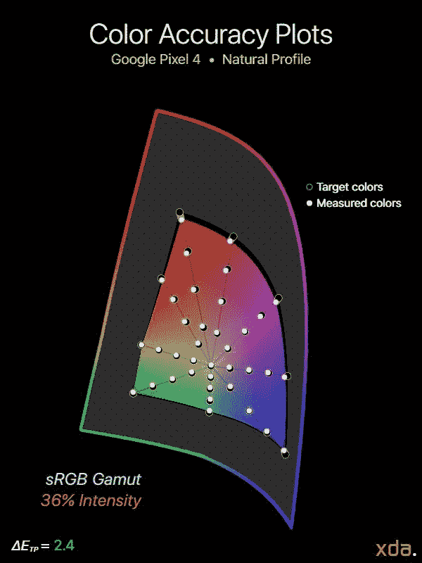

谷歌像素 4 的中等强度 sRGB 色彩准确度图，自然轮廓[/caption]

[caption align = " align center " width = " 400 "]

Google Pixel 4 的低强度 sRGB 色彩准确度图，自然轮廓[/caption]

[caption align = " align center " width = " 400 "]

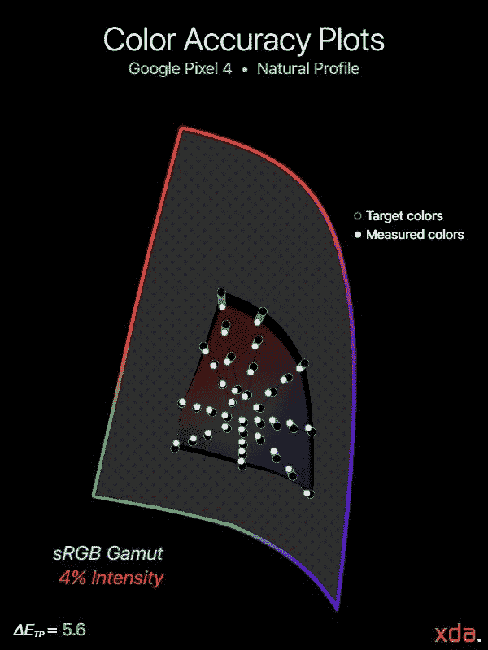

谷歌像素 4 的极低强度 sRGB 色彩准确度图，自然轮廓[/caption]

[caption align = " align center " width = " 400 "]

谷歌像素 4 的平均 P3 色彩准确度图，自然轮廓[/caption]

[caption align = " align center " width = " 400 "]

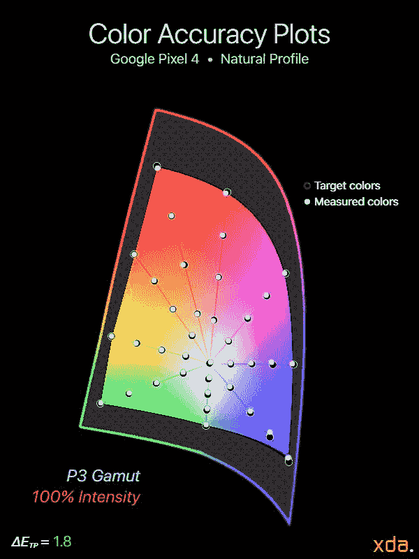

谷歌像素 4 的最大强度 P3 色彩准确度图，自然轮廓[/caption]

[caption align = " align center " width = " 400 "]

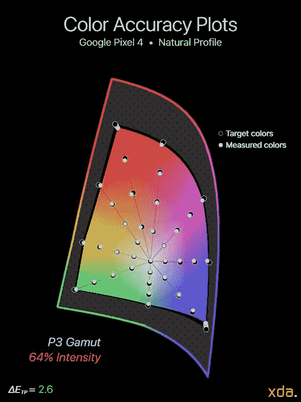

谷歌像素 4 的高强度 P3 色彩准确度图，自然轮廓[/caption]

[caption align = " align center " width = " 400 "]

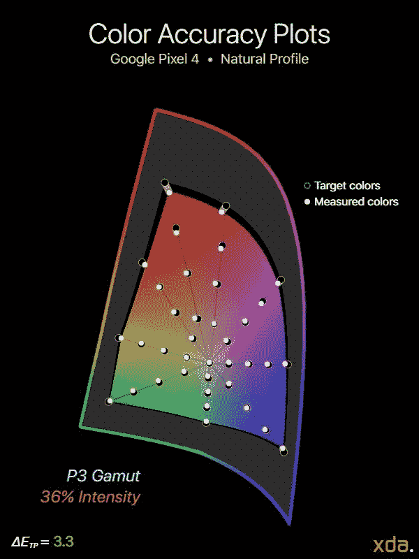

谷歌像素 4 的中等强度 P3 色彩准确度图，自然轮廓[/caption]

[caption align = " align center " width = " 400 "]

Google Pixel 4 的低强度 P3 色彩准确度图，自然轮廓[/caption]

[caption align = " align center " width = " 400 "]

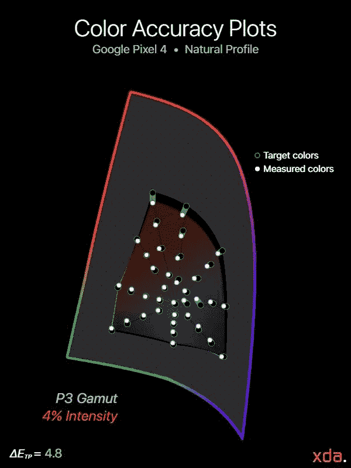

谷歌像素 4 的极低强度 P3 色彩准确度图，自然轮廓[/caption]

[caption align = " align center " width = " 400 "]

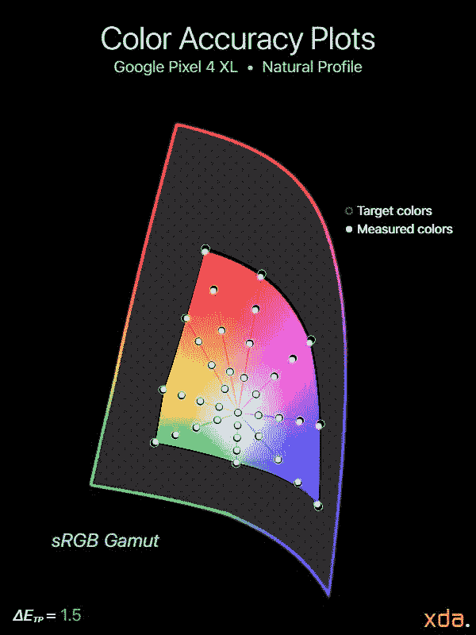

谷歌像素 4 XL 的平均 sRGB 色彩准确度，自然轮廓[/caption]

[caption align = " align center " width = " 400 "]

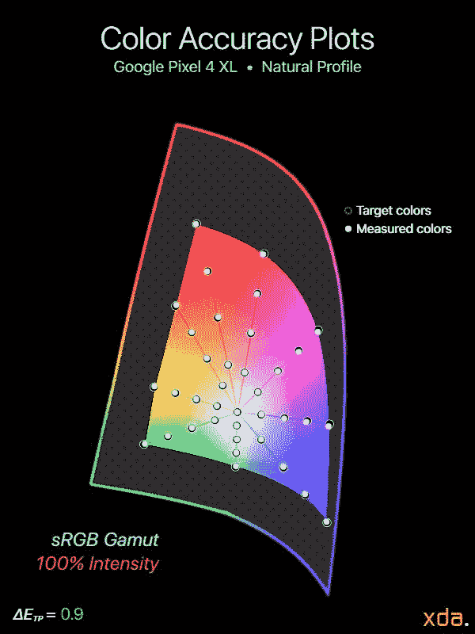

谷歌像素 4 XL 的最大强度 sRGB 色彩准确度，自然轮廓[/caption]

[caption align = " align center " width = " 400 "]

Google Pixel 4 XL 的高强度 sRGB 色彩准确度，自然轮廓[/caption]

[caption align = " align center " width = " 400 "]

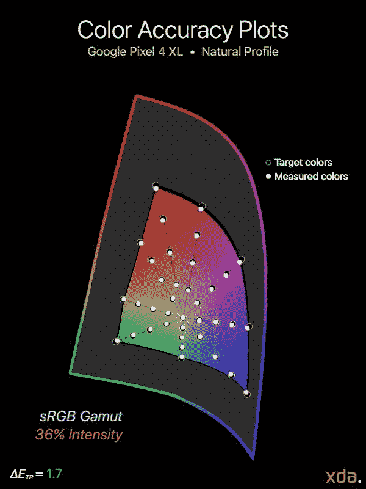

谷歌像素 4 XL 的中等强度 sRGB 色彩准确度，自然轮廓[/caption]

[caption align = " align center " width = " 400 "]

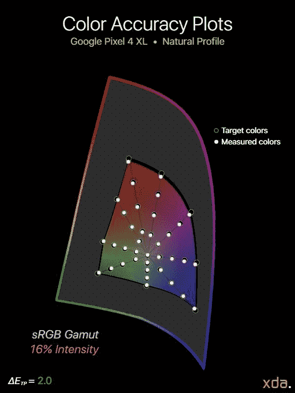

Google Pixel 4 XL 的低强度 sRGB 色彩准确度，自然轮廓[/caption]

[caption align = " align center " width = " 400 "]

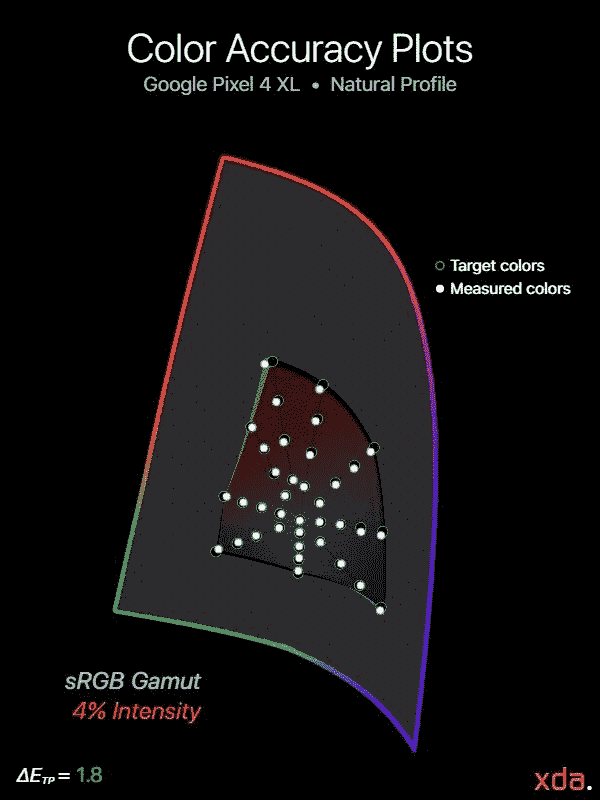

Google Pixel 4 XL 的极低强度 sRGB 色彩准确度，自然轮廓[/caption]

[caption align = " align center " width = " 400 "]

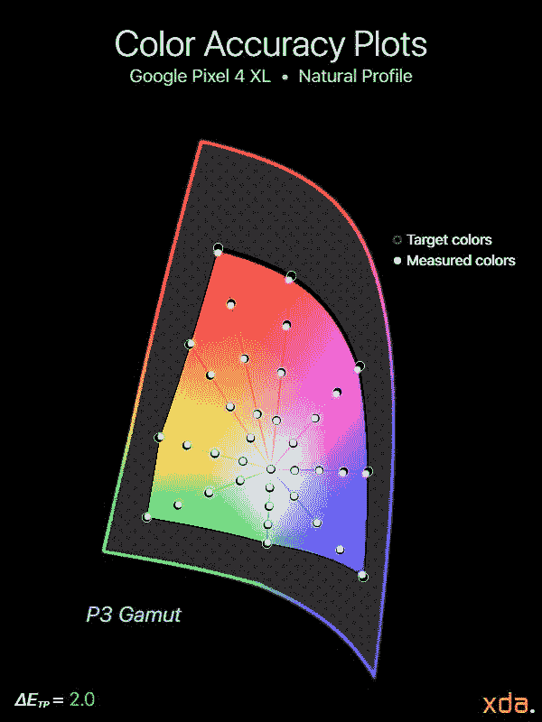

谷歌像素 4 XL 的平均 P3 色彩准确度，自然轮廓[/caption]

[caption align = " align center " width = " 400 "]

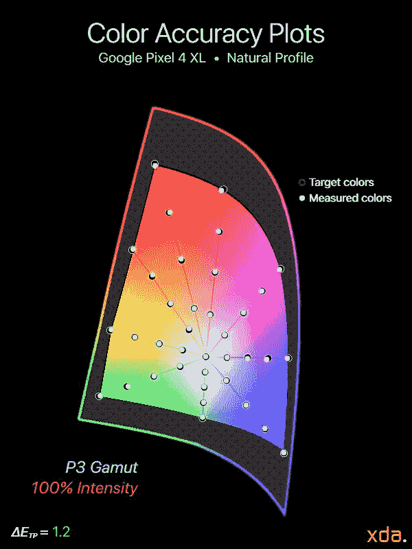

谷歌像素 4 XL 的最大强度 P3 色彩准确度，自然轮廓[/caption]

[caption align = " align center " width = " 400 "]

Google Pixel 4 XL 的高强度 P3 色彩准确度，自然轮廓[/caption]

[caption align = " align center " width = " 400 "]

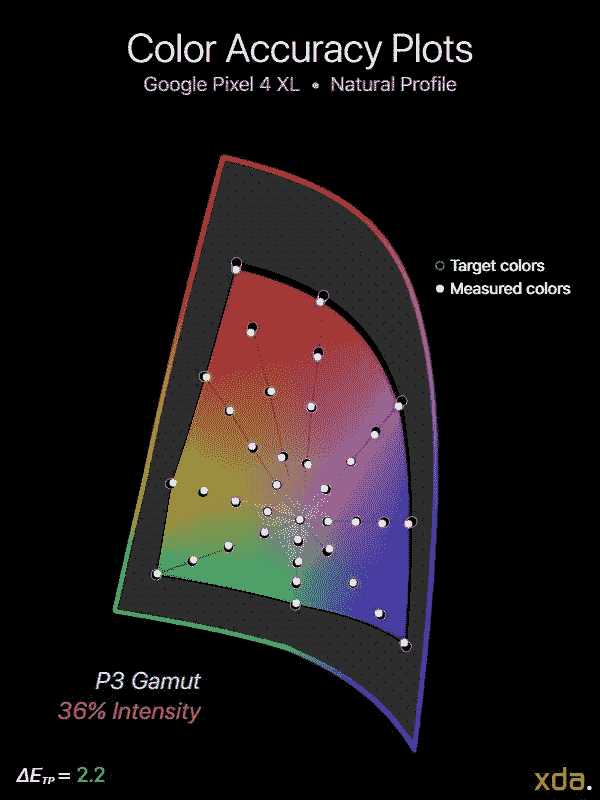

谷歌像素 4 XL 的中等强度 P3 色彩准确度，自然轮廓[/caption]

[caption align = " align center " width = " 400 "]

Google Pixel 4 XL 的低强度 P3 色彩准确度，自然轮廓[/caption]

[caption align = " align center " width = " 400 "]

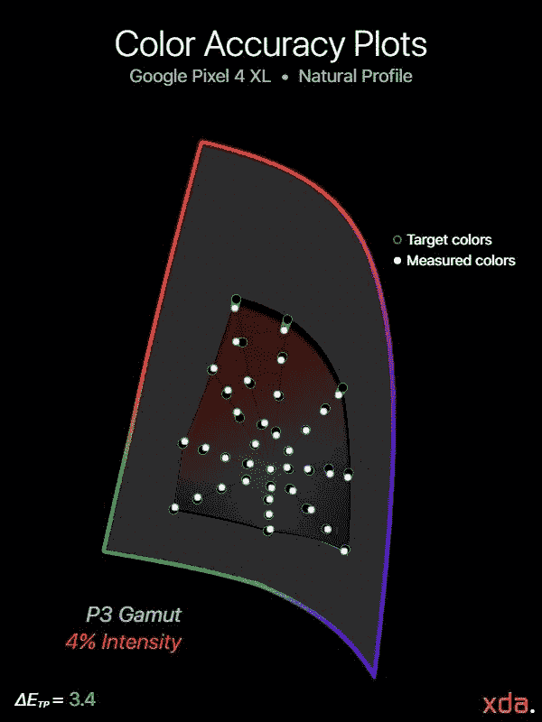

Google Pixel 4 XL 的极低强度 P3 色彩准确度，自然轮廓[/caption]

 <picture>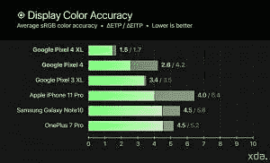</picture> 

Comparative color accuracy chart

谷歌通常擅长的一个领域是颜色的准确性。他们的手机每年都在颜色准确性方面具有竞争力，谷歌在 2019 年成功延续了这一趋势。我们的色彩准确度测试平台由显示器亮度范围内五种不同刺激水平的 37 个恒定亮度点组成。图像和电影中的大多数颜色强度在 15–40%之间，而应用程序/网页设计和用户界面中的颜色通常由 50%以上强度的色调组成，因此测量所有刺激水平下的颜色非常重要。新的δ*ETP*色差指标改善了这些低刺激读数，我们现在用它来评估显示器的总色彩准确度。

**准确的白点？**

我们的谷歌 Pixel 4 和 Pixel 4 XL 设备都有非常精确到 D65 标准的白点。我们的谷歌 Pixel 4 平均白点测量值为 6586K(δ*ETP*= 1.3)，而我们的 Pixel 4 XL 测量值更精确，为 6477K(δ*ETP*= 0.4)。虽然我很想称赞这些白点有多准确，但谷歌内部的目标是 D67 (6700 K)的白点，所以我不能说他们击中了他们的目标。然而，我想指出的是，OLED 的 D67 白点实际上可能比目标 D65 更准确，因为现代 OLED 容易出现同色异谱故障(由于宽颜色扩展的窄光谱带原色)，并且在相同的光谱功率分布下比 LCD 或 CRT 更温暖。 [1](https://www.avsforum.com/forum/139-display-calibration/1908505-why-current-leds-oleds-breaking-cie1931-observer-model.html) 此外，无论如何，他们中的大多数人倾向于用比他们的目标更暖的白点来运输。

**改善色彩明度**

一些先前的像素设备虽然在色度上是精确的，但是表现出对比度问题和比标准更暗的颜色。这是所有有机发光二极管面板的共同问题，直到三星 Galaxy S9，这是第一款控制亮度-APL 响应的智能手机显示屏。谷歌在 Pixel 3 XL 上修复了这个问题，但 Pixel 3 上的 LG 面板仍然存在这个问题。随着 Pixel 4 上新的 LG 面板，谷歌也提高了亮度-APL 响应，现在 Pixel 4 和 Pixel 4 XL 都具有出色的总色彩准确度。sRGB *和 P3*显示器的平均δ*ETP*低于 3.0，最大误差较小。然而，当考虑亮度误差时，我们看到较小的谷歌 Pixel 4 似乎在伽玛之外的颜色亮度方面存在额外的问题。尽管较小的谷歌 Pixel 4 的对比度相当准确，但一些颜色仍然比预期的略暗，特别是在红色混合色和蓝色中。这可能是由于它的白点向品红色移动，远离了构成 RGB 颜色混合物中大多数亮度的绿色。与像素 3 相比，这仍然是一个明显的改进，这些亮度问题应该不会被大多数人注意到，因为它低于我们的参考阈值(δ*EI*=-2.8)

**行业领先的色彩准确度**

在 Pixel 4 XL 的三星显示屏上，谷歌显示了行业领先的总精度，展示了我在我们的全面测试平台上见过的任何最新智能手机中最低的颜色误差。Pixel 4 XL 测得的平均总色彩精度δ*EITP*为 1.7，相比其他 2019 款旗舰有了明显的飞跃。对于最大强度的色彩，Pixel 4 XL 表现出了媲美甚至超过许多专业参考显示器的色彩准确度性能，平均δ*ETP*为 0.9，低于我们的视觉阈值(δ*ETP*<1)。

虽然 iPhone 11 Pro 和 Galaxy Note10 的显示屏仍然是目前同类最佳的，但它们有两个共同的缺陷:都比标准的白点更温暖，并且都在较低的亮度下表现出过饱和。大多数显示器评论不涵盖较低刺激的颜色(DisplayMate 仅测试最大亮度和最大强度测试颜色)，大多数显示器评论使用旧的δ*E2000*颜色误差指标，该指标报告了较低强度的颜色，因为该指标假设视觉适应特定的白色水平。因此，旧的δ*E2000*度量对于具有较低画面级别的内容(大多数电影；暗模式应用中的颜色)或用于 HDR 颜色准确度评估。谷歌 Pixel 4 和 Pixel 4 XL 在较低的色彩强度下确实显示出轻微的不饱和，但总体上在所有强度下都保持了很高的准确性。

## **像素 4 对比度&色调响应**

[caption align = " align center " width = " 400 "]

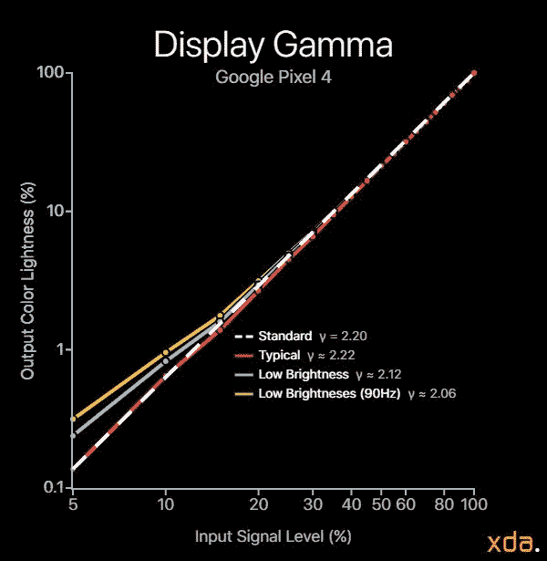

谷歌 Pixel 4 的平均伽马值[/caption]

[caption align = " align center " width = " 400 "]

谷歌像素 4，60Hz 的最大亮度伽马值[/caption]

[caption align = " align center " width = " 400 "]

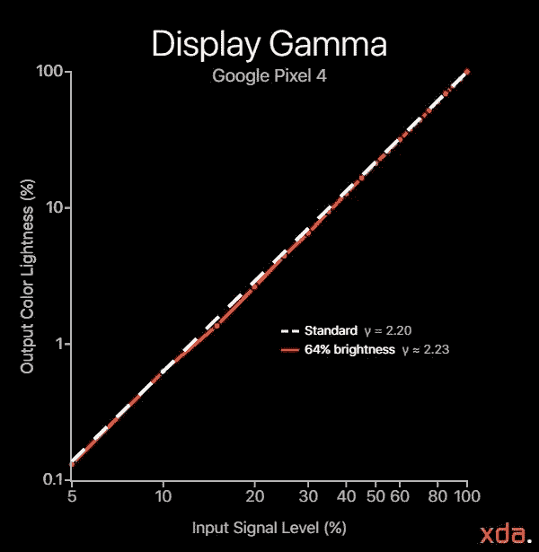

谷歌 Pixel 4，60Hz 的 64%亮度伽马射线[/caption]

[caption align = " align center " width = " 400 "]

谷歌像素 4，60Hz 的 36%亮度伽玛[/caption]

[caption align = " align center " width = " 400 "]

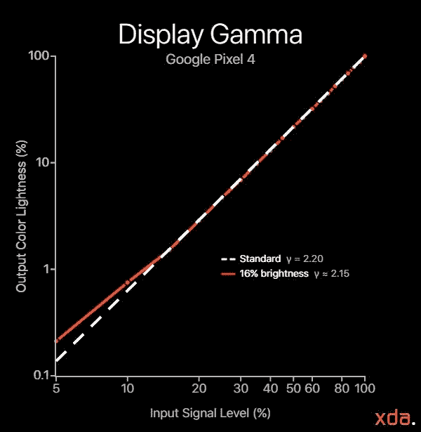

谷歌像素 4，60Hz 的 16%亮度伽玛[/caption]

[caption align = " align center " width = " 400 "]

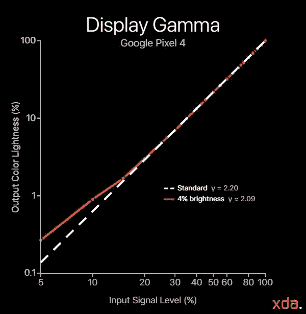

谷歌像素 4，60Hz 的 4%亮度伽玛[/caption]

[caption align = " align center " width = " 400 "]

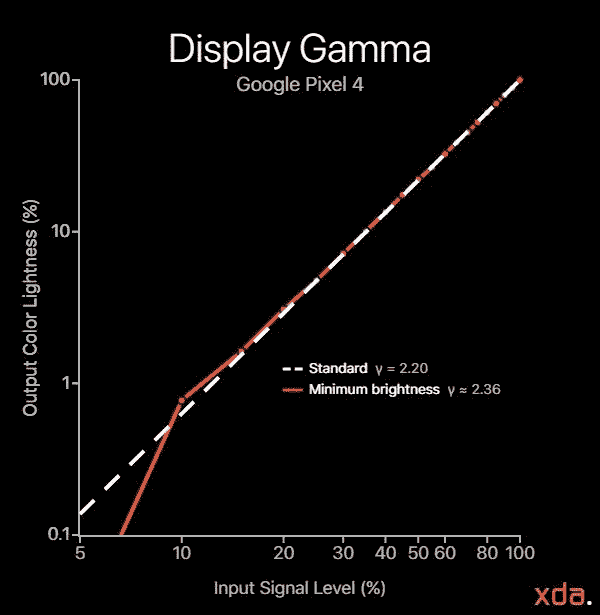

谷歌像素 4，60Hz 的最小亮度伽马值[/caption]

[caption align = " align center " width = " 400 "]

谷歌 Pixel 4 的平均伽马值[/caption]

[caption align = " align center " width = " 400 "]

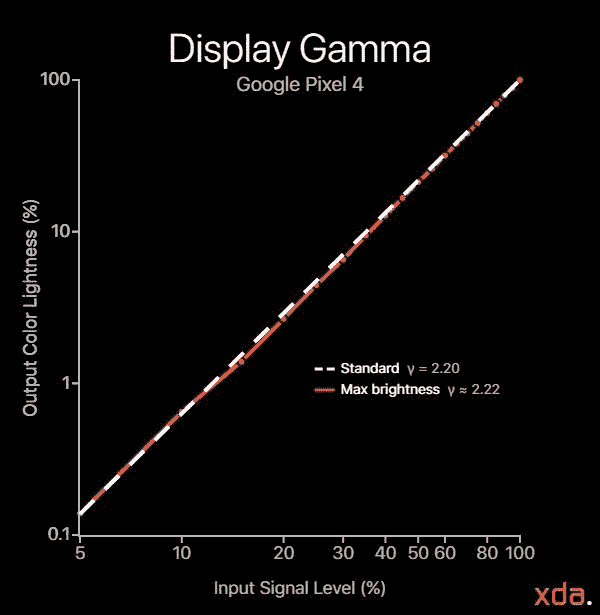

谷歌像素 4，90Hz 的最大亮度伽马值[/caption]

[caption align = " align center " width = " 400 "]

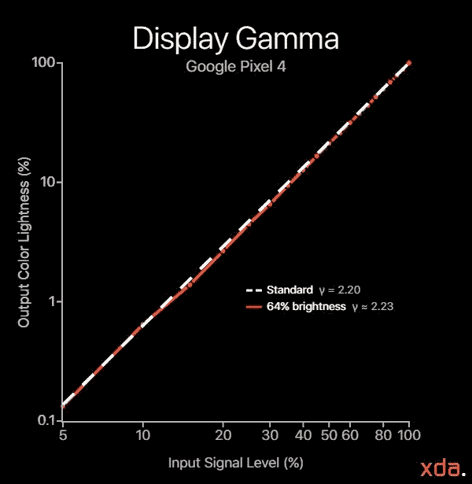

谷歌像素 4，90Hz 的 64%亮度伽玛[/caption]

[caption align = " align center " width = " 400 "]

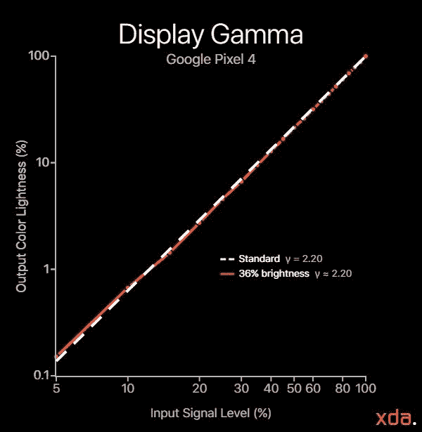

谷歌像素 4，90Hz 的 36%亮度伽玛[/caption]

[caption align = " align center " width = " 400 "]

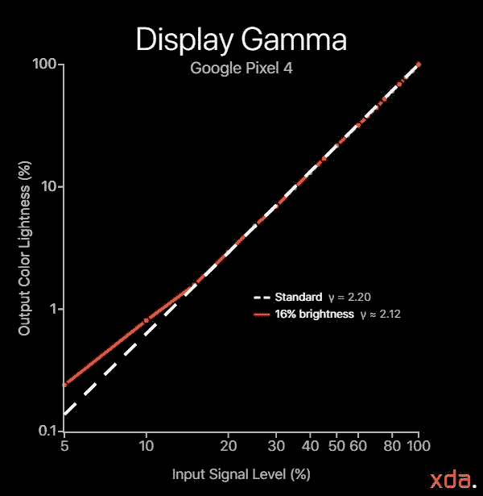

谷歌像素 4，90Hz 的 16%亮度伽玛[/caption]

[caption align = " align center " width = " 400 "]

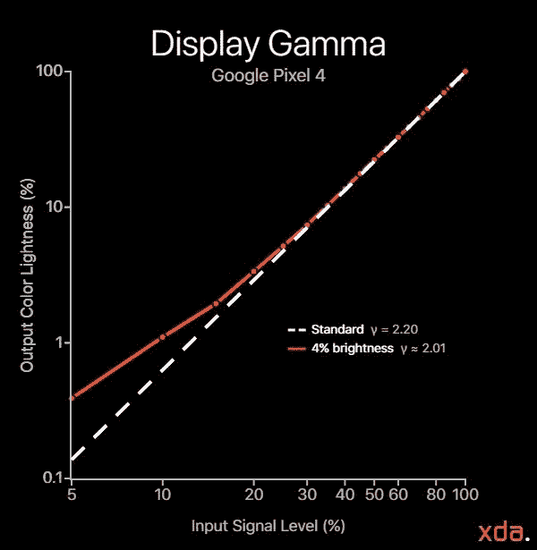

谷歌像素 4，90Hz 的 4%亮度伽玛[/caption]

[caption align = " align center " width = " 400 "]

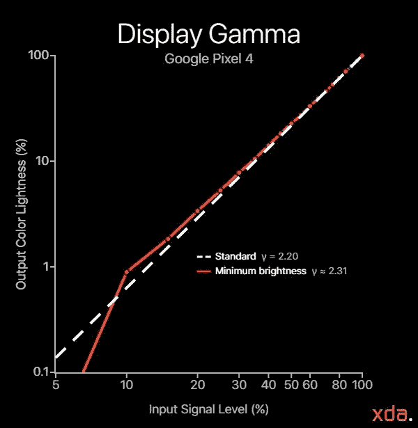

谷歌像素 4，90Hz 的最小亮度伽马值[/caption]

[caption align = " align center " width = " 400 "]

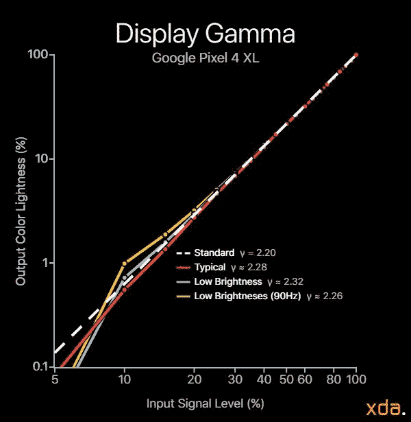

谷歌 Pixel 4 XL 的平均伽马值[/caption]

[caption align = " align center " width = " 400 "]

谷歌像素 4 XL 的最大亮度伽玛，60Hz[/caption]

[caption align = " align center " width = " 400 "]

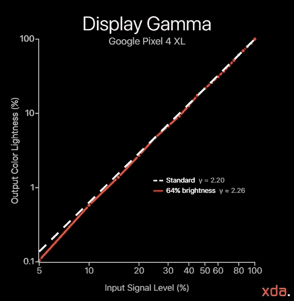

谷歌像素 4 XL 的 64%亮度伽玛，60Hz[/caption]

[caption align = " align center " width = " 400 "]

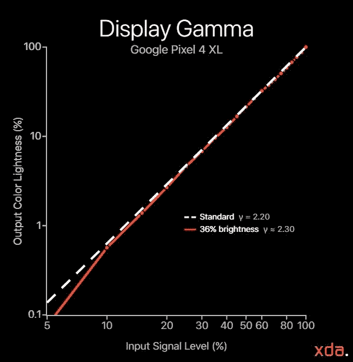

谷歌 Pixel 4 XL 的 36%亮度伽玛，60Hz[/caption]

[caption align = " align center " width = " 400 "]

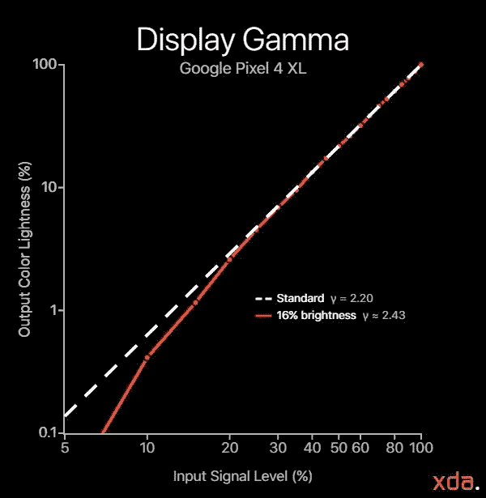

谷歌像素 4 XL 的 16%亮度伽玛，60Hz[/caption]

[caption align = " align center " width = " 400 "]

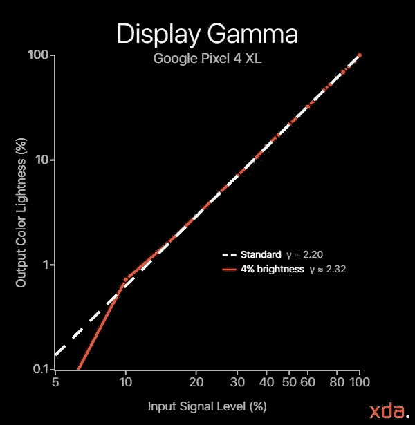

谷歌像素 4 XL，60Hz 的 4%亮度伽马射线[/caption]

[caption align = " align center " width = " 400 "]

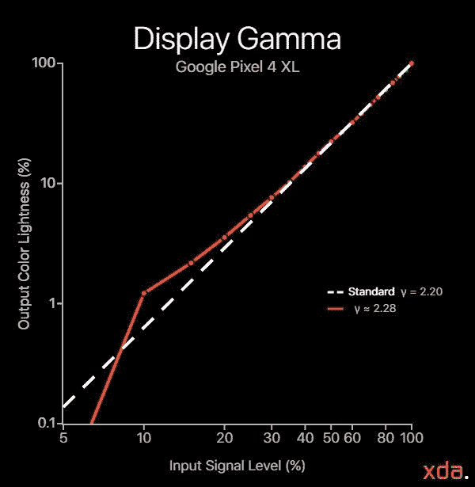

谷歌像素 4 XL 的最小亮度伽玛，60Hz[/caption]

[caption align = " align center " width = " 400 "]

谷歌 Pixel 4 XL 的平均伽马值[/caption]

[caption align = " align center " width = " 400 "]

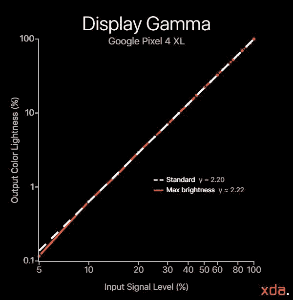

谷歌 Pixel 4 XL 的最大亮度伽玛，90Hz[/caption]

[caption align = " align center " width = " 400 "]

谷歌像素 4 XL 的 64%亮度伽玛，90Hz[/caption]

[caption align = " align center " width = " 400 "]

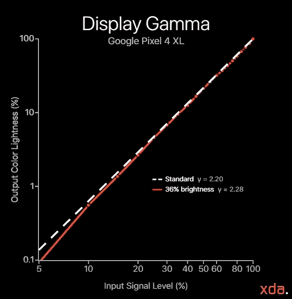

谷歌像素 4 XL 的 36%亮度伽玛，90Hz[/caption]

[caption align = " align center " width = " 400 "]

谷歌像素 4 XL 的 16%亮度伽玛，90Hz[/caption]

[caption align = " align center " width = " 400 "]

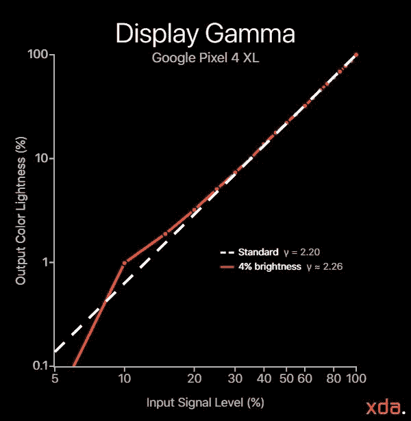

谷歌像素 4 XL 的 4%亮度伽玛，90Hz[/caption]

[caption align = " align center " width = " 400 "]

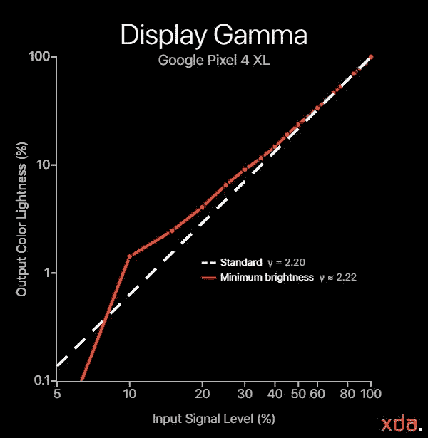

谷歌像素 4 XL 的最低亮度伽玛，90Hz[/caption]

显示器对比度和伽玛往往被认为是精确显示中最重要的因素。由于谷歌的显示器来自两家不同的供应商，它们之间肯定会有差异。最重要的差异通常出现在它们的伽马刻度中，谷歌 Pixel 4 和 Pixel 4 XL 面板之间的伽马行为实际上是非常不同的。

**不稳定像素 4 XL 伽玛**

Pixel 4 XL 的伽马校准有点麻烦。在最大亮度下，谷歌 Pixel 4 XL 显示器的对比度非常完美——完全是 2.20 伽马功率。但是，随着显示器亮度的降低，Pixel 4 XL 的伽玛会发生变化。大约 50%的亮度(~200 尼特)，Pixel 4 XL 的伽马刻度不再是直的，暗色调急剧下降。在大约 70 尼特的情况下，Pixel 4 XL 似乎采用了不同的显示校准，其锯齿伽马接近高 2.43 伽马功率。低于 10%强度的颜色覆盖了图像中的大部分阴影，非常暗，几乎被剪切掉了。在中低显示亮度下，Pixel 4 XL 的对比度比 Pixel 3 XL 略有下降，只是谷歌已经修复了 Pixel 3 XL 在最低亮度下存在的严重校准错误。我不禁认为，谷歌主要专注于使最大亮度伽马精确，以获得 DisplayMate 的高分，display mate 的测试平台只测量最大亮度的伽马。不仅仅是伽玛，还有色彩的准确性。这类似于 Galaxy S10 和 Galaxy Note10(骁龙),其中只有最大亮度具有直线 2.20 伽马功率，并且在较低的显示亮度下它变得越来越差。

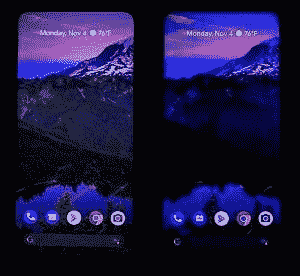

正常(左)，调试伽玛(右)

似乎还有一个谷歌 Pixel 4 XL 独有的错误，导致不和谐的显示校准。根据我的测试，Pixel 4 XL 在启用 90Hz 并禁用常亮显示的情况下唤醒显示器时，应用了错误的伽马校准。90Hz 和 AOD 模式都有自己的显示器校准，Pixel 4 XL 在确定唤醒显示器时应用什么显示器校准时会感到困惑。在 50%以上的亮度下，这个 bug 不会太明显，但它仍然会稍微影响白点和显示饱和度。在较低的亮度下，这个问题变得越来越严重，在最低亮度下拍摄显示器伽玛，并大幅削减色调。

**像素 4:改进最多的(LG)显示屏**

另一方面，较小的谷歌 Pixel 4 具有惊人的校准显示对比度，这可以部分归功于其对 APL 的固定亮度响应。它的较高显示亮度范围具有令人印象深刻的低方差，范围仅在 2.21 和 2.23 直线伽马功率之间。对于较低的亮度水平，谷歌 Pixel 4 会提升其阴影，从而导致较低的显示伽玛。这既是一件好事，也是一件坏事，因为谷歌 Pixel 4 在较低的显示亮度下以降低图像对比度为代价显示了典型的有机发光二极管近黑色渲染。谷歌 Pixel 4 是我见过的第一款能够渲染其第一个 8 位深度强度(1/255，#010101)的安卓有机发光二极管显示器，其近黑色渲染能力仍然非常出色，直到其最低亮度仍能渲染 2.4%强度(6/255)的灰色。到目前为止，只有 iPhones 能够在移动有机发光二极管上做到这一点。iPhone OLEDs 也能提升暗端的阴影，呈现更好的近黑色；目前，这是在黑暗的观看条件下保持图像保真度的必要权衡。然而，在最低亮度下，苹果 iPhones 和一加 7 Pro 在黑色剪裁方面仍优于谷歌 Pixel 4。

这是一个令人惊讶的进展，因为 Pixel 2 XL 中的 LG 面板因异常高的黑色削波而臭名昭著。Pixel 3 也有 LG 面板，它在黑色剪裁方面有所改善，但仍然明显高于典型的三星面板。我只期望 LG 面板在 Pixel 4 上有一点点改善，但我实际上对 LG 面板这次的改善感到非常震惊。

## **像素 4 HDR10 回放**

虽然智能手机上的 HDR 内容通常仍仅限于网飞和 YouTube 上的一些短片，但看到我们的小口袋电脑的尖端功能总是很有趣。现在支持良好的 HDR10 精度可以为 HDR 内容的最终扩散增加一个良好的未来防护层——尽管 HDR10 标准是否将占主导地位仍有待观察。我只设法有时间在谷歌 Pixel 4 XL 中测试 HDR10(只有 8 位间隔)，它确实*还行*。

谷歌 Pixel 4 XL 的峰值亮度为 600 尼特，符合 HDR 标准的 OLEDs 亮度至少为 540 尼特。但与 Galaxy Note10 和 iPhone 11 Pro 上声称的 1200+尼特相比，Pixel 4 XL 上的亮点似乎有些暗淡。此外，谷歌 Pixel 4 XL 似乎明显低于其信号范围的 15%，使这些关键的黑暗场景比预期的暗得多。不过，它确实提供了到峰值亮度的平滑衰减，而不仅仅是削波。

展望未来，谷歌 Pixel 4 XL 的色彩准确度的卓越性延伸到了它的 HDR Rec。709 精度。虽然不是参考水平，但 3.4 的δ*ETP*还是很不错的。然而，大多数 HDR10 内容扩展到 DCI-P3，这对于准确再现要求更高。HDR DCI-P3 的标准通常是 1000 尼特的标称白色水平，Pixel 4 XL 甚至无法达到这样的亮度。因此，正如预期的那样，Pixel 4 XL 无法覆盖 HDR DCI-P3 色域的很大一部分，并且它在再现更高的内部颜色混合(橙色、粉色和紫色)时会出现故障。

## **最后的想法**

今年，谷歌比以往任何时候都更好地缩小了两种显示器之间的差距。他们的校准匹配得更加均匀，但现在他们都有各自的特点，防止一个显示器是明显的优势。虽然 Pixel 4 XL 可能有更准确的颜色测量，但我很难看出这些比例的差异。此外，我认为对比度是精确图像中最重要的因素，Pixel 4 在其整个亮度范围内始终比 Pixel 4 XL 表现更好。Pixel 4 还具有出色的阴影渲染能力，可以与 iPhones 相媲美，我是许多这方面内容的消费者。然而，灰度不一致是显而易见的，令人讨厌，它让我离开了 Pixel 4，看到不同的灰色 UI 元素和不同的色调。幸运的是，我的 Pixel 4 对暗灰色的显示均匀性非常好，但我已经看到了许多关于区域屏幕色调的帖子。这导致了显示屏抽奖，我敢肯定这仍然是今年 LG Pixel 4 面板的一个大问题。

> 支付 800 美元以上的消费者不应该担心 2019 年昏暗的显示器或彩票之类的事情，但这似乎是像素设备的一个反复出现的主题

不出所料，我对这两款显示器最大的不满是亮度太低。我住在加州——在夏天，明亮的展示是 T4 的必去之地。我开车时通常会把手机放在汽车支架上，我发现所有 Pixel 手机的亮度都很差。明亮的屏幕只是总体上更好的户外体验，如果你一开始就看不清，那么世界上最好的校准也没有用。这也将[改善相机体验](#camera-viewfinder-potential)，这似乎是谷歌的主要卖点。当然，对于其他人来说，它的亮度可能不是一个问题，这取决于他们对手机的期望，但这并不影响许多人对它的看法。

> “有而不要，不如要而不要。”
> 
> -不是谷歌

比谷歌小得多的一加公司能够从三星获得与 Galaxy Note10 和 iPhone 11 Pro 一样亮的下一代面板，他们在与 Pixel 4 几乎同时发布了一加 7T。iPhone 11 Pro 是谷歌试图直接与之竞争的手机，发布时间早于配备三星最新面板的 Pixel 4。如果谷歌真的尽最大努力使用最好的部分，他们肯定也能做到这一点。感觉好像谷歌真的为找到硬件“瓶颈”的解决方案而自豪，但有时它似乎只是一个错误——在这种情况下，他们应该使用更好的硬件。

**[谷歌 Pixel 4 论坛](https://forum.xda-developers.com/pixel-4)**| |**|[谷歌 Pixel 4 XL 论坛](https://forum.xda-developers.com/pixel-4-xl)**

**[购买谷歌 Pixel 4 或 Pixel 4 XL](https://store.google.com/us/product/pixel_4)**

| **规格** | **谷歌像素 4** | **谷歌 Pixel 4 XL** |
| --- | --- | --- |
| **类型** | “灵活的”有机发光二极管 PenTile 钻石像素 |
| **制造商** | LG 显示器 | 三星显示公司。 |
| **尺寸** | 5.2 英寸乘 2.4 英寸 5.7 英寸对角线 12.6 平方英寸 | 5.7 英寸乘 2.6 英寸 6.3 英寸对角线 15.4 平方英寸 |
| **决议** | 2280×1080 像素 19:9 像素宽高比 | 3040×1440 像素 19:9 像素宽高比 |
| **像素密度** | 每英寸 314 个红色子像素每英寸 444 个绿色子像素每英寸 314 个蓝色子像素 | 每英寸 380 红色子像素每英寸 537 绿色子像素每英寸 380 蓝色子像素每英寸 |
| **像素锐度距离** *视力为 20/20 的可分辨像素距离。典型的智能手机观看距离约为 12 英寸* | ETP = 1.3 | **sRGB:** 平均δ*ETP*= 2.5 2.1 最大δ*ETP*= 13.3*非常准确* |
| **角度偏移** *在倾斜 30 度时测量* | -27%的亮度偏移δ*ETP*= 6.1 的颜色偏移*点击此处查看图表* | -26%的亮度偏移δ*ETP*= 6.4 的颜色偏移*点击此处查看图表* |
| **黑色削波阈值** *要削波的黑色信号电平* | **色域比自然轮廓**大 22.2% | **最小值:** 1.9 尼特 |

| **规格** | **谷歌像素 4，自然** | **谷歌 Pixel 4，自适应** |
| --- | --- | --- |
| **亮度** | 最小: 2.0 尼特**峰值 100% APL:** 449 尼特**峰值 50% APL:** 460 尼特1% APL 峰值: 467 尼特峰值 HDR 20% APL: 615 尼特

* * *

每 100 尼特的亮度降低 1.0% |
| **伽玛** *标准是 2.20 的直线伽玛* | 2.21–2.23 平均 2.22**低亮度:**2.09–2.15 平均 2.12

**90Hz 低亮度:**

2.01–2.12 平均 2.06

**峰值 1% APL:** 430 尼特

*极低方差* *优秀***白点** *标准是 6504 K* |
| 2.20–2.43 平均 2.28 | **色差** |
| **sRGB:** 平均δ*ETP*= 2.5 2.1 最大δ*ETP*= 13.3*非常准确* | **90Hz:****P3:** 平均δ*ETP*= 2.9 2.5 最大δ*ETP*= 17.1*非常准确***比自然轮廓**大 22.2% *色域* | 2.22–2.28 平均 2.25+11%红色饱和度，轻微移动橙色(δ*etp⊥*= 6.1)+19%绿色饱和度，轻微移动薄荷色(δ*etp⊥*= 3.6)-1%蓝色饱和度**规格** |

| **谷歌 Pixel 4 XL，自然** | **谷歌 Pixel 4 XL，自适应** | **亮度** |
| --- | --- | --- |
| 最小: 1.9 尼特 | 6477Kδ *ETP* = 0.4**峰值 100% APL:** 437 尼特50% APL 峰值: 434 尼特1% APL 峰值: 430 尼特**sRGB:** 平均δ*ETP*= 1.5 1.2 最大δ*ETP*= 6.4*极为精确*峰值 HDR 20% APL: 596 尼特**伽玛** *标准是 2.20 的直线伽玛* |
| 2.20–2.43 平均 2.28 | **比自然轮廓大 22.6%*色域***

*相同的蓝色饱和度*

*2.22–2.28 平均 2.25*

*2.22–2.28 Average 2.25*

**变化伽玛* *可以略高*****白点** *标准是 6504 K** |
| 6477Kδ*ETP*= 0.4 | **色差** |
| **sRGB:** 平均δ*ETP*= 1.5 1.2 最大δ*ETP*= 6.4*极为精确* | **sRGB:** Average Δ*ETP* = 1.5 ± 1.2 Maximum Δ*ETP* = 6.4 *Outstandingly accurate***P3:** 平均δ*E*= 2.0 1.6 最大δ*ETP*= 8.8*极为精确***比自然轮廓**大 22.6% *色域* | **22.6% *larger* gamut than Natural profile**+11%红色饱和度，轻微移动橙色(δ*etp⊥*= 7.0)+19%绿色饱和度，轻微移动薄荷色(δ*etp⊥*= 3.4)相同的蓝色饱和度Identical blue saturation |