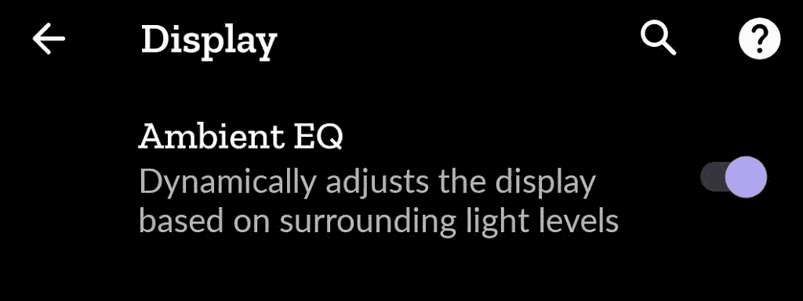

# 如何在谷歌 Pixel 4 上完全控制环境均衡器

> 原文：<https://www.xda-developers.com/google-pixel-4-ambient-eq-tweak/>

当谷歌上个月宣布 Pixel 4 时，我最兴奋尝试的功能之一[是 Ambient EQ。Ambient EQ 就是谷歌所说的自动白平衡调整功能。使用一个能够测量环境照明色温的传感器(](https://www.xda-developers.com/google-pixel-4-automatic-white-balance-true-tone/) [TMD3702VC](https://ams.com/tmd3702vc) )，Ambient EQ“根据周围的光线水平动态调整显示器[白平衡]。”遗憾的是，Pixel 4 *上的环境均衡器几乎没有调整显示器的色温，导致我感觉这是一个令人印象深刻的体验。*

 <picture></picture> 

Ambient EQ toggle in Display settings on the Google Pixel 4

XDA 显示器分析师 Dylan Raga 称，将这一功能放在首位的原因是因为“显示器的感知白平衡会随着你周围环境照明的颜色而变化”。例如，“在温暖的光线下观看时，屏幕经常显得过于蓝。”为了“不管环境照明的颜色如何，都使屏幕看起来一致”，智能手机“应该朝着环境照明的颜色改变[它们的显示器]色温。”

谷歌的第一款具有自动白平衡调整功能的产品是 Nest Hub，该功能也被称为环境均衡器。在 Nest Hub 上，Ambient EQ 简直不可思议。无论当前的照明条件如何，在 Nest Hub 显示器上查看图像就像是在查看打印的照片。你不会在 Pixel 4 上获得这种环境均衡器的体验，公平地说，这是有意义的，因为智能手机不仅仅用于查看图像。

*不同光照条件下的 Google Nest Hub。环境均衡器与设备上的“自动亮度”设置相关联。在这里捕捉效果有点困难——你真的需要自己去看。*

然而，Pixel 4 远不是唯一一款具有自动白平衡调节功能的移动设备，这意味着我们可以比较其他科技公司是如何实现这一功能的。苹果和三星都有类似的功能，尽管由于更好的营销，苹果的真实语气更为人所知。从我在 Reddit 等在线论坛上看到的大量投诉来看，并不是每个人都喜欢启用 True Tone 的 iPhone 显示屏看起来有多黄。这就是为什么我认为谷歌限制了低环境 EQ 可以调整 Pixel 4 上的白点的程度——他们希望效果微妙，颜色更准确，所以人们不会关闭它。这也可能是 iPhone 默认禁用 True Tone 而 Pixel 4 默认启用 Ambient EQ 的原因。

虽然谷歌的目标是取悦所有人，但我认为谷歌在 Pixel 4 上选择环境均衡器的范围有点太保守了。我个人非常喜欢 True Tone 在 iPhone 和 iPad 上的外观，所以我很失望地得知 Pixel 4 的白点平均值从最低 6300K 到最高 7450K 不等，分别对应于 5300K 和 8000K 的环境色温。在这些默认设置下，与 iPhone 或 iPad 相比，我几乎没有注意到显示屏的变化。相比之下，根据 [*AnandTech*](https://www.anandtech.com/show/10265/understanding-the-97-ipad-pros-true-tone-display) 的测量，2016 款 9.7 英寸苹果 iPad Pro 在 3000K 的环境照明下可以降至 5388K。

## 调整像素 4 的环境均衡器

在我认为我比谷歌知道得更多的评论开始满天飞之前，我想解释一下为什么我认为调整环境情商是值得的。谈到显示质量，人们的品味各不相同。有些人喜欢暖色，而有些人喜欢冷色。一些人希望他们的显示器总是色彩准确，而另一些人更关心舒适度。像 Pixel 4 的所有其他功能一样，谷歌设计了 Ambient EQ 来吸引大多数用户。然而，如果你想玩玩这个特性，得到你认为对你来说更好看的东西**，那么这就是我在这里告诉你怎么做的。**

 **是的，[正如 Pixel 4](https://www.xda-developers.com/tag/google-pixel4/) 上的许多功能一样，如果[您拥有 root 访问权限](https://www.xda-developers.com/google-pixel-4-root-magisk/)，则可以在 Pixel 4 上调整环境均衡器。我已经使用自定义参数一个多星期了，我觉得它不仅使在温暖的环境照明下阅读文本更加愉快，而且还减少了眼睛疲劳。**Pixel 4 已经成为我使用最舒适的智能手机。在我向你展示如何调整环境均衡器之前，你需要了解它的参数是如何控制的。**

| 

环境色温

 | 

显示色温

 | 

降低/提高阈值

 |
| --- | --- | --- |
| 5300 | 6300 | 0.007874 |
| 6000 | 6400 | 0.0075472 |
| 7000 | 6850 | 0.006993 |
| 8000 | 7450 | 0.0067114 |

*储存 Pixel 4 和 Pixel 4 XL 上的环境均衡器参数。*

上表显示了像素 4 上环境均衡器的最重要参数。前两列示出了相对于环境色温(列#1)的像素 4 的基本显示色温(列#2)。使用涉及减小/增大阈值以及一些其他参数的计算，像素 4 可以将其显示色温调节到最小值(6300K)和最大值(7450K)之间的任何值。如果你对如何计算这些中间值感兴趣，我推荐[阅读 AOSP](https://android.googlesource.com/platform/frameworks/base/+/master/core/res/res/values/config.xml) 中每个设置的描述。搜索“config_displayWhiteBalance”以找到所有相关的环境均衡器参数及其描述。

有了这些知识，我调整了 Ambient EQ，使用已知的 Apple True Tone 值(感谢 *Anandtech* )和 stock Pixel 4 值的混合来创建以下更改:

| 

环境色温

 | 

显示色温

 | 

降低/提高阈值

 |
| --- | --- | --- |
| 3000 | 5388 | 0.008 |
| 5000 | 6404 | 0.0076981 |
| 6000 | 6700 | 0.0075472 |
| 7000 | 6850 | 0.006993 |
| 8000 | 7450 | 0.0067114 |

*在我的 Pixel 4 上自定义环境均衡器参数。*

这些价值观完美吗？不，当然不是——质量是主观的。我个人更喜欢 Pixel 4 在这些值下的样子吗？你打赌。如果我能得到真实色调环境/显示颜色值的完整列表，我会扩展我的调整以更好地匹配 iPhone。如果我有更好的显示设备，我可以创建一组值，使 Pixel 4 在所有环境照明条件下都显示准确的颜色。如果我愿意，我可以扩大环境均衡器的色彩范围，使它完全取代夜间照明。只需要一点点的尝试和错误，这就是为什么我要与社区分享我所学到的东西。

这是我制作的一个 Magisk 模块，上面的表格中包含了自定义的环境均衡器值。只需从下面的链接下载并在 Magisk 管理器中安装该模块。

**[下载 AmbientEQTweak Magisk 模块](https://www.androidfilehost.com/?fid=4349826312261626370)**

如果您对自定环境均衡器感兴趣，您需要执行以下操作:

1.  创建一个针对 android 框架(包名:“Android”)的运行时资源覆盖(RRO)。[这是我的覆盖图中的 AndroidManifest.xml。](https://hastebin.com/eguzabufos.xml)
    *   使用所需的自定义参数创建 arrays.xml。例如，config _ displaywhitebalanceambientcoltemperatures 是对应于上表中列#1 的整数数组，而 config _ displaywhitebalancebasesholds 和 config _ displayWhiteBalanceDisplayColorTemperatures 对应于上表中列#2。请注意，config _ displayWhiteBalanceDecreaseThresholds 和 config _ displayWhiteBalanceIncreaseThresholds 的长度必须与 config _ displaywhitebalancebasesholds 的长度相同。[这是我在叠加中使用的 arrays.xml。](https://hastebin.com/olafebepet.xml)
    *   如果您想要一个新的最小或最大显示色温，请创建一个 integers.xml 文件。在 config _ displayWhiteBalanceColorTemperatureMin 中设置最小值，在 config _ displayWhiteBalanceColorTemperatureMax 中设置最大值。[这是我在叠加中使用的 integers.xml。](https://hastebin.com/exidabozug.xml)
    *   如果您想要更改环境光均衡器在低光照条件下偏向的色温，请创建一个 dimens.xml。这是通过更改 config _ displaywhitebalancelowlightambientcolortempty 的值来实现的。请注意，低光阈值是数组 config _ displaywhitebalancelowlightambient brightness 中的 lux 值范围，它可以在 arrays.xml 中被覆盖。(我用 10 覆盖了默认的 10-50 范围，因此当环境亮度低于 10 lux 时，像素 4 将下降到 5388K。)[这是我在覆盖图](https://hastebin.com/pinekivoqa.xml)中使用的 dimens.xml。
2.  编译并签名您的覆盖包，并创建一个 Magisk 模块将这个覆盖放在/vendor/overlay 中。

你可以使用[底层](https://github.com/substratum/template)和 [Magisk 模块](https://github.com/topjohnwu/magisk-module-installer)模板，或者你可以提取我的 Magisk 模块并反编译我做的覆盖图作为基础。如果你想出了一套你满意的价值观，请在下面的评论中或者在 XDA 论坛上分享你的成果。

**[谷歌 Pixel 4 论坛](https://forum.xda-developers.com/pixel-4)**| |**|[谷歌 Pixel 4 XL 论坛](https://forum.xda-developers.com/pixel-4-xl)**

最后，如果您想走试错路线，我建议使用以下两个 adb shell 命令:

*   `adb shell dumpsys color_display` -使用此按钮查看您的最小和最大色温覆盖是否有效，并查看当前显示色温的设置。
*   `adb shell dumpsys display` -查找“AmbientColorTemperatureSensor”输出，查看 TMD3702VC 颜色传感器报告的当前环境色温。事件历史记录列出了记录的环境色温和记录该值的时间(以 Unix 纪元毫秒为单位)。**