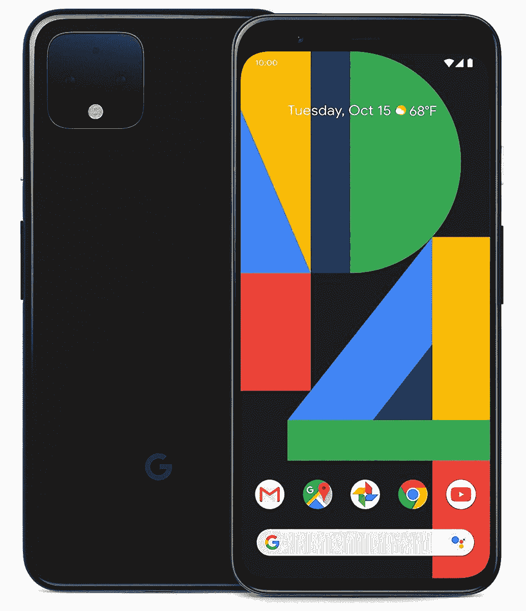

# 谷歌 Pixel 4 现在在多家商店仅售 399 美元

> 原文：<https://www.xda-developers.com/google-pixel-4-now-on-sale-for-just-399-at-multiple-stores/>

谷歌的 Pixel 4 在这一点上已经将近两年了，但它仍然是一款有能力的 Android 手机，具有干净的软件体验和定期的安全补丁。较小的 Pixel 4 最初定价为 799 美元，自发布以来已经销售了许多次，但现在你可以在多家商店以 399 美元的价格买到一台。这比原价低了 400 美元，是我们见过的新手机的最低价格之一。

谷歌 Pixel 4 于 2019 年 10 月发布，采用骁龙 855 芯片组，64GB 内部存储(无 microSD 扩展)，6GB 内存，5.7 英寸 1080x2280 AMOLED 屏幕，IP68 防水/防尘。谷歌还发布了另一款 128GB 存储的型号，但该型号尚未上市。还有两个后置摄像头:一个 12.2MP 主镜头和一个 16MP 长焦镜头。

 <picture></picture> 

Google Pixel 4

##### 谷歌像素 4

较小的 Pixel 4 现在以比原价低 400 美元的价格出售。B&H 照片有两种颜色，而亚马逊只有“黑色”库存。

谷歌表示，Pixel 4 最早将在 2022 年 10 月之前接收安卓更新[，这意味着该手机肯定会获得安卓 12，最有可能在明年获得安卓 13(假设更新在 8 月至 9 月的典型时间框架内)。谷歌的手机也有出色的](https://support.google.com/pixelphone/answer/4457705?hl=en#zippy=%2Cpixel-phones)[定制 ROM 支持](https://forum.xda-developers.com/c/google-pixel-4.9014/)，所以如果你不介意在那之后失去 Google Pay 和其他[安全网相关功能](https://www.xda-developers.com/safetynet-hardware-attestation-feature-here-to-stay/)，你可以在手机的生命周期内保持更新。