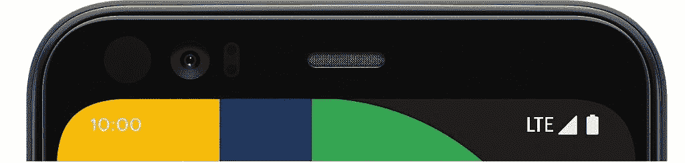

# 谷歌像素 4 宣布-规格，功能，价格和可用性

> 原文：<https://www.xda-developers.com/google-pixel-4-specs-features-pricing-availability/>

在 4 个月前首次戏弄这款手机后，谷歌正式推出了 Pixel 4 和 Pixel 4 XL。对于那些关注科技新闻的人来说，由于一系列泄露，你可能对 2019 年的 Pixel 智能手机有很多了解。尽管如此，仍有一些细节需要我们确认，此外，2019 年由谷歌制造的活动不仅仅是关于新的 Pixel 智能手机。不过，谷歌的新智能手机绝对是这场展览的明星，所以这里是我们对你需要知道的谷歌 Pixel 4 系列的一切的总结，包括硬件规格、软件功能、定价、可用性。

## **设计**

Pixel 4 与最初的 3 Pixel 智能手机的设计截然不同。玻璃背面只有一种颜色，即白色、黑色或橙色，并且没有指纹扫描仪的压痕，因为谷歌已经转向面部识别。新像素背面的摄像头嵌入一个方形摄像头凸起中；在这个相机凸起中有主相机、长焦相机、LED 闪光灯和闪烁传感器。2019 像素上没有显示凹槽，因为谷歌将整个顶部挡板用于摄像头和传感器。

不过，新像素确实与旧像素在设计上有很多相似之处。谷歌 Pixel 4 和 Pixel 4 XL 都没有 3.5 毫米耳机端口，底部有一个 USB Type-C 端口，右侧有音量摇杆，有彩色电源按钮，有平板显示器，并有圆形显示角。

当其他智能手机制造商正在尝试曲面显示器、双显示器、弹出式相机、翻盖相机和其他设计技巧来尽可能减少边框时，谷歌正在用过多的传感器包装 Pixel 4 的顶部边框。除了前置摄像头之外，大多数传感器都用于 2019 像素上的面部解锁。没有智能手机制造商能够在提供安全面部识别的同时避免顶部边框，所以至少谷歌在这里很好地利用了边框。他们还在这里添加了一个 Soli 雷达芯片，用于支持 Pixel 4 的运动感应手势。

较小的 Pixel 4 拥有 5.7 英寸的显示屏，而较大的 Pixel 4 XL 拥有 6.3 英寸的显示屏。非 XL 设备肯定比市场上大多数旗舰智能手机更紧凑，而 XL 在尺寸上更接近大多数旗舰产品。

* * *

## **规格**

以下是两款新 Pixel 智能手机的规格概述。这里有很多东西需要解开，但是我们将强调您需要知道的关键特性。

|  | 

谷歌像素 4

 | 

谷歌 Pixel 4 XL

 |
| --- | --- | --- |
| **尺寸** | 2.7 x 5.7 x 0.3 英寸，162 克 | 2.9 x 6.3 x 0.3 英寸，193 克 |
| **显示** | 5.7 英寸全高清+ OLED19:9，444 ppi90Hz 平滑显示屏环境均衡器 | 6.3 英寸四核高清+ OLED19:9，537 ppi90Hz 平滑显示屏环境均衡器 |
| **SoC** | 高通骁龙 855Adreno 像素神经内核 | 高通骁龙 855Adreno 像素神经内核 |
| **摄像头(后置)** | 12MP 双像素(索尼 IMX363) + 16MP 2X 长焦(索尼 imx 481)4K @ 30°视频录制 | 12MP 双像素(索尼 IMX363) + 16MP 2X 长焦(索尼 imx 481)4K @ 30°视频录制 |
| **摄像头(前置)** | 800 万像素(索尼 IMX520)1080p@30 视频录制 | 800 万像素(索尼 IMX520)1080p@30 视频录制 |
| **撞锤** | 6GB LPDDR4x | 6GB LPDDR4x |
| **存储** | 64GB 或 128GB(不可扩展) | 64GB 或 128GB(不可扩展) |
| **安全** | 面部解锁泰坦 MNo 指纹扫描仪 | 面部解锁泰坦 MNo 指纹扫描仪 |
| **电池** | 2800 毫安时 | 3700 毫安时 |
| **充电** | 18W USB PD(有线)，10W Qi 充电(无线) | 18W USB PD(有线)，10W Qi 充电(无线) |
| **端口** | USB 3.1 Type-C，无 3.5 毫米耳机端口 | USB 3.1 Type-C，无 3.5 毫米耳机端口 |
| **音频** | 立体声扬声器 | 立体声扬声器 |
| **传感器** | 运动感应手势的 Soli radar，Active Edge | 运动感应手势的 Soli radar，Active Edge |
| **连通性** | wi-Fi 2.4 GHz+5 GHz 802.11 a/b/g/n/AC 2x 2 mimobluteooth 5.0 NFC GPS，GLONASS，伽利略 | wi-fi 2.4 GHz+5 GHz 802.11 a/b/g/n/AC 2x 2 mimobluetooth5.0nfcgps,⁸GLONASS、伽利略 |
| **软件** | 具有 3 年安全性和操作系统更新的 Android 10 | 具有 3 年安全性和操作系统更新的 Android 10 |
| **耐水性** | IP68 | IP68 |

**显示屏:**Pixel 4 和 Pixel 4 XL 在显示屏尺寸和分辨率方面仍然分别与 Pixel 3 和 Pixel 3 XL 相当，但新像素正在获得两项与显示屏相关的重大升级。首先，新像素的显示屏最高刷新率为 90Hz。谷歌将这一功能称为“平滑显示”，它的意思是显示屏可以每秒 90 次刷新，而不是每秒 60 次。这将提高动画和某些游戏的流畅性，但启用它会对电池寿命产生影响。另一个主要的显示功能是引入了 Ambient EQ，谷歌对基于环境照明条件的自动白平衡调整[的名称。该功能通过将 Pixel 4 显示屏的色温与周围环境相匹配，提高了所有照明条件下的可读性。](https://www.xda-developers.com/google-pixel-4-automatic-white-balance-true-tone/)

Pixel 4 还可以播放来自网飞的高清和高清视频。

**性能:**这两个 2019 像素都采用高通骁龙 855 移动平台，这是高通移动设备性能最好的芯片组，这并不奇怪。高通确实在 7 月宣布了[骁龙 855 Plus，但那只是对“主”CPU 核心和 GPU 超频的一个小修改。更重要的是，谷歌终于将内存容量从之前 3 代 Pixel 的 4GB 增加到了 Pixel 4 的 6GB。Pixel 3 因内存管理问题](https://www.xda-developers.com/qualcomm-snapdragon-855-plus/)受到了[的批评，因此拥有额外的 2GB 内存有望防止新设备上出现类似问题。凭借升级的 SoC、更多的 RAM 和更高的刷新率，Pixel 4 将比 Pixel 3 感觉更流畅，打开应用程序更快，并在内存中保存更多应用程序。](https://www.xda-developers.com/google-pixel-3-pixel-3-xl-issues-problems-help-list/)

**摄像头:**当它的竞争对手已经转向拥有数百万像素的四摄像头时，谷歌今年正适度转向双摄像头。然而，Pixel 智能手机上的摄像头硬件从来都不是问题，因为软件一直是重点。我们将稍微讨论一下新的相机功能，但回顾一下相机硬件，Pixel 4 具有:与 Pixel 3 相同的 12MP 相机传感器，16MP 大约 2 倍的长焦相机传感器，8MP 前置相机传感器，以及用于图像处理的“像素神经核心”。

**安全性:**当引导加载程序被锁定时， [Titan M 安全芯片](https://www.xda-developers.com/google-pixel-3-titan-m-security/)会验证您的设备没有运行被篡改或过时的软件，防止不必要的数据解密尝试，并保护第三方应用程序中的交易。说到第三方交易，由于 Pixel 4 没有指纹扫描仪，你不能再用指纹解锁应用程序或进行购买。然而，它确实提供了安全的面部识别，可以用于这些目的，当然也可以用于解锁屏幕。

谷歌 Pixel 4 与开箱即用的 Android 10 一起发布，谷歌承诺 3 年的操作系统和安全更新。这意味着，在 2022 年 10 月之前，您可以一直获得 Android 操作系统升级到 Android 13 以及每月安全补丁更新。

**运动感应:**由 Soli radar 支持，运动感应手势可以让你通过在像素上挥手来控制音乐、静音提醒或查看手机。这是该设备的一个主要功能，因此我们将在下面详细介绍。

 <picture></picture> 

The "forehead" of the Google Pixel 4 is larger than what you'll find on other devices, but it packs a lot of useful sensors. These sensors are what make Face Unlock and Motion Sense gestures possible.

**电池&充电:**谷歌在提供容量为 4000mAh 或更高的电池方面尚未与其他智能手机制造商竞争，但 Pixel 4 XL 的电池容量接近 3700mAh。然而，当你考虑到它拥有 90Hz QHD+显示屏的事实时，3700mAh 的电池容量就有点令人担忧了。更令人担忧的是配有 2800 毫安时电池的 Pixel 4。在我们回顾或看到对这两款设备的评论之前，我们不能说它们会持续多久，但当其他公司提供更多产品时，看到这些电池容量令人失望。

USB 供电仍然是给像素充电的首选方式，这与新像素没有什么不同。您可以使用包括 18W USB Type-C 至 Type-C 充电器或任何兼容的 USB PD 充电器为 Pixel 4 充电。无线充电支持回归，但谷歌仅通过 Pixel 支架提供 10W 快速充电。当华为和小米能够分别提供 [27W](https://www.xda-developers.com/huawei-mate-30-pro-rs-porsche-design-specifications-features-pricing-availability/) 和 [30W](https://www.xda-developers.com/mi-9-pro-5g-miui-11-snapdragon-mi-tv-pro-8k-video/) 快速无线充电时，很难看出为什么 Pixel 的无线充电相对如此缓慢。至少有[总比没有](https://www.xda-developers.com/oneplus-7-wireless-charging/)好。

**音频:**Pixel 4 像 Pixel 3 一样有立体声扬声器，但它们不再都在正面。顶部挡板容纳一个扬声器，而另一个是底部发射。Pixel 4 缺少 3.5 毫米耳机端口，盒子里没有加密狗，所以你必须使用有线 USB Type-C 或无线蓝牙耳机。只有[谷歌的中端智能手机有耳机插孔](https://www.xda-developers.com/google-pixel-3a-headphone-jack-flexibility-audio/)。

* * *

## **新的摄像机功能**

Pixel 智能手机以拍摄出色的照片而闻名，这要归功于谷歌相机应用和谷歌的计算摄影算法。Pixel 4 保留了旧款 Pixel 智能手机中的大部分改进和相机功能(广角自拍相机除外)，包括 HDR+、人像模式、夜视和超分辨率变焦。还有照片球、游乐场 AR 贴纸、谷歌镜头集成、延时、全景和慢动作。

然而，Pixel 4 上的谷歌相机 7.1 新增了以下功能:天文摄影(长达 15 秒的曝光时间)、8 倍变焦、实时 HDR+(实时，取景器中的近似 HDR)、双曝光控制、快速视频和社交分享。人像模式得到了改进，因为它可以应用于大型物体和类似单反的散景。基于学习的白平衡将不断改善低光或黄光下的拍摄色彩。谷歌表示，他们致力于通过软件更新来改善 Pixel 4 的摄像头，请继续关注。

天体摄影可以让你拍摄星星和月光下的风景，只要你把 Pixel 4 放在三脚架上，在夜间拍摄时保持静止。得益于新的约 2 倍长焦相机和 Super Res Zoom，Pixel 4 可以以高达 8 倍的放大倍数拍摄高质量的照片。使用双重曝光控制，您可以独立调整场景的亮度和阴影，以获得最佳的拍摄照明。当您按住快门按钮时，快速视频可以捕捉短视频并拍摄 10 张照片，让您永不错过任何时刻。最后，社交分享通过提供快速访问 3 个您选择的应用程序的快捷方式，帮助您快速将照片分享到社交媒体。

其中一些功能将在装有[谷歌相机 7.1 更新](https://www.xda-developers.com/google-camera-7-1-new-ui-framing-hints-social-share/)的旧 Pixel 智能手机上提供，但对于其他功能，你必须等待谷歌相机改装器解锁。

* * *

## **新软件功能**

### 面部解锁

[Android 10 正式增加了对面部认证的支持](https://www.xda-developers.com/android-q-security-privacy-features/)，谷歌 Pixel 4 正在利用这一点。你将能够在谷歌支付或谷歌 Play 商店等应用中认证支付。你将能够解锁你的设备或支持的应用。Pixel 4 上的面部解锁速度非常快，但它也很安全，不像大多数其他智能手机上纯粹基于软件的面部识别功能。你不可能轻易地用一张静态的 2D 脸部照片来欺骗它，因为它依赖于你脸部的 3D 深度数据。不过，谷歌警告说，长得像你的人可能会骗过它。

谷歌吹捧 Pixel 4 的面部解锁是市场上最快的，因为增加了 Soli 雷达，可以检测你何时伸手打开面部解锁传感器。

### 动作感应手势

谷歌 Pixel 4 是第一款采用谷歌 Soli 雷达项目的商业设备。Soli 可以在任何光照条件下进行精确的手势检测，甚至可以通过塑料材料检测手势，因为它的工作频率为 60GHz。然而，由于雷达以这一频率传输，谷歌不得不寻求他们销售 Pixel 4 的每个国家的监管机构的认证。比如[美国 FCC 已经批准 Pixel 4](https://www.xda-developers.com/pixel-4-fcc-wireless-charging-lte/) 在这个频率传输。可悲的是，谷歌还没有在所有地区获得批准，尽管他们已经取得了相当大的进展。

那么 Soli 雷达芯片真的让 Pixel 4 做了吗？现在，你可以使用谷歌所谓的“动作感应”手势来控制手机的某些部分。总而言之:

*   向左或向右挥手跳过音乐曲目。
*   通过在设备上挥动您的手来静音电话或警报。
*   将手靠近设备，打开屏幕以检查通知。
*   离开时关闭屏幕以节省电池寿命。

这里有一个演示这些功能的视频:

隐私是内置的，因为你可以随时打开或关闭它。当它打开时，传感器数据在设备上处理，并且永远不会保存或与其他服务共享。

### 新的谷歌助手

在今年的谷歌 I/O 大会上，谷歌[展示了](https://www.xda-developers.com/google-pixel-4-faster-google-assistant/)一款更新、更快的谷歌助手版本。谷歌将助手的语音识别和语言理解模型缩小到 0.5GB，使助手能够“几乎零延迟”地处理语音，“实时”转录语音，“甚至在没有网络连接的情况下”也能操作。它有望在查询你的发言和给出答案时比以前快 10 倍。它不仅更快，而且更智能。新助手可以与其他应用程序集成，如 Gmail、谷歌日历、谷歌地图、YouTube 和谷歌照片。

这里有几张截图显示了 Pixel 4 上的新谷歌助手。如果你想了解更多细节和视频，可以看看[这篇我之前写的关于新助手的文章](https://www.xda-developers.com/google-pixel-4-new-google-assistant-motion-sense-gestures-leaked-videos/)。

谷歌还为这款助手增加了新的隐私功能。你可以要求它显示你的个人资料页面，甚至删除你的活动数据。要获得提示，您可以向助手咨询如何保护您的数据安全。

### 杂项功能

Pixel 4 上还有许多其他新的软件功能值得一提，但不值得单独讨论。总而言之:

*   屏幕注意。这项功能可以让你的 Pixel 4 在你看着它的时候保持清醒。
*   实时字幕。[最初宣传](https://www.xda-developers.com/google-accessibility-live-caption-android-q-live-relay-live-transcribe/)是 Android 10 的一项功能，这项功能首次出现在 Pixel 4 上。它可以让你将手机上播放的音频转录成屏幕上的浮动字幕。如果你听力不好，不能调高音量，或者此刻没有耳机，这是很有用的。它适用于大多数音频，包括播客、视频或音频信息，但不适用于电话或视频通话。它也只在英语(美国)工作。想要亲身体验该功能，请查看我们关于该主题的文章或视频。
*   [汽车碰撞检测](https://www.xda-developers.com/google-pixel-car-crash-detection/)。该功能通过使用您的位置、运动传感器和环境音频来检测您何时发生了机动车事故。它会触发一个对话框，如果无人注意，就会呼叫紧急服务来提醒他们你的情况。该功能目前仅限于美国。
*   [谷歌录音应用](https://www.xda-developers.com/google-pixel-car-crash-detection/)。这款新应用可以让你使用 Pixel 4 的麦克风录制音频，这对于录制讲座或采访非常有用。然而，它的特别之处在于，它可以自动转录并标记您的录音以供搜索。
*   [临开庭](https://www.xda-developers.com/google-pixel-4-tips-pro-sessions-google-one-social-share-google-camera/)。不熟悉 Pixel？如果你说英语，并且在美国或加拿大，你可以在 Google One 应用程序中安排一个专业会议，以获得 Pixel 专家的帮助。
*   [像素主题](https://www.xda-developers.com/google-pixel-themes-customize-android-10/)。这个应用程序可以让你自定义图标形状，字体，强调颜色等。在你的设备上。
*   与 Android 10 的黑暗模式切换兼容的新动态壁纸。一些新的动态壁纸也是交互式的，比如一个可以将指南针指向你选择的位置，另一个可以让你在屏幕上涂鸦。点击此处查看。
*   更新了像素启动器，带有向下滑动通知手势。由于不再有指纹扫描仪可以向下滑动，谷歌更新了 Pixel Launcher，添加了向下滑动通知手势。你所要做的就是在启动屏幕的任何地方向下滑动，通知面板就会被拉下来。[更多详情在此](https://www.xda-developers.com/download-updated-google-pixel-launcher-4-swipe-down-notification-gesture/)。

除了这些新功能，其他功能，如现在播放环境音乐检测、主动边缘挤压手势、最近应用概述中的文本/图像选择、数字健康和 Flip to Shhh，都可以在 2019 像素上使用。

* * *

## **定价&供货情况**

谷歌的 Pixel 智能手机从来都不便宜，Pixel 4 和 Pixel 4 XL 也是如此。这是我们目前所知的价格。

| 

模型

 | 

加拿大

 | 

美利坚合众国

 | 

欧洲

 |
| --- | --- | --- | --- |
| 谷歌像素 4 (64GB) | 约 999 美元 | $799 | €749 |
| 谷歌像素 4 (128GB) | 约 1129 美元 | $899 | €849 |
| 谷歌像素 4 XL (64GB) | 约 1129 美元 | $899 | €899 |
| 谷歌像素 4 XL (128GB) | 约 1259 美元 | $999 | €999 |

随着我们获得更多信息，我们将继续更新此图表。据我们所知，Pixel 4 不会在印度销售。[今天开始预购](https://store.google.com/product/pixel_4)，10 月 24 日开始供货。

至于在美国的供应，Pixel 4 将通过威瑞森、T-Mobile、Sprint 以及美国电话电报公司(AT&T)销售，这是 Pixel 历史上第一次。该设备还将在包括加拿大和欧洲在内的全球多个地区销售。谷歌标志性的织物保护套将单独出售；它们有三种不同的颜色:黑色、蓝色和灰色。在有限的时间内，谷歌将为购买 Pixel 4 的用户提供 3 个月的 100GB 谷歌 One 存储空间，但仅限于新的合格会员。

加入我们的论坛，了解新 Pixel 智能手机的最新消息、提示、技巧、配件等。

[**谷歌 Pixel 4 论坛**](https://forum.xda-developers.com/pixel-4)| |[|**谷歌 Pixel 4 XL 论坛**](https://forum.xda-developers.com/pixel-4-xl)