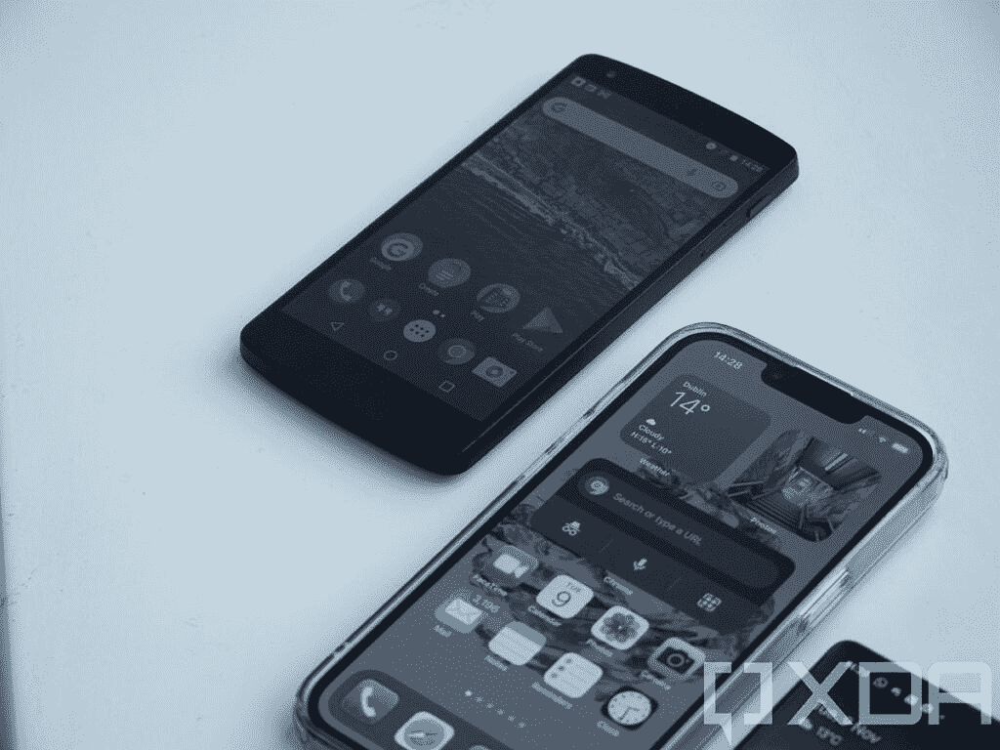

# 谷歌 Pixel 6 是现代版的 Nexus 5

> 原文：<https://www.xda-developers.com/google-pixel-6-modern-day-nexus-5/>

谷歌 Nexus 5 是我第一次真正了解智能手机改装的真实世界，也许对你也是如此。一个容易解锁的引导加载程序，一系列可供选择的定制 rom，以及一个充满志同道合的智能手机爱好者的繁荣社区，使这款手机成为我进入 XDA 开发者论坛的入口。我过去曾涉足 HTC Desire C 和沃达丰 Smart 等设备，但 Nexus 5 有所不同。Nexus 5 很特别。

当时，我不得不做出选择——是选择 OnePlus One 还是 Nexus 5。我承认，我曾试图搭上一加的宣传列车，但邀请制让我无法如愿。相反，我选择了 Nexus 5，这是我买过的最好的科技产品之一。

Nexus 5 由 LG 制造(与 LG G2 有许多相似之处)，采用高通骁龙 800，2GB 内存，4.95 英寸 1080p IPS LCD，以及高达 32GB 的内部存储。这款手机在当时是市场上最好的廉价设备之一，这要归功于它的免费软件和相对较低的价格标签。这肯定不是没有缺点，与竞争对手相比，它的相机和电池寿命都差得可怜。

## 谷歌 Pixel 6 Pro 如何从上一个伟大的 Nexus 中吸取教训

Nexus 5 是在 Nexus 4 的基础上构建的，它在发烧友社区中获得了巨大的成功。Nexus 5 生命周期接近尾声时，谷歌显然开始致力于向消费者而不是开发者销售手机。说到 Nexus 系列就是这个东西；它最初的目标是开发者，而不是消费者。它们在运营商的商店里买不到，只能从谷歌商店在线购买。

然而，Nexus 5 可能是谷歌像素之旅的起点。凭借这款特殊的智能手机，谷歌推出了 HDR+算法，作为 Nexus 的独家产品。谷歌开始每一代迭代这种算法，该公司的相机智能在后来被称为[谷歌相机](https://www.xda-developers.com/google-camera-port-hub/)的产品中达到顶峰。我们今天使用的[谷歌 Pixel 6 Pro 相机](https://www.xda-developers.com/google-pixel-6-pro-camera-review/)的基础在 Nexus 5 中有其卑微的开端，多年来不断改进。

当时，Nexus 5 因其接近库存的 Android 体验而受到欢迎。它非常接近 AOSP，这也是因为它是针对开发者的。开发者不想要原始设备制造商增加的所有额外功能，像三星的 TouchWiz 是开发者想要避免的。随着谷歌转向提供一种更加以消费者为中心的设备，这些核心价值得到了仔细的考虑，因为这仍然是一些消费者(比如我自己)选择购买 Nexus 设备而不是任何其他产品的原因。当然，现在 Pixel 智能手机看起来非常接近库存，但它们有很多 AOSP 没有的附加功能。

事实上，随着 Android 平台的每一次重大更新，都会引发一场关于某些功能是否是像素专属的讨论。谷歌通常不会识别哪些功能是 Pixel 专有的，这让设备所有者来判断另一款 [Android 12](https://www.xda-developers.com/android-12/) 设备相对于 Pixel 是否似乎省略了某个功能。我能想到的最近唯一的例外是在 Android 12 中引入了“Recents URL sharing”，谷歌在 Android 开发者文档中将其定义为 Pixel 专属功能[。谷歌甚至还没有给它的 Android 版本命名，选择愉快地利用“Android”和“谷歌的 Android”之间的无知。谷歌的 Android 肯定不是现阶段的 AOSP。](https://developer.android.com/about/versions/12/features#recents-url-sharing)

抛开题外话，Pixel 智能手机仍然是最接近旧的 Nexus 体验的，将 Nexus 与 Pixel 6 Pro 进行比较可以揭示这些年来谷歌发生了多大的变化。Pixel 6 Pro 的前后玻璃和方形设计提供了近乎无边框的体验。相比之下，Nexus 5 的顶部和底部都是圆形的，带有巨大的边框，尽管这在发布时没有什么可犹豫的。Nexus 5 的设计非常过时。

奇怪的是，Nexus 5 是谷歌智能手机业务的关键时刻。在发布的时候，围绕 Nexus 系列及其可行性存在一些问题，Nexus 4 被称为前三个月销量不到 40 万台的[。Nexus 6，随后是 Nexus 5X 和 Nexus 6P，它们是 Nexus 5 的继任者，该公司在 2016 年淘汰了 Nexus 系列并推出了最初的 Pixel 智能手机。](https://www.theguardian.com/technology/2013/jan/03/google-nexus-4-phone-sales)

将 Nexus 5 与最新的 Pixel 进行比较是一种怪异的体验。Pixel Launcher 显然是 Nexus 上的启动器的演变，谷歌相机应用程序显然在这些年里有所增长。大约也是在这个时候，谷歌开始将 AOSP 版的 Dialer 和 Messages 等应用程序替换为谷歌 Dialer 和 Hangouts 中自己的专有应用程序。

我之所以称之为最后一个伟大的 Nexus 是出于多种原因，尽管我愿意讨论 Nexus 6P 是否是最伟大的 Nexus。至于 Nexus 6，它太大了，价格接近 Nexus 5 的两倍。Nexus 6P 受到大量硬件问题的困扰，导致谷歌和华为都支付了和解费。

## iPhone 的影响

## 

就开发过程而言，iPhone 处于一个独特的位置，苹果往往会通过每一次发布为来年设定很多趋势。然而，Pixel 智能手机也可以享受同样的独特性。

苹果控制着芯片组、软件和硬件，有效地设计了智能手机和操作系统。Nexus 系列智能手机也成功实现了这一点，尽管该芯片组通常由高通制造和销售。软件显然是谷歌制造的，硬件也是谷歌选择的，但由合作伙伴制造。在过去，Nexus 智能手机是获得“真正”Android 体验的唯一途径，尤其是与当时其他制造商提供的类似产品相比。

如今，这种说法在 Pixel 系列中变得更加真实，谷歌也在这一理念上加倍努力。随着[谷歌张量](https://www.xda-developers.com/google-says-its-tensor-chip-is-80-faster-than-the-pixel-5s-cpu/)的出现，Pixel 系列离成为 iPhone 的竞争对手又近了一步。谷歌不再听命于高通，相反，它似乎不仅在谷歌张量上与三星合作，而且可能是其继任者。[很明显，我们已经面临了很多关于张量的问题](https://www.xda-developers.com/google-pixel-6-pro-review/)，但我们很可能会在未来的谷歌芯片中看到改进。

## 定制 rom 的状态

Nexus 5 是定制 rom 的福音，也是我真正接触智能手机改装的开始。论坛充满了活跃的自定义内核、rom 和其他修改。虽然事情已经放缓，但论坛上有一个非官方的 LineageOS 17 版本，这意味着用户可以很容易地获得 Android 11。Nexus 5 是最开放的，如果用户购买智能手机进行改装，他们的钱是值得的。

Nexus 系列有真正的继任者吗？我能想到的最接近的是一加。虽然不再是发烧友的最爱，但它们仍然是市场上最开放的设备，你可以很容易地买到。你可以买一个[一加 9 或一加 9 专业版](https://www.xda-developers.com/oneplus-9/)，解锁引导程序，如果你愿意，可以从我们的论坛上选择一些 rom 安装在上面。没有多少设备能达到这样的访问或简单程度。

## 是否需要另一种联系？

很难说我们是否真的需要另一个联系，因为它似乎实现了它的目的。这是一款针对开发者的设备，在系统行为方面提供了最“纯粹”的 Android 体验，像素仍然在很大程度上提供这种体验。多亏了兼容性定义文件和谷歌对安卓合作伙伴的其他要求，T2 不再是曾经的蛮荒之地。

不管怎样，很可能一些开发者觉得他们错过了纯粹的 Android 体验。你目前能得到的最好的是一个通用的系统映像，尽管那些是*令人难以置信的*准系统，而且在一些设备上也不那么稳定。如果你追求的是一款开发设备，那么 Nexus 系列的精神继承者 Pixel 6 可能是你能得到的最好的产品。

 <picture></picture> 

Google Pixel 6

Pixel 6 配备了谷歌新的张量芯片、现代设计和旗舰相机。

 <picture></picture> 

Google Pixel 6 Pro

Pixel 6 Pro 是较大的兄弟，配有谷歌的新张量芯片、现代设计和额外的远摄相机。