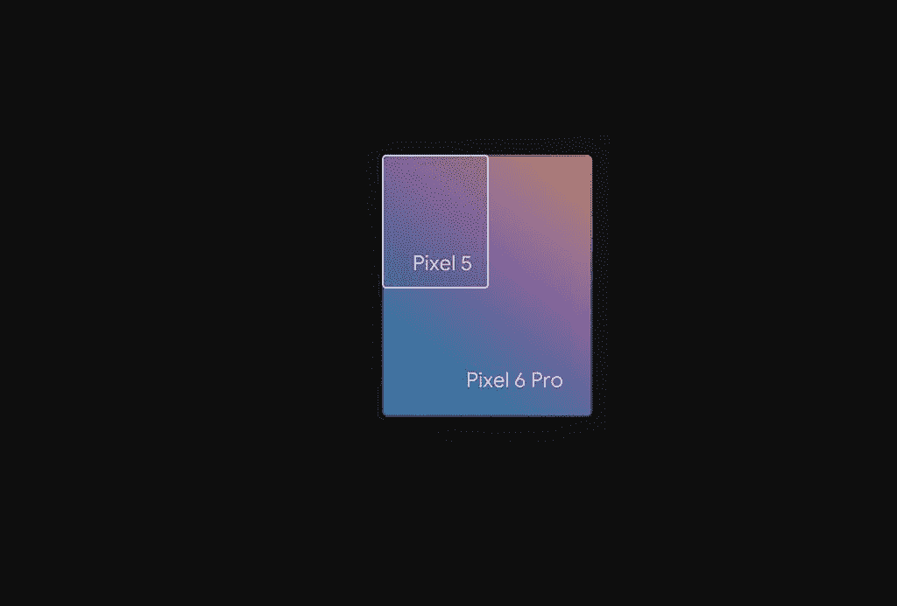
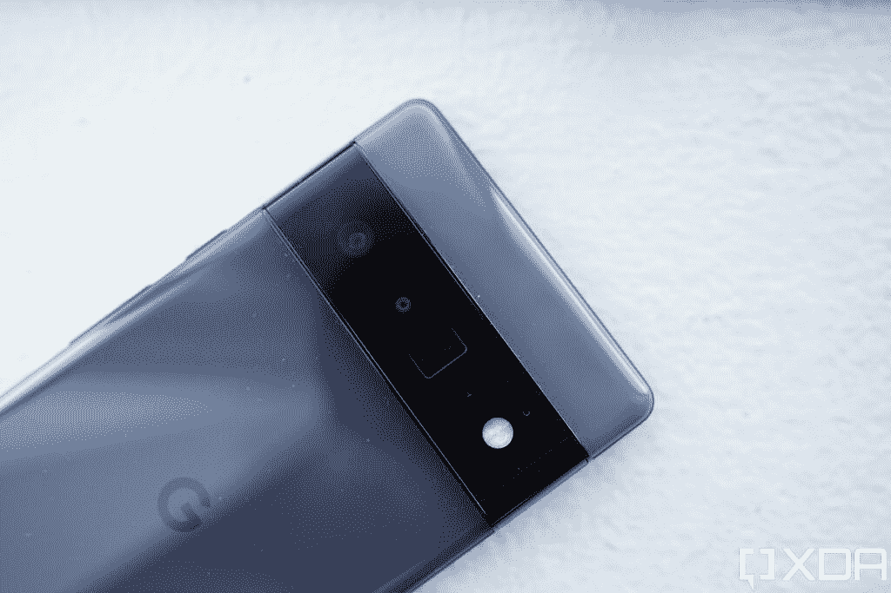
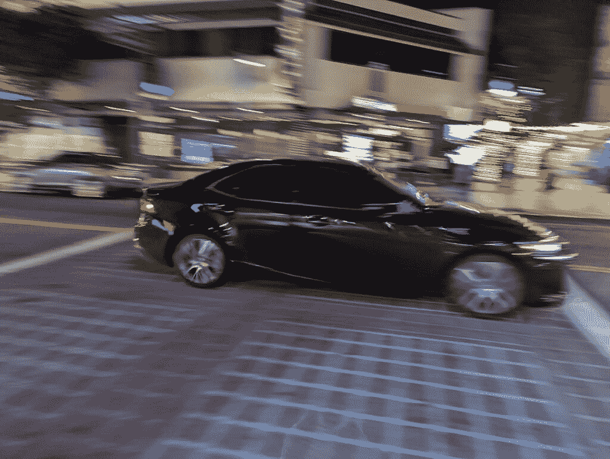
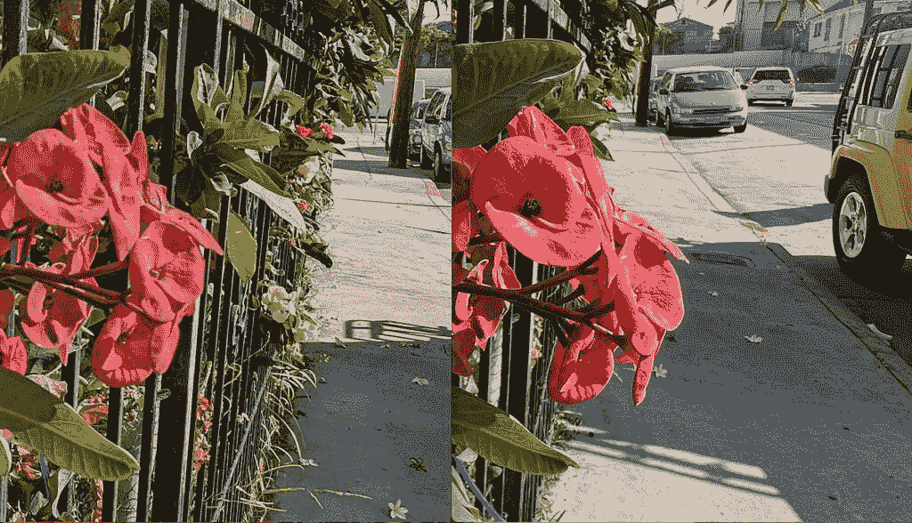
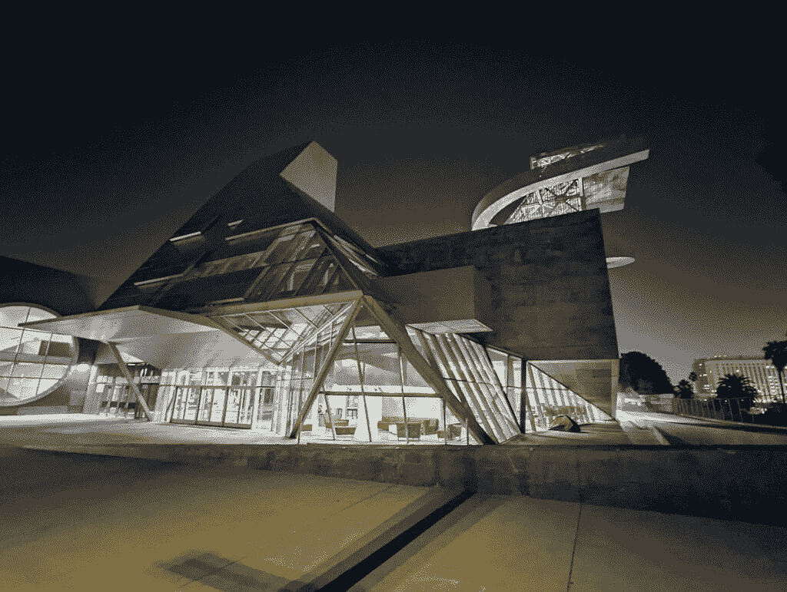

# 谷歌 Pixel 6 Pro 相机评论:终于配得上谷歌人工智能的硬件

> 原文：<https://www.xda-developers.com/google-pixel-6-pro-camera-review/>

从一开始，谷歌的 Pixel 手机就自豪地将软件置于硬件之上。这一理念适用于整个智能手机，但在相机部门尤为明显，过去的像素几乎都是为了避免新的相机硬件趋势。当许多手机品牌在 2017 年开始添加二级甚至三级摄像头时，谷歌坚持只使用单一的主摄像头。当苹果在 2019 年提供超宽传感器时，Pixel 4 说“ *nah* ”一年后的 2020 年，当 Android 品牌进行图像传感器尺寸军备竞赛时，谷歌退缩了，并回收了相同的普通索尼 IMX363 图像传感器，用于 Pixel 5 的*第三代*。

谷歌的想法本质上是“*我们的软件非常擅长处理图像，我们真的不需要花哨的硬件*这在最初是可行的，而且效果非常好。发布时，前两个，也许是三个像素几乎毫无争议地是最好的拍照手机。多亏了谷歌的机器学习魔法，早期的像素提供了完美的 HDR、逼真的数字散景和行业最佳的夜间模式。但是，即使是地球上最伟大的软件(谷歌可能/可以说确实提供了这种软件)也无法克服老化、平庸的硬件，特别是因为像苹果、三星、华为和许多其他公司这样的竞争对手正在跟随谷歌的脚步优先发展计算摄影*，同时也在升级相机硬件。*

因此，到了 Pixel 4，谷歌的智能手机摄像头不再领先。我认为 Pixel 3 已经输给了华为 Mate 20 Pro，但这是有争议的。

谷歌终于在 [Pixel 6 系列](https://www.xda-developers.com/google-pixel-6/)中认识到了这一点，因为这些新的 Pixel 手机，尤其是 Pixel 6 Pro，相比之前的 Pixel 带来了*重大的*相机硬件升级。但当然，升级相机硬件并不意味着谷歌放弃了其“*计算摄影为王*”的哲学。这种新的相机硬件只是增加了谷歌的机器学习数字图像处理软件，该软件本身以新的定制张量 SoC 的形式获得了一个很大的硬件推动。

每个人都想知道的一个大问题是:谷歌 Pixel 6 Pro 会重新夺回最佳拍照手机的宝座吗？答案并不简单，因为现在有很多数码摄影。我们已经有了我们的 [Pixel 6 Pro 评测](https://www.xda-developers.com/google-pixel-6-pro-review/)，但值得对 Pixel 6 Pro 的摄像头投入更多的文字，因为它为未来开辟了潜力。

 <picture></picture> 

Google Pixel 6

Pixel 6 配备了谷歌新的张量芯片、现代设计和旗舰相机。

 <picture></picture> 

Google Pixel 6 Pro

Pixel 6 Pro 是较大的兄弟，配有谷歌的新张量芯片、现代设计和额外的远摄相机。

### 谷歌 Pixel 6 Pro:规格

| 

规格

 | 

谷歌 Pixel 6 Pro

 |
| --- | --- |
| **尺寸和重量** |  |
| **显示** | 

*   6.71 英寸 LTPO AMOLED
*   QHD+ (1400 x 3120)
*   居中打孔机
*   120Hz 显示器刷新率
*   HDR10+支持
*   高亮度模式
*   1600 万色的全 24 位深度
*   大猩猩玻璃 Victus

 |
| **SoC** | 

*   谷歌张量八核芯片组

 |
| **RAM 和存储器** | 

*   12GB LPDDR5 内存
*   128GB/256GB/512GB UFS 3.1 闪存存储

 |
| **电池&充电** | 

*   5000 毫安时电池
*   30W 快速充电
*   23W 快速无线充电

 |
| **后置摄像头** | 

*   主摄像头:5000 万像素 f/1.8 OIS 三星 GN1 主摄像头
*   辅助:12MP f/2.2 超宽相机，114 度 FOV
*   第三级:48MP f/3.5，长焦，4 倍光学变焦，20 倍数码变焦

 |
| **前置摄像头** |  |
| **端口** |  |
| **连通性** | 

*   5G NR(低于 6GHz)
*   国家足球联盟
*   超宽带
*   蓝牙 5.2
*   C 型端口
*   WiFi 802.11 . b/g/n/AC(2.4 GHz+5 GHz)

 |
| **其他功能** | 

*   光学显示下指纹读取器
*   IP68 防水防尘等级
*   立体声扬声器

 |
| **软件** | 

*   安卓 12
*   三年的操作系统更新
*   五年的安全更新

 |

***关于本次评测:**我们为本次评测购买了自己的 Google Pixel 6 Pro。谷歌爱尔兰公司确实向我的同事亚当·康威提供了一台 Pixel 6 Pro 供审查——然而，这并没有在这里使用。谷歌在这次审查中没有任何投入。*

## 谷歌 Pixel 6 Pro:相机硬件

谷歌 Pixel 6 Pro 升级后的摄像头硬件是一个 50MP 的三星 GN1 传感器，具有 1.2 微米像素和 1/1.31 英寸的图像传感器尺寸。这是从之前谷歌在 Pixel 3 中使用的索尼 IMX363 传感器到 5a 的巨大飞跃。

Pixel 6 Pro 还在该系列中首次带来了潜望镜变焦镜头，这是一个 48MP 的拍摄器，可以产生 4 倍无损光学变焦图像。包裹三镜头主系统的是一台 16MP 超宽相机。正面周围是一个 11MP 超宽摄像头，视野为 94 度。

这些硬件改进是巨大的。GN1 传感器的图像传感器比索尼 IMX363 大得多，这意味着它可以自然地吸收更多的光线，并由于景深较浅而产生更自然的散景。

 <picture></picture> 

The GN1's image sensor size in relation to the IMX363's image sensor size.

同样，转用潜望镜技术来变焦照片是对以前的长焦变焦镜头的一次重大技术升级。

处理所有这些新传感器的是一个新的大脑:谷歌张量(Google Tensor)，这是谷歌定制的一个 SoC，用于处理人工智能驱动的机器学习任务。用一个赛车的比喻来说:Pixel 6 Pro 不仅增加了一个更强大的电机和更新的车轮(这些将是相机硬件)，还让一个更聪明和熟练的司机来操控车辆。

## 谷歌 Pixel 6 Pro:相机应用体验

Pixel 6 Pro 的相机应用乍一看似乎很简单——只有六种模式可以水平滑动(不像一些中国手机似乎有 10 种)，屏幕顶部只有两个图标，而 iPhone 13 相机应用有四个，Vivo X70 的应用有六个。也没有像华为或苹果的相机应用程序那样，通过向上滑动激活的隐藏菜单。切换镜头的按钮也位于取景器底部，便于拇指操作。这意味着那些只想指向并拍摄的人应该能够轻松地获取他们需要的照片或视频，而不会分心。

Pixel 6 Pro 的相机应用乍一看很简单，但如果你深入了解，它的功能非常丰富。

但是如果你想深入挖掘，你可以。Pixel 6 Pro 的相机应用程序实际上是挤满了各种功能的*,它们只是被很好地组织成各个部分，所以它们不会到处都是。例如，虽然许多手机的相机应用程序将“延时”或“慢动作”作为独立模式*与主视频拍摄模式*分开(在 iPhone 上，你必须从“视频”中滑动两次以上)；在小米和 Vivo 手机中，它们被埋在“更多”里面)，谷歌将它们放在一个子菜单中，当你选择视频模式时，它会弹出来。*

这完全有道理，因为延时和慢动作视频只是以不同速度播放的视频。同样，你知道相机设置菜单，允许你改变视频帧速率，照片纵横比，以及默认情况下闪光灯是否打开(顺便说一下，总是关闭)？其他手机倾向于将所有这些选项组合到一个通用设置页面中。在 Pixel 6 Pro 的相机应用程序上，这些设置会在你的拍摄模式背景下显示出来。例如，如果你在照片模式下点击设置菜单，你将看不到视频帧速率选项，因为你在照片模式下。切换到视频模式，改变帧率的能力就显现出来了。

当你拍照时，Pixel 也足够智能，可以理解上下文，只在需要时显示屏幕指南。例如，如果你在良好的光线条件下直立拿着手机，你会得到一个干净的取景器，不受干扰。但是，如果 Pixel 感觉到你的手机倾斜到一个尴尬的角度，就会出现一条虚拟的水平线，所以你可以正确地排列镜头(除非你喜欢荷兰角度)。当你在构图的时候，轻点取景器，会弹出滑块来调整色温、阴影亮度或整体曝光。

通过摆弄这些转盘，你已经可以彻底改变一个镜头的情绪。

如果我不得不吹毛求疵，那就是一旦你进入子菜单，相机应用程序就会变得太复杂。例如，在视频模式下，有一个上面有手掌的按钮表示稳定。但是一旦你敲击手掌，你会看到四种不同的稳定模式。还有一些弹出窗口，其中包含解释某项功能的整段文字。普通消费者可能会发现这些菜单令人困惑，这里有简化的空间。

## 谷歌 Pixel 6 Pro:主摄像头

谷歌 Pixel 主摄像头的优势一直在于它的易用性，你可以瞄准，点击快门，很可能获得具有出色动态范围的照片(即使你是逆光拍摄的)；色彩还原(谷歌让照片生动了一点，但不像三星相机那样过分)；看起来足够自然的人工散景；以及无延迟快门(这不是所有最近的 Android 旗舰都能在 2021 年声称的)。

 <picture></picture> 

The Pixel 6 Pro camera

所有这些优势都在这里回归，但由于改进的 50MP GN1 传感器，摄影技术有了一个飞跃。更大的传感器吸收更多的光线，因此谷歌不必经常求助于夜间模式。如果你离物体或主体足够近，会有更多自然的散景；拥有 5000 万像素可以让谷歌使用像素宁滨技术制作 1250 万像素的照片，包含更多图像信息的“更大”像素。

### GN1 传感器在特写镜头中带来自然的散景和更多的深度

快门速度非常灵敏，当我靠近一个对象时，加上我得到的自然散景，我可以得到像这样令人印象深刻的照片，这是我心血来潮拍摄的。

 <picture></picture> 

Pixel 6 Pro, main camera

如果你放大到 100%的大小和像素窥视，拍摄仍然举行。

 <picture></picture> 

100% crop of above shot.

过去，我一直是 Pixel 手机肖像模式的忠实粉丝，因为它有令人信服的人工散景。但是现在 Pixel 6 Pro 的主摄像头可以拍出这样的真实散景，我用软件人像模式的次数就少了很多。

### 现场 HDR+工程再次神奇

“真实”摄影世界中的一个传统智慧是“让太阳在你身后”，这意味着不要在刺目的光线下拍摄，因为“真实”相机将无法知道是否正确曝光并让前景中的任何主体/对象沉浸在阴影中，或者曝光主体/对象并让光线完全熄灭。这条规则在数码摄影领域也适用了很多年，直到智能手机开发出通过使用软件技巧来制作 HDR 图像的能力，谷歌的 HDR+一直是该领域的领导者之一。本质上，像素相机将捕捉曝光不足和曝光过度的快速拍摄，然后使用这些拍摄的所有图像信息来产生具有适当曝光的单个拍摄。今年，随着张量处理图像信号处理，Pixel 6 Pro 似乎能够比以往更快更好地进行这种计算。下面是所有以明亮的阳光点和充满阴影的区域为特色的镜头，正如灭霸所说，所有四个镜头都是“完美平衡”的，精确的颜色和阴影稍微变亮，不是完全黑暗，但仍然保持了场景的对比氛围。

特别是最后一个镜头，这是一个非常具有挑战性的镜头:南加州午后刺目的阳光透过窗户照射进来，而照片的中间部分(展示了木制货架)却被阴影笼罩。Pixel 6 找到了一个几乎完美的平衡，当你看到竞争对手的表现时，这一点就更加明显了。

iPhone 13 Pro 完全吹灭了从窗户射进来的光线，以便适当地曝光木架子，而 Vivo X70 Pro Plus 则制作了一个到处都有适当曝光的镜头，包括人为调高蓝色和黄色的对比度，以获得更突出的照片。但 Vivo 的镜头看起来也不真实，几乎是假的——我们的大脑知道这个场景中应该有一些阴影。

### 流行但不太多的颜色

总的来说，Pixel 6 Pro 会提高对比度，而不是像 iPhone 相机那样保持完全“自然”(也就是无聊)，但它只是小剂量地这样做，而不是像 Vivo 或三星的相机那样过度。换句话说，Pixel 6 图像产生的颜色有点流行，但仍然接近现实生活中的场景。

Pixel 6 图像产生的颜色有点流行，但仍然保持真实的现实生活场景。

### 弱光拍摄是正确的

如前所述，凭借更大的图像传感器和 pixel-宁滨的帮助，Pixel 6 Pro 不需要像以前的 Pixel 那样经常求助于“夜视”夜间模式。但即使如此，也没什么大不了的，因为夜间模式会自动启动，就像 iPhone 一样无缝。在下面的四个镜头中，前两张照片不需要夜间模式，后两张需要。

特别是最后一个镜头——中国雕像——是在凌晨 1 点一个非常暗的房间里拍摄的，所有的灯都关了。这个镜头太棒了。但是，再次，这是值得比较的竞争，看看有多少谷歌钉这个镜头。

如果你放大的话，iPhone 13 Pro 的镜头非常嘈杂，Vivo 的镜头出于某种原因完全打乱了白平衡，而 iPhone 8，嗯，我只是把它作为我眼中场景的参考。Pixel 6 Pro 的夜视辅助拍摄效果非常好。值得一提的是，Vivo X70 Pro Plus 使用了完全相同的 GN1 传感器，所以这纯粹是谷歌的软件击败了 Vivo。

### 人像摄影仍然有用，但缺乏专用的变焦镜头限制了使用场合

人像拍摄，又名人工散景拍摄，一直是一个强(最强？)点像素相机过去。而且在 Pixel 6 Pro 上，还是很不错的，只是多了一点事后诸葛亮。如上所述，如果你拍摄得足够近，主相机的自然散景已经非常好了。第二，与目前几乎所有其他顶级旗舰手机不同，Pixel 6 Pro 缺乏专门的人像变焦镜头。

这并不是因为 Pixel 6 Pro 没有变焦镜头——它有一个出色的 4 倍潜望镜变焦，我们很快就会看到——而是焦距太长了(理想情况下，用于人像的变焦镜头应该是 2 倍到 3 倍)。因此，Pixel 6 Pro 只是用主相机拍摄，但用这种数字作物来模拟更传统的人像焦距。尽管如此，结果还是很令人满意，边缘检测准确，虽然散景效果有点强，但你可以在拍摄后轻松地将其减弱。像往常一样，Pixel 的肖像模式也适用于无生命的物体。

### 特技镜头！

Pixel 6 Pro 引入了两种新的拍摄模式，根据用户的不同，这两种模式可能是噱头，也可能是有用的。第一个是“动作平移”(Action Pan)，它模拟了在相机也在运动的情况下用快速移动的对象拍摄的效果——本质上，Pixel 6 Pro 在移动的对象周围添加了人工运动线条。

使用 Action Pan 很简单，你只需指向并拍摄一个移动的对象，谷歌将在拍摄后应用速度线效果。但这并不总是有效——谷歌甚至在相机应用程序内的模式上贴上了“测试版”标签——当它错过时，照片可能看起来像这样。

 <picture></picture> 

Action Pan gone wrong -- the whole shot is blurry

在我一周的测试中，我会说 Action Pan 每四五次尝试中就有一次拍出了好看的照片。

一部分原因可能是因为我目前在洛杉矶，一个杂乱无章的城市，没有足够的背景来拍摄这种动态的动作镜头。我认为在人口更密集的城市丛林中，理想情况下是像香港或东京这样霓虹闪烁的城市，动作镜头会更好看。事实上，彭博的弗拉德·萨沃夫在东京用他的 Pixel 6 拍摄了非常棒的照片。

另一个技巧是“长时间曝光”，顾名思义，除了在传统相机和过去大多数其他智能手机上，你几乎肯定必须使用三脚架才能获得可用的照片。但谷歌的人工智能有助于解决不可避免的手抖问题，还可以动态调整动态范围。如果你在白天使用这种模式，你可以得到一些风格的运动模糊背景。或者，如果你在夜间拍摄移动的汽车，你会得到如下的光线轨迹。

请注意，在最后一段中，我说“大多数”其他智能手机都需要三脚架来拍摄这些照片。这是因为 Pixel 6 手机并不是第一个能够实现这一点的手机——华为从 P9 系列开始的旗舰智能手机已经能够捕捉类似的手持长曝光模式。

### 录像

Pixel 6 Pro 的主摄像头最高可拍摄 4K60fps。这与其他骁龙 888 驱动的 Android 手机的 8K 功能有所差距，但这并不重要，因为 8K 镜头目前并没有太大的用处。Pixel 6 Pro 的视频性能在很大程度上非常好，具有令人印象深刻的稳定性和对移动动态范围的实时处理。然而，我确实注意到，在弱光条件下，有时在张量的大脑可以修复它之前，视频在一瞬间变得非常嘈杂。在下面的视频样本中，你可以看到 Pixel 6 Pro 的视频在很大程度上与 iPhone 13 Pro 保持一致，并具有明显更清晰的变焦镜头，但在 0:14 标记处，Pixel 镜头中有明显的噪声，而 iPhone 镜头没有遇到这样的问题。

Pixel 6 Pro 的主要相机体验符合宣传和 Pixel 的声誉

我很有信心地说，Pixel 6 Pro 至少是目前市场上排名前三的最佳视频相机手机。iPhone 仍然是王者，但 Pixel 6 Pro 可能处于第二到第三的位置。我必须在未来几天对 Vivo X70 Pro+进行更多的并排测试，以确定 Pixel 6 Pro 摄像头的确切位置。

总的来说，Pixel 6 Pro 的主要相机体验符合宣传和 Pixel 的声誉。这款相机几乎总能找到完美的动态范围，产生清晰的细节和生动的色彩，即使在漆黑的场景中也能从稀薄的空气中提取光线。其他手机可以做到而 Pixel 6 Pro 不能做到的唯一一种拍摄类型是微距拍摄——这里没有微距传感器或模式，所以你不能像 iPhone 13 或 Galaxy S21 Ultra 那样离物体太近。

* * *

## 谷歌 Pixel 6 Pro:超宽摄像头

Pixel 6 Pro 的 12MP 超宽摄像头表现也很好，尽管它的 114 度视野明显比 iPhone 13 Pro 和 Galaxy S21 Ultra 的 120 度视野更窄。

Pixel 6 Pro 在保持主摄像头和超宽摄像头之间的颜色和动态范围一致方面做得很好。

然而，Pixel 6 Pro 的超宽相机没有自动对焦功能(iPhone 13 Pro 有)，这意味着你不能专门锁定照片的一部分。有点扫兴。

例如，在上面的镜头中，iPhone 照片有更好的深度感，因为我能够专注于前景中的花，从而导致前景(花)和背景(蓝色汽车)之间的更多分离。如果我们放大 100%，我们可以看到，不仅 iPhone 图像中的花朵更清晰，后面的汽车也有轻微的散景，而 Pixel 6 Pro 照片看起来有点平。

 <picture></picture> 

Pixel 6 Pro (left); iPhone 13 Pro (right).

在夜间，超宽相机几乎每次拍摄都必须求助于夜间模式，因为与主相机相比，它的图像传感器更小，光圈更慢。考虑到当时非常暗，吹的超广角镜头还是可以的，但有明显的噪音和伪像。

 <picture></picture> 

Pixel 6 Pro, ultra-wide with Night Sight

* * *

## 谷歌 Pixel 6 Pro:潜望镜变焦

自从我在 2019 年春天从华为 P30 Pro 和 OPPO Reno 10x Zoom 首次尝到潜望镜变焦相机的滋味后，我就无法回到标准的长焦镜头。其实我觉得一个 2x 的长焦在这一点上本质上就是浪费空间。因此，我对谷歌给 Pixel 6 Pro 配备潜望镜摄像头的消息感到高兴——尽管我有点怀疑谷歌是否能做到这一点。我很高兴地报告，Pixel 6 Pro 的变焦镜头是合法的。

不仅 4 倍变焦的照片非常清晰，即使是 15 或 16 倍的数码变焦也能拍出有用的照片(数码变焦最大可达 20 倍)。

在晚上，变焦超过 4 倍(激活数码变焦)会看到主要质量下降，但坚持 4 倍，拍摄仍然可以清晰。

现在，Pixel 6 Pro 是市面上最好的变焦相机吗？不，因为它缺乏三星 Galaxy S21 Ultra 或 Vivo X70 Pro+的多功能性，这两款相机都有两个变焦镜头，可以覆盖短距离和长距离变焦。特别是 Galaxy S21 Ultra，使用 3 倍长焦进行短变焦，使用 10 倍潜望镜进行长变焦。Pixel 6 Pro 没有这样的多功能性。正如之前在人像部分提到的那样，更常用的人像变焦距离是 2 倍或 3 倍，使用 Pixel 6 Pro，这完全是数字变焦。尽管如此，Pixel 6 Pro 比以前的像素有了很大的进步。

* * *

## 谷歌 Pixel 6 Pro:自拍

Pixel 6 Pro 的 11MP 自拍相机可能没有最棒的相机硬件，但谷歌的软件处理是顶级的。无论是创建人工散景，还是夜间模式(自动启动)，或者逆光拍摄，自拍看起来都很棒。

如果你进入设置，有一个选项可以打开皮肤平滑效果。我很高兴看到这是唯一提供的美化选项，因为中国和韩国的安卓品牌也倾向于提供皮肤美白，这只会加强色彩。当谷歌关闭时，它实际上也是关闭的——中国和韩国的品牌会告诉你它已经关闭了，但仍然会在顶部应用一层温和的效果。

* * *

## 最后的想法

我之前已经说过，Pixel 6 Pro 的主摄像头是我测试过的最好的相机之一。虽然其他镜头没有达到同样的高度，但它们仍然足够好，不会损害系统。超宽相机不是我测试过的最清晰的超宽相机——Vivo X70 Pro+、OPPO Find X3 Pro 和一加 9 Pro 都有更好的超宽传感器，可以产生更清晰、更明亮的图像——但谷歌在保持主相机和超宽相机的照片之间的一致性方面做得很好。镜头之间的切换也相对无缝，尽管不像 iPhone 那样流畅。

同样，对于变焦镜头，Pixel 6 Pro 的变焦系统不是最好或最通用的，但它有 OIS、快速对焦和快速快门，总体来说使用起来很愉快。

最终，Pixel 6 Pro 的相机系统不仅仅是其各部分的总和。谷歌的 Pixel 手机一直具有其他安卓手机所缺乏的独特的个人风格。我不太清楚这一点，但当我用像素相机拍摄时，有一种个性和快乐的感觉，这是我用技术上更令人印象深刻，但也更机械/机器人相机所没有的。例如，因为我使用了色彩鲜艳的壁纸，谷歌的 Material You 在整个手机上采用了粉红色的配色方案，这也适用于相机应用程序。一个带有粉色按钮的相机应用程序确实从其他任何地方古板的黑白事务中脱颖而出。

我还没有准备好说 Pixel 6 Pro 是今年最好的相机系统——我还没有与 Vivo X70 Pro+进行彻底的测试，考虑到 Vivo 的系统除了厨房水槽之外什么都有(包括万向节超宽相机、蔡司 T *涂层镜头和一个额外的变焦镜头)，我不确定 Pixel 6 Pro 能打败 X70 Pro+。但我知道 Pixel 6 Pro 相机更有个性，也更自信。这是一款异想天开的、完全个性化的谷歌手机，我喜欢这一点。

 <picture></picture> 

Google Pixel 6

Pixel 6 配备了谷歌新的张量芯片、现代设计和旗舰相机。

 <picture></picture> 

Google Pixel 6 Pro

Pixel 6 Pro 是较大的兄弟，配有谷歌的新张量芯片、现代设计和额外的远摄相机。