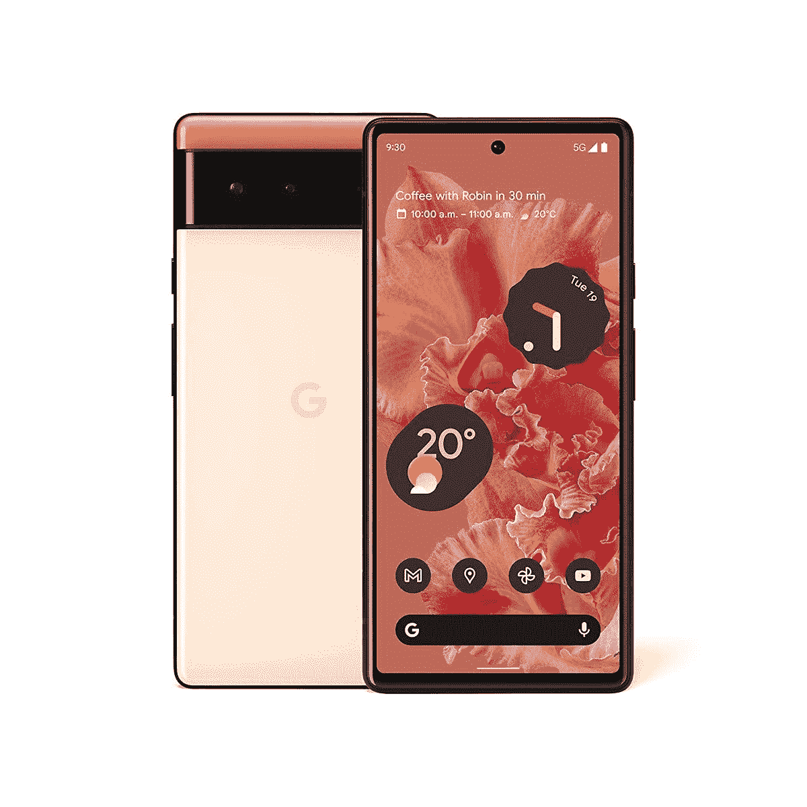
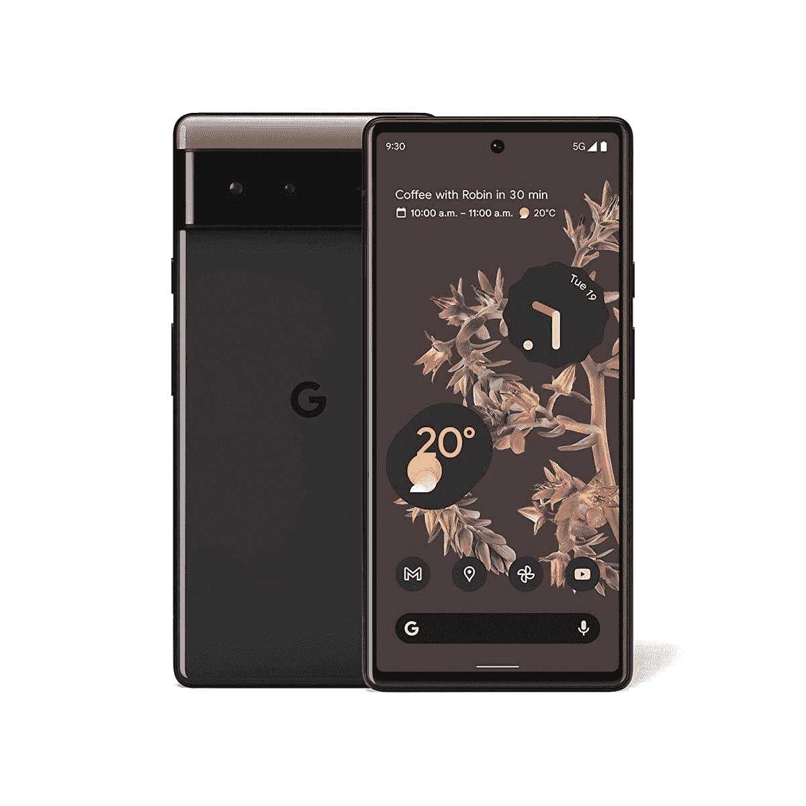
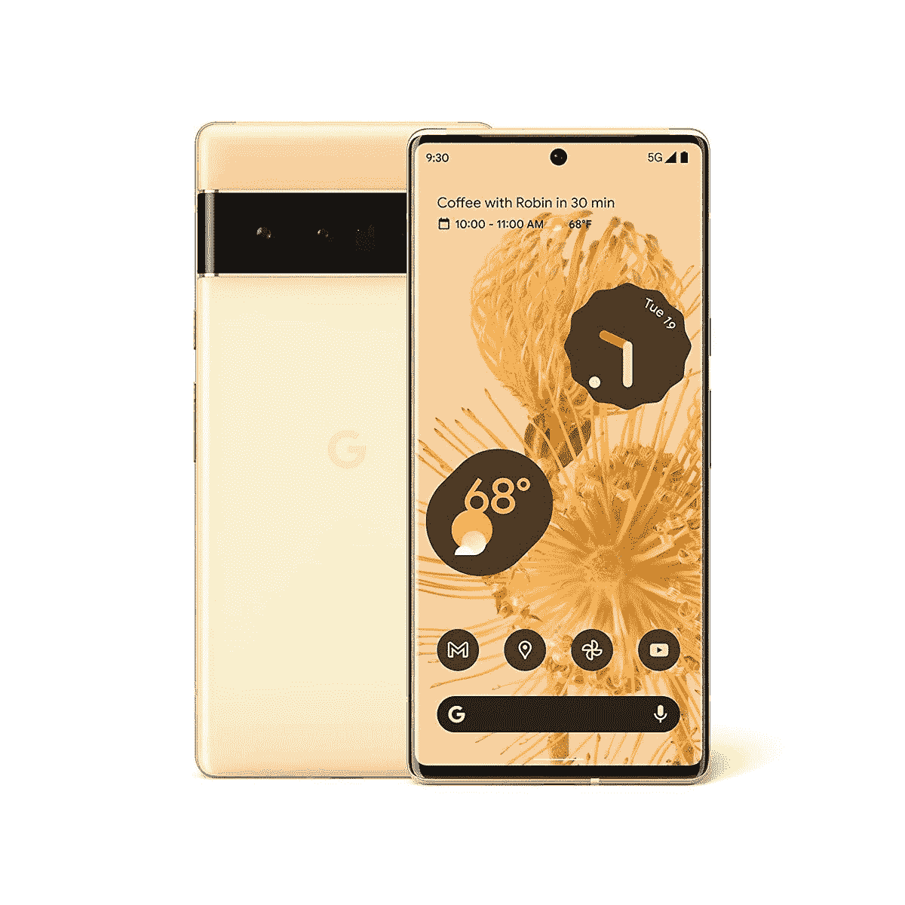
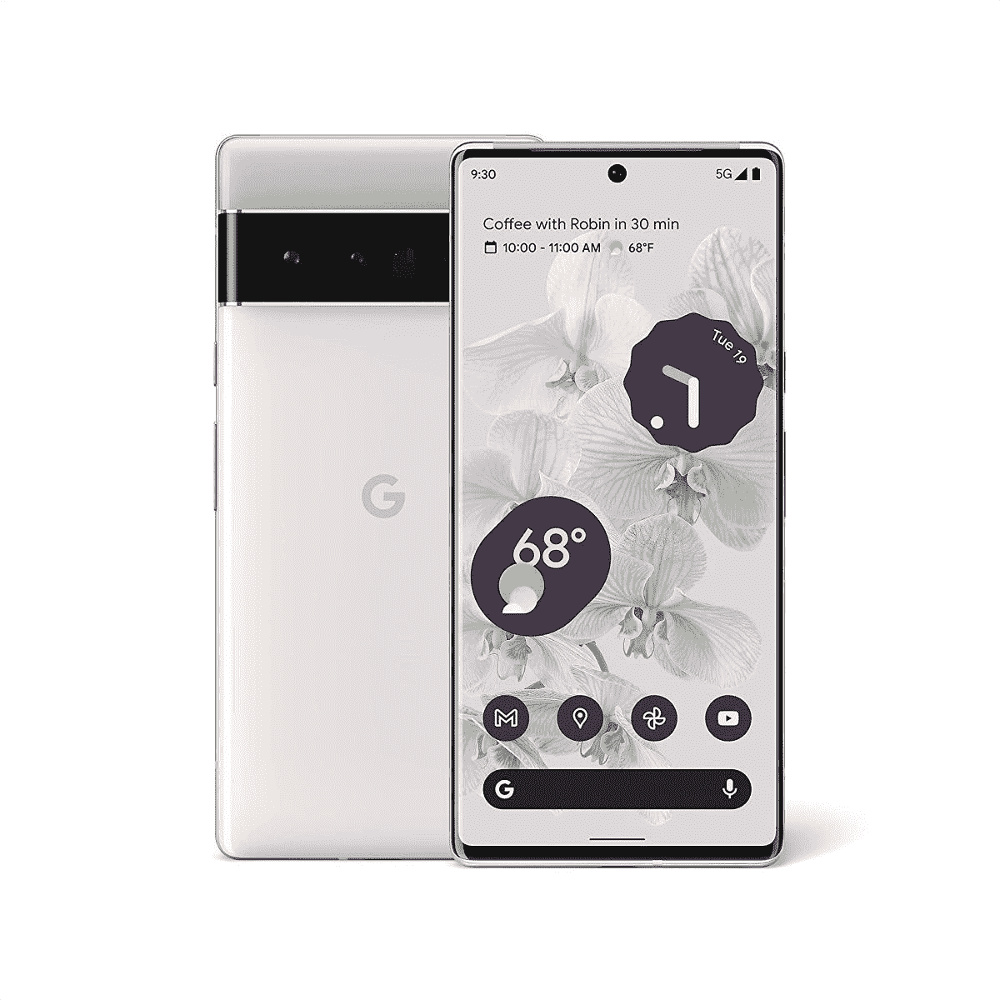
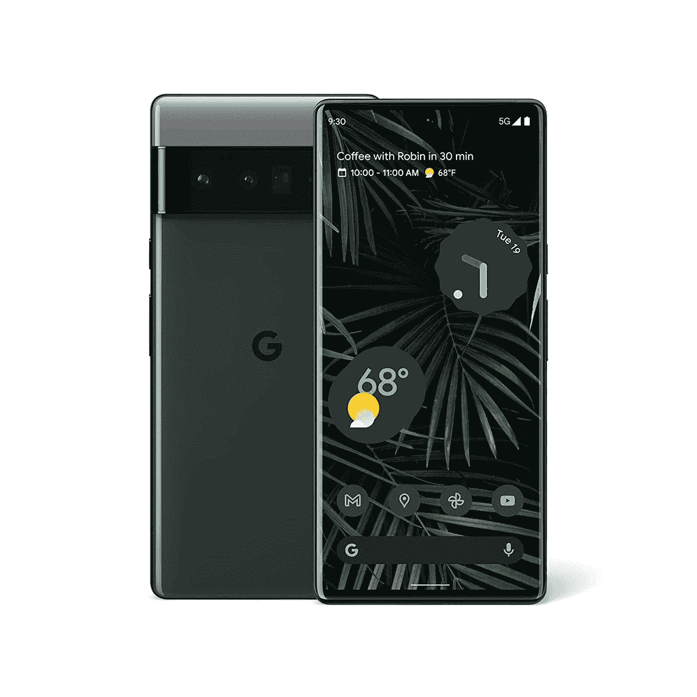

# 谷歌 Pixel 6 和 Pixel 6 Pro:这里是所有不同的颜色选项！

> 原文：<https://www.xda-developers.com/google-pixel-6-pro-colors/>

# 谷歌 Pixel 6 和 Pixel 6 Pro:这里是所有不同的颜色选项！

以下是 Pixel 6 和 Pixel 6 Pro 的各种颜色。这应该给你一个好主意，你应该买哪种颜色。

经过数月的泄露和猜测，谷歌 Pixel 6 和 Pixel 6 Pro 终于正式发布。谷歌的两款旗舰手机配备了为 Pixel 6 系列定制的新[张量](https://www.xda-developers.com/google-says-its-tensor-chip-is-80-faster-than-the-pixel-5s-cpu/)芯片以及更新的相机硬件。看起来谷歌终于成功地组装了一款真正的旗舰手机，在所有部门都具有竞争力的规格和功能。这无疑是今年最受期待的手机之一，让许多人兴奋不已。如果你打算给自己买一台 Pixel 6 或 Pixel 6 Pro，但不知道该选择哪种颜色，这里列出了两款手机的所有可用颜色，让你更容易做出决定。

当你这样做的时候，你可能还想看看[最好的 Pixel 6 和 Pixel 6 Pro 交易](https://www.xda-developers.com/best-google-pixel-6-pro-deals/)，以帮助你节省一些额外的钱，你可以花这些钱为你的全新 Pixel 6 买一个[好盒子](https://www.xda-developers.com/best-google-pixel-6-pro-cases/)！鉴于这款手机有一个玻璃背板，如果你不小心摔了手机，你肯定不希望它破裂。更大的 Pixel 6 Pro 甚至有一个弯曲的显示屏，容易破碎，通常被认为更脆弱。如果你不想隐藏 Pixel 6 背面漂亮的颜色，可以弄个透明的保护壳。现在说说颜色。

Pixel 6 和 Pixel 6 Pro 有多种颜色可供选择，看起来非常独特。到目前为止，Pixel 手机的设计很简单，并没有真正脱颖而出。随着 Pixel 6 系列的出现，这种情况得到了改善。Pixel 6 和 Pixel 6 Pro 都有三种不同的颜色可供选择。

### 像素 6:颜色

 <picture></picture> 

Sorta Seaform

这看起来像绿色配色，背面有双色调涂层。绿色实际上相当温和，带有一点蓝绿色。

 <picture></picture> 

Kinda Coral

这种颜色有双重色调的橙色，看起来非常有吸引力。这无疑是 Pixel 6 的最佳颜色选择之一。

 <picture></picture> 

Stormy Black

这是你能得到的最基本的灰色选项。如果你想要一些微妙和隐秘的东西，就选这个吧。挺低调的。

### Pixel 6 Pro:颜色

 <picture></picture> 

Sorta Sunny

这种配色带有黄色和橙色色调。这类似于珊瑚色，只是颜色更浅更亮。几乎看起来像金子。

 <picture></picture> 

Google Pixel 6 Pro

这种白色和灰色的颜色看起来非常优雅和经典。这是我们认为 Pixel 6 Pro 最好的颜色。如果你想脱颖而出，就拿着这个。

 <picture></picture> 

Stormy Black

这是你能得到的最基本的灰色选项。如果你想要一些微妙和隐秘的东西，就选这个吧。挺低调的。

* * *

与前几年不同，谷歌这一次在 Pixel 6 和 Pixel 6 Pro 上采用了大胆的设计语言，似乎正在取得回报。这些手机看起来与众不同，鹤立鸡群，尤其是巨大的相机栏和这些诱人的颜色。

你最喜欢 Pixel 6 或 Pixel 6 Pro 的哪种颜色，你打算给自己买哪种颜色？请在下面的评论中告诉我们！