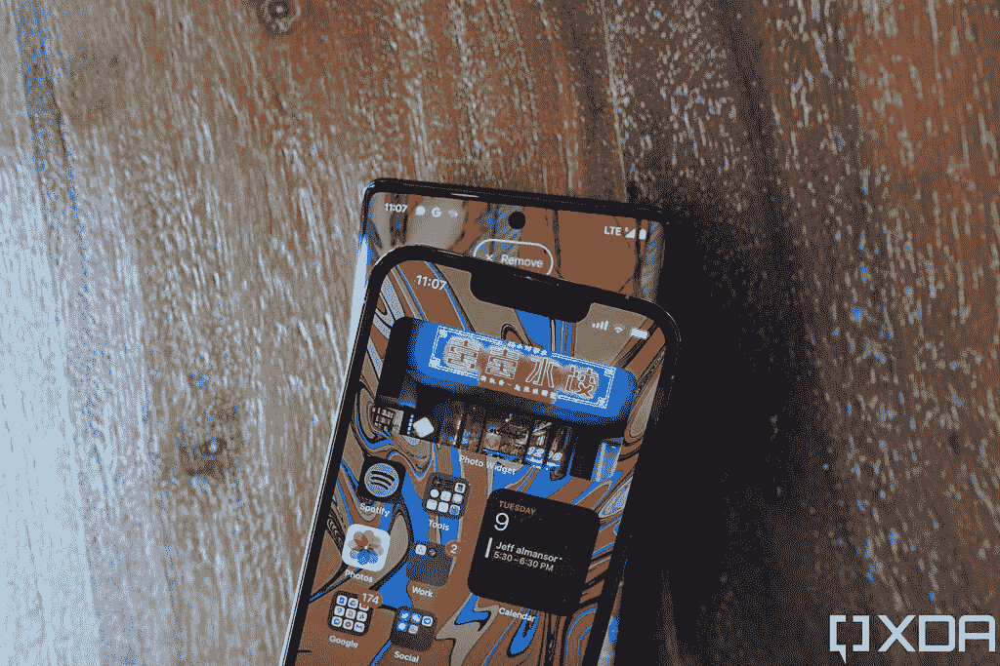
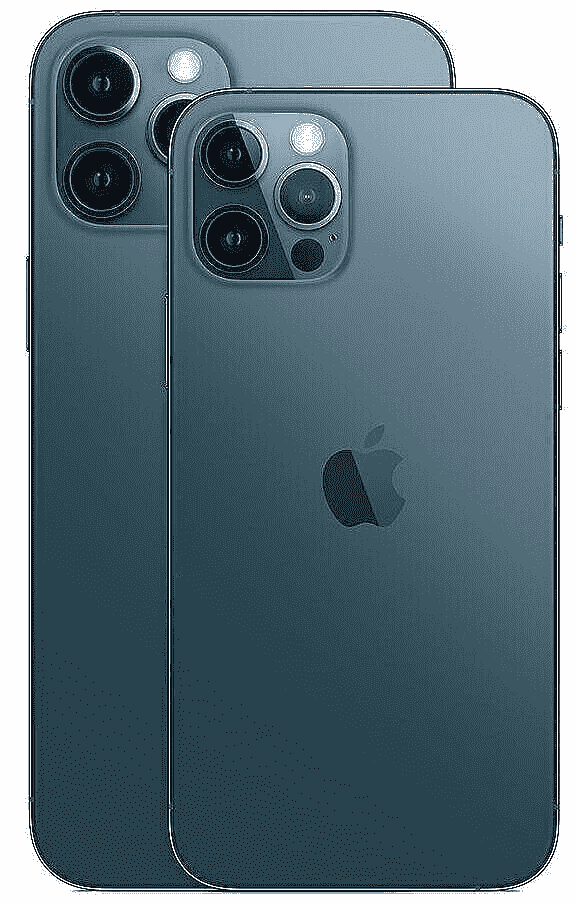

# 谷歌 Pixel 6 Pro vs 苹果 iPhone 12 Pro:买哪个 Pro 手机？

> 原文：<https://www.xda-developers.com/google-pixel-6-pro-vs-apple-iphone-12-pro/>

谷歌的 Pixel 系列手机在过去几年里表现平平。Pixel 5 有一个中档芯片，Pixel 4 的电池寿命很差，Pixel 3XL 有一个浴缸凹口。虽然它们有自己的优点，但对大多数人来说，它们并不是值得推荐的手机。谷歌试图通过 Pixel 6 系列来改变这种情况。新的 Pixel 和 [Pixel 6 Pro](https://www.xda-developers.com/google-pixel-6-pro-review/) 为一款能够与竞争品牌竞争的旗舰手机提供了强有力的理由。Pixel 6 Pro 的起价也比大多数突破 1000 美元大关的旗舰手机低 100 美元。以类似的价格，或者甚至更便宜，你也可以找到去年的二手或翻新的苹果 iPhone 12 Pro。虽然苹果不再正式销售 iPhone 12 Pro，但你可以在许多第三方零售商那里找到它的现货，尤其是折扣价。iPhone 12 Pro 也是去年的旗舰手机，这可能会让你困惑，你应该在两者之间选择哪一个 Pixel 6 Pro 还是 iPhone 12 Pro？

好吧，我们这里有一个谷歌 Pixel 6 Pro 和苹果 iPhone 12 Pro 的对比，帮助你决定哪一个更适合你！去年苹果的 pro 旗舰还是今年谷歌的 Pro 旗舰？让我们看看哪部手机会胜出。

## 谷歌 Pixel 6 Pro vs 苹果 iPhone 12 Pro:规格

|  | 谷歌 Pixel 6 Pro | 苹果 iPhone 12 Pro |
| --- | --- | --- |
| 中央处理器 | 谷歌张量 | 苹果 A14 仿生 |
| 身体 | 

*   163.9 x 75.9 x 8.9 毫米
*   重量:210 克

 | 

*   146.7×71.5×7.4 毫米
*   重量:189 克

 |
| 显示 | 

*   6.71 英寸 QHD+ LTPO AMOLED
*   1400 x 3120 像素
*   512 PPI
*   120 赫兹刷新率
*   19.5:9
*   HDR10+
*   大猩猩玻璃 Victus

 | 

*   6.1 英寸 Super Retina XDR 有机发光二极管显示屏
*   2532 x 1170 像素
*   460 PPI
*   60Hz 刷新率
*   19.5:9
*   HDR10
*   杜比视觉
*   陶瓷屏蔽

 |
| 照相机 | 

*   50MP 初级，f/1.9 (OIS，激光自动对焦)
*   12MP 二级 f/2.2 超宽
*   48MP 三级 f/3.5 4X 长焦
*   1110 万像素前置，f/2.2

 | 

*   12MP 小学，f/1.6(PDAF OIS)
*   12MP 二级 f/2.4 超宽
*   12MP 三级 f/2.0 2X 长焦
*   12MP 前置，f/2.2

 |
| 记忆 | 

*   12GB 内存
*   128GB/256GB/512GB UFS 3.1 存储

 | 

*   6GB 内存
*   128GB/256GB/512GB 存储

 |
| 电池 | 

*   5003 毫安时
*   30W 快速充电
*   Qi 无线充电(21W)
*   反向无线充电

 | 

*   2815 毫安时
*   20W 快速充电
*   MagSafe 支架(15W)
*   Qi 无线充电

 |
| 连通性 | 

*   5G:非独立(NSA)，独立(SA)，Sub6 / mmWave
*   超宽带
*   Wi-Fi 802.11 a/b/g/n/ac/6e
*   蓝牙 5.2
*   A-GPS，GLONASS，伽利略，BDS，QZSS

 | 

*   5G:低于 6GHz
*   超宽带
*   Wi-Fi 802.11 a/b/g/n/ac/6
*   蓝牙 5.0
*   A-GPS，GLONASS，伽利略，BDS，QZSS

 |
| 抗水性 | IP68 | IP68 |
| 传感器 | 指纹传感器(欠显示)、加速度计、气压计、陀螺仪传感器、接近传感器、光传感器 | Face ID、加速度计、气压计、陀螺仪传感器、接近传感器、光传感器 |
| 操作系统（Operating System） | 安卓 12 | iOS 15 |
| 颜色；色彩；色调 | 有点阳光，多云的白色，暴风雨般的黑色 | 太平洋蓝、银、石墨、金 |
| 材料 | 铝金属 | 不锈钢 |
| 价格 | 起价 899 美元 | 700-900 美元(二手/翻新/翻新) |

## 建造和设计

从制造质量和两款手机的制造材料来看，Pixel 6 Pro 和 iPhone 12 Pro 没有太大的区别。与 Pixel 6 Pro 的铝制框架相比，iPhone 12 Pro 在底盘上使用了稍微更高级的材料——不锈钢。Pixel 6 Pro 的正面有大猩猩玻璃 Victus，而 iPhone 12 Pro 有陶瓷盾牌。iPhone 12 Pro 更薄、更轻、更紧凑，这意味着它将更容易使用，也更容易放在口袋或钱包中。两款手机都具有 IP68 防尘和防水性能。你不应该担心拿起任何一个设备，因为它们都是固体。

虽然两款手机的制造方式相似，但它们看起来却大相径庭。iPhone 12 Pro 采用了更传统的外观，与 iPhone 11 Pro 相似，除了平坦闪亮的侧面和类似于 iPhone 4 的方形外观。这是非常基本的，类似于我们在现代手机上看到的。一个普通的玻璃背面，左上角有一个摄像头模块。Pixel 6 Pro 在这里采取了不同的方法。谷歌为这款手机提供了双色外观，一个大的摄像头栏将两种颜色分开。

颜色很好，很有趣，相机栏真的增加了手机的个性。它横跨手机的整个宽度，类似于几年前我们在 Nexus 6P 上看到的那样。这种外观非常独特，这使得 Pixel 6 Pro 在设计方面得分很高。外观和设计是非常主观的，所以这个部门的获胜者应该由你来选择。有些人可能喜欢 iPhone 12 Pro 干净和成熟的设计，而有些人可能喜欢 Pixel 6 Pro 更大胆的外观。平坦的侧面吸引了一些人，而一些人可能会发现 Pixel 6 Pro 的弯曲侧面更容易放在手掌上。

## 显示

在我们进入显示屏的细节之前，在查看这两款手机时，你首先会注意到的是，iPhone 12 Pro 有一个凹口，但侧面是平的，而 Pixel 6 Pro 有一个穿孔，但侧面有弯曲的边缘。再次，这归结为个人喜好。很多人似乎讨厌凹口，因为当你在屏幕上观看内容时，它很碍眼。其他人不介意，因为它就在那里，几天后你就会习惯。嗯，我属于第二类。苹果已经将今年 iPhone 13 上的凹槽尺寸缩小了约 20%，但 iPhone 12 Pro 仍然有一个略大的切口。

Pixel 6 Pro 确实有更身临其境的显示屏，因为没有大的凹口，边缘是弯曲的。现在，就像刻痕一样，很多人要么讨厌它，要么根本不介意它。由于弯曲的性质，可能会有一些意外的触摸，但这也使手机看起来更高级。对于大多数人来说，这不应该是一个问题，但它是值得一提的。Pixel 6 Pro 还提供了一个更大的画布，采用 6.71 英寸的 AMOLED 显示屏，而 iPhone 12 Pro 的面板为 6.1 英寸。更大的显示屏意味着您可以观看更多的内容，这是观看电影和节目的更好体验。

另一方面，iPhone 12 Pro 的显示屏更小，边框更薄，这意味着这款手机更紧凑，单手使用相对更容易。如果你不在手机上看很多内容，iPhone 12 Pro 的 6.1 英寸有机发光二极管显示屏应该可以满足你的需求。由于支持杜比视觉，即使你观看大量内容，它在 iPhone 12 Pro 的显示器上也会看起来一样好。然而，Pixel 6 Pro 凭借其 120Hz 的 LTPO 显示屏进行了反击，使滚动和游戏更加流畅。更快的刷新率是你会喜欢的，因为像滚动列表和社交媒体提要这样的事情会显得更流畅。

两款手机都提供了良好的显示屏，各有利弊。如果你想要一个更大的显示屏，在滚动和游戏时也更流畅，并且没有可能会干扰的缺口，请选择 Pixel 6。如果你想要一个更紧凑的显示屏，并且有可以用拇指够到的边角，请选择 iPhone 12 Pro，前提是你对凹槽没有问题。如果你在手机上使用大量内容，你应该选择更大的显示屏。

## 表演

由于 iPhone 12 Pro 和 Pixel 6 Pro 都是旗舰手机，所以它们都有顶级的内部部件来为它们供电。不过，需要注意的是，iPhone 12 Pro 是去年的旗舰产品，而 Pixel 6 Pro 是最近的产品。iPhone 12 Pro 采用了苹果的 A14 Bionic，而 Pixel 6 Pro 采用了谷歌新的内部张量 SoC。在过去的几年里，苹果的芯片组在原始性能方面一直领先于竞争对手。谷歌正在努力赶上张量，特别是在处理计算算法方面。

iPhone 12 Pro 尽管已经上市一年了，但在视频编辑、渲染和游戏等密集型任务中仍将表现更好。然而，日常任务，如运行社交媒体和消息应用程序、休闲游戏、观看视频/电影等。理想情况下，两部手机的感觉应该是相似的。凭借更高的刷新率，它甚至可能在 Pixel 6 Pro 上更快。张量在图形性能方面不太好，所以如果高端游戏是你的优先选择，iPhone 12 Pro 是一个选择。多年来，苹果的硬件和软件集成变得越来越强大，这使得应用程序能够更好地为 iPhone 优化。这只是谷歌第一次尝试制造自己的硬件和软件，所以我们可以希望它会随着时间的推移而变得更好。

你不应该担心任何一款手机的性能。去年的手机很少表现得像今年的旗舰手机一样好，但这只是苹果芯片组最近有多好。

不用说，两款手机上的软件差别很大。Pixel 6 Pro 运行 [Android 12](https://www.xda-developers.com/android-12/) ，将获得三年的主要 Android 版本更新和五年的安全补丁。另一方面，iPhone 12 Pro 运行的是 [iOS 15](https://www.xda-developers.com/ios-15/) ，根据苹果的记录，理想情况下应该会获得四到五年的软件支持。请注意，此时它已经存在一年了。这又一次归结为个人偏好，你是想要一个在很大程度上可定制的操作系统，还是一个获得基本权利并得到更好优化的操作系统。

## 摄像机

这是 Pixel 6 Pro 绝对大放异彩的领域。虽然 iPhone 12 Pro 确实点击了一些很棒的图片，但 Pixel 6 Pro 做得更好。Pixel 6 Pro 拥有更高分辨率的主传感器，可以捕捉更多细节。与 iPhone 12 Pro 相比，它在低光摄影方面也更好。谷歌的夜视模式相当神奇，比 iPhone 12 Pro 上的夜间模式捕捉到更多的光线。Pixel 6 Pro 在几乎所有场景下点击的静止图像都比 iPhone 12 Pro 点击的要好。

这并不是说 iPhone 12 Pro 无论如何都不好。它仍然有一套稳定的摄像头，可以说比大多数手机都更加稳定。iPhone 12 Pro 拍摄的图像颜色看起来很自然，动态范围看起来也很棒。这两款手机甚至都有长焦镜头，但谷歌的潜望镜相机在这方面也胜过苹果微薄的 2 倍镜头。你可以使用 Pixel 6 Pro 上的长焦相机来实际放大远处的物体并捕捉它们。然而，iPhone 12 Pro 只有一个 2X 镜头，除了在拍摄人像模式照片时，这不是很有用。

 <picture></picture> 

Pixel 6 Pro showing 16x zoom on the viewfinder

Pixel 6 Pro 输出的图像颜色和对比度略有提升。自拍在两款手机上都很好，但即使在这一领域，Pixel 6 Pro 也能胜出，因为它的镜头更宽，可以适合更多人。在静态图像方面，Pixel 6 Pro 拍摄的照片令人赏心悦目，这可能使它成为普通消费者的更好选择。

iPhone 12 Pro 做得稍好的一个领域是摄像。在拍摄视频方面，Pixel 6 系列比前几代产品有了很大的改进。不过在这个部门还是输给了 iPhone 12 Pro。iPhone 12 Pro 的视频看起来更清晰、稳定，在颜色和动态范围方面也更好。iPhone 12 Pro 还可以通过板载的三个摄像头以 4K 60fps 拍摄，这是 Pixel 6 Pro 无法做到的。

总的来说，就相机性能而言，你会很高兴拿起任何一款手机。iPhone 12 Pro 是一致的，但如果你只关心静态图像，并且你想要可以随时发布到社交媒体的照片，Pixel 6 Pro 是一个很好的选择。

## 电池寿命和充电

iPhone 12 Pro 的电池非常小，因此肯定不会获得任何续航奖。在将 iPhone 12 Pro 插入充电器之前，您可以预计它的屏幕打开时间约为 6 小时。这对大多数人来说应该是好的，但如果你是一个重度用户，你可能不得不在晚上晚些时候开始寻找充电器。尽管 Pixel 6 Pro 拥有更大的电池，但其性能与 iPhone 12 Pro 相似。

张量芯片并不是真正的续航冠军，120Hz 的显示屏也可能消耗更多的电池，特别是在利用高刷新率的应用程序中。两款手机在电池方面都不算令人失望，但我们当然希望 Pixel 6 Pro 的续航时间更长。你将不得不在晚上开始为两部手机寻找充电器，尤其是如果你是一个重度用户的话。说到充电，iPhone 12 Pro 支持高达 20W 的快充，而 Pixel 6 Pro 可以达到 23W。两款手机都有无线充电功能，iPhone 12 Pro 通过 MagSafe 达到 15W，Pixel 6 达到 21W。Pixel 6 Pro 相对于 iPhone 12 Pro 的一个巨大优势是，它通过 USB-C 充电，而不是 iPhone 上专有的 lightning 连接器。

## Pixel 6 Pro vs iPhone 12 Pro:该买哪个？

Pixel 6 Pro 在美国的起价为 899 美元，而 iPhone 12 Pro 的价格可能差不多，甚至更低，这取决于你从哪里以及在什么条件下获得它。除此之外，这两款手机没有太多区别。它们都有很棒的摄像头、不错的电池寿命、漂亮的显示屏和旗舰处理器。这一切都可以归结为由来已久的 Android vs iOS 辩论，不是吗？嗯，算是吧。iPhone 12 Pro 更擅长游戏、拍摄视频，并且外形紧凑。它还具有额外的功能，如隔空投送，连续性，移交等。如果你了解苹果的生态系统，你就会明白这一点。

Pixel 6 Pro 有一个更大、更好的显示屏，没有凹口，一组更好的摄像头，独特的设计，它可以在 Android 12 上运行，使用了你大修的新材料。这是迄今为止最好的 Pixel 手机之一。除非你真的想要一部与苹果其他产品同步的 iOS 手机，否则 Pixel 6 Pro 实际上更有意义，因为它也更新，而且大多数基本功能都是正确的。你甚至可以查看我们的 [Pixel 6 Pro 评测](https://www.xda-developers.com/google-pixel-6-pro-review/)来了解更多关于这款设备的信息。事实上，如果你已经进入了苹果生态系统，并且喜欢 iOS，你也可以考虑购买 [iPhone 13](https://www.xda-developers.com/iphone-13/) ，你可能会发现它比 iPhone 12 Pro 便宜。

 <picture></picture> 

Google Pixel 6 Pro

Pixel 6 Pro 配备了谷歌新的张量芯片、现代设计和旗舰相机。

 <picture></picture> 

iPhone 12 Pro Max

##### 苹果 iPhone 12 Pro

iPhone 12 Pro 是苹果去年的旗舰产品，但仍是 2021 年值得购买的智能手机。

你打算买哪个 Pixel 6 Pro 还是 iPhone 12 Pro？请在下面的评论中告诉我们！如果你打算购买这款手机，你可以查看[最佳 Pixel 6 Pro 交易](https://www.xda-developers.com/best-google-pixel-6-pro-deals/)，以及[最佳 Pixel 6 Pro 保护套](https://www.xda-developers.com/best-google-pixel-6-pro-cases/)或[最佳 iPhone 12 Pro](https://www.xda-developers.com/best-iphone-12-cases/) 保护套，以保护这两款设备中的任何一款。