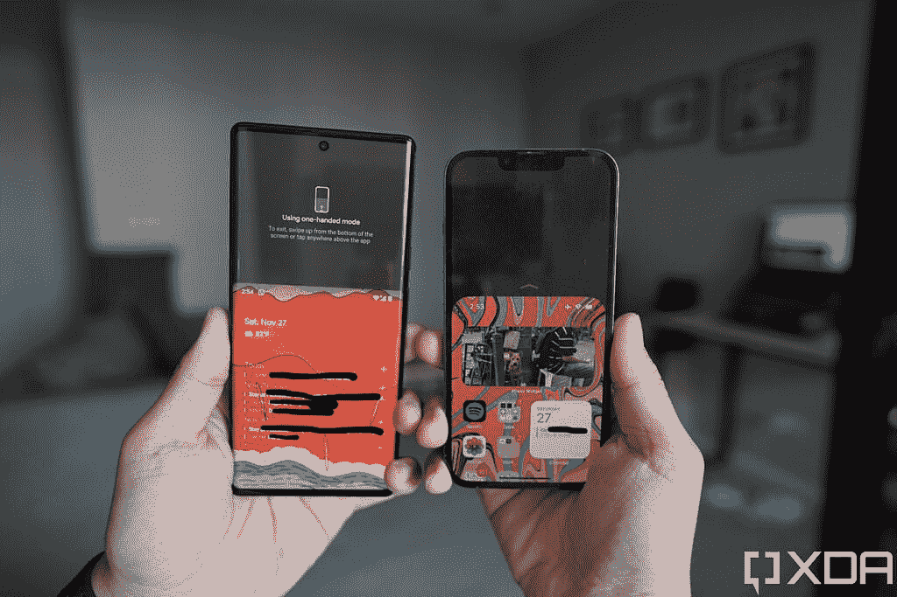

# 谷歌 Pixel 6 Pro vs iPhone 13 Pro:硬件、软件、电池寿命

> 原文：<https://www.xda-developers.com/google-pixel-6-pro-vs-apple-iphone-13-pro/>

谷歌 Pixel 一直被设计成“Android 的 iPhone”，而 [Pixel 6 Pro](https://www.xda-developers.com/google-pixel-6/) 是迄今为止最接近实现这一目标的产品。除了首次展示自己的芯片，Pixel 6 Pro 还在 Android 12 的基础上看到了[进一步的软件调整，这使它感觉不同于典型的 Android 设备——我们敢说，更像一个 iOS。与此同时，](https://www.xda-developers.com/android-12-review/) [iPhone 13 Pro](https://www.xda-developers.com/iphone-13-pro/) 是去年 iPhone 12 Pro 的迭代更新，大部分重大升级来自安卓手机多年来提供的硬件组件，如更大的摄像头传感器和高分辨率显示屏。

对于技术极客来说，iPhone vs Pixel 的辩论每年都很有趣，但这可能是这场辩论第一次对普通消费者产生影响(只是*轻微，*但仍然如此)。

我的同事 Adam Conway 已经[对 Pixel 6 Pro](https://www.xda-developers.com/google-pixel-6-pro-review/) 进行了彻底的评测，而我也在上个月[评测了 iPhone 13 Pro](https://www.xda-developers.com/apple-iphone-13-pro-review/) 。我还在一场 [Pixel 6 Pro 对 iPhone 13 Pro 的相机枪战中测试了这两个相机。这篇文章将从更广泛的角度比较这两款旗舰产品。](https://www.xda-developers.com/google-pixel-6-pro-vs-apple-iphone-13-pro-camera-shootout-comparison/)

 <picture></picture> 

Pixel 6 Pro (left); iPhone 13 Pro (right).

 <picture></picture> 

Google Pixel 6 Pro

Pixel 6 Pro 是较大的兄弟，配有谷歌的新张量芯片、现代设计和额外的远摄相机。

### 点击展开:谷歌 Pixel 6 Pro 和苹果 iPhone 13 Pro:规格

## 谷歌 Pixel 6 Pro 和苹果 iPhone 13 Pro:规格

| 

规范

 | 

谷歌 Pixel 6 Pro

 | 

苹果 iPhone 13 Pro 和 iPhone 13 Pro Max

 |
| --- | --- | --- |
| **构建** | 

*   铝制中框
*   大猩猩玻璃 Victus 回
*   大猩猩玻璃 Victus 正面

 | 

*   不锈钢中框
*   玻璃正面和背面
*   前玻璃的“陶瓷护罩”

 |
| **尺寸&重量** | 

*   163.9 x 75.9 x 8.9 毫米
*   210 克

 | 

*   iPhone 13 Pro:
    *   146.7 毫米 x 71.5mm 毫米 x 7.65mm 毫米
    *   204 克

 |
| **显示** | 

*   6.71 英寸 AMOLED
*   3120 x 1440 像素
*   可变 120Hz 可变刷新率

 | 

*   超级视网膜 XDR 有机发光二极管:
    *   iPhone 13 Pro: 6.1 英寸
    *   iPhone 13 Pro Max: 6.7”
*   推广 120Hz 可变刷新率

 |
| **SoC** | 谷歌张量 | 苹果 A15 仿生 |
| **风筒&储存** |  | 

*   RAM 未公开
*   128GB/256GB/512GB/1TB

 |
| **电池&充电** | 

*   5000 毫安时
*   高达 30W 的有线快速充电
*   高达 23W 的无线充电

 | 

*   电池尺寸未透露；监管文件中的大致大小:
*   高达 20W 的有线充电
*   最高 7.5W 的无线充电
*   MagSafe 充电功率高达 15W

 |
| **安全** | 光学显示指纹读取器 | Face ID |
| **后置摄像头** | 

*   **初级:** 50MP 宽，三星 GN1，f/1.57，1/1.31”
*   **中学:** 12MP 超宽，f/2.2
*   **三级:** 48MP 潜望镜，f/3.5

 | 

*   **初级:** 12MP 宽，f/1.5 光圈，1.9μm
*   **次要:** 12MP 超宽，f/1.8 光圈
*   **第三:** 12MP 长焦，3 倍光学变焦，f/2.8
*   激光雷达相机

 |
| **前置摄像头** | 11MP | 12MP 原深感摄像头系统 |
| **端口** | USB-C | 闪电 |
| **音频** | 立体声扬声器 | 立体声扬声器 |
| **连通性** | 

*   5G(毫米波)
*   支持 4x4 MIMO 和 LAA 的千兆级 LTE
*   支持 2x2 MIMO 的 Wi-Fi 6 (802.11ax)
*   蓝牙 5.0
*   国家足球联盟

 | 

*   5G(低于 6 GHz 和毫米波)
*   支持 4x4 MIMO 和 LAA 的千兆级 LTE
*   支持 2x2 MIMO 的 Wi-Fi 6 (802.11ax)
*   蓝牙 5.0
*   国家足球联盟

 |
| **软件** | 安卓 12 | iOS 15 |
| **其他特征** | 双物理 SIM | 双物理 SIM 或双 eSIM 支持 |

***关于这篇评测:**这篇对比是在对 XDA 购买的一台谷歌 Pixel 6 Pro 和苹果提供的一台 iPhone 13 Pro 进行了长达数周的测试后撰写的。谷歌爱尔兰公司确实向我的同事亚当·康威提供了一个 Pixel 6 Pro 审查单元，但它没有用在这一块。这两家公司在这篇文章中都没有任何投入。*

* * *

## 谷歌 Pixel 6 Pro vs 苹果 iPhone 13 Pro:硬件

### 设计、外观、手感

虽然 Pixel 在软件方面越来越像 iPhone，但在硬件方面，它却恰恰相反。虽然 iPhone 13 Pro 主要是坚硬的边角和平坦的侧面，具有专业、冰冷和机械的氛围——如果它采用全黑配色，它会类似于 2001 年《太空漫游》中的矩形整体——但 Pixel 6 Pro 是弯曲的，多彩的，有趣的(除非你有我得到的非常暗淡的深灰色)。

尽管 Pixel 6 Pro 为 iPhone 13 Pro 的 6.1 英寸屏幕带来了更大的 6.7 英寸屏幕，但 Pixel 6 Pro 对我来说更容易握持，因为前面提到的曲线，也因为 Pixel 6 Pro 像几乎所有安卓手机一样，使用了比 iPhone 更长的长宽比。因此，尽管 Pixel 6 Pro 更高，但其横向宽度为 75.9 毫米，低于 iPhone 13 Pro 的 78.1 毫米。

两款手机都提供刷新率高达 120 赫兹的有机发光二极管屏幕，但 Pixel 的显示屏像素密度更高，iPhone 13 Pro 的屏幕明显更亮——而且后者在现实世界中的使用将会很重要。然而，iPhone 的屏幕也被一个巨大的缺口打断，而 Pixel 有一个小孔，所以你在 Pixel 6 Pro 上获得的屏幕比 iPhone 13 Pro 多得多。

### 摄像机

Pixel 6 Pro 更擅长捕捉静态宽和变焦图像，而 iPhone 更擅长超宽照片和整体视频性能

在多年使用普通相机硬件(至少相对于三星、华为、小米提供的硬件)后，苹果和谷歌今年终于推出了更新、更好的硬件。Pixel 6 Pro 看到了更大的飞跃，将其传感器升级为 50MP GN1 传感器，配有 1/1.31 英寸的大传感器，以及 48MP 潜望镜变焦镜头和 12MP 超宽。与此同时，iPhone 13 Pro 带回了一种熟悉的感觉，三个 12MP 主系统，但每个镜头都有一个更大的传感器，包括主摄像头相对较大的提升(尽管仍小于 Pixel 的 1/1.31 英寸)，以及改进的 3 倍长焦变焦(也不如 Pixel 的 4 倍潜望镜变焦)。两款手机的自拍相机硬件基本保持不变:Pixel 6 Pro 为 11MP，iPhone 13 Pro 为 12MP。

我已经在[深入的相机枪战](https://www.xda-developers.com/google-pixel-6-pro-vs-apple-iphone-13-pro-camera-shootout-comparison/)中介绍了这两款手机的相机系统，所以如果你想了解更多，请查看一下。但长话短说，我发现 Pixel 在用主摄像头和变焦摄像头捕捉静态图像方面稍好一些，而 iPhone 在超宽照片和视频性能方面更好。

至于哪款手机更好看？判断手机背面是个主观练习，两个背面我都一样喜欢。我喜欢 Pixel 6 Pro 独特的遮阳板和“Sorta Sunny”配色中的双色调饰面，但 iPhone 13 Pro 凭借其不锈钢平栏杆和坚硬的边角，看起来像一台专业的抛光机器。

你可以以任何一种方式争论——为了背后。如果我们谈论正面，我认为像素客观上获胜，因为穿孔比凹口占用的空间少得多。

无论哪种方式，这些最终仍然是玻璃手机，所以你会想要为这些手机中的任何一个提供保护的外壳和/或屏幕保护。查看我们关于[最佳 Pixel 6 Pro 保护套](https://www.xda-developers.com/best-google-pixel-6-pro-cases/)和[最佳 iPhone 13 Pro 保护套](https://www.xda-developers.com/best-iphone-13-pro-cases/)以及[最佳 Pixel 6 Pro 屏幕保护套](https://www.xda-developers.com/best-pixel-6-pro-screen-protectors/)的综述。

### 内部构件

一般来说，iPhones 在历史上比 Android 手机功能更强大，电池效率更高，即使后者配备了更多内存或更大的电池。主要原因是因为苹果设计了自己的 SoC 和软件，使其能够完全控制硬件和软件，从而在两者之间创造更好的协同效应。在 Pixel 6 系列之前，没有任何一款 Android 手机达到过这种总体控制水平，因为这是第一款运行在谷歌自己的 SoC 上的设备，即 Tensor。

 <picture></picture> 

The iPhone 13 Pro's 4498 multi-core score trumps the Pixel 6 Pro's 2749.

虽然 Tensor 不如 iPhone 13 Pro 的 A15 Bionic 强大，但它确实允许 Pixel 6 Pro 在图像和语言处理方面进行大量的设备上计算，而其他 Android 手机无法做到这一点。

* * *

## 谷歌 Pixel 6 Pro vs 苹果 iPhone 13 Pro:软件

iPhone 13 Pro 和谷歌 Pixel 6 Pro 都发布了各自软件的最新版本:iOS 15 和 [Android 12](https://www.xda-developers.com/android-12/) 。我们将从后者开始，因为 Android 12 是多年来 Android 最大的视觉改革。

### 安卓 12

谷歌创造了这个大革新“ [Material You，”](https://www.xda-developers.com/material-you/)“材料设计”的进化最早可以追溯到 Android 5。顾名思义，Material You 是一种更加可定制的美学，旨在提供适合每个用户的不同美学。为此，Pixel 6 Pro 使用了一个代号为“莫奈”的[主题引擎，它可以识别壁纸中使用的颜色，然后构建一个彩色主题，Pixel 6 Pro 的用户界面围绕这个主题旋转。](https://www.xda-developers.com/material-you-monet-theme-engine/)

对于我的 Pixel 6 Pro，莫奈引擎提出了一种浅粉色调，可以在整个手机界面上看到，我真的很喜欢它。特别是在相机应用程序中，这种有趣的颜色真的让界面变得流行，因为我花了十多年时间看到智能手机相机应用程序几乎都是黑白配色。就外观而言，我喜欢 Android 12 Pixel 版本的几乎所有东西，除了一个吹毛求疵的地方，我稍后会回来，因为它与一个更大的咆哮有关。

除了外观，Android 12 还带来了新的隐私功能，如隐私仪表盘，这是一个一体化的页面，可以准确显示每个应用程序在过去 24 小时内访问过的数据。这些信息以线性时间线的形式呈现，因此你可以清楚地了解，例如，Instagram 在一个下午访问了你的位置多少次。

还有新的指示器，以绿色椭圆形图标或圆点的形式，让你随时知道应用程序正在使用 Pixel 6 Pro 的摄像头或麦克风。这个功能很棒，但也是从 iOS 上批发过来的。事实上，Android 12 从 iOS 借鉴了相当多的东西，包括一个新的单手模式，它的行为与 iOS 的 take 完全一样，与其他 Android 手机上的每一个单手模式都截然不同。基本上，三星、小米、华为、Vivo 等品牌长期以来一直提供单手模式，在高度和宽度上都缩小了显示屏。像素的拍摄，只是降低了屏幕的顶部(意味着屏幕和以前一样宽)，就像 iPhone 五年多来一直在做的那样。

 <picture></picture> 

The Pixel 6 Pro’s one-hand mode (left) and iPhone 13 Pro’s “reachability” (right).

我一点也不喜欢这个举动，不仅仅是因为这是对苹果一直在做的事情的公然复制(甚至触发它的动作都是完全一样的)，而是其他 Android 品牌的单手模式更好，因为它也缩小了屏幕的宽度。许多手较小的人在现代智能手机上单手打字有困难，因为他们的拇指无法水平伸出。

现在，在 Android 粉丝拿起他们的干草叉之前，我很清楚 iOS 也已经从 Android 中提取了一些功能，比如主屏幕上的小部件。我并不反对品牌抄袭，我认为每个手机品牌在这一点上都有创意。我的抱怨是，谷歌正在提升 iOS 的一些元素，这些元素使得 Android 的可定制性不如以前。例如，屏幕底部的栏(向用户显示滑动位置)可以隐藏在几乎所有其他 Android 皮肤中，以获得更整洁的外观，但 Pixel launcher 必须始终显示该栏——就像 iOS 一样。

另一个例子:在 Pixel launcher 的主屏幕上有两个小部件——谷歌搜索栏和日期/天气小部件——不能被移除。这让我抓狂，因为 Android 对我最大的吸引力之一就是我可以(或者曾经)完全按照我认为合适的方式定制主屏幕。如果我愿意，我可以在整个主屏幕上只有一个应用程序。你不能再使用 Pixel launcher 了，因为谷歌搜索栏必须位于底部，日期/天气窗口必须位于顶部。这听起来有点苛刻，就像 iOS 一样。

正如我的同事亚当·康威(Adam Conway)在他对 Android 12 的深度[评论中所写的那样:“*Pixel launcher 在很大程度上是 Android 世界的 iOS launcher。*](https://www.xda-developers.com/android-12-review/)

### iOS 15

从美学角度来说， [iOS 15](https://www.xda-developers.com/ios-15/) 与 iOS 14 相比没有太大变化——最大的视觉变化来自 Safari，地址栏被移到了屏幕底部——但苹果引入了一些提高可用性的功能，如与 Android 手机用户分享 FaceTime 链接的功能，以及 SharePlay，允许 iPhone 用户在 FaceTime 通话期间一起观看视频或听音乐。对于许多生活在北美的人来说，这可能是一次大的升级，也许是在英国，FaceTime 显然在苹果用户中非常受欢迎。但我住在香港，和世界其他地方一样(不包括前面提到的北美和英国)，我们主要依赖第三方聊天应用，如 WhatsApp、微信、Line 等。

iOS 15 还带来了略有改善的通知(顺便说一句，这仍然很糟糕——只是有点不那么糟糕)，以及 Siri 离线处理一些任务的能力(公平地说，这在谷歌助手上已经存在多年了)。在很大程度上，iOS 15 是一个小升级，因为去年的 iOS 14 带来了很大的变化，比如添加了小工具。尽管如此，如果你使用其他苹果产品，iOS 与这些设备的集成效果很好。许多现有的功能，如隔空投送，或私人中继，仍然工作得很好。

至于我更喜欢哪个 OS？比起 iOS，我一直更喜欢 Android，现在也是如此。我喜欢 Android 更传统的文件系统、通知管理和完全免费的主屏幕网格，这让我可以在屏幕上的任何地方放置应用程序。然而，Pixel launcher 慢慢地在主屏幕上“锁定东西”,这一点已经有所改变。

* * *

## 谷歌 Pixel 6 Pro vs 苹果 iPhone 13 Pro:性能

我们已经确定，苹果的 A15 Bionic 比谷歌张量具有更强的原始能力，但这并没有在现实世界中表现出来——两款手机都可以快速运行，并很好地启动应用程序。我唯一一次注意到 A15 Bionic 的优越性是在我导出视频的时候，无论是通过 Insta360 的应用程序导出的 360 视频，还是只是渲染我为 Instagram 故事拍摄的短片，A15 Bionic 都能以闪电般的速度渲染视频，而 Tensor(或任何骁龙 888 设备)的时间明显更长。我不是说两倍的时间，而是三到四倍的时间。

也就是说，张量可以做一些令人惊讶的事情，因为谷歌设计它是为了优先考虑谷歌非常擅长的事情，比如机器学习。为此，张量使 Pixel 6 系列实现了我在任何计算设备上见过的最佳实时文本到语音转换和实时语言翻译。尤其是语音到文本的转录功能非常好用，以至于它改变了我使用 WhatsApp 的方式:我现在更喜欢用我的语音来口述回答，而不是用手打字。

当然，苹果也通过 A15 Bionic 向机器学习迈出了一大步，它也能够完成一些开创性的计算任务，比如在视频中创建有点逼真的人工散景(更好的说法是“电影模式”)。

无论是哪种方式，无论你是用它来工作还是娱乐，这两款手机都不会让你失望——然而，对于后者，我更喜欢 Pixel 6 Pro 不太受干扰的屏幕，但 iPhone 13 Pro 有更响亮、更饱满的立体声扬声器。

### 电池寿命

Pixel 6 Pro 的 5，000 毫安时电池比 iPhone 13 Pro 的 3，125 毫安时大得多，但我觉得 iPhone 13 Pro 的电池续航时间要好一点。过去几周，我一直在频繁使用这两款手机，iPhone 13 Pro 几乎总能让我轻松使用一整天——甚至是频繁使用 15 个小时。然而，Pixel 6 Pro 有几次危险地接近 0%。如果我必须给出一个粗略的估计，我会说 iPhone 13 Pro 在一次充电后可以额外使用两到三个小时。我将此归因于几个原因:Pixel 6 Pro 可能更频繁地使用高刷新，由于这是谷歌第一次使用自己的定制 SoC(反正也不完全是谷歌设计的，因为它植根于三星的 Exynos 2100)，谷歌没有像苹果那样有效地掌握硬件/软件协同。

* * *

## 谷歌 Pixel 6 Pro vs iPhone 13 Pro:结论

通常，当我做这些 iPhone vs Android 的比较时，我总是得出这样的结论:Android 手机可能有更好的摄像头或更沉浸式的屏幕，但它无法匹配 iPhone 的独特性，因为苹果是唯一一个制造 iOS 产品的公司，而有几个品牌制造 Android 手机。例如，尽管我非常喜欢一加 9 Pro，但它真的感觉与 OPPO Find X3 Pro 有很大不同吗？

因此，我认为谷歌对 Pixel 6 Pro 所做的事情——赋予它几项独家功能和不同于普通 Android 的独特用户界面——是正确的举动。它赋予了像素个性和个性。谷歌显然一直试图让 Pixel 成为 Android 世界的 iPhone，随着 Pixel 6 Pro 的推出，谷歌已经最接近了。

谷歌显然一直在试图让 Pixel 成为 Android 世界的 iPhone，凭借 Pixel 6 Pro，谷歌已经最接近了

就我个人而言，我现在选择携带 Pixel 6 Pro 而不是 iPhone 13 Pro(和我的任何其他东西)作为我的日常司机，因为 Pixel 6 Pro 的语音听写是一个游戏改变者，我喜欢 Pixel UI 的异想天开的美学(我敢说...类 MIUI？)而且我认为 Pixel 6 Pro 拥有目前市场上第二好的相机系统(在[Vivo X70 Pro 加上](https://www.xda-developers.com/google-pixel-6-pro-vs-vivo-x70-pro-plus-camera-shootout-comparison/)之后)。

但让我们面对现实吧，iPhone 13 Pro 的销量仍然会比 Pixel 6 Pro 高出几百倍，因为它的供应更加广泛，而且它有一个广泛的配套产品生态系统，如耳塞、耳机、平板电脑和电脑。这是谷歌的终极目标。让 Pixel 6 Pro 在个性和排他性上接近 iPhone 只是第一步。谷歌需要努力扩大零售业务和产品生态系统。

就像现在一样，Pixel 6 Pro 仍然是技术人员和 Android 粉丝的小众设备。全球大多数普通消费者仍在选择苹果或三星。

 <picture></picture> 

Google Pixel 6 Pro

Pixel 6 Pro 是较大的兄弟，配有谷歌的新张量芯片、现代设计和额外的远摄相机。