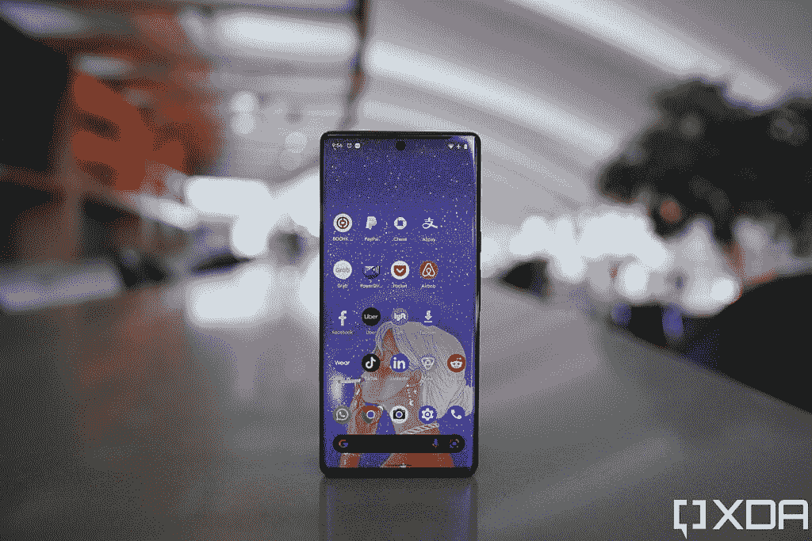
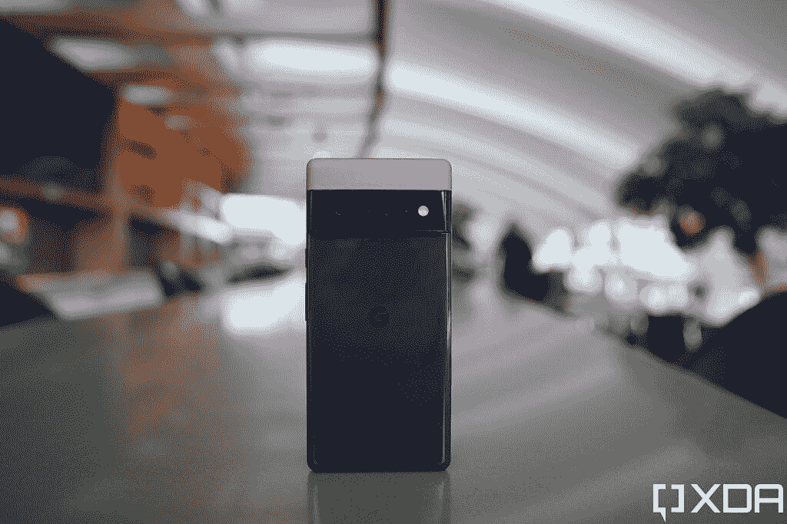
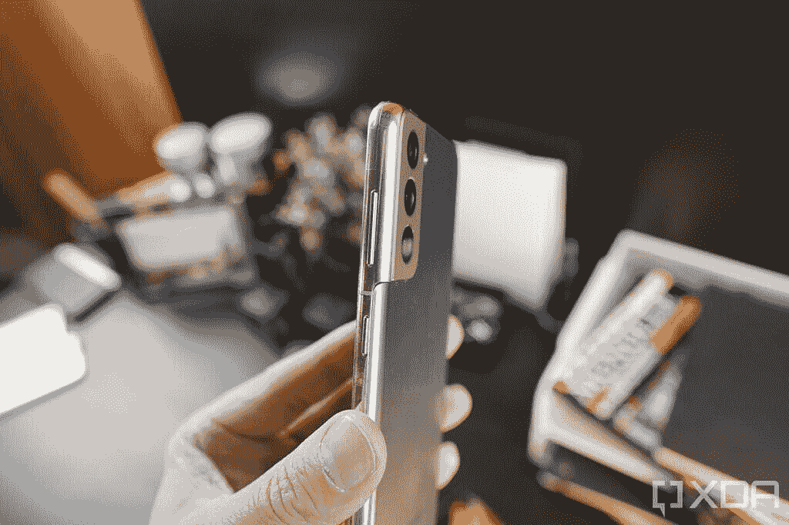
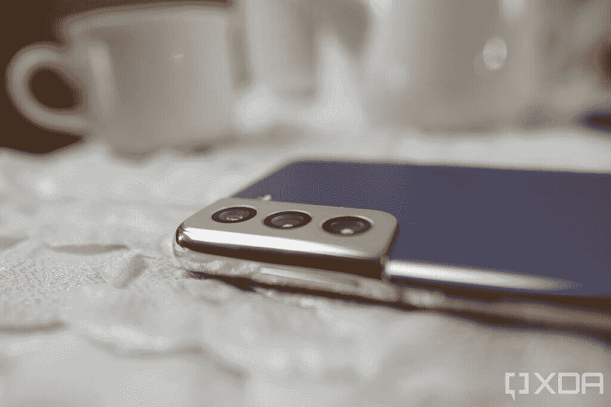
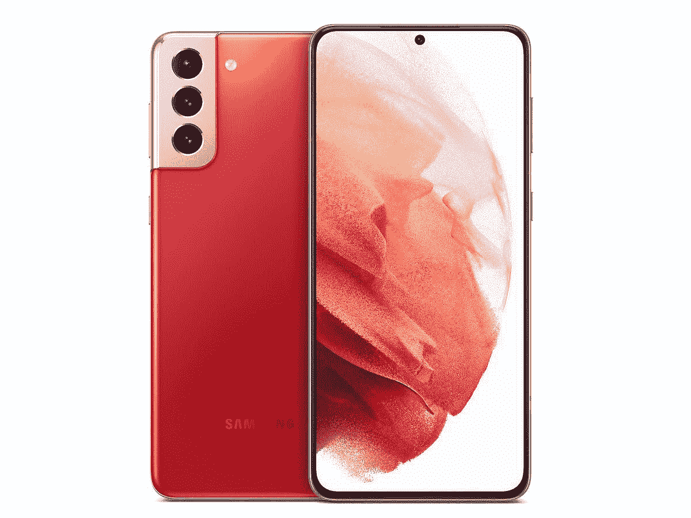

# 谷歌 Pixel 6 Pro vs 三星 Galaxy S21 Plus:应该买哪个顶级旗舰？

> 原文：<https://www.xda-developers.com/google-pixel-6-pro-vs-samsung-galaxy-s21-plus/>

在几年的中端智能手机交易之后，谷歌凭借其新的 [Pixel 6 系列](https://www.xda-developers.com/google-pixel-6/)重返高端市场。此外，Pixel 6 Pro 是其新的旗舰机型，拥有您可以期待的所有高端功能和规格。凭借 Pixel 6 Pro，谷歌正在挑战其他旗舰智能手机，如 Galaxy S21 系列和 iPhone 13 系列。

本文将对谷歌 Pixel 6 Pro vs [三星 Galaxy S21 Plus](https://www.xda-developers.com/samsung-galaxy-s21/) (三星旗舰阵容中的老二)进行坑，看看这两款手机如何相互抗衡。

**浏览本指南:**

## 谷歌 Pixel 6 Pro vs 三星 Galaxy S21 Plus:规格

| 

规格

 | 

Pixel 6 Pro

 | 

三星 Galaxy S21 Plus

 |
| --- | --- | --- |
| **尺寸和重量** | 

*   163.9 x 75.9 x 8.9 毫米
*   210g

 | 

*   161.5 x 75.6 x 7.8 毫米
*   202 克

 |
| **显示** | 

*   6.71 英寸 LTPO AMOLED
*   QHD+ (1400 x 3120)
*   居中打孔机
*   120Hz 显示器刷新率
*   HDR10+支持
*   高亮度模式
*   1600 万色的全 24 位深度
*   大猩猩玻璃 Victus

 | 

*   6.7 英寸 FHD+动态 AMOLED 2X 平板显示器
*   居中打孔机
*   HDR10+支持
*   120 赫兹刷新率
*   大猩猩玻璃 Victus

 |
| **SoC** | 

*   谷歌张量八核芯片组

 | 

*   高通骁龙 888 SoC/ Exynos 2100

 |
| **RAM 和存储器** | 

*   12GB LPDDR5 内存
*   128GB/256GB/512GB UFS 3.1 闪存存储

 | 

*   8GB LPDDR5 RAM
*   128GB/256GB UFS 3.1 存储

 |
| **电池&充电** | 

*   5000 毫安时电池
*   30W 快速充电
*   23W 快速无线充电

 | 

*   4800 毫安时电池
*   25W 快速有线充电
*   15W 快速无线充电

 |
| **后置摄像头** | 

*   主要:50MP，f/1.8，三星 GN1 传感器，OIS
*   辅助:12MP f/2.2 超宽相机，114 度 FOV
*   第三级:48MP f/3.5，长焦，4 倍光学变焦，20 倍数码变焦

 | 

*   小学:12MP，f/1.8，OIS
*   辅助:12MP f/2.2 超宽摄像头，120 度 FOV
*   第三级:64MP f/2.0，长焦，1.1 倍光学变焦，3 倍混合变焦

 |
| **前置摄像头** |  |  |
| **港口** |  |  |
| **连通性** | 

*   5G NR(低于 6GHz 和毫米波)
*   国家足球联盟
*   超宽带
*   蓝牙 5.2
*   WiFi 802.11 . b/g/n/AC(2.4 GHz+5 GHz)

 | 

*   5G NR(低于 6GHz 和毫米波)
*   国家足球联盟
*   蓝牙 5.0
*   WiFi 802.11 . b/g/n/ax(2.4 GHz+5 GHz)

 |
| **软件** | 

*   安卓 12
*   三年的操作系统更新
*   五年的安全更新

 | 

*   安卓 11
*   三年的操作系统更新
*   四年的安全更新

 |
| **其他特征** | 

*   光学显示下指纹读取器
*   IP68 防水防尘等级
*   立体声扬声器

 | 

*   超声波欠显示指纹传感器
*   IP68 防水防尘等级
*   立体声扬声器

 |

## 设计和展示

 <picture></picture> 

Google Pixel 6 Pro

谷歌和三星分别在 Pixel 6 Pro 和 Galaxy S21 Plus 上采用了典型的优质智能手机配方，即玻璃夹层和金属框架。也就是说，这两款智能手机看起来令人难以置信，但 S21 Plus 的制造质量和光洁度略好。

在 [Pixel 6 Pro](https://www.xda-developers.com/best-pixel-6-pro-screen-protectors/) 上，你会得到一个 6.71 英寸的 QHD+ AMOLED 屏幕，刷新率为 120Hz，而 [S21 Plus 包括一个 6.7 英寸的全高清+屏幕](https://www.xda-developers.com/best-galaxy-s21-plus-screen-protectors/)，刷新率为 120Hz。尽管屏幕尺寸相同，但 S21 Plus 的整体尺寸略小于谷歌手机，重量也轻了 10 克。

虽然 Pixel 6 Pro 的屏幕分辨率更高，但这些额外的像素肯定会缩短电池寿命。有些人可能也更喜欢 S21 Plus，因为它的显示屏很平，因为 Pixel 6 Pro 的屏幕有弯曲的边缘。

## 处理器、内存和存储

 <picture></picture> 

Samsung Galaxy S21 Plus

谷歌在 Pixel 6 Pro 中使用了其新的张量芯片，该芯片基于三星的 Exynos 2100。另一方面，三星在北美将高通骁龙 888 SoC 放在 S21 Plus 中，而世界其他地区获得 Exynos 2100 SoC。

张量和骁龙 888 都是顶级芯片。虽然骁龙可能会在原始基准测试中脱颖而出，但两种处理器的真实性能都不尽如人意。然而，你不会对这两款芯片的性能感到失望。

此外，Pixel 手机拥有 12GB 内存和高达 512GB 的存储空间。然而，S21 Plus 仅限于 8GB 内存和高达 256GB 的存储空间。

## 谷歌 Pixel 6 Pro vs 三星 Galaxy S21 Plus:相机

 <picture></picture> 

Google Pixel 6 Pro

Pixel 6 Pro 和三星 Galaxy S21 Plus 上有三个后置摄像头。Pixel 6 Pro 配备了 50MP 主摄像头(能够拍摄 12.5MP 图像)、48MP 长焦摄像头和 12MP 超宽摄像头，而 S21 Plus 配备了 12MP 主摄像头、64MP 长焦摄像头和 12MP 超宽摄像头。

Pixel 6 Pro 和其他 Pixel 手机一样，在良好和弱光条件下都能拍摄出出色的照片。它的长焦拍摄者特别棒。Galaxy S21 Plus 拍摄的照片也很棒，但其长焦相机仅支持 1.1 倍光学变焦。

## 电池、连接和操作系统

 <picture></picture> 

Samsung Galaxy S21 Plus

两款手机的电池容量没有太大区别。Pixel 6 Pro 配备了 5000 毫安时的电池，而 Galaxy S21 Plus 配备了 4800 毫安时的电池。因此，对于重度用户来说，这两款手机都可以轻松坚持一天，中度用户甚至可以获得大约一天半的电池寿命。

两款手机的快速充电能力也差不多。虽然 Pixel 宣传的快速充电速度为 30W，但在现实生活中，它最多只能管理 23W。而三星 Galaxy S21 Plus 则支持 25W 有线充电。也就是说，尽管有 23W 的快速充电，Pixel 6 Pro 仍然需要近两个小时，才能从零到 100%。

在连接方面，S21 Plus 和 Pixel 6 Pro 都支持美国三大运营商-美国电话电报公司、T-Mobile 和威瑞森的毫米波和低于 6GHz 的 5G。

Pixel 6 Pro 在软件方面得分很高，因为这款手机自带 Android 12，并将获得三年的软件更新和五年的安全补丁。相比之下，你在 S21 Plus 上获得了 Android 11，但手机已经获得了 Android 12 更新。它还将获得三年的 Android 更新和四年的安全补丁。

## 价格和颜色选项

 <picture></picture> 

Google Pixel 6 Pro

Pixel 6 Pro 在定价部门比 S21 Plus 稍有优势。谷歌手机起价 899 美元，而 S21 Plus 的零售价为 999 美元。

就颜色而言，谷歌手机有暴风雨黑、云白和有点阳光的颜色。另一方面，您可以购买幻影黑、幻影银、幻影紫、幻影金和幻影红颜色的 S21 Plus。

## 谷歌 Pixel 6 Pro vs 三星 Galaxy S21 Plus:结论

 <picture></picture> 

Samsung Galaxy S21 Plus

除了奇怪的差异，Pixel 6 Pro 和 Galaxy S21 Plus 的堆叠相当均匀。但是，如果你用长焦相机拍摄许多照片，如股票 Android，并且想要一个 QHD+分辨率的屏幕， [Pixel 6 Pro 是一个很好的选择](https://www.xda-developers.com/best-google-pixel-6-pro-deals/)。

然而，如果你想要骁龙 888 芯片，更喜欢三星 S21 Plus 相机的过饱和高亮度外观，三星手机对你来说更有意义，特别是如果[你可以在交易](https://www.xda-developers.com/best-galaxy-s21-deals/)中得到它。

* * *

你打算买哪部手机？请在评论区告诉我们。与此同时，我们还为 [Pixel 6 Pro](https://www.xda-developers.com/best-pixel-6-pro-screen-protectors/) 和 [Galaxy S21 Plus](https://www.xda-developers.com/best-galaxy-s21-plus-screen-protectors/) 挑选了最佳案例。

 <picture></picture> 

Stormy Black

Pixel 6 Pro 是 Pixel 6 系列中较大的兄弟姐妹，它配备了谷歌新的张量芯片、现代设计和一个额外的长焦摄像头。

 <picture></picture> 

Samsung Galaxy S21 Plus

##### 三星 Galaxy S21 Plus

三星 Galaxy S21 Plus 是 2021 年新旗舰系列中的老二，集旗舰 SoC 和高级构建于一身，配有体面的显示屏和摄像头设置。