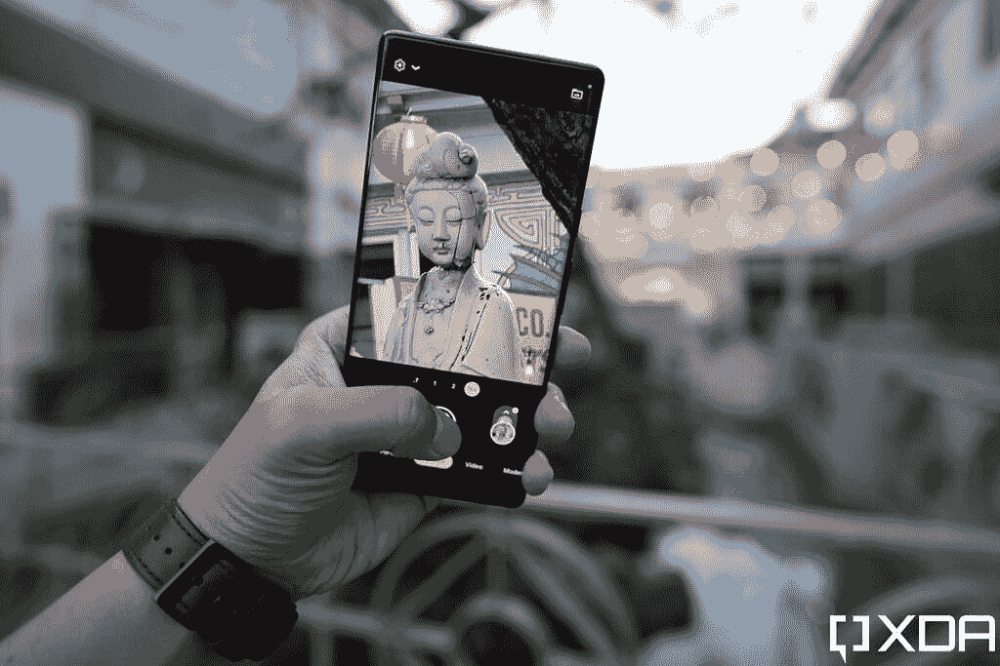
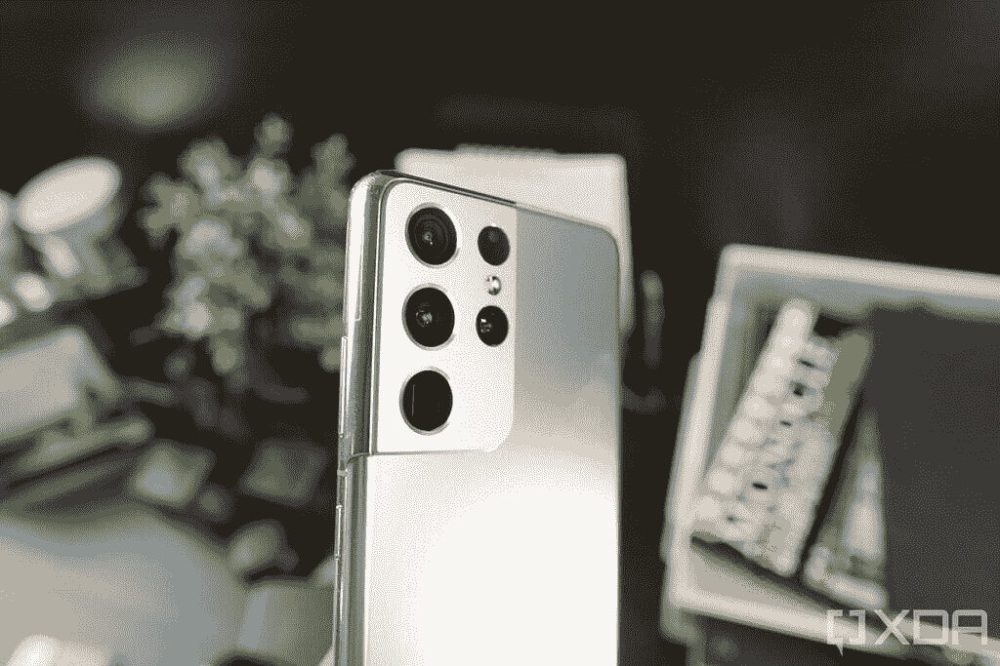
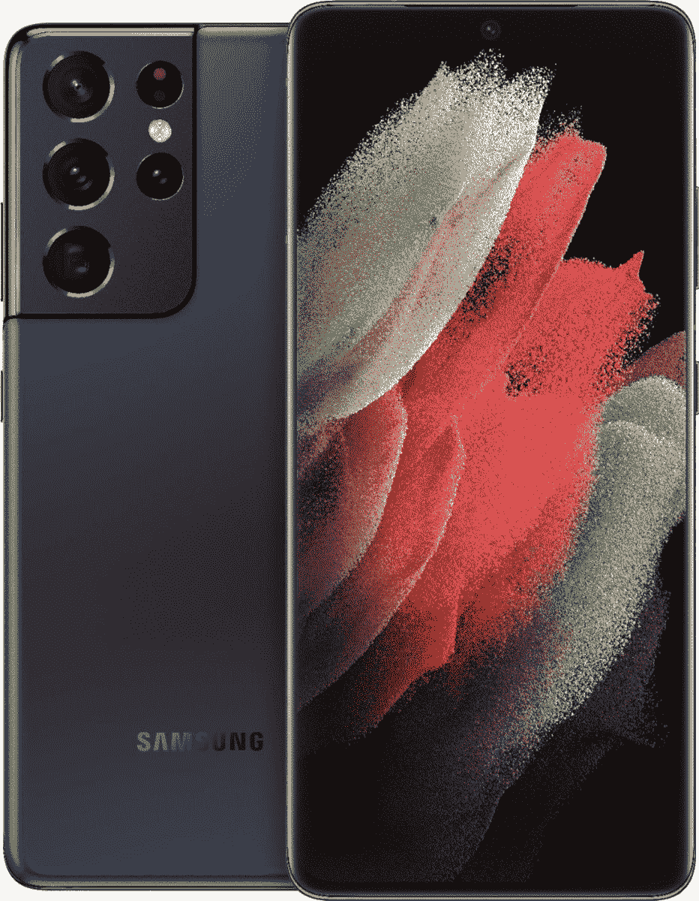

# 谷歌 Pixel 6 Pro vs 三星 Galaxy S21 Ultra:买哪款手机？

> 原文：<https://www.xda-developers.com/google-pixel-6-pro-vs-samsung-galaxy-s21-ultra/>

在推出中端产品 Pixel 5 之后，Pixel 6 Pro 将谷歌带回了旗舰讨论中。该公司表示，它花了数年时间进行研发，最终推出了 Pixel 6 和 Pixel 6 Pro。正如我们在[谷歌 Pixel 6 Pro 评测](https://www.xda-developers.com/google-pixel-6-pro-review/)中提到的，这是一款出色的日常手机，提供可靠的日常性能，并拥有出色的摄像头。Pixel 6 Pro 有很多值得喜欢的地方，但它与同类产品中的其他智能手机相比如何？在本文中，我们将看看谷歌 Pixel 6 Pro 与[三星 Galaxy S21 Ultra](https://www.xda-developers.com/samsung-galaxy-s21-ultra-preview-five-takeaways/) 的对比，看看哪个更好。

Galaxy S21 Ultra 可能不是三星的最新旗舰，因为我们现在已经有了 [Galaxy S22 Ultra](https://www.xda-developers.com/samsung-galaxy-s22-ultra-review/) 戴上了那顶皇冠。但归根结底，它仍然是一款“超”手机，是该公司移动技术的绝对巅峰。因此，即使它已经存在一年了，你仍然可以在不花大钱的情况下获得很好的体验。让我们深入比较一下，看看两者中哪一个更好，好吗？

**浏览此比较:**

## 谷歌 Pixel 6 Pro vs 三星 Galaxy S21 Ultra:规格

在我们开始比较之前，让我们快速浏览一下它们的规格，看看每款手机都有哪些特点:

| 

**规格**

 | 

**谷歌 Pixel 6 Pro**

 | 

**三星 Galaxy S21 Ultra**

 |
| --- | --- | --- |
| **构建** | 

*   铝制中框
*   大猩猩玻璃 Victus 回
*   大猩猩玻璃 Victus 正面

 | 

*   铝制中框
*   大猩猩玻璃 Victus 回
*   大猩猩玻璃 Victus 正面

 |
| **尺寸&重量** | 

*   163.9 x 75.9 x 8.9 毫米
*   210g

 | 

*   165.1 x 75.6 x 8.9 毫米
*   229 克

 |
| **显示** | 

*   6.71 英寸 LTPO AMOLED
*   QHD+ (1400 x 3120)
*   居中打孔机
*   120Hz 显示器刷新率
*   HDR10+支持
*   高亮度模式
*   1600 万色的全 24 位深度
*   大猩猩玻璃 Victus
*   始终显示

 | 

*   6.8 英寸 QHD+动态 AMOLED 2X 曲面显示屏
*   3200 x 1440 像素
*   515 磅每英寸
*   120Hz 可变刷新率
*   支持 120 赫兹 QHD+频率
*   10-120 赫兹
*   20:9 宽高比
*   1500 尼特峰值亮度
*   HDR10+
*   始终显示
*   无限显示

 |
| **SoC** | 

*   谷歌张量八核芯片组
*   泰坦 M2 安全芯片

 | 

*   **国际:** Exynos 2100:
    *   1x ARM Cortex X1 @ 2.9GHz +
    *   3 个 ARM Cortex A78 内核，2.8GHz 以上
    *   4 个 ARM Cortex A55 内核@ 2.2GHz
*   美国:高通骁龙 888:
    *   1 个 Kryo 680 Prime 内核@ 2.84GHz
    *   3 个 Kryo 680 性能内核@ 2.4GHz
    *   4 个 Kryo 680 高效内核@ 1.8GHz

 |
| **风筒&储存** | 

*   12GB LPDDR5 内存
*   128GB/256GB/512GB UFS 3.1 闪存存储

 | 

*   12GB LPDDR5 + 128GB UFS 3.1 闪存存储
*   12GB + 256GB
*   16GB + 512GB

 |
| **电池&充电** | 

*   5000 毫安时电池
*   30W 快速充电
*   23W 快速无线充电
*   反向无线充电
*   USB 供电 3.0

 | 

*   5000 毫安时
*   25W 快速充电
*   15W 无线充电
*   4.5 反向无线充电
*   USB 供电 3.0
*   在大多数地区，包装盒中没有充电器

 |
| **安全** | 

*   光学显示下指纹读取器

 | 

*   超声波显示指纹扫描仪

 |
| **后置摄像头** | 

*   主摄像头:5000 万像素 f/1.8 OIS 三星 GN1 主摄像头
*   辅助:12MP f/2.2 超宽相机，114 度 FOV
*   第三级:48MP f/3.5，长焦，4 倍光学变焦，20 倍数码变焦
*   视频:4K@30/60fps，1080p@30/60/120/240fps

 | 

*   主要:108 MP，广角镜头，f/1.8，79，24 毫米，1/1.33 英寸，0.8 米(诺娜宁滨之前)，OIS，PDAF，激光自动对焦
*   次要:12 MP，超广角镜头，f/2.2，120 FoV，13 毫米，1/2.55 英寸，1.4 米，双像素自动对焦
*   第三代:1000 万像素，长焦镜头，f/2.4，35，72 毫米，1/3.24 英寸，1.22 米，OIS，3 倍光学变焦，双像素自动对焦
*   四进制:1000 万像素，长焦镜头，f/4.9，10，240 毫米，1/3.24 英寸，1.22 米，OIS，10 倍光学变焦，双像素自动对焦
*   视频:8K@24fps，4K@30/60fps，1080p@30/60/240fps，720p@960fps，HDR10+

 |
| **前置摄像头** | 

*   1110 万像素 f/2.2
*   视频:4K@30/60fps，1080p@30fps

 | 

*   40MP，f/2.2，0.7 米，80 FoV，PDAF
*   4K@30fps，1080p@30/60fps

 |
| **端口** | USB 3.1 类型 C | USB 3.2 类型 C |
| **音频** | 立体声扬声器 | 

*   AKG 的立体声扬声器
*   杜比大气

 |
| **连通性** | 

*   5G NR(低于 6GHz 和毫米波)
*   国家足球联盟
*   超宽带
*   蓝牙 5.2
*   C 型端口
*   WiFi 802.11 . b/g/n/AC(2.4 GHz+5 GHz)

 | 

*   蓝牙 5.1
*   国家足球联盟
*   Wi-Fi 6E
*   5G

 |
| **软件** | 

*   安卓 12
*   三年的操作系统更新
*   五年的安全更新

 | 基于 Android 11 的三星 One UI 3.1 |
| **其他功能** | 

*   IP68 防水防尘等级
*   超宽带

 | 

*   IP68 防水等级
*   蚂蚁+
*   三星 DeX
*   诺克斯
*   超宽带
*   Bixby 语音助手
*   谷歌探索窗格
*   Wacom 手写笔和 S Pen 支持(单独销售，外部存储)
*   某些地区的 MST 支持

 |

正如你所见，谷歌 Pixel 6 Pro 和三星 Galaxy S21 Ultra 在规格上不相上下。当然，两者之间有一些值得注意的差异，但似乎这两款手机都提供了全面的体验。让我们更深入地研究一下各个部分，看看您会得到什么。

## 设计和制造质量:两款外观独特的手机

让我们从设计开始吧。多年来，谷歌的 Pixel 手机凭借古怪的纹理和有趣的配色成功脱颖而出。虽然该公司这次遵循了其他 Android 原始设备制造商的惯例，提供了典型的玻璃和金属夹层板，但我们认为 Pixel 6 Pro 仍然具有非常独特的设计。它有三种颜色——多云的白色、有点阳光的黑色和暴风雨的黑色，所有这些颜色的背面都有一个黑色的相机遮光板，里面装有手机的相机传感器。这是一个相当大的凸起，但我们更喜欢它穿过整个设备，而不是只在一侧突出。Pixel 6 Pro 在使用时不会在桌子上晃动。

与普通的 Pixel 6 不同，Pixel 6 Pro 的正面有一个弯曲的显示屏，顶部有一个中心对齐的打孔摄像头和一个可见的下巴。电源按钮在手机的右侧，音量摇杆的上方。左侧有一个 SIM 卡托盘，底部有一个 USB 3.1 Type-C 端口，位于扬声器格栅旁边。Pixel 6 Pro 拥有我们所谓的“盒子”设计，看起来让人想起旧款 Galaxy Note 手机。设计完全是主观的，但我们真的很喜欢 Pixel 6 Pro 的外观。

另一方面，三星 Galaxy S21 Ultra 也是一款外观非常独特的手机。在设计方面，我们认为它比 Galaxy S20 Ultra 有了很大的改进。新的“轮廓切割”相机模块为手机增添了更多的个性，我们也喜欢它如何无缝融入铝框架。它仍然是一个巨大的摄像头，所以当你的手机平放在桌子上时肯定会抖动。三星 Galaxy S21 Ultra 有许多不同的配色可供购买——幻影灰色、幻影白色和三星网络商店独家幻影钛、幻影海军和幻影棕色。

不过，总的来说，Galaxy S21 Ultra 看起来和感觉上都像三星的其他旗舰产品。如果你是来自一个较小的平板显示器手机，前面有一个巨大的 6.8 英寸曲面显示器，可能需要一段时间来适应。Galaxy S21 Ultra 在显示屏顶部有一个居中的打孔摄像头，它还有一个可见的下巴。音量摇杆和电源按钮在左侧，但值得指出的是，电源按钮在音量摇杆下方，不像谷歌 Pixel 6 Pro。你可以在底部找到一个 USB 3.2 Type-C 端口，一边是 SIM 卡 try，另一边是扬声器格栅。Galaxy S21 Ultra 屏幕两侧的曲率更加微妙。尽管如果你使用的是平板屏幕的设备，你仍然需要习惯这一点，所以这里没有区别。

如果你看一下 Pixel 6 Pro 和 Galaxy S21 Ultra 的尺寸，你会发现这两款设备的尺寸几乎相同。它们的厚度都是 8.9 毫米，这意味着与市面上的许多手机相比，它们是相对较薄的手机。但如果你倾向于购买一部更轻的手机，那么谷歌 Pixel 6 Pro 值得考虑，因为它的重量比 Galaxy S21 Ultra 的 229 克轻了几克，只有 210 克。

至于耐用性，谷歌 Pixel 6 Pro 和 Galaxy S21 Ultra 都具有 IP68 防水和防尘性能，以及与大猩猩玻璃 Victus 相当的屏幕保护。如果你想知道，Gorilla Glass Victus 可以防止典型的碰撞和轻微跌落，但它们都是玻璃板，这意味着如果其中一个受到严重撞击，它们仍然会破裂。我们建议使用外壳来保护这些昂贵的玻璃设备，即使这样做的代价是否定每部手机的一些设计。你可以查看我们收集的[最佳谷歌 Pixel 6 Pro 保护套](https://www.xda-developers.com/best-google-pixel-6-pro-cases/)和[最佳三星 Galaxy S21 Ultra 保护套](https://www.xda-developers.com/best-galaxy-s21-ultra-cases/)，找到市场上这些手机的一些最佳保护套。

Galaxy S21 Ultra 配备了超声波显示指纹扫描仪，众所周知，该扫描仪速度快，非常可靠。谷歌 Pixel 6 Pro 还配备了光学下显示指纹扫描仪。它也是一个快速响应的扫描仪，尽管它不太可靠，特别是如果你在它上面使用屏幕保护的话。说到屏幕保护器，我们建议你看看我们收集的[最佳谷歌 Pixel 6 Pro 屏幕保护器](https://www.xda-developers.com/best-pixel-6-pro-screen-protectors/)和[最佳 Galaxy S21 Ultra 屏幕保护器](https://www.xda-developers.com/best-galaxy-s21-ultra-screen-protectors/)，找到一些很好的选择。

综合考虑，可以肯定地说，谷歌 Pixel 6 Pro 和 Galaxy S21 Ultra 是我们多年来见过的最好看的手机。与前代产品相比，这两款产品在设计上都有显著变化。两款手机都有自己独特的方式，我们认为它们也易于握持和使用，尽管它们的外形尺寸相对较大。最后，值得一提的是，Galaxy S21 Ultra 还支持 S Pen 手写笔。不过，它不是包装的一部分，而且设备本身也没有储存它的空腔。这意味着你必须单独购买并存放在室外。

## 显示:QHD+显示与 LTPO 在两个手机上

谷歌 Pixel 6 Pro 使用三星的显示技术来对抗 Galaxy S21 Ultra 的 6.7 英寸 QHD+ (3120x1440 像素)LTPO 有机发光二极管显示屏。谷歌为 Pixel 6 Pro 引入了自适应刷新率，然而，值得指出的是，这款手机使用的是第一代 LTPO，这意味着它只能在 10Hz 到 120Hz 之间移动。Galaxy S21 Ultra 为其配备了 6.8 英寸 WQHD+ (3200x1440 像素)LTPO 动态 AMOLED 2X 显示屏，也可以在 10Hz 到 120Hz 之间移动。包括 Galaxy S22 Ultra 在内的新款手机采用了 LTPO 2.0 显示屏，刷新率可以在 1 赫兹到 120 赫兹之间变化。尽管在这次比较中没有一款手机支持这种功能，但请记住这一点。

Galaxy S21 Ultra 拥有约 515 PPI 的 20:9 纵横比面板，而谷歌 Pixel 6 Pro 拥有约 512 PPI 的 19.5:9 纵横比面板。看着这些数字，可以肯定地说，当谈到清晰度时，它们几乎是不可区分的。如果有什么不同的话，那就是 Galaxy S21 Ultra 的优势，因为它的显示屏略大。这两款手机的显示屏顶部都有一个居中对齐的打孔摄像头，这也是我们多年来已经习惯的东西。值得注意的是，这两款显示器都支持 HDR10+和“永远在线显示器”。你可以阅读我们对这些手机的全面评论，以获得更多关于显示器的信息。

## 内部硬件:谷歌张量 vs Exynos &骁龙

就内部硬件而言，Pixel 6 Pro 的所有型号都采用了谷歌张量八核芯片组。谷歌张量是该公司第一个定制的移动芯片组，它是专门为谷歌 Pixel 6 Pro 制作的。然而，就 Galaxy S21 Ultra 而言，芯片组因地区而异——在美国和其他几个地区，它使用骁龙 888，在世界其他地区，它使用三星自己的 Exynos 2100 芯片组。两款手机的基本版本都装有 12GB 的 LPDDR5 内存和 128GB 的 UFS 3.1 存储空间。在最高端，Pixel 6 Pro 拥有 12GB 内存和 512GB 存储空间，而 Galaxy S21 Ultra 则拥有高达 16GB 内存和 512GB 存储空间。

最后，Galaxy S21 Ultra 和谷歌 Pixel 6 Pro 都配备了 5000 毫安时的电池。我们预计这两款手机都可以轻松使用一整天，不会出现任何问题，但根据使用情况，您的里程数可能会有所不同。Galaxy S21 Ultra 通过 USB PD 3.0 支持 25W 快速充电，而谷歌 Pixel 6 Pro 通过 USB PD 3.0 支持高达 30W 的快速充电。这两款手机都支持无线充电，尽管 Pixel 6 Pro 的速度也更快，最高可达 23W 的快速无线充电，而 Galaxy S21 Ultra 的无线充电功率为 15W。这两款设备也可以反向无线充电，但不用说，它不会像标准无线充电速度那样快。Galaxy S21 Ultra 的另一个值得指出的地方是，在大多数地区，它的包装盒中都没有充电器。谷歌尚未跟随这一趋势，所以你确实可以在 Pixel 6 Pro 的包装盒中获得一个充电器。

## 相机:Galaxy S21 Ultra 拥有更先进的相机系统

你可能已经知道，谷歌的 Pixel 智能手机因其摄像头而得到认可。谷歌 Pixel 6 Pro 在相机硬件方面与旧的 Pixel 设备有很大的不同。背面的相机遮阳板容纳了手机的 50MP 三星 GN1 主相机，12MP 超宽相机和 48MP 长焦相机。三星 GN1 相机传感器与 Vivo X70 Pro Plus 的传感器相同，所以我们已经知道这个传感器的能力。如果你不知道我们在说什么，那么一定要看看我们的[谷歌 Pixel 6 Pro 和 Vivo X70 Pro Plus 相机对比](https://www.xda-developers.com/google-pixel-6-pro-vs-vivo-x70-pro-plus-camera-shootout-comparison/)，看看这个初级传感器能做什么。

 <picture></picture> 

Pixel 6 Pro showing 16x zoom on the viewfinder

三星 Galaxy S21 Ultra 采用了四摄像头设置，包括一个 108 MP 广角镜头，一个 12 MP 超广角镜头和两个 10MP 长焦镜头，每个镜头都投影到一个 1/3.24 英寸的传感器上，像素为 1.22 m。主要的 108MP 传感器是一个 f/1.8 射手，带有一个大的 1/1.33”传感器，产生 0.8 m 大像素的图像。然后手机将这些像素中的九个合并成一个像素(非宁滨)，给你一个 12MP 的输出和 240 万的大像素。在长焦镜头的情况下，Galaxy S21 Ultra 使用其中两个镜头来提供两个不同级别的光学变焦。第一个是 10MP f/2.4 拍摄器，提供 3 倍光学变焦，第二个是 10MP f/4.9 拍摄器，提供 10 倍光学变焦。这两种镜头都具有 OIS 功能。

 <picture></picture> 

Samsung Galaxy S21 Ultra's "contour cut" camera module

就前置摄像头而言，Pixel 6 Pro 的自拍摄像头为 11.1MP f/2.2，Galaxy S21 Ultra 的自拍摄像头为 40MP f/2.2。在视频方面，Pixel 6 Pro 可以用后置摄像头录制 4K@30/60fps 和 1080p@30/60/120/240fps。另一方面，自拍相机只能做到 4K@30/60fps 或 1080p@30fps。Galaxy S21 Ultra 在视频录制能力方面更胜一筹。除了 4K@30/60fps 和 1080p@30/60/240fps，Galaxy S21 Ultra 还可以做到 8K@24fps 和 720p@960fps。值得注意的是，它还支持 HDR10+视频录制。Galaxy S21 Ultra 上的 40MP 自拍相机可以进行 4K@30fps 和 1080p@30/60fps。

我们在下面添加了一些从谷歌 Pixel 6 Pro 和 Galaxy S21 Ultra 拍摄的相机样本。我们强烈建议您查看我们对每款手机的详细评论，找到更多相机样本，甚至视频录制样本，以更好地了解每款手机的功能。

**谷歌 Pixel 6 Pro 相机样品:**

**三星 Galaxy S21 Ultra 相机样品:**

## 谷歌 Pixel 6 Pro vs 三星 Galaxy S21 Ultra:该买哪个？

Galaxy S21 Ultra 可能不是市场上最新的三星旗舰产品，但我们认为它在 2022 年仍然表现不错。这两款设备都以合理的价格提供了一流的设计和制造质量。我们认为它们看起来都非常独特，所以我们将由您来决定您最喜欢哪一个。每部手机上的显示器也非常相似，无论是物理尺寸还是刷新率、亮度等规格。就像其他旗舰设备一样，在日常使用中，你不会对这些设备的性能感到失望。当然，当谈到基准测试时，您肯定会看到一些差异，但这不应该是一个问题，因为它们都提供了很好的用户体验。

Galaxy S21 Ultra 和谷歌 Pixel 6 Pro 都有强大的相机硬件，但我们认为 Galaxy S21 Ultra 的先进相机系统由于这些长焦镜头而更加通用，支持高达 10 倍的光学变焦和 100 倍的数字变焦。谷歌 Pixel 6 Pro 在这方面有点不足，因为它只能进行 4 倍光学变焦和 20 倍数码变焦。也就是说，我们建议您在做出购买决定之前，查看我们对这些手机的评论，看看一些相机样品。

就软件而言，这两款设备现在都运行 Android 12，即使 Galaxy S21 Ultra 是在开箱即用 Android 11 的情况下推出的。当 Galaxy S21 Ultra 运行在基于 Android 12 的一个 UI 4 上时，您可以通过 Pixel 6 Pro 获得清晰的像素体验。谷歌承诺长达三年的操作系统更新和长达五年的安全更新，而 Galaxy S21 Ultra 则承诺总共获得四次 Android 操作系统升级，这相当不错。这又一次取决于你的个人喜好，因为每一个手机操作系统版本都有其独特之处。

 <picture></picture> 

Google Pixel 6 Pro

谷歌 Pixel 6 Pro 是谷歌最新、最伟大的旗舰智能手机，它有很多令人喜爱的地方。它并不完美，但肯定是迄今为止最好的谷歌手机。

 <picture></picture> 

Samsung Galaxy S21 Ultra

三星 Galaxy S21 Ultra 是 2021 年新旗舰系列中的终极杀手锏，集旗舰 SoC、高级构建、出色的显示屏和令人惊叹的相机设置于一身，以及高级旗舰上预期的所有额外功能。

谷歌 Pixel 6 Pro 起价 899 美元，现在就可以在谷歌商店买到。Galaxy S21 Ultra 并不容易从三星获得，因为该公司目前只销售 Galaxy S21 FE。然而，你可以从包括百思买在内的第三方零售商那里购买 Galaxy S21 Ultra，起价为 1199 美元。值得指出的是，Galaxy S21 Ultra 现在经常打折，你应该预计会支付 1000 美元左右。你可以看看我们的[最佳 Galaxy S21 Ultra 交易](https://www.xda-developers.com/best-galaxy-s21-ultra-deals/)和[最佳 Google Pixel 6 Pro 交易](https://www.xda-developers.com/best-google-pixel-6-pro-deals/)，看看你是否能在购买上节省一些钱。即使算上 Galaxy S21 Ultra 的折扣价，Pixel 6 Pro 也更便宜，为大多数人提供了更多价值。Galaxy S21 Ultra 肯定比 Pixel 6 Pro 提供了一些硬件优势，但这些功能是否值得溢价取决于你。