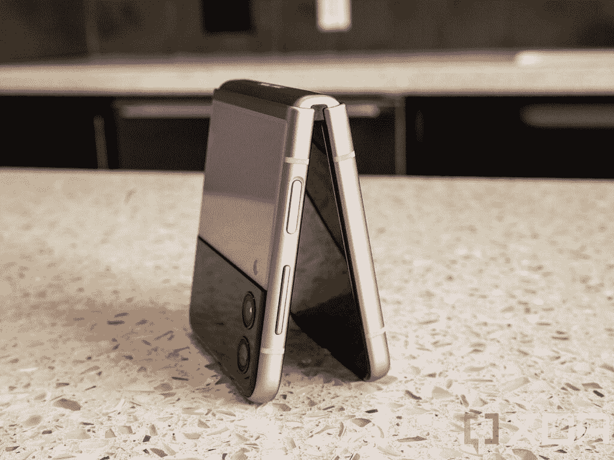
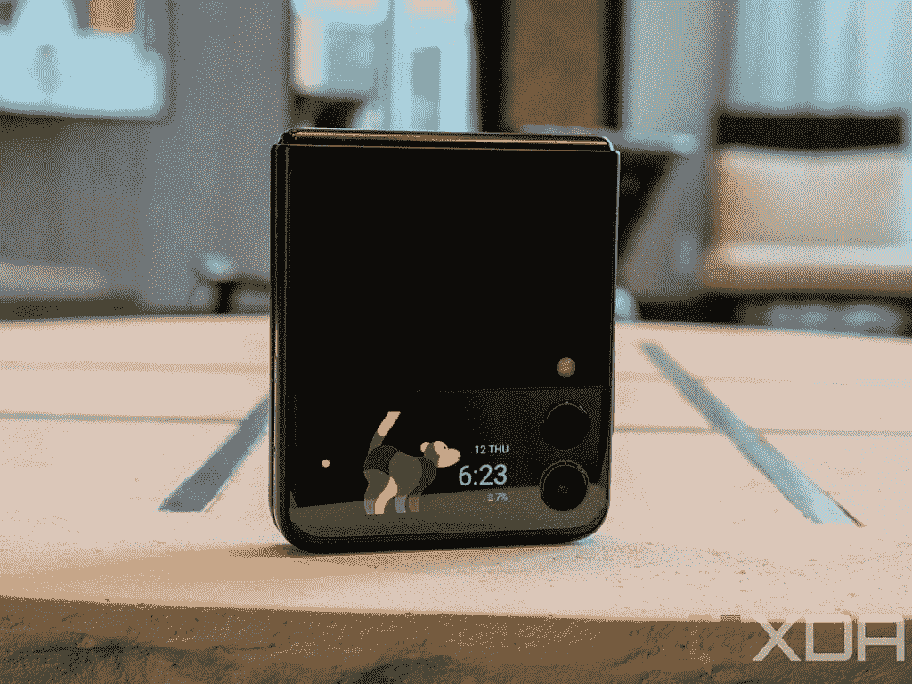

# 谷歌 Pixel 6 Pro vs 三星 Galaxy Z Flip 3:你该买哪款 900 美元旗舰？

> 原文：<https://www.xda-developers.com/google-pixel-6-pro-vs-samsung-galaxy-z-flip-3/>

Pixel 6 Pro 是谷歌的新旗舰智能手机，如果你想买一部新手机，它很可能是你的候选名单的一部分。但也有其他几款很棒的手机，包括[三星 Galaxy Z Flip 3](https://www.xda-developers.com/samsung-galaxy-z-flip-3/) 。三星 foldable 不仅试图通过其积极的定价使可折叠产品成为主流产品，而且它本身也是一款优秀的手机。

因此，在本文中，我们将对比[谷歌 Pixel 6 Pro](https://www.xda-developers.com/google-pixel-6-pro-review/) 与[三星 Galaxy Z Flip 3](https://www.xda-developers.com/samsung-galaxy-z-flip-3-review/) ，看看这两款高端智能手机如何相互抗衡。

**浏览本指南:**

## 谷歌 Pixel 6 Pro vs 三星 Galaxy Z Flip 3:规格

| 

规格

 | 

Pixel 6 Pro

 | 

三星 Galaxy Z Flip 3

 |
| --- | --- | --- |
| **尺寸和重量** | 

*   163.9 x 75.9 x 8.9 毫米
*   210g

 | 

*   72.2 x 166.0 x 6.9mm 毫米(未折叠)
*   72.2 x 86.4 x 17.1mm 毫米(铰链)-15.9 毫米(下垂)
*   183g

 |
| **显示** | 

*   6.71 英寸 LTPO AMOLED
*   QHD+ (1400 x 3120)
*   居中打孔机
*   120Hz 显示器刷新率
*   HDR10+支持
*   高亮度模式
*   1600 万色的全 24 位深度
*   大猩猩玻璃 Victus

 | 

*   6.7 英寸 FHD+动态 AMOLED 2X 柔性显示屏
*   居中打孔机
*   HDR10+支持
*   120 赫兹刷新率
*   1.9 英寸 Super AMOLED 外壳显示屏

 |
| **SoC** | 

*   谷歌张量八核芯片组

 | 

*   高通骁龙 888 足球俱乐部

 |
| **RAM 和存储器** | 

*   12GB LPDDR5 内存
*   128GB/256GB/512GB UFS 3.1 闪存存储

 | 

*   8GB LPDDR5 RAM
*   128GB/256GB UFS 3.1 存储

 |
| **电池&充电** | 

*   5000 毫安时电池
*   30W 快速充电
*   23W 快速无线充电

 | 

*   3300 毫安时电池
*   15W 快速有线充电
*   10W 快速无线充电

 |
| **后置摄像头** | 

*   主要:50MP，f/1.8，三星 GN1 传感器，OIS
*   辅助:12MP f/2.2 超宽相机，114 度 FOV
*   第三级:48MP f/3.5，长焦，4 倍光学变焦，20 倍数码变焦

 | 

*   小学:12MP，f/1.8，OIS
*   辅助:12MP f/2.2 超宽摄像头，120 度 FOV

 |
| **前置摄像头** |  |  |
| **端口** |  |  |
| **连通性** | 

*   5G NR(低于 6GHz 和毫米波)
*   国家足球联盟
*   超宽带
*   蓝牙 5.2
*   WiFi 802.11 . b/g/n/AC(2.4 GHz+5 GHz)

 | 

*   5G NR(低于 6GHz 和毫米波)
*   国家足球联盟
*   蓝牙 5.1
*   WiFi 802.11 . b/g/n/ax(2.4 GHz+5 GHz)

 |
| **软件** | 

*   安卓 12
*   三年的操作系统更新
*   五年的安全更新

 | 

*   安卓 11
*   三年的操作系统更新
*   四年的安全更新

 |
| **其他特性** | 

*   光学显示下指纹读取器
*   IP68 防水防尘等级
*   立体声扬声器

 | 

*   侧装式指纹传感器
*   IPX8 防水防尘
*   立体声扬声器

 |

## 设计和展示

 <picture></picture> 

Google Pixel 6 Pro

鉴于不同的外形，谷歌 Pixel 6 Pro 和三星 Galaxy Z Flip 3 在设计和显示上都是非常不同的手机。有了 Pixel 6 Pro，你会得到一部传统的智能手机，它采用了玻璃夹层设计，配有铝制框架。

另一方面，Galaxy Z Flip 3 是一款蛤壳式可折叠手机，采用铝制框架，柔性主屏和第二个翻盖显示屏。

由于可折叠智能手机技术还处于早期，传统智能手机仍然更耐用，但可折叠手机每一代都在变得更好。此外，有了 Galaxy Z Flip 3 这样的手机，当手机处于折叠状态时，你的占地面积要小得多，这使得它更容易随身携带。

但一旦 Galaxy Z Flip 3 展开，其高大的 6.7 英寸 AMOLED 屏幕几乎与 [Pixel 6 Pro 的 6.71 英寸 AMOLED 显示屏](https://www.xda-developers.com/best-pixel-6-pro-screen-protectors/)一样大。不过，Pixel 6 Pro 面板的分辨率更高，为 1440p。也就是说，你可以在 Z Flip 3 上获得一个额外的 1.9 英寸显示屏，以查看通知等。

## 处理器、内存和存储

 <picture></picture> 

Samsung Galaxy Z Flip 3

谷歌在 Pixel 6 Pro 中使用了张量 SoC，而 Galaxy Z Flip 3 则采用了高通骁龙 888 SoC。两者都是非常有能力的芯片，你不会发现他们在现实生活中的表现有任何问题。也就是说，骁龙 888 确实在原始基准测试中击败了张量。

此外，Pixel 6 Pro 还有 12GB 的 RAM 和高达 512GB 的存储空间。另一方面，Galaxy Z Flip 3 包括 8GB 内存和高达 256GB 的存储空间。

## 谷歌 Pixel 6 Pro vs 三星 Galaxy Z Flip 3:相机

 <picture></picture> 

Google Pixel 6 Pro

Pixel 6 Pro 背面配有三个摄像头，包括一个 50MP 主摄像头，一个 48MP 长焦摄像头和一个 12MP 广角摄像头。船上还有一个 11.1 百万像素的自拍相机。

Galaxy Z Flip 3 背面有两个摄像头——一个 12MP 主摄像头和一个 12MP 广角摄像头。此外，你还会得到一个 10MP 的自拍相机。

如你所料，Pixel 6 Pro 在相机部门大放异彩。这款手机在标准和低光照条件下都能拍出精彩的照片。它也有一个优秀的长焦相机。Galaxy Z Flip 3 拍摄的照片很好，但在像素上不够出色。这款手机的低光相机性能也不是像素级别，而且手机上没有长焦拍摄器。

如果手机摄影是你的优先选择，Pixel 6 Pro 是比 Galaxy Z Flip 3 好得多的选择。

## 电池、连接和操作系统

 <picture></picture> 

Samsung Galaxy Z Flip 3

电池是 Pixel 6 Pro 比 Galaxy Z Flip 3 更有优势的另一个领域。它配备了 5,000mAh 电池，支持 30W(实际上是 23W)快速有线充电支持，而 Z Flip 3 的 3,300mAh 电池支持 15W 快速充电。

因此，虽然 Pixel 6 Pro 在适度使用的情况下可以持续一天半，但你在三星手机上只能获得一天的备份。

在连接方面，谷歌和三星手机都包括 5G 支持、NFC、Wi-Fi 6(Pixel 上的 Wi-Fi 6e)和蓝牙。

谈到软件，谷歌手机开箱即可运行 Android 12，并将获得三年的操作系统更新和五年的安全更新。Z Flip 3 安装了 Android 11，也将获得三年的操作系统更新，但只有四年的安全补丁。

## 价格和颜色选项

 <picture></picture> 

Google Pixel 6 Pro

与许多起价 1000 美元左右的现代旗舰不同，谷歌的 Pixel 6 Pro 定价颇具侵略性。这款手机的起价仅为 899 美元，有三种颜色可供选择——暴风雨黑、多云白和阳光白。

三星 Galaxy Z Flip 3 是迄今为止最实惠的可折叠产品，起价为 999 美元。此外，折叠式还有四种颜色可供选择——奶油色、幻影黑、绿色和淡紫色。

## 谷歌 Pixel 6 Pro vs 三星 Galaxy Z Flip 3:结论

 <picture></picture> 

Samsung Galaxy Z Flip 3

如果我们暂时忘记外形因素，谷歌 Pixel 6 Pro 在几乎所有方面都似乎是比 Galaxy Z Flip 3 更好的智能手机。因此，如果你正在考虑这两款手机，很大程度上取决于你是否准备好进入可折叠的世界。

如果翻盖可折叠的想法吸引了你，并且你不太担心它的耐用性或相机功能，Galaxy Z Flip 3 是有意义的。但是如果你需要绝对最好的摄像头，并且不想担心手机的耐用性，那么你最好选择 Pixel 6 Pro。

* * *

你打算买哪部手机？请在评论区告诉我们。无论你决定购买哪部手机，请务必查看我们的[最佳 Pixel 6 Pro 保护套](https://www.xda-developers.com/best-google-pixel-6-pro-cases/)和[最佳 Galaxy Z Flip 3 保护套](https://www.xda-developers.com/best-samsung-galaxy-z-flip-3-cases/)指南，以保护你的设备。我们还挑选了 Pixel 6 Pro 和 Z Flip 3 的[最佳交易，以帮助您节省一些资金。](https://www.xda-developers.com/best-google-pixel-6-pro-deals/)

 <picture></picture> 

Stormy Black

Pixel 6 Pro 是 Pixel 6 系列中较大的兄弟姐妹，它配备了谷歌新的张量芯片、现代设计和一个额外的长焦摄像头。

 <picture></picture> 

Samsung Galaxy Z Flip 3

Galaxy Flip 3 是三星的新款翻盖式可折叠手机。它采用 6.7 英寸 120Hz 柔性屏幕和骁龙 888 SoC。