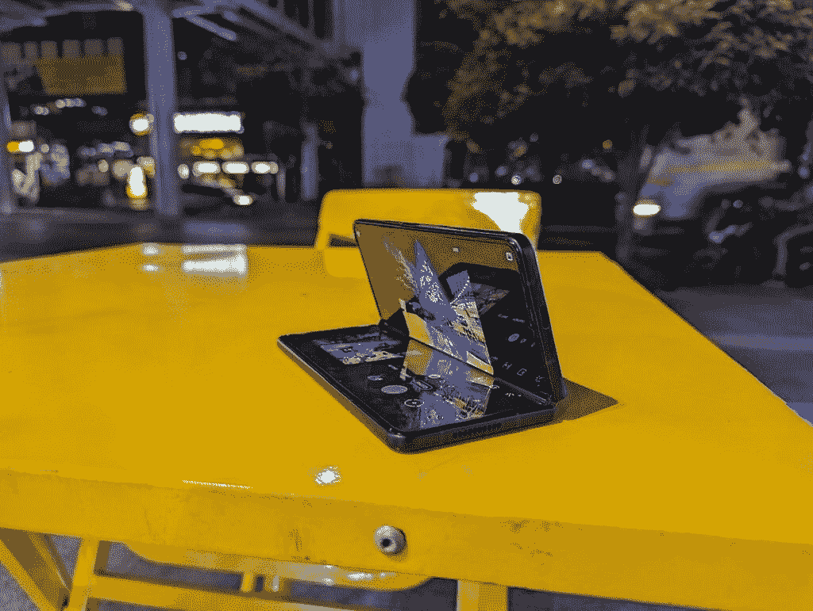

# 谷歌 Pixel 6 Pro vs 三星 Galaxy Z Fold 3:疯狂相机 vs 可折叠魔法

> 原文：<https://www.xda-developers.com/google-pixel-6-pro-vs-samsung-galaxy-z-fold-3/>

三星的 Galaxy Z Fold 系列在中国有几个有价值的挑战者，但在世界其他地方,*、*Galaxy Z Fold 实际上垄断了大型可折叠类别。这应该很快就会改变，因为有大量传言称谷歌一直在研究可折叠像素，但可惜的是，这并不意味着，因为据报道谷歌[已经取消了目前的可折叠计划](https://www.xda-developers.com/google-pixel-fold-reportedly-canceled/)。

但这并不意味着谷歌没有任何东西可以与三星的老大 [Galaxy Z Fold 3](https://www.xda-developers.com/samsung-galaxy-z-fold-3/) 竞争。 [Pixel 6 Pro](https://www.xda-developers.com/google-pixel-6/) 可能“只是”一部传统的平板手机，不会折叠或改变形状，但它仍然是一部优秀的 Android 手机——根据我们的[官方评论](https://www.xda-developers.com/google-pixel-6-pro-review/)，可以说是最好的——市场上每个新手机的人都应该考虑。如果你想买一部新手机，你应该考虑哪一部？

 <picture></picture> 

Google Pixel 6 Pro

Pixel 6 Pro 是较大的兄弟，配有谷歌的新张量芯片、现代设计和额外的远摄相机。

 <picture></picture> 

Samsung Galaxy Z Fold 3

##### 三星 Galaxy Z Fold 3

三星 Galaxy Z Fold 3 是目前最好的可折叠手机，虽然它的摄像头不如 Pixel 6 Pro，但它可以做得更多。

### 点击展开:谷歌 Pixel 6 Pro 和三星 Galaxy Z Fold 3:规格

## 谷歌 Pixel 6 Pro 和三星 Galaxy Z Fold 3:规格

| 

规范

 | 

谷歌 Pixel 6 Pro

 | 

三星 Galaxy Z Fold 3

 |
| --- | --- | --- |
| **构建** | 

*   铝制中框
*   大猩猩玻璃 Victus 正面和背面

 | 

*   铝制中框
*   大猩猩玻璃 Victus 正面和背面
*   “超薄玻璃”可折叠内屏

 |
| **尺寸&重量** | 

*   163.9 x 75.9 x 8.9 毫米
*   210 克

 | 

*   展开后:158.2 x 128.1 x 6.4 毫米
*   折叠后:158.2 x 67.1 x 14.4-16 毫米

 |
| **显示** | 

*   6.71 英寸 AMOLED
*   3120 x 1440 像素
*   可变 120Hz 可变刷新率

 | 

*   展开:7.6 英寸可折叠 AMOLED
*   折叠:6.2 英寸 AMOLED

 |
| **SoC** | 谷歌张量 | 高通骁龙 888 |
| **闸板&存放** |  |  |
| **电池&充电** | 

*   5000 毫安时
*   高达 30W 的有线快速充电
*   高达 23W 的无线充电

 | 

*   4400 毫安时
*   高达 25W 的有线充电
*   高达 11W 的无线充电

 |
| **安全** | 光学显示指纹读取器 | 侧装电容式指纹读取器 |
| **后置摄像头** | 

*   **初级:** 50MP 宽，三星 GN1，f/1.57，1/1.31”
*   **二级:** 12MP 超宽，f/2.2
*   48MP 潜望镜，f/3.5

 | 

*   **主:** 12MP 宽，f/1.8 光圈
*   **次要:** 12MP 超宽，f/2.2 光圈
*   **第三:** 12MP 长焦，2 倍光学变焦，f/2.4

 |
| **前置摄像头** | 11MP | 

*   10MP，f/2.2 光圈
*   4MP，f/1.8，显示不足

 |
| **港口** | USB-C | USB-C |
| **音频** | 立体声扬声器 | 立体声扬声器 |
| **连通性** | 

*   5G(毫米波)
*   支持 4x4 MIMO 和 LAA 的千兆级 LTE
*   支持 2x2 MIMO 的 Wi-Fi 6 (802.11ax)
*   蓝牙 5.0
*   国家足球联盟

 | 

*   5G(低于 6 GHz 和毫米波)
*   支持 4x4 MIMO 和 LAA 的千兆级 LTE
*   支持 2x2 MIMO 的 Wi-Fi 6 (802.11ax)
*   蓝牙 5.0
*   国家足球联盟

 |
| **软件** | 安卓 12 | Android 11 之上的一个 UI 3.1 |
| **其他功能** | 双物理 SIM | 单一物理 SIM |

***关于这篇评测:**这篇对比是在测试了 XDA 购买的一台谷歌 Pixel 6 Pro 和三星提供的一台 Galaxy Z Fold 3 之后写的。谷歌爱尔兰公司确实向我的同事亚当·康威提供了一个 Pixel 6 Pro 审查单元，但它没有用在这一块。这两家公司在这篇文章中都没有任何投入。*

* * *

## 谷歌 Pixel 6 Pro vs 三星 Galaxy Z Fold 3:设计和硬件

这两款手机都非常出色，在同类产品中名列前茅。Pixel 6 Pro 拥有精确的触觉，使打字成为一种乐趣，还有一个弯曲的有机发光二极管屏幕，可以无缝融入铝制机箱。我的灰色变体在我看来有点沉闷(至少在我给手机背面的一部分涂上亮橙色皮肤之前)，但我近距离看过其他颜色，它们看起来很漂亮。

但 Galaxy Z Fold 3 只是在另一个层面上展示了令人瞠目结舌的尖端硬件。这是一个迷你平板电脑，对折后成为一个电视遥控器形状的智能手机。在使用了第一款 Galaxy Fold 之后，我仍然对三星在短短两年内成功实现的利润感到惊讶。Z Fold 3 的铰链非常稳定，允许设备保持半折叠状态，并在任何角度保持静止。折叠式塑料有机发光二极管屏幕虽然仍然比真正的玻璃屏幕模糊，但感觉不如第一个折叠式的屏幕塑料。尽管有这些活动部件，三星还是设法增加了 IPX8 防水等级。

Pixel 6 Pro 显然更容易握持，机身更弯曲，更薄(8.9 毫米，折叠时 Galaxy Z Fold 3 的 14 毫米)，重量更轻(210 克，Z Fold 3 的 273 克)，但 Galaxy Z Fold 3 可能是一款更好的单手手机，因为在折叠形式下，它现在与水平方向一样宽。无论哪种方式，你可能会想得到这些情况下，因为他们仍然主要是由玻璃制成。对于 [Galaxy Z Fold 3](https://www.xda-developers.com/best-samsung-galaxy-z-fold-3-cases/) 和 [Pixel 6 Pro](https://www.xda-developers.com/best-google-pixel-6-pro-cases/) ，有很多很棒的选择。

这两款手机都是精心打造的，但 Galaxy Z Fold 3 只是在另一个层面上展示了令人惊叹的尖端硬件

这两款手机都配备了 120Hz 的显示屏(三星有两个)，虽然我认为 Pixel UI 的动画比三星的 One UI 更好地利用了 120Hz，但 Z Fold 3 的屏幕变得更亮了。

在大脑方面，Pixel 6 Pro 运行在张量上，广泛宣传为谷歌自己自主设计的 SoC，但具有讽刺意味的是，张量与三星的 Exynos 芯片有着密切的联系。而且更讽刺的是，Galaxy Z Fold 3 根本没有使用三星自己的 Exynos 芯片。相反，它运行在骁龙 888 上，因为高通拥有美国使用的所有关键 CDMA 专利。所以在某种程度上，Pixel 6 Pro 的大脑比 Galaxy Z Fold 3 的大脑包含更多三星零件。

张量和骁龙 888 都是非常强大的芯片。后者有更多的原始能力，但前者在处理语言和照片的机器学习任务方面更智能。

人们对 2021 年旗舰手机的其他所有期望都可以在这些设备中找到:出色的立体声扬声器系统、无线充电、NFC、最新的蓝牙标准和大电池(Pixel 6 Pro 上的 5,000 mAhGalaxy Z Fold 3 上的 4,400 mAh)。

* * *

## 谷歌 Pixel 6 Pro vs 三星 Galaxy Z Fold 3:相机

谷歌 Pixel 6 Pro 比以前的 Pixel 带来了重大的相机硬件升级:三镜头主系统由一个 50MP GN1 传感器(再次讽刺的是，来自三星)和一个大型图像传感器组成，可以捕捉浅景深的清晰有力的图像。这个功能强大的主拍摄镜头两侧是一个 48MP 潜望镜变焦镜头，可以拍摄清晰的 4 倍光学变焦照片，以及一个 12MP 超宽镜头。正面周围是一个 11MP 自拍相机。

谷歌 Pixel 6 Pro 比以前的 Pixel 带来了重大的相机硬件升级

另一方面，Galaxy Z Fold 3 的相机硬件相对普通:三个 12MP 传感器，覆盖广角、超广角和长焦范围，同时有两个自拍相机(每个屏幕一个):一个 10MP 的相机位于外盖屏幕上，一个 4MP 的自拍相机位于折叠显示屏下。

这里的三重 12MP 主系统是从去年的 Z Fold 2 回收的，在技术上甚至不如三星 18 个月前发布的标准非 Ultra Galaxy S20。

然而，正如谷歌在过去几年中证明的那样，相机性能不仅仅是硬件，Z Fold 3 的相机仍然很好。事实上，大多数普通用户在真空中可能不会有任何抱怨。但是相比 Pixel 6 Pro 呢？Z Fold 3 的相机几乎在每个领域都有所欠缺。在低光照片中，Pixel 6 Pro 始终能够找到更好的曝光，无论是主摄像头还是超宽摄像头。

对于变焦照片，同样的事情——这并不奇怪，因为 Pixel 6 Pro 的潜望镜变焦是 Z Fold 3 的 2 倍长焦变焦。

Galaxy Z Fold 3 击败 Pixel 6 Pro 的地方有两个:Galaxy Z Fold 3 的超宽明显更宽(Pixel 的超宽几乎不能称之为超宽)。而且 Galaxy Z Fold 3 的折叠机身赋予了它更多的灵活性，比如可以充当自己的三脚架。只要你能找到一个平坦的表面来放置 Galaxy Z Fold 3，它就可以自己“直立”并拍摄，而 Pixel 6 Pro 则需要靠着什么东西支撑。

 <picture></picture> 

The Z Fold 3 serving as its own tripod.

* * *

## 谷歌 Pixel 6 Pro vs 三星 Galaxy Z Fold 3:软件

在我写这篇文章的时候，我的解锁版 Galaxy Z Fold 3 仍然在 Android 11 上运行，上面是三星的 One UI 3.1.1。虽然三星已经开始在测试阶段推出带有一个 UI 4 的 Android 12，但还不知道我的 Fold 3 何时会真正得到它。

当然，Pixel 6 Pro 没有这种担忧，并且开箱即用 Android 12。作为谷歌自己的设备，它将永远是第一批运行最新版本 Android 的设备。这里运行的 Android 12 也不是普通的 Android，而是谷歌可能为 Pixel 保留的独家版本。正如我的同事亚当·康威[在最近的一篇文章](https://www.xda-developers.com/material-you-monet-theme-engine/)中解释的那样，Pixel 6 Pro 的 Android 12 非常强调审美定制，因此手机的用户界面可以有一点个性和创意。

仅仅从外观上看，我更喜欢 Pixel 6 Pro 的软件，而不是三星的。我喜欢贯穿整个 Pixel UI 的可定制颜色，我喜欢异想天开的动画(它们比大多数 Android 皮肤更容易压缩和反弹，可能小米的 MIUI 除外)，大的切换按钮和圆角部件。相比之下，三星的 One UI 看起来有点平淡。

在额外的功能方面，每个 UI 交易都很糟糕。我喜欢 Pixel 可以自动识别在我附近播放的音乐，并在始终打开的显示屏上显示歌曲名称。Pixel 出奇准确的语音听写改变了我使用 WhatsApp 的方式(我现在主要通过语音而不是打字来回复)。但 Galaxy Z Fold 3 具有更好的多任务处理能力，我不只是说它有更大的屏幕。三星的 One UI 不仅允许我以分屏模式打开应用程序，还允许我在一个浮动的、可调整大小的窗口中打开应用程序。这意味着我可以轻松使用两个应用程序。Pixel 6 Pro 只提供分屏多任务处理，没有浮动窗口那么自由。

* * *

## 谷歌 Pixel 6 Pro vs 三星 Galaxy Z Fold 3:一般性能和日常使用

我断断续续使用 Galaxy Z Fold 3 已经超过三个月了，至少有一个月的时间是作为我的主要手机使用的。与此同时，Pixel 6 Pro 在过去一个月里一直是我的日常司机。我对性能没有什么大的抱怨，因为两款手机都运行稳定，表现基本符合预期。每一个都有 12GB 的内存，应用程序运行速度很快，即使我在后台有十几个。

Galaxy Z Fold 3 内部的骁龙 888 拥有比张量略强的 GPU，但我在游戏时没有注意到任何差异——尽管无可否认，我是一个轻度手机游戏玩家。我认为三星有一点是正确的，那就是它将 Galaxy Z Fold 3 的存储空间从 256GB 开始，而不是 Pixel 6 Pro 的 128GB。2021 年只有 128GB，感觉不足以维持未来两年，特别是因为 Pixel 的相机如此之好，它会诱使你拍摄更多照片。

我不时会注意到 Pixel 6 Pro 上的错误，比如应用程序崩溃，或者在我解锁手机后指纹传感器灯仍然亮着。但是这种情况很少发生。Galaxy Z Fold 3 在运行无问题方面更加完美。然而，Pixel 6 Pro 的相机系统更好，电池寿命也更长。Pixel 6 Pro 一次充电可以持续完成一整天 13 个小时的工作，而 Galaxy Z Fold 3 在我的使用中只能坚持 13 个小时——到第 12 个小时时，它的电量通常会下降到 10%以下。

不幸的是，对任何使用过其他中国手机的人来说，给两部手机充电都会感觉很慢。Pixel 6 Pro 有线充电 30W，无线充电 23W，Z Fold 3 分别充电 20W，11W。与小米或一加手机提供的 50-60W 无线充电相比，这些数字很慢。我整夜给手机充电，所以这不是什么大问题。但是，如果你需要在晚上 12 点之前充值，请准备好盛装坐在那里，比小米或 Oppo 用户多等 20 分钟。

Pixel 6 Pro 改变了我使用智能手机相机的方式，Galaxy Z Fold 3 改变了我使用智能手机的方式

最终，将这两款手机作为购买指南进行比较有点棘手，因为它们的外形如此不同。对我来说，Pixel 6 Pro 几乎是平板手机目前能达到的最好水平——除了明显较慢的显示指纹传感器。我知道有些人觉得它有点太大了，但是这个尺寸对我来说很合适。从手感到 UI 流畅性，从相机性能到续航，我在这里没什么好抱怨的。Pixel 的相机性能和相机应用程序 UI 都非常好，这让我想拍更多的照片。

但它最终仍只是一部外形单一的平板手机。Galaxy Z Fold 3 是一款更具雄心的设备，可以做更多的事情。更大的屏幕(7.6 英寸)让几乎所有任务都变得更容易:游戏、观看视频、编辑 word 文档、键入长邮件、阅读文章、浏览谷歌地图，一切都在更大的屏幕上变得更好。

Galaxy Z Fold 3 能够在任何角度保持半折叠状态(三星称之为“Flex Mode”)，这也增加了另一层多功能性。只要有一个平面，我就可以使用 Galaxy Z Fold 3 进行免提视频通话或给自己拍照，而无需让陌生人帮忙拿着相机。我可以拍摄延时视频，不需要三脚架，也不用把手机支撑在什么东西上。因此，虽然 Pixel 6 Pro 改变了我使用智能手机相机的方式，但 Galaxy Z Fold 3 改变了我使用智能手机的方式。

* * *

## 谷歌 Pixel 6 Pro vs 三星 Galaxy Z Fold 3:结论

在过去的一周里，我一直带着这两款手机，不知道我更喜欢哪一款。Pixel 6 Pro 可能是我目前最喜欢使用的平板电脑，因为它结合了出色的相机性能、强劲的电池续航时间、身临其境的(无缺口)屏幕和好看的用户界面。但是由于它还是一部普通的手机。Galaxy Z Fold 3 感觉更多。对于我这个经常在路上工作的技术爱好者来说，由于键盘更大，打字速度更快，或者在分屏模式下运行两个应用程序而不需要眯着眼睛，或者在观看视频时在一个小的浮动窗口中运行正在进行的 WhatsApp 对话，这让我感到敬畏，并提醒我为什么可折叠仍然是绝对的未来。

但是现在，可折叠的价格仍然很高，所以对大多数人来说，Pixel 6 Pro 是更明智的选择。

 <picture></picture> 

Google Pixel 6 Pro

Pixel 6 Pro 是较大的兄弟，配有谷歌的新张量芯片、现代设计和额外的远摄相机。

 <picture></picture> 

Samsung Galaxy Z Fold 3

##### 三星 Galaxy Z Fold 3

三星 Galaxy Z Fold 3 是目前最好的可折叠手机，虽然它的摄像头不如 Pixel 6 Pro，但它可以做得更多。