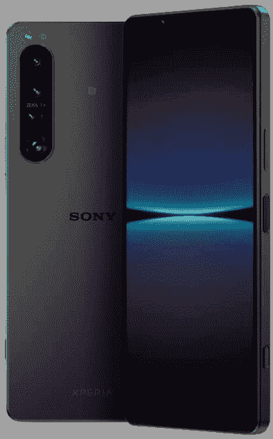

# 谷歌 Pixel 6 Pro vs 索尼 Xperia Pro 1 四:应该买哪款相机智能手机？

> 原文：<https://www.xda-developers.com/google-pixel-6-pro-vs-sony-xperia-1-iv/>

谷歌 Pixel 6 Pro 和 T2 索尼 Xperia 1 IV 是两款独特的旗舰产品，几乎在每个领域都形成了鲜明的对比，从设计和显示到摄影方法。对于那些不想选择主流选项的人来说，它们是很好的选择，例如[三星 Galaxy S22 Ultra](https://www.xda-developers.com/samsung-galaxy-s22-ultra-review/) 或[一加 10 Pro](https://www.xda-developers.com/oneplus-10-pro-review/) 。Pixel 6 Pro 于去年发布，而索尼 Xperia 1 IV 于今年 5 月上市。如果你很难决定哪一个最适合你，请继续阅读，现在是时候用最好的相机硬件之一来与计算摄影王对抗手机了。

## 谷歌 Pixel 6 Pro Vs 索尼 Xperia 1 IV:规格

| 

**规格**

 | 

谷歌 Pixel 6 Pro

 | 

索尼 Xperia 1 IV

 |
| --- | --- | --- |
| **构建** | 

*   铝制中框
*   大猩猩玻璃 Victus 正面和背面
*   IP68 等级

 | 

*   金属和玻璃夹层
*   大猩猩玻璃 Victus 正面和背面
*   IP68 等级

 |
| **尺寸&重量** | 

*   163.9 x 75.9 x 8.9 毫米
*   210g

 |  |
| **显示** | 

*   6.7 英寸有机发光二极管
*   1,440 x 3,120 像素
*   HDR10+认证
*   60Hz 到 120Hz 之间的可变刷新率

 | 

*   6.5 英寸 4K 有机发光二极管 HDR (3840 x 1644)
*   120 赫兹刷新率
*   240Hz 触摸采样率
*   100% DCI-P3
*   HDR BT.2020(建议 2020)
*   D65 白点
*   21:9 宽高比
*   康宁大猩猩玻璃 Victus

 |
| **SoC** |  | 

*   **骁龙 8 创 1**
    *   1x ARM Cortex-X2 @ 3.0GHz
    *   3 个 ARM Cortex-A710 @ 2.50GHz
    *   4x ARM Cortex-A510 @ 1.80GHz
*   Adreno 730 GPU
*   4 纳米工艺

 |
| **风筒&储存** | 

*   8GB/12GB 内存
*   128GB/256GB/512GB UFS 3.1 存储

 | 

*   12GB 内存
*   256GB/512GB 存储空间

 |
| **电池&充电** | 

*   5，004 毫安时电池
*   30W 快速有线充电
*   无线充电
*   不含充电器

 | 

*   5000 毫安时电池
*   30W 快速充电器(包装盒内)
*   无线充电
*   反向无线充电

 |
| **安全** | 光学显示器内指纹传感器 | 侧装式指纹扫描仪 |
| **后置摄像头** | 

*   主要:50MP 主要，f/1.9，1/1.31 英寸，OIS，装箱
*   中学:12MP 超宽，f/2.2
*   第三:48MP 潜望镜，4 倍光学变焦

 | 

*   摄像机设置:
    *   **主** : 12MP，f/1.7，24mm，1/1.7”，1.8 m，OIS，双像素 PDAF
    *   **辅助** : 12MP 超宽，f/2.2，16mm，1/2.6”，双像素 PDAF
    *   **三级** : 12MP 潜望镜，f/2.3-2.8，85mm-125mm，OIS，双像素 PDAF
    *   **四元** : 3D iToF 传感器
*   特点:
    *   蔡司光学
    *   120fps 读出速度(所有镜头)
    *   20fps 自动对焦/自动曝光跟踪连拍，带降噪功能(所有镜头)
    *   60fps 连续自动对焦/自动曝光计算
    *   实时眼睛自动对焦(所有镜头)

 |
| **前置摄像头** | 11MP，f/2.2/1.22μm | 12MP |
| **端口** | 

*   USB 类型-C
*   没有耳机插孔
*   没有 microSD 卡插槽

 | 

*   USB 类端口
*   3.5 毫米耳机插孔
*   专用 microSD 卡插槽

 |
| **音频** |  | 

*   全音域前置立体声扬声器
*   杜比大气
*   高分辨率音频
*   360°真实音频(通过扬声器)
*   360°空间声音(通过耳机)

 |
| **连通性** | 

*   5G:非独立(NSA)，独立(SA)，Sub6 / mmWave
*   LTE:增强型 4×4 MIMO，最高 7CA，LTE Cat.20
*   wi-Fi 802.11 a/b/g/n/AC/ax(2.4/5/6 GHz)
*   蓝牙 v5.2
*   国家足球联盟
*   GPS，伽利略，GLONASS，北斗

 | 

*   5G(低于 6Hz)
*   蓝牙 5.x
*   802.11 a/b/g/n/ac 双频 WiFi
*   国家足球联盟
*   全球定位系统，GLONASS，伽利略

 |
| **软件** | 

*   带 Pixel 启动器的 Android 12

 | 

*   开箱即用的 Android 12

 |
| **其他功能** | 

*   单一物理 SIM
*   承诺四大 Android 操作系统更新
*   五年的安全补丁

 | 

*   MicroSD 卡支持
*   专用相机快门按钮

 |

## 设计与展示

设计是 Pixel 6 Pro 和索尼 Xperia 1 IV 最大也是最显著的区别。Pixel 6 Pro 给人的感觉是一款大胆、引人注目的设备，拥有所有的曲线和鲜艳的颜色。相比之下，索尼 Xperia 1 IV 看起来就像一片没有涂黄油的烤面包一样无聊。

自第一代 Xperia 1 II 推出以来，索尼的设计几乎没有什么变化。如果你将 Xperia 1 II、Xperia、Xperia 1 III 和 Xperia 1 IV 并排放置，你很难发现任何明显的差异。Xperia 1 IV 是一个矩形的玻璃和金属平板，具有窄纵横比和无凹槽显示屏。背面有一个矩形的摄像头带，而右边的框架是电源按钮、音量键和专用快门按钮的所在地。

Pixel 手机在设计部门一直都很独特和有趣，Pixel 6 Pro 当然是谷歌有史以来最好看的设备。双色播放和类似遮阳板的大矩形条是 Pixel 6 Pro 的突出元素，使手机鹤立鸡群，并赋予它一点个性。

索尼 Xperia 1 IV 和 Pixel 6 Pro 都支持高刷新率有机发光二极管显示器。Pixel 6 Pro 拥有 6.71 英寸 LTPO AMOLED 显示屏，具有 QHD+分辨率，支持 HDR10+和居中打孔。

Xperia 1 IV 采用 6.5 英寸 4K 有机发光二极管显示屏，分辨率为 3840 x 1644，高宽比为 21:9。该面板没有切口或缺口，所以你得到了完整的不显眼的看法。尽管听起来令人印象深刻，但在一个小小的智能手机屏幕上实现 4K 分辨率有些过头了。即使是并排比较，你也不太可能发现 QHD 面板和 4K 面板之间的差异。但是，是的，如果你想在智能手机上阅读 4K·HDR 的内容，Xperia 1 IV 是市场上唯一可以做到这一点的设备。

还有，Xperia 1 IV 面板比 Pixel 6 Pro 更亮，所以在晴天室外使用会更容易。总的来说，我们认为 Xperia 1 IV 的面板比 Pixel 6 Pro 更好。它更亮，没有缺口，分辨率更高。

* * *

## 摄像机

Pixel 6 Pro 和索尼 Xperia 1 IV 都是以相机为中心的设备。Pixel 6 Pro 提供了三摄像头设置，具有 50MP f/1.9 三星 GN1 主传感器，114 度视野的 12MP 超宽摄像头，以及 48MP 具有 4 倍光学变焦的潜望镜镜头。Pixel 6 Pro 还提供了几个简洁的相机技巧，如魔法橡皮擦、动作平移、真实色调和天体摄影模式。

**Pixel 6 Pro 相机样本**

索尼 Xperia 1 IV 有三个 12MP 拍摄器。有一个等效焦距为 24 毫米的 12MP 主拍摄镜头，一个 12MP 超宽拍摄镜头，一个 12MP 潜望式变焦镜头，可以在 85 毫米(3.5 倍)和 125 毫米(5.2 倍)之间平滑切换不同的焦距。最后，还有一个用于收集深度数据的 ToF 传感器。这三款镜头都提供了 120fps 的读取速度，实时眼睛自动对焦，20fps 的 HDR 连拍，以及 60fps 的连续自动对焦和自动曝光计算。

**索尼 Xperia 1 IV**

毫无疑问，这两款设备都配备了一些令人印象深刻的相机硬件。然而，当谈到他们的摄影方法时，有一个明显的区别。虽然 Pixel 6 Pro 在很大程度上依赖于计算摄影和后期处理，但 Xperia 1 IV 让你坐在驾驶座上，并让你对拍摄的最终输出有更大的控制权。

对于大多数普通用户来说，Pixel 6 Pro 是最好的选择。得益于其惊人的计算摄影能力，Pixel 6 Pro 在所有光线条件下都能持续拍摄出出色的照片。这是[最好的傻瓜相机智能手机](https://www.xda-developers.com/best-smartphone-cameras/)之一，一次惊人的点击所需的努力非常低。

然而，如果你是一名知道自己在做什么的摄影师或内容创作者，你可能会从 Xperia 1 IV 中获得更多收益，因为它给了你复杂的手动相机控制和对图像输出的更多控制。你不再让人工智能为你选择正确的设置——相反，你自己做，这种手动控制有一定的自由。

* * *

## 表演

两款手机在处理包方面也有所不同。Pixel 6 Pro 使用谷歌的内部张量 SoC，该 SoC 是专为手机开发和优化的。它具有两个 Arm Cortex-X1 内核、两个 Cortex-A76 内核和四个 Cortex-A55 节能内核。此外，该芯片组还具有其他几个组件，用于设备上的机器学习、人工智能功能和相机处理。其中包括张量处理单元、低功耗上下文中枢、泰坦 M2 安全芯片和图像信号处理器(ISP)。

索尼 Xperia 1 IV 由高通的骁龙 8 Gen 1 驱动，具有 1 个主频为 3.0GHz 的 Arm Cortex-X1 核心，3 个主频为 2.50GHz 的 Cortex-A710 核心和 4 个主频为 1.8GHz 的 Cortex-A510 核心。芯片组配有 12GB RAM 和 256GB/512GB UFS 3.1 存储。

两款手机都有 12GB 的内存。Pixel 6 给了你三种存储选择:128GB、256GB 和 512GB，而你可以选择 256GB 或 512GB 存储的 Xperia 1 IV。

无论你选择 Pixel 还是 Xperia，你都不必担心一般的性能。两者在日常工作中都表现出色。但请注意，这两款手机在炎热的天气和重度游戏中容易过热，因为它们没有复杂的冷却系统。

* * *

## 电池和充电

Pixel 6 Pro 和 Xperia 1 IV 都装有 5000 毫安时的大电池。充电速度也是一样的，两款设备都支持 30W 的快速有线充电，这是保守的，因为我们有像一加 10 Pro 这样的手机最高可达 80W。两款设备均支持无线充电。正如你所看到的，两部手机在这个部门并驾齐驱。然而，在现实世界的性能方面，Pixel 6 Pro 占据上风。这主要是因为 Pixel 6 Pro 的 QHD 面板比 Xperia 的 4K 面板对电池的负担轻。此外，Pixel 的面板支持 LTPO 技术，这允许它将显示刷新率降低到 10Hz 以节省电力。

* * *

## 谷歌 Pixel 6 Pro vs 索尼 Xperia 1 IV:你该买哪个？

如你所见，Pixel 6 Pro 和索尼 Xperia 1 IV 是两款有能力的旗舰，拥有强大的摄像头。但如果非要选一个的话，那就是 Pixel 6 Pro。谷歌 Pixel 6 Pro 是大多数主流买家的完美旗舰。它看起来很棒，有一个漂亮的显示屏，它的相机性能是最好的之一。再加上谷歌令人惊叹的软件支持和四个有保证的操作系统更新，你就有了一笔非常划算的交易。

 <picture></picture> 

Sony Xperia 1 IV

##### 索尼 Xperia 1 IV

索尼 Xperia 1 IV 是一款强大的专注于相机的旗舰产品，拥有令人惊叹的 4K 显示屏和高通骁龙 8 Gen 1 芯片组。

 <picture></picture> 

Google Pixel 6 Pro

谷歌 Pixel 6 Pro 运行在谷歌内部的张量 SoC 上，并装有强大的摄像头。

然而，如果你不介意 1600 美元的高昂价格和 3.5 音频插孔、无凹槽显示屏、微型 SD 卡插槽和手动相机控制等超值功能，Xperia 1 IV 是一个不错的选择。