# 谷歌 Pixel 6 Pro vs Vivo X70 Pro Plus:相机枪战和比较

> 原文：<https://www.xda-developers.com/google-pixel-6-pro-vs-vivo-x70-pro-plus-camera-shootout-comparison/>

我有幸测试了许多智能手机。显然，我接触过 iPhones、三星 Galaxies 和 OnePluses of the world，但因为我住在中国南部的香港，我也能接触到一些不知名的亚洲发布的产品，比如[的 Royole FlexPai 2](https://www.xda-developers.com/royole-flexpai-2-preview/) 或[的徕卡 Leitz 1。毫不夸张地说，我已经拿到了今年发布的所有与智能手机相关的产品。所以当我说 Vivo X70 Pro Plus 是我几周前测试过的最好的拍照手机时，我真的是认真的。因为我的参考点不仅仅是通常的苹果和三星的两三款手机。相反，我指的是苹果和三星的十几款旗舰产品...加上索尼、小米、华为、Honor、OPPO、一加、魅族、徕卡、摩托罗拉、夏普、微软、联想、中兴。](https://www.xda-developers.com/leica-leitz-phone-1-preview/)

但即使在我撰写 Vivo 文章的时候，我也加入了一个主要挑战者即将到来的警告——谷歌 Pixel 6 Pro。现在，在最终拿到 Pixel 6 Pro 并对其相机进行测试之后，我可以说 Pixel 6 系列不负众望，无愧于我之前授予它的特殊地位。

但是谷歌 Pixel 6 Pro 比 Vivo X70 Pro Plus 好吗？这就是我们要在这篇文章中发现的。不管是什么情况，我现在都很喜欢这一点:虽然 Galaxy S21 Ultra 仍然拥有最通用的相机系统，但就拍摄照片而言，在所有条件下都保持良好的效果*，谷歌 Pixel 6 Pro 和 Vivo X70 Pro Plus 被我评为智能手机上最好的两个相机。*

 *<picture>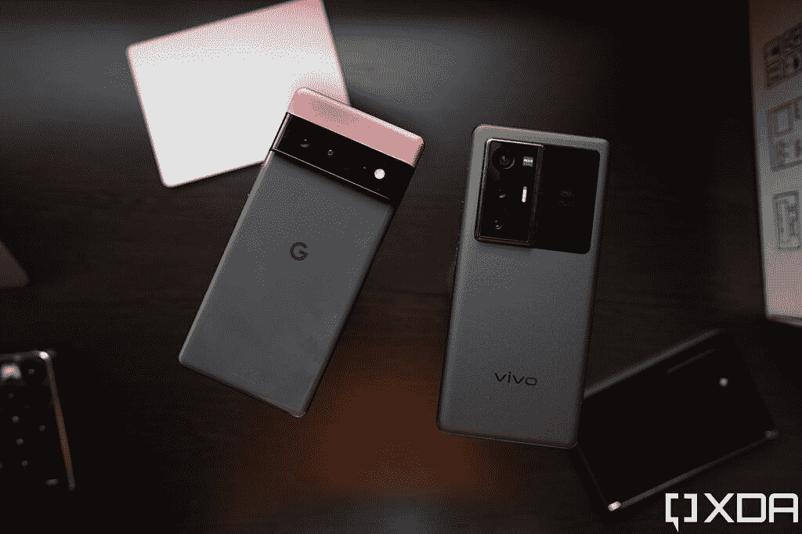</picture> 

The Google Pixel 6 Pro and the Vivo X70 Pro+ (the bright orange accent on the Pixel 6 Pro is a skin — the original color was deep grey just like the rest of the body).

 <picture></picture> 

Google Pixel 6 Pro

Pixel 6 Pro 是较大的兄弟，配有谷歌的新张量芯片、现代设计和额外的远摄相机。

 <picture></picture> 

Vivo X70 Pro Plus

##### Vivo X70 Pro Plus

Vivo X70 Pro Plus 配备了一个 50MP 主摄像头，配有一个 1/1.31 英寸的大型图像传感器，以及一个 48MP 超宽摄像头，外加两个变焦镜头。这是一个庞大的摄像系统。

### 点击展开:谷歌 Pixel 6 Pro 和 Vivo X70 Pro Plus:规格

## 谷歌 Pixel 6 Pro 和 Vivo X70 Pro Plus:规格

| 

规范

 | 

谷歌 Pixel 6 Pro

 | 

Vivo X70 Pro Plus

 |
| --- | --- | --- |
| **构建** | 

*   铝制中框
*   大猩猩玻璃 Victus 回
*   大猩猩玻璃 Victus 正面

 | 

*   铝制中框
*   大猩猩玻璃 Victus 回
*   大猩猩玻璃 Victus 正面

 |
| **尺寸&重量** | 

*   163.9 x 75.9 x 8.9 毫米
*   210 克

 | 

*   164.5 x 75.2 x 8.9 毫米
*   209 克

 |
| **显示** | 

*   6.71 英寸 AMOLED
*   3120 x 1440 像素
*   可变 120Hz 刷新率

 | 

*   6.78 英寸 AMOLED
*   3200 x 1440 像素
*   可变 120Hz 刷新率

 |
| **SoC** | 谷歌张量 | 高通骁龙 888+。 |
| **内存&存储** |  |  |
| **电池&充电** | 

*   5003 毫安时
*   高达 30W 的有线快速充电
*   高达 23W 的无线充电

 | 

*   4500 毫安时
*   55W 有线快速充电(充电器包含在包装盒中)
*   50W 无线充电

 |
| **安全** | 光学显示指纹读取器 | Opticall 显示屏指纹识别器 |
| **后置摄像头** | 

*   **主要:** 50MP 宽，三星 GN1，f/1.9，1/1.31 英寸
*   **二级:** 12MP 超宽，f/2.2
*   第三级: 48MP 潜望镜，f/3.5

 | 

*   **主要:** 50MP 宽，三星 GN1，f/1.57，1/1.31 英寸，OIS
*   **次要:** 48MP 超宽，索尼 IMX 598，f/2.2，万向技术
*   **第三:** 12MP 长焦，索尼 IMX 663，f/1.6，2x 光学
*   **四元:** 8MP 潜望镜，f/3.4，5 倍光学变焦

 |
| **前置摄像头** | 11MP | 32MP |
| **端口** | USB-C | USB-C |
| **音频** | 立体声扬声器 | 立体声扬声器 |
| **连通性** | 

*   5G(毫米波)
*   支持 4x4 MIMO 和 LAA 的千兆级 LTE
*   支持 2x2 MIMO 的 Wi-Fi 6 (802.11ax)
*   蓝牙 5.0
*   国家足球联盟

 | 

*   5G(毫米波)
*   支持 4x4 MIMO 和 LAA 的千兆级 LTE
*   支持 2x2 MIMO 的 Wi-Fi 6 (802.11ax)
*   蓝牙 5.0
*   国家足球联盟

 |
| **软件** | 安卓 12 | 顶部装有 FunTouch OS 12 的 Android 12 |
| **其他特性** | 双物理 SIM | 双物理 SIM 或双 eSIM 支持 |

***关于这篇评测:**这篇相机评测是在测试了一台从 XDA 购买的谷歌 Pixel 6 Pro 和一台从 Vivo 借来的 Vivo X70 Pro Plus 近两周之后撰写的。谷歌确实为 XDA 提供了一个 Pixel 6 Pro 审查单元，但它是由我的同事亚当·康威在爱尔兰提供的，没有用于这次审查。谷歌和 Vivo 都没有对这次相机拍摄和比较的内容进行任何投入。*

## 谷歌 Pixel 6 Pro vs Vivo X70 Pro Plus:主摄像头

Pixel 6 Pro 发布前令人兴奋的部分原因是，众所周知，谷歌终于将其主要相机硬件升级到了同一款三星 ISOCELL GN1 传感器，该传感器已被几家中国品牌使用，效果很好，其中最显著的是 Vivo。GN1 是一个强大的 50MP 传感器，具有 1/1.31 英寸的大传感器，这有助于它接受更多的光线和更浅的景深。然而，谷歌和 Vivo 将这些传感器应用于不同的光学。

在 Pixel 6 Pro 上，GN1 传感器配有 f/1.9 光圈和明显更紧的大约 25 毫米的裁剪。另一方面，Vivo 采用了更快的 f/1.6 光圈(这进一步有助于进光，但反过来，你会失去快门速度的灵活性)和更宽的视野，接近 22mm 的等效视野。Vivo 的相机还获得了另一个所谓的硬件提升，因为它的镜头涂有蔡司的 T 涂层。

每部手机还使用一个新的定制“大脑”来解释这些传感器捕捉的信息。在 Pixel 6 Pro 上，我们有 Tensor，一个完整的 SoC，而在 X70 Pro Plus 上，Vivo 内置了一个定制的图像信号处理器(ISP)芯片，以配合骁龙 888+ SoC。

但是技术上的讨论已经够多了，让我们来看看照片吧。

### 主相机，光线充足的场景:颜色，动态范围，清晰度

第一个场景有很多颜色和纹理，从这些样本中，我们已经可以看到两款手机在处理颜色方面的差异。Vivo 的照片有更强烈、更生动的颜色，但它是人工调高的——场景更像 Pixel 的照片。然而，从远处看，X70 Pro Plus 的照片在视觉上对我的眼睛更有吸引力，对比度更强(伞的颜色真的很流行，然后它下面的阴影比 Pixel 的照片更深)。

但是放大到 100%和像素窥视，我们可以看到像素的镜头更清晰，更详细。

 <picture></picture> 

Pixel 6 Pro (left); X70 Pro Plus (right)

我们可以看到，Pixel 的镜头中石灰和透明塑料袋更加锐利，而 Vivo 的镜头在电话附近也有明显的噪点和颗粒。虽然 Vivo 的照片中树叶更绿，但 Pixel 的照片显示了更多细节。

 <picture>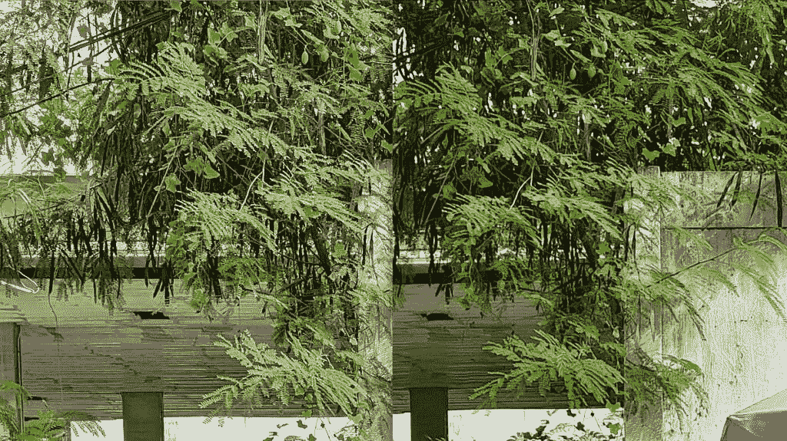</picture> 

Pixel 6 Pro (left); X70 Pro Plus (right)

转到另一个场景，趋势仍在继续:Vivo X70 Pro Plus 的颜色更流行一些，但如果你放大并检查，像素的拍摄会更清晰。像素的镜头也更酷——Vivo 的镜头白平衡更准确。

 <picture>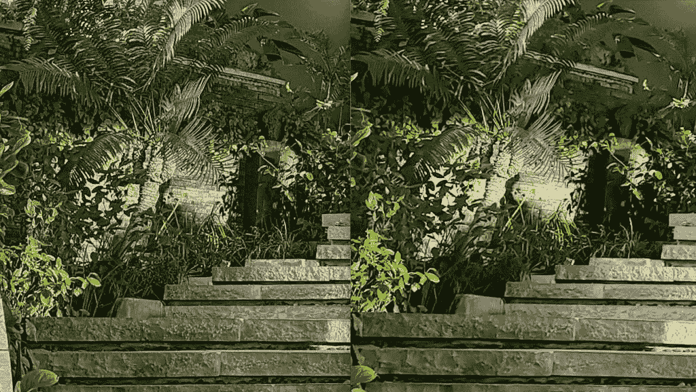</picture> 

Pixel 6 Pro (left); X70 Pro Plus (right).

下一组是一个有一些对比的场景，因为大部分镜头是在室内，但一部分暴露在一扇窗户下，阳光从侧面射进来。

我们可以看到 X70 Pro Plus 的照片更好地暴露了外部的强光。

 <picture></picture> 

Pixel 6 Pro (left); X70 Pro Plus (right)

GN1 传感器的一个强大特点是其浅景深，这意味着有一个非常美观的散景，将主体/对象从背景中分离出来。

再一次，耐克运动鞋上的红色差异是不和谐的。虽然 Vivo 的拍摄确实使鞋子变得流行，但像素拍摄的实际鞋子上的颜色更像。

 <picture>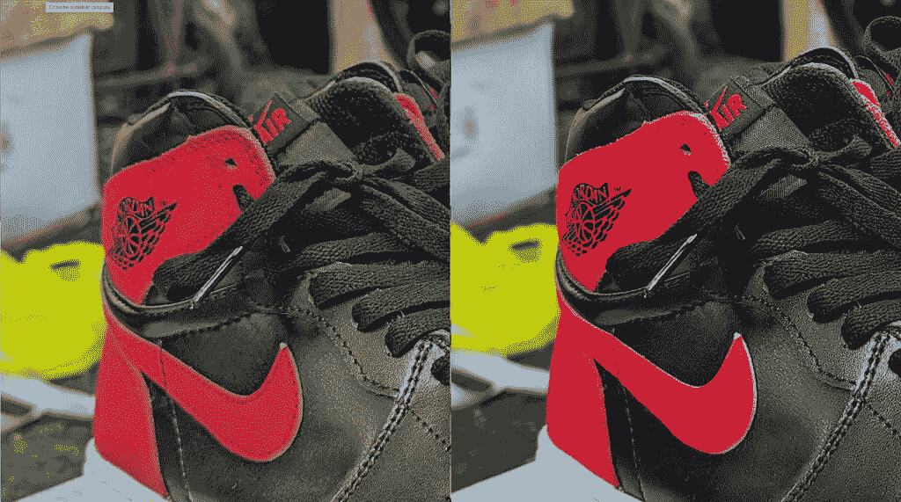</picture> 

Pixel 6 Pro (left); X70 Pro Plus (right)

焦距的减弱是自然的——因为这是真正的散景——而且对两部手机来说都是对的。

 <picture>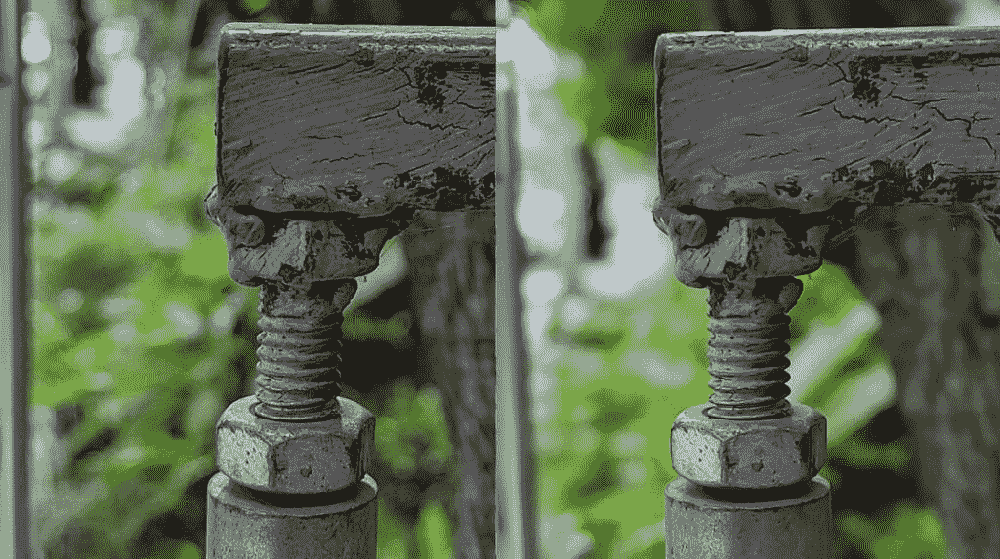</picture> 

Pixel 6 Pro (left); X70 Pro Plus (right)

当我们转向更具挑战性的高对比度场景时，Vivo 在具有对比度的场景中找到更好平衡的能力变得更加明显。

Vivo 倾向于让颜色看起来更大胆、更生动，而 Pixel 6 Pro 则更真实，但色调也更冷

上面的一组是前面提到的几个东西的一个很好的例子:Vivo 明显更宽的边框；蔡司 T 涂层有助于减少镜头眩光(请注意，阳光较少被吹散)；以及 Vivo 让颜色显得更大胆、更鲜艳的倾向。我在近两周的测试中注意到的另一个趋势是，谷歌喜欢以更冷的色调为目标，这一点在这里很明显，因为 Vivo 的照片明显更暖——也就是更黄。

也许是因为这个镜头有太多的事情发生，而且离得太远，谷歌以前在保留更好的细节方面的优势在这里已经变得无关紧要了。如果我们像素偷窥，两个镜头显示大致相同的清晰度，除了像素的镜头更嘈杂。

 <picture>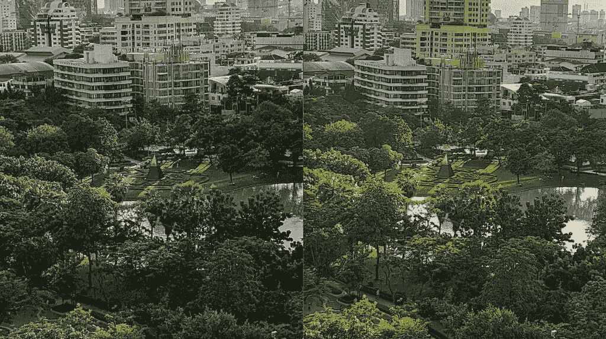</picture> 

Pixel 6 Pro (left); X70 Pro Plus (right).

 <picture>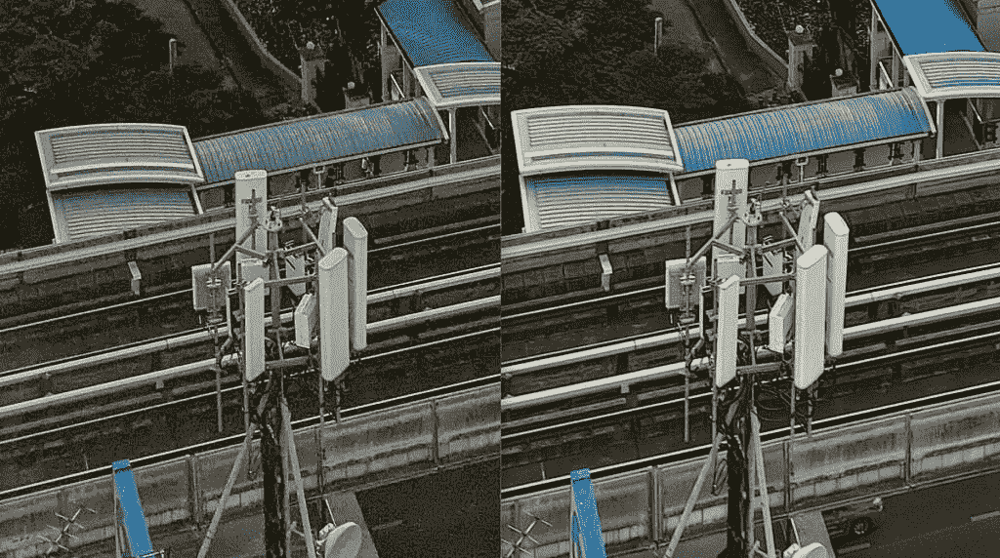</picture> 

Pixel 6 Pro (left); X70 Pro Plus (right)

下面是另一个高对比度场景，Vivo 的镜头再次有明显更大胆的颜色，更明亮的阴影。但也正如上面的设置，放大不再揭示一个更清晰的像素图像。

 <picture></picture> 

Pixel 6 Pro (left); X70 Pro Plus (right)

如果你想检查更多，下面是我捕捉到的更多样本。

### 主相机，低光场景:进光，动态范围，噪声和锐度

X70 Pro Plus 更快的 f/1.6 光圈使它能够比 Pixel 的 f/1.9 光圈自然地吸收更多的光线，然而，谷歌通过更积极和自动地使用夜间模式来平衡这一点——事实上，用 Pixel 拍摄弱光照片通常需要等待三到四秒钟(除非你特意关闭*夜视功能)，而 Vivo 的夜间模式(至少是自动模式)最多不会超过两秒钟。但我们可以看到，由于谷歌更重地使用了软件辅助(夜间模式)，所以可以拍出“更亮”的镜头。但是这总是一件好事吗？*

例如，在上面这组曼谷日落后不久在高架火车站台上拍摄的照片中，我们可以看到右侧的树木和下面的街道被明显照亮，但 Vivo 的图像显示出更大的对比度，这在这个场景中对它有利。像素的拍摄几乎完全感觉不到夜拍。

如果我们放大到像素窥视，谷歌之前卓越的清晰度优势几乎消失了。相反，像素的拍摄更嘈杂，有过度处理的迹象。这个镜头几乎是 Vivo 的明显胜利。

 <picture>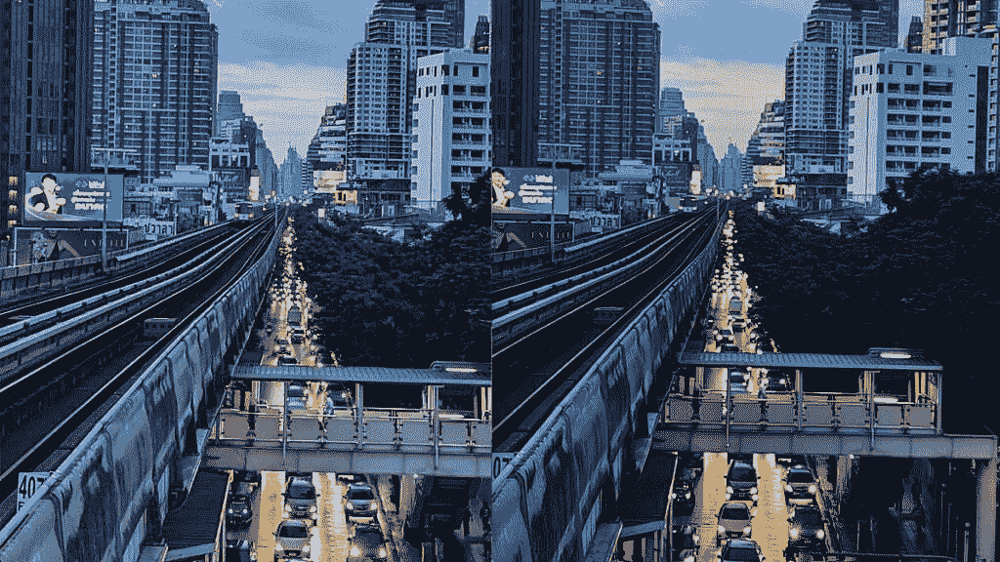</picture> 

Pixel 6 Pro (left); X70 Pro Plus (right)

 <picture></picture> 

Pixel 6 Pro (left); X70 Pro Plus (right)'

在下一组中，我们再次看到 Vivo X70 Pro Plus 的照片有更鲜艳的颜色。注意霓虹灯浸透的火车轨道和公园里的树木，它们在 Vivo 的图像中看起来更有力。

放大后，我们可以再次看到 Vivo 的镜头表现出更少的噪点，略显清晰。

 <picture>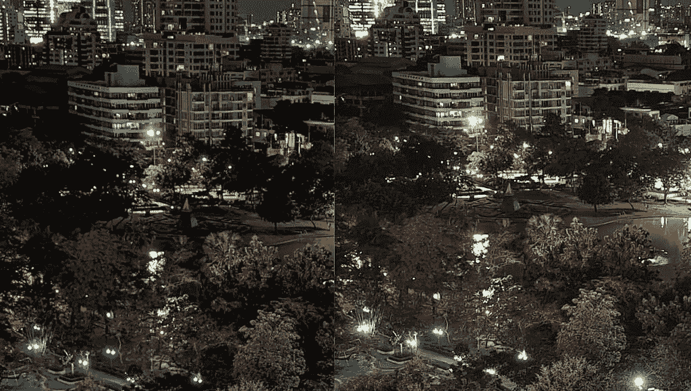</picture> 

Pixel 6 Pro (left); X70 Pro Plus (right)

下面的照片再次展示了 GN1 传感器产生的令人敬畏的自然散景——这些不是人像照片，只是简单的傻瓜相机。老实说，Pixel 的照片在真空中看起来很棒，会给 99%的用户留下深刻印象，但如果你将它与 X70 Pro Plus 的照片进行对比，在我看来，Vivo 看起来更好。优越的散景在灯笼和摩天大楼之间创造了更强的背景分离，灯笼内部的火更好地暴露出来(这可能是由于蔡司的 T 涂层)，灯笼前面的植物也更锐利和有力。

在下面这张高对比度的日出照片中，我们可以看到像素的夜间模式再次吸收了更多的光线。我同时拍摄了这些照片，所以看到张量和 V1 如何不同地解释日出的颜色是很有趣的。Vivo 的镜头具有适合场景的强烈对比度，但如果你在乎突出桌子上的东西——你可以在 Pixel 的镜头中看到我在桌子上的索尼相机——也许 Pixel 的镜头是首选？

下面是一个不太极端(又名更容易)的夜拍，我们看到两款手机势均力敌。

放大后，像素的镜头在中心更清晰，这在这里很重要，因为它更好地突出了泰国寺庙。

 <picture></picture> 

Pixel 6 Pro (left); X70 Pro Plus (right)

下面是更多的弱光样本。

从上面的样本——以及我拍的几十张照片，我没有空间在这里分享——我认为总的主题是 Vivo 的镜头在几乎每个场景中都有额外的色彩和保真度，但如果光线良好，Pixel 可以捕捉到更详细的图像。然而，在弱光或具有挑战性的条件下，我认为我几乎在所有情况下都更喜欢 Vivo 的拍摄。

### 主摄像头:视频

Vivo X70 Pro Plus 最高可拍 8k/30，Pixel 6 Pro 最高可拍 4k/60。但大多数人可能更喜欢用 4k/30 拍摄，所以这是我在并排测试中使用的标准。我们可以看到两款手机都具有出色的稳定性，尤其是在白天。晚上，Pixel 的视频可能会有点嘈杂，但除此之外，稳定性、颜色和动态范围都很好。然而，Vivo 的夜间镜头看起来更好。但在录音方面，我发现 Vivo 的麦克风太敏感，吸收了太多的街道噪音，而 Pixel 6 Pro 似乎应用了一点噪音消除功能，以消除曼谷街道的噪音。

不过，这两款手机都有出色的视频性能。Android 视频录制正在赶上 iPhone。

* * *

## 谷歌 Pixel 6 Pro vs Vivo X70 Pro Plus:超宽摄像头

这里首先要注意的是，谷歌 Pixel 的 12MP 超宽相机勉强称得上超宽——它只有 114 度的视野，在下面的每个样本中，你会看到取景明显比 Vivo X70 Pro Plus 的 120 度视野更紧密。两个品牌在如何引入光线方面也采取了相反的方式。Vivo 选择使用像素密度更高的传感器——48MP——然后使用像素宁滨将四个像素的数据收集到一个像素中。与此同时，谷歌坚持使用像素更大的 12MP 传感器(1.8 微米)。一般来说，像素的超宽可以吸收更多的光线，但反过来，也有更多的噪音。

Vivo 的超宽还内置了 Vivo 在最近几款旗舰产品中使用的微型万向节，尽管只有在拍摄移动视频时你才会注意到这种差异(我们将在下面的几节中介绍)。

### 超宽相机，光线充足的场景:动态范围和清晰度

上面的第一组重复了前面提到的趋势 Pixel 的照片色调更冷，Vivo 的照片对太阳的曝光更好。这两个都是出色的超广角镜头，捕捉到了席卷城市的风景，但 Vivo 的镜头更宽。

像素剥离超广角镜头没有太大意义，但为了吹毛求疵，我们就做到这里。

 <picture>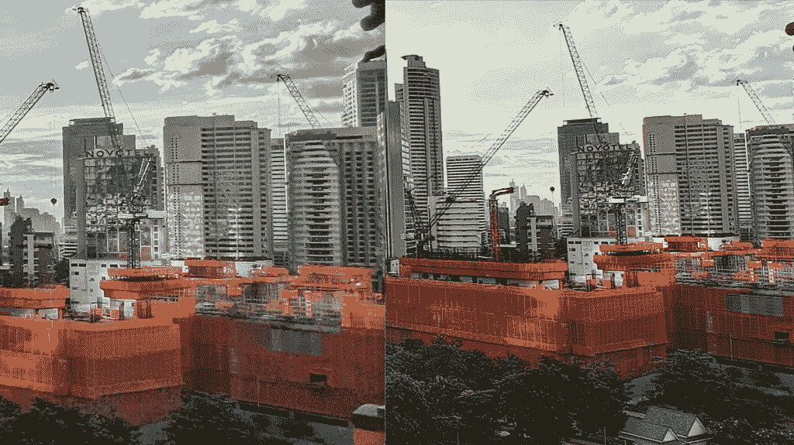</picture> 

Pixel 6 Pro (left); X70 Pro Plus (right).

 <picture>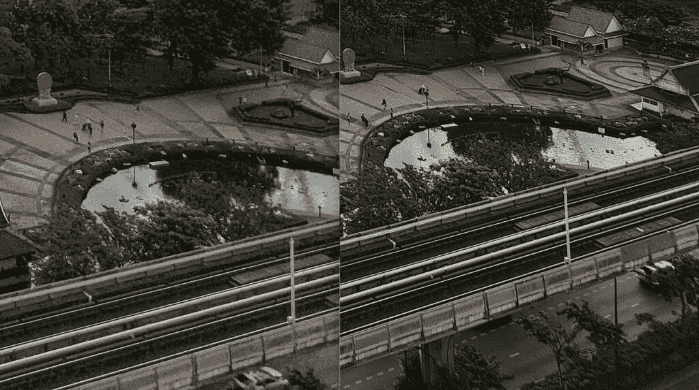</picture> 

Pixel 6 Pro (left); X70 Pro Plus (right).

是的...如果你仔细观察，像素的超宽是一个污点，嘈杂的混乱。这就是 X70 Pro Plus 的像素密度更高的传感器真正有利于其图像的地方。

在下一组中，我们可以看到视野中的显著差异。Vivo 的镜头使该结构看起来被拉长了，角度略有扭曲，这是我们对超宽相机的预期。这里的像素拍摄勉强看起来像一个超宽。不过，两张照片的色彩和细节都很出色。

下面这张照片是在一个具有挑战性的场景中拍摄的:我站在阴影中，直射午后的阳光，部分灯光被圣诞树挡住了。这就是 Vivo X70 Pro Plus 令人瞠目结舌的 HDR 发挥作用的地方，它成功地完美曝光了整个场景，而像素完全遮住了天空。

Pixel 的镜头把天空炸得太惨了，我一开始以为是一次性的 bug。于是我又抓拍了一个超广角镜头，结果也是一样。

事情是这样的，如果我用*主相机拍摄这个完全相同的场景，*像素的张量可以智能地分析这个镜头，并产生一个平衡得多的镜头，如下图所示。

 <picture>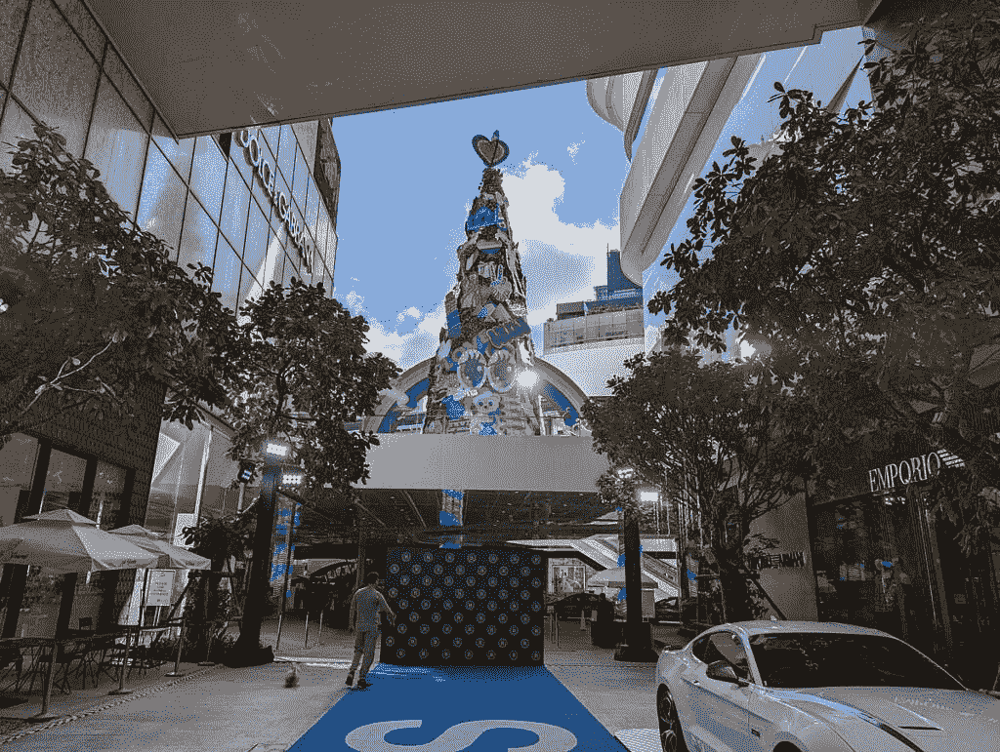</picture> 

Pixel 6 Pro, main camera

Pixel 6 Pro 的超宽硬件只是不如 Vivo X70 Pro Plus '

所以只有在用超宽相机拍摄时，像素才会与场景发生冲突。我认为这是因为与 Pixel 的主摄像头和 Vivo 的超宽摄像头相比，Pixel 的超宽传感器只是劣质的硬件。无论如何，让我们转移到低光场景。

### 超宽相机，弱光场景:进光，噪声和锐度

在这里，我们看到 Pixel 6 Pro 的超宽产生了更亮，但更紧密的图像。如果我们放大，我们可以看到在镜头的中心，像素的图像更清晰，但边缘，特别是阴影部分，完全是噪声。

 <picture></picture> 

Pixel 6 Pro (left); X70 Pro Plus (right)

 <picture></picture> 

Pixel 6 Pro (left); X70 Pro Plus (right)

另一张低光城市风景照片显示，与更宽但更暗的 Vivo 照片相比，像素更亮，但噪音更大。

### 超宽摄像机:视频

两款手机的超宽摄像头可以在白天拍摄精彩的视频，谷歌的视频显示出更强烈的色彩和略胜一筹的电子图像稳定。但当我们转向夜间视频时，特别是在极端运动的情况下，Vivo 的高级硬件就会脱颖而出，画面噪音更少，清晰度更好，并且由于增加了万向节，稳定性更好。

* * *

## 谷歌 Pixel 6 Pro vs Vivo X70 Pro Plus:变焦镜头

比起 X70 Pro Plus 的 5 倍镜头，我更喜欢 Pixel 6 Pro 的 4 倍光学镜头。

谷歌对 Pixel 6 Pro 的另一项升级是采用了潜望镜变焦相机，这是一款 4800 万像素的相机，可通过 4 倍光学变焦输出 1200 万像素的照片。另一方面，Vivo 的 X70 Pro Plus 有一个 800 万像素的 5 倍潜望镜变焦和一个 1200 万像素的 2 倍长焦变焦。使用两个变焦镜头来覆盖短焦距和长焦距是华为(P40 Pro Plus)的首创，今年早些时候被三星采用。然而，Vivo 的方法很奇怪，因为两个镜头仅覆盖 2 倍和 5 倍的范围-三星的 Galaxy S21 Ultra 覆盖 3 倍和 10 倍，这似乎更实用。

无论如何，X70 Pro Plus 在技术上确实比 Pixel 拥有更通用的变焦系统，Pixel 只有一个光学变焦范围，其他都是数字变焦。但在大多数情况下，我更喜欢 Pixel 6 Pro 的 4 倍光学镜头，而不是 X70 Pro Plus 的 5 倍镜头，即使这不是直接的 1:1 比较。

Pixel 潜望镜明显更大的 1/2 英寸传感器(与 Vivo 潜望镜的 1/4.4 英寸相比，可以吸收更多的光，在主相机的反面，张量似乎比 V1 产生更鲜艳的颜色。

### 变焦镜头:2x(用于肖像)

在我看来，2 倍变焦的长焦变焦镜头没有多大用处，因为它不能足够接近我已经看不清楚的东西(我经常使用 5 倍镜头从远处阅读街道标志或咖啡店菜单)，如果我真的想要一个更紧密的主体框架，仅仅向前 3-4 步就已经可以模拟相同的框架。只有 2x 的专用镜头似乎太浪费了。但如果你真的不想移动，想获得更紧密的取景，这对人像来说更理想，那么 X70 Pro Plus 的 2x 镜头可以拍摄比 Pixel 6 Pro 更接近传统人像焦距的人像，Pixel 6 Pro 用主摄像头拍摄人像(因为 4x 变焦太接近了)，然后进行数字裁剪。但是就像我说的，我可以很容易地向前迈 3-4 步，得到一个相似的框架，所以这对我真的不重要。

### 变焦镜头:视频

谷歌的领先优势延伸到了视频领域，因为 Pixel 6 Pro 可以在拍摄过程中动态切换镜头，而 X70 Pro Plus 则不能。这意味着如果我用像素放大到 4 倍，潜望镜相机就会启动，在 Vivo 上，放大到 5 倍只会产生数字裁剪，它在细节上看起来很清晰。

* * *

## 谷歌 Pixel 6 Pro vs Vivo X70 Pro Plus:自拍相机

自拍方面，Pixel 6 Pro 配备了 11.1MP f/2.2 前置摄像头，而 X70 Pro Plus 则使用了 32MP f/2.5 摄像头，输出 8MP binned 图像。两款自拍相机都能拍出令人满意的自拍，可以同样好地处理动态范围，两款手机的人像模式都可以产生具有精确边缘检测的人工散景，这也可以在拍摄后进行定制。

亚洲品牌几乎总是这样，Vivo 的自拍一直在美白我的皮肤，而 Pixel 6 Pro 以更自然的色调呈现我的肤色。正是基于这一点，我把胜利给了谷歌，因为我厌倦了中国和韩国手机品牌所暗示的色彩主义，它们似乎认为“肤色越浅越好”。

对于视频，像素始终具有更好的稳定性和音频增益。Vivo 的 mic jus 噪音太大。

* * *

## 谷歌 Pixel 6 Pro vs Vivo X70 Pro Plus:结论

这是一个非常接近的事实，特别是当你考虑到在他们自己的真空中，这两款手机都有几乎所有用户都会喜欢的优秀相机——你真的需要坐下来，并排 pixel 窥视数十张和数百张照片，然后吹毛求疵地宣布一个“赢家”。虽然我通常认为 Vivo 的主摄像头拍摄的图像更好看，特别是在弱光或挑战性的照明条件下，但 Vivo X70 Pro Plus 的整体拍照体验感觉有点僵硬。相机应用程序布满了按钮和不必要的模式，拍摄时你不能轻易切换镜头，变焦转盘太滑了(这意味着如果我想精确地变焦 15 倍，我经常需要花几秒钟让变焦转盘保持在 15 倍，而不是 15.1 倍或 14.8 倍)。

另一方面，谷歌的相机应用可以说是我在所有智能手机中最喜欢的相机应用。我喜欢定制的颜色，我喜欢当我的手机离轴时弹出的地平线测量仪，以及当我得到一个平坦的地平线时产生的触觉振动。和额外的模式，如行动潘是相当有趣的游戏。

至于其他镜头，Vivo 赢了超宽摄像头，Pixel 赢了变焦和自拍摄像头，所以这真的要归结到你更喜欢哪个镜头了。最终，在技术层面上，我不得不把胜利交给 Vivo X70 Pro Plus——因为当 Pixel 6 Pro 搞乱曝光时，它会搞砸，而 Vivo X70 Pro Plus 几乎总能在每次拍摄中找到完美的平衡。

如果你对我对这些图像的分析不满意，想亲自像素窥视，我已经在两个独立的 Flickr 相册中上传了以上所有样本的全尺寸版本(加上更多未使用的)。[如果嵌入的内容被破坏，你可以在这里看到 [Pixel 6 Pro Flickr 相册](https://www.flickr.com/photos/190493029@N08/albums/72157720176979692)，在这里看到 [Vivo X70 Pro Plus Flickr 相册](https://www.flickr.com/photos/190493029@N08/albums/72157720219363985)。]

如前所述，我有幸几乎测试了 2021 年发布的每一款重要智能手机——那么，为什么我会将 Pixel 6 Pro 和 X70 Pro Plus 评为两款最好的拍照手机呢？因为它们总是能生产出最好的颜色，而且缺陷最少。

例如，Galaxy S21 Ultra 的变焦系统比这两款手机都好，但其主摄像头有明显的快门延迟，超宽摄像头在夜间低于标准。 [iPhone 13 Pro](https://www.xda-developers.com/apple-iphone-13-pro-review/) 仍然拥有最好的视频录制功能，但它有一个习惯，即定期吹出高光(甚至比上面拍摄的像素更差)。[小米 Mi 11 Ultra](https://www.xda-developers.com/xiaomi-mi-11-ultra-review/) 使用了一个更新的 GN2 传感器，传感器接近 1 英寸，但它也存在快门延迟，超宽屏幕产生的颜色非常不均匀。至于配有实际 1 英寸传感器的手机，比如夏普 Aquos R6 手机或徕卡莱茨手机？他们缺乏软件实力来跟上尖端硬件的发展。[索尼 Xperia 1 III？](https://www.xda-developers.com/sony-xperia-1-iii-hands-on/)我也试过——它的超宽相机也很一般。 [OPPO Find X3 Pro](https://www.xda-developers.com/oppo-find-x3-pro-review/) 和[一加 9 Pro](https://www.xda-developers.com/oneplus-9-pro-review/) 拥有令人惊叹的超宽相机，但两者都缺少潜望镜变焦相机，而[华为 P50 Pro](https://www.xda-developers.com/huawei-p50-pro-hands-on/) 已经受到美国政府的制裁，以至于它不得不从 P40 Pro 降级其图像传感器，因为它无法再购买更多。

Vivo X70 Pro Plus 是我评选的年度最佳拍照手机

因此，除非未来五周内有一款神秘的惊喜手机问世，否则 2021 年的智能手机相机之战已经结束:Vivo X70 Pro Plus 是我选择的年度最佳相机手机，Pixel 6 Pro 是非常接近的年度最佳相机手机。

 <picture></picture> 

Google Pixel 6 Pro

Pixel 6 Pro 是较大的兄弟，配有谷歌的新张量芯片、现代设计和额外的远摄相机。

 <picture></picture> 

Vivo X70 Pro Plus

##### Vivo X70 Pro Plus

Vivo X70 Pro Plus 配备了一个 50MP 主摄像头，配有一个 1/1.31 英寸的大型图像传感器，以及一个 48MP 超宽摄像头，外加两个变焦镜头。这是一个庞大的摄像系统。*