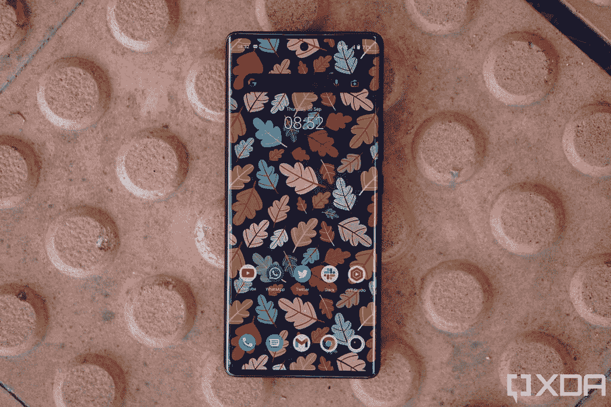
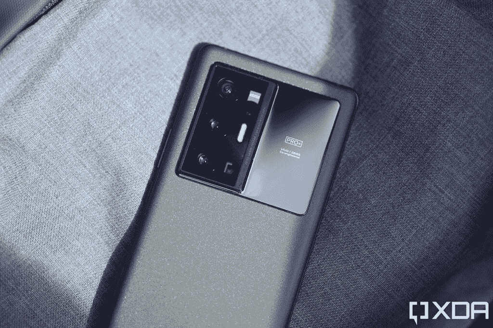
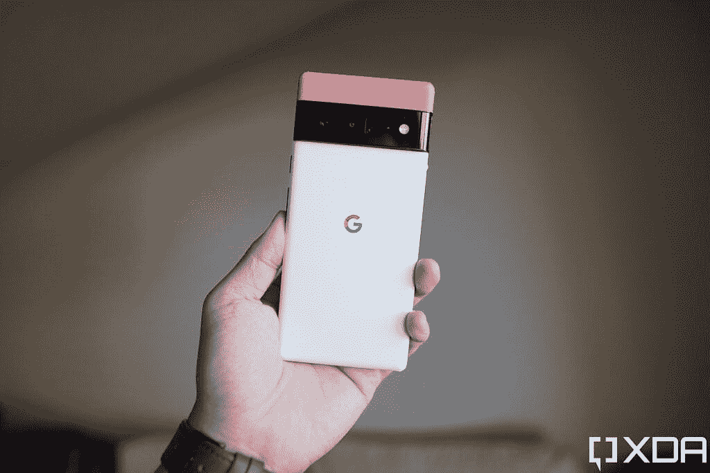
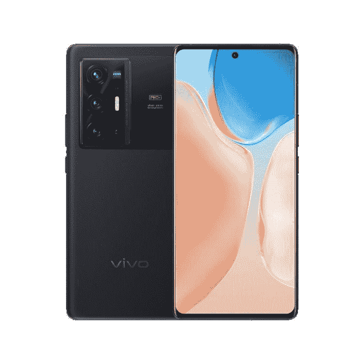

# 谷歌 Pixel 6 Pro vs Vivo X70 Pro Plus:该买哪款 Pro 旗舰？

> 原文：<https://www.xda-developers.com/google-pixel-6-pro-vs-vivo-x70-pro-plus/>

Pixel 6 Pro 是谷歌最新的旗舰智能手机。在典型的像素时尚中，它提供了出色的相机性能，使其成为任何想要一部出色相机手机的人的绝佳选择。但 Pixel 6 Pro 并不是唯一一款拥有出色相机设置的手机；Vivo 的 X 系列手机凭借其令人惊叹的摄像头赢得了许多消费者的惊叹。该公司的最新旗舰产品 X70 Pro+是 Pixel 6 Pro 的有力竞争对手。这两款手机都在我们的[最佳相机智能手机](https://www.xda-developers.com/best-smartphone-cameras/)名单中找到了一席之地，我们甚至有一个专门的[谷歌 Pixel 6 Pro vs Vivo X70 Pro Plus 相机比较和枪战](https://www.xda-developers.com/google-pixel-6-pro-vs-vivo-x70-pro-plus-camera-shootout-comparison/)。在本文中，我们将对比[谷歌 Pixel 6 Pro](https://www.xda-developers.com/google-pixel-6-pro-review/) 和 [Vivo X70 Pro Plus](https://www.xda-developers.com/vivo-x70-pro-plus-first-impressions/) ，看看这两款手机如何作为完整的 Android 智能手机包相互竞争，而不仅仅是在摄像头上。

**浏览本指南:**

## 谷歌 Pixel 6 Pro vs Vivo X70 Pro Plus:规格

| 

规格

 | 

Pixel 6 Pro

 | 

Vivo X70 Pro Plus

 |
| --- | --- | --- |
| **尺寸和重量** | 

*   163.9 x 75.9 x 8.9 毫米
*   210g

 | 

*   164.54 x 75.21 x 8.89mm 毫米
*   213g

 |
| **显示** | 

*   6.71 英寸 LTPO AMOLED
*   QHD+ (1400 x 3120)
*   居中打孔机
*   120Hz 显示器刷新率
*   HDR10+支持
*   高亮度模式
*   1600 万色的全 24 位深度
*   大猩猩玻璃 Victus

 | 

*   6.78 寸 FHD+ LTPO AMOLED 显示屏
*   QHD+ (1400 x 3200)
*   居中打孔机
*   HDR10+支持
*   120 赫兹刷新率

 |
| **SoC** | 

*   谷歌张量八核芯片组

 | 

*   高通骁龙 888+ SoC

 |
| **RAM 和存储器** | 

*   12GB LPDDR5 内存
*   128GB/256GB/512GB UFS 3.1 闪存存储

 | 

*   8/ 12GB LPDDR5 RAM
*   128GB/256GB UFS 3.1 存储

 |
| **电池&充电** | 

*   5000 毫安时电池
*   30W 快速充电
*   23W 快速无线充电

 | 

*   4500 毫安时电池
*   55W 快速有线充电
*   50W 无线充电

 |
| **后置摄像头** | 

*   主要:50MP，f/1.8，三星 GN1 传感器，OIS
*   辅助:12MP，f/2.2，超宽摄像头，114 度 FOV
*   第三级:48MP，f/3.5，长焦，4 倍光学变焦，20 倍数码变焦

 | 

*   小学:50MP，f/1.6，OIS
*   次要:4800 万像素，f/2.2，超宽相机，万向 OIS
*   第三级:12MP，f/1.6，长焦，2 倍光学变焦
*   四元:800 万像素，f/3.4，长焦，5 倍光学变焦

 |
| **前置摄像头** |  |  |
| **端口** |  |  |
| **连通性** | 

*   5G NR(低于 6GHz 和毫米波)
*   国家足球联盟
*   超宽带
*   蓝牙 5.2
*   WiFi 802.11 . b/g/n/AC(2.4 GHz+5 GHz)

 | 

*   5G NR(低于 6GHz)
*   蓝牙 5.2
*   WiFi 802.11 . b/g/n/ax(2.4 GHz+5 GHz)
*   国家足球联盟

 |
| **软件** | 

*   安卓 12
*   三年的操作系统更新
*   五年的安全更新

 | 

*   Funtouch 12，基于 Android 11

 |
| **其他特征** | 

*   光学显示下指纹读取器
*   IP68 防水防尘等级
*   立体声扬声器

 | 

*   显示不足的指纹传感器
*   立体声扬声器

 |

## 设计和展示

 <picture></picture> 

Google Pixel 6 Pro

虽然 Pixel 6 Pro 和 X70 Pro+都采用了玻璃夹层设计，但 Vivo 对后玻璃面板进行了萤石处理，使其具有微妙的纹理和哑光表面。此外，X70 Pro+的后面板有很大一部分是由其相机设置拍摄的。也就是说，Pixel 6 Pro 在这方面并没有太大的不同，它的水平相机栏也在背面占据了相当大的空间。你肯定要在这两个方面与笨重的相机岛进行斗争，但 Pixel 6 Pro 的 visor-look 有自己的粉丝。

这两款手机的正面非常标准，你可以在中央为自拍相机打孔。Pixel 6 Pro 的屏幕为 6.71 英寸，而 Vivo 手机的显示屏为 6.78 英寸。这两款手机都有 AMOLED 面板，分辨率为 1440p。

这两款手机的重量几乎相同，总体尺寸也基本相同。

## 处理器、内存和存储

 <picture></picture> 

Vivo X70 Pro Plus

它们的 SoC 是 Pixel 6 Pro 和 X70 Pro+的第一个显著区别。虽然谷歌使用自己的张量芯片，但 Vivo 已经采用了高通最新的旗舰芯片骁龙 888+。

得益于骁龙 888+，X70 Pro+提供了出色的性能，您在任何部门都不会有任何抱怨。谷歌的张量也是一款旗舰级芯片，除了高端图形密集型游戏，它在几乎所有方面都表现出色。也就是说，如果你不经常玩游戏或者主要是玩休闲游戏，你就不会对张量芯片感到不安。

在内存和存储方面，谷歌手机的内存为 12GB，有 128GB、256GB 和 512GB 三种存储版本。另一方面，Vivo 手机有 8GB 和 12GB 内存选项，以及 256GB 或 512GB 存储空间。不幸的是，这两款手机都没有存储扩展槽。

## 谷歌 Pixel 6 Pro vs Vivo X70 Pro Plus:摄像头

摄像头是 Pixel 6 Pro 和 Vivo X70 Pro+最受关注的部分。Pixel 6 Pro 上有三个后置摄像头——一个 50MP 主摄像头，一个 48MP 长焦摄像头和一个 12MP 超宽摄像头。另一方面，Vivo 手机背面有四个摄像头——一个 50MP 主摄像头，一个 8MP 长焦摄像头，另一个 12MP 长焦摄像头和一个 48MP 广角摄像头。

谷歌 Pixel 手机一次又一次地证明了它们可以拍摄出令人惊叹的照片，Pixel 6 Pro 也不例外。谷歌的计算摄影能力显示在手机拍摄的每张照片中。所以不管是白天还是夜晚，Pixel 6 Pro 的主摄像头拍出的照片都非常出色。广角拍摄有点平淡无奇，但手机的长焦相机是一个明星。

Vivo X70 Pro+也是一款非常棒的拍照手机，它能够与 Pixel 6 Pro 抗衡。这款手机在标准和弱光环境下都能拍出出色的照片。此外，广角相机附带的万向节稳定功能在拍摄视频时有很大帮助，并且支持主相机上的 8K 视频录制。

你可以在[我们对谷歌 Pixel 6 Pro 和 Vivo X70 Pro Plus 相机的详细比较](https://www.xda-developers.com/google-pixel-6-pro-vs-vivo-x70-pro-plus-camera-shootout-comparison/)中了解更多信息。要点是，你可以选择任何一款手机进行摄影，你不会失望。

## 电池、连接和软件

 <picture></picture> 

Vivo X70 Pro Plus

谷歌 Pixel 6 Pro 的电池容量为 5000 毫安时，而 Vivo X70 Pro+的电池容量为 4500 毫安时。Pixel 中额外的电池容量有助于手机在重度使用情况下轻松持续一天，如果你是一个中度用户，你甚至可以获得一天半的电池寿命。

另一方面，Vivo 手机一次充电只能持续一天左右。但这款手机支持 55W 快充，比你在 Pixel 上能实现的 23W 左右快充快得多。X70 Pro+的无线充电速度也快得多，功率为 50W。

在连接选项方面，Pixel 6 Pro 支持毫米波和 6GHz 以下的 5G，并配有 Wi-Fi 6E、蓝牙 5.2 和 NFC。另一方面，Vivo X70 Pro+支持 sub-6GHz 5G、Wi-Fi 6、蓝牙 5.2 和 NFC。

Pixel 6 Pro 在软件方面获得了谷歌的优势，手机开箱即可运行 Android 12。它还将获得三年的操作系统更新和五年的安全补丁。Vivo X70 Pro+运行 Android 11，搭载 Funtouch OS 12。但是，同样，它预计将获得三年的操作系统更新。

## 价格和颜色选项

 <picture></picture> 

Google Pixel 6 Pro

由于 Pixel 6 Pro 和 X70 Pro+都没有上市，我们将使用 Pixel 的美国价格和 X70 Pro+的印度价格来比较这两款手机。基本款 12GB + 128GB 的 [Pixel 6 Pro 售价为 899 美元](https://www.xda-developers.com/best-google-pixel-6-pro-deals/)。其 12GBV + 256GB 型号的零售价为 999 美元，而 X70 Pro+的 12 gbv+256 GB 型号的售价为 400 卢比。79,990 (~$1059).所以两款手机的价格并没有太大差别。

说到颜色，你可以购买暴风雨黑、多云白和阳光色的 Pixel 6 Pro。Vivo 手机有黑色、蓝色和橙色三种颜色。

## 谷歌 Pixel 6 Pro vs Vivo X70 Pro Plus:结论

得益于 Vivo 手机出色的摄像头和整体性能，它是 Pixel 6 Pro 的坚实竞争对手。Vivo 手机唯一落后的地方是软件和电池容量。但是 Pixel 6 Pro 也不是没有问题。这款手机的快速充电速度还有很多需要改进的地方，Tensor 芯片并不适合硬核游戏。因此，在两者之间做出选择归根结底是为了更好的游戏体验还是软件。因此，选择 Pixel 做软件，Vivo 做游戏。

 <picture></picture> 

Google Pixel 6 Pro

Pixel 6 Pro 是谷歌的旗舰产品，配备了新的张量芯片、现代设计和长焦相机。

 <picture></picture> 

Vivo X70 Pro Plus

##### Vivo X70 Pro Plus

Vivo X70 Pro Plus 配备了一个 50MP 主摄像头，配有一个 1/1.31 英寸的大型图像传感器，以及一个 48MP 超宽摄像头，外加两个变焦镜头。这是一个庞大的摄像系统。

这两款手机你喜欢哪一款？请在评论区告诉我们。同时，如果你打算购买 Pixel，我们已经选择了[最佳 Pixel 6 Pro 保护套](https://www.xda-developers.com/best-google-pixel-6-pro-cases/)和[最佳 Pixel 6 Pro 屏幕保护器](https://www.xda-developers.com/best-pixel-6-pro-screen-protectors/)来帮助你保护手机。