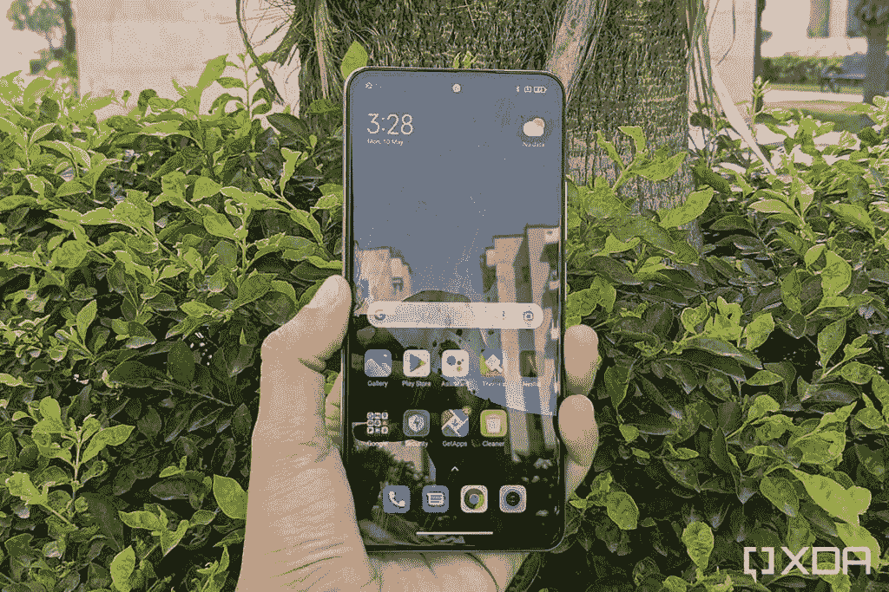
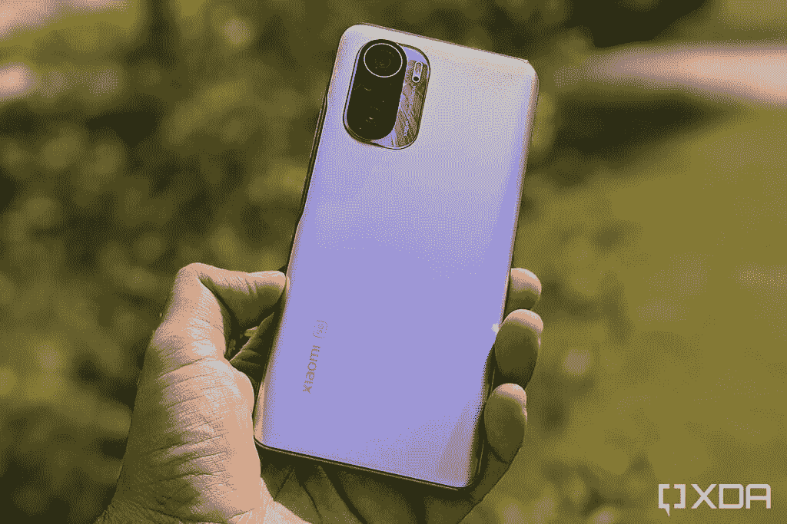
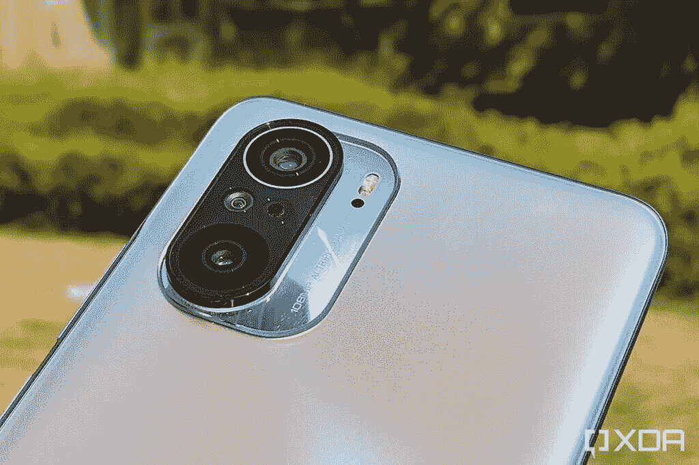

# 谷歌 Pixel 6 Pro vs 小米 Mi 11X Pro:应该买哪个顶级旗舰？

> 原文：<https://www.xda-developers.com/google-pixel-6-pro-vs-xiaomi-mi-11x-pro/>

谷歌最新旗舰智能手机 [Pixel 6 Pro](https://www.xda-developers.com/google-pixel-6/) 已经上市。凭借顶级的规格、行业领先的相机设置、Android 12 和诱人的价格标签，它为自己提供了一个绝佳的案例。但这是智能手机的黄金时代，市场上有很多很棒的选择，包括小米的 Mi 11X Pro。本文就来坑一下[谷歌 Pixel 6 Pro](https://www.xda-developers.com/google-pixel-6-pro-review/) vs [小米 Mi 11X Pro](https://www.xda-developers.com/xiaomi-mi-11x-pro-review/) ，看看这两款高端手机如何对决。

**浏览本指南:**

## 谷歌 Pixel 6 Pro vs 小米 Mi 11X Pro:规格

| 

规格

 | 

Pixel 6 Pro

 | 

小米 Mi 11X Pro

 |
| --- | --- | --- |
| **尺寸和重量** | 

*   163.9 x 75.9 x 8.9 毫米
*   210g

 | 

*   163.7 x 76.4 x 7.8 毫米
*   196 克

 |
| **显示** | 

*   6.71 英寸 LTPO AMOLED
*   QHD+ (1400 x 3120)
*   居中打孔机
*   120Hz 显示器刷新率
*   HDR10+支持
*   高亮度模式
*   1600 万色的全 24 位深度
*   大猩猩玻璃 Victus

 | 

*   6.67 寸 FHD+ Super AMOLED 显示屏
*   居中打孔机
*   HDR10+支持
*   120 赫兹刷新率
*   大猩猩玻璃 5

 |
| **SoC** | 

*   谷歌张量八核芯片组

 | 

*   高通骁龙 888 足球俱乐部

 |
| **RAM 和存储器** | 

*   12GB LPDDR5 内存
*   128GB/256GB/512GB UFS 3.1 闪存存储

 | 

*   8GB LPDDR5 RAM
*   128GB/256GB UFS 3.1 存储

 |
| **电池&充电** | 

*   5000 毫安时电池
*   30W 快速充电
*   23W 快速无线充电

 | 

*   4，520 毫安时电池
*   33W 快速有线充电

 |
| **后置摄像头** | 

*   主要:50MP，f/1.8，三星 GN1 传感器，OIS
*   辅助:12MP f/2.2 超宽相机，114 度 FOV
*   第三级:48MP f/3.5，长焦，4 倍光学变焦，20 倍数码变焦

 | 

*   初级:108 百万像素，f/1.75
*   辅助:800 万像素 f/2.2 超宽摄像头，119 度 FOV
*   高等教育:5 百万女性/2.4，远程教育

 |
| **前置摄像头** |  |  |
| **端口** |  |  |
| **连通性** | 

*   5G NR(低于 6GHz 和毫米波)
*   国家足球联盟
*   超宽带
*   蓝牙 5.2
*   WiFi 802.11 . b/g/n/AC(2.4 GHz+5 GHz)

 | 

*   5G NR(低于 6GHz)
*   蓝牙 5.2
*   WiFi 802.11 . b/g/n/ax(2.4 GHz+5 GHz)

 |
| **软件** | 

*   安卓 12
*   三年的操作系统更新
*   五年的安全更新

 | 

*   MIUI 12，基于 Android 11

 |
| **其他特征** | 

*   光学显示下指纹读取器
*   IP68 防水防尘等级
*   立体声扬声器

 | 

*   侧装式指纹传感器
*   立体声扬声器

 |

## 设计和展示

大多数现代智能手机旗舰都选择玻璃夹层设计，Pixel 6 Pro 和 Mi 11X Pro 也不例外。然而，虽然 Pixel 6 Pro 有铝边框，但小米选择了塑料边框。塑料边框确实在重量部门对 Mi 11X Pro 有所帮助，但它只是比像素轻了 14 克。

除了重量，Pixel 6 Pro 和 Mi 11X Pro 在比例上非常相似，包括屏幕。谷歌手机使用 6.71 英寸的屏幕，而小米手机配备 6.67 英寸的显示屏。但 Pixel 的 QHD+ AMOLED 面板分辨率高于 Mi 11X Pro 的全高清+ Super AMOLED 屏幕。

小米手机也缺乏防水防尘的 IP 认证，但 Pixel 6 Pro 通过了 IP68 认证。

## 处理器、内存和存储

 <picture></picture> 

Xiaomi Mi 11X Pro display outdoor under shade

谷歌自己的张量芯片为 Pixel 6 Pro 提供动力。这是一个有能力的芯片，让事情顺利进行。然而，游戏是张量似乎有点纠结的一个领域。另一方面，Mi 11X Pro 使用的是骁龙 888，我们已经在几乎所有其他安卓旗舰机上看到过，它是一款顶级的产品。

在其他规格中，谷歌旗舰包 12GB 的内存和高达 512GB 的存储空间。但你只能在 Mi 11X Pro 上获得 8GB 内存和高达 256GB 的存储空间。

## 谷歌 Pixel 6 Pro vs 小米 Mi 11X Pro:相机

 <picture></picture> 

Pixel 6 Pro

谷歌 Pixel 手机以其拍照功能而闻名，Pixel 6 Pro 凭借其令人难以置信的成像性能延续了这一传统。这款手机通过主摄像头和广角摄像头在标准和弱光条件下都能拍摄出精彩的照片。此外，手机的长焦拍摄效果非常好，如果你喜欢用长焦相机拍照，你会非常高兴。

Mi 11X Pro 也可以拍摄高质量的照片，但它们没有达到 Pixel 6 Pro 的水平。还有，小米手机上的 telemacro 摄像头没有光学变焦支持。

谈到原始规格，Pixel 6 Pro 配备了一个 50MP 主摄像头，一个 48MP 长焦摄像头和一个 12MP 广角摄像头。船上还有一个 11.1 百万像素的自拍相机。另一方面，Mi 11X Pro 配备了 108MP 主摄像头、8MP 广角摄像头和 5MP telemacro 摄像头。它还配有 20MP 自拍相机。

总的来说，如果摄影是你的优先事项之一，你最好使用 Pixel 6 Pro。

## 电池、连接和软件

 <picture></picture> 

Xiaomi Mi 11X Pro

谷歌 Pixel 6 Pro 配备了比 MI 11X Pro 更大的电池，但其更高分辨率的屏幕夺走了这一优势。因此，尽管 Pixel 6 Pro 配备了 5000 毫安时的电池，而 Mi 11X Pro 配备了 4520 毫安时的电池，但这两款手机都只能在一次充电后提供一天的备用电池。也就是说，Mi 11X 的充电速度比 Pixel 6 Pro 快得多。

说到连接，虽然 Pixel 6 Pro 支持毫米波和低于 6GHz 的 5G，但你只能在 Mi 11X Pro 上获得低于 6GHz 的 5G 支持。此外，小米手机仅支持两个 5G 频段，而像素大约有 20 个。

软件是谷歌手机能否如预期那样大放异彩的另一个领域。它自带 Android 12，并将获得三年的操作系统更新和五年的安全补丁。相比之下，米 11X Pro 运行的是 MIUI 12，基于 Android 11。目前还不清楚这款手机将获得多少年的软件支持。

## 价格和颜色选项

Pixel 6 Pro 在美国的起价为 899 美元，有三种颜色可供选择——暴风雨黑、多云白和阳光白。另一方面，Mi 11X Pro 8GB RAM+128 GB 型号的价格为 36，999 印度卢比(约 493 美元)，8GB + 256GB 型号的价格为 41，999 印度卢比(约 560 美元)。这款手机有天银、宇宙黑和月球白三种颜色。

## 谷歌 Pixel 6 Pro vs 小米 Mi 11X Pro:结论

 <picture></picture> 

Xiaomi Mi 11X Pro with a 108MP primary camera

小米 11X Pro 和 Pixel 6 Pro 定价之间的巨大差异无疑使小米手机成为一个诱人的选择。但是你必须做出一些明显的取舍。例如，你会失去行业领先的相机性能、更好的 5G 支持和更好的软件支持。但如果你能忍受这些权衡，小米手机就物有所值了。但如果你宁愿有一个更好的相机，更新的软件，并且不担心价格，Pixel 6 Pro 在许多方面都是一款优于 Mi 11X Pro 的手机。

然而，最终决定买什么可能在很大程度上取决于你在世界上的什么地方买。印度和中国的用户无法购买 Pixel 6 Pro，因此他们别无选择，只能获得 Mi 11X Pro。而美国和英国等地区的用户无法获得 Mi 11X Pro，因此 Pixel 6 Pro 仍然是唯一的选择。

这两款手机你打算买哪一款？请在评论区告诉我们。与此同时，我们选出了[最佳 Pixel 6 Pro 保护套](https://www.xda-developers.com/best-google-pixel-6-pro-cases/)和[最佳 Pixel 6 Pro 屏幕保护套](https://www.xda-developers.com/best-pixel-6-pro-screen-protectors/)，如果你购买了谷歌手机，可以帮助你保护好它。

 <picture></picture> 

Stormy Black

Pixel 6 Pro 是 Pixel 6 系列中较大的兄弟姐妹，它配备了谷歌新的张量芯片、现代设计和一个额外的长焦摄像头。

 <picture></picture> 

Xiaomi Mi 11X Pro

##### 小米 Mi 11X Pro

米 11X Pro 是一款功能丰富的旗舰杀手，拥有 120Hz AMOLED 显示屏，骁龙 888，108MP 摄像头等。