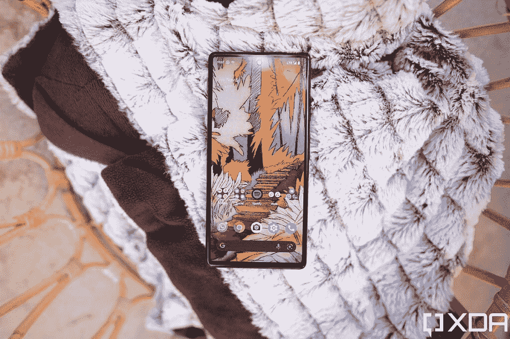
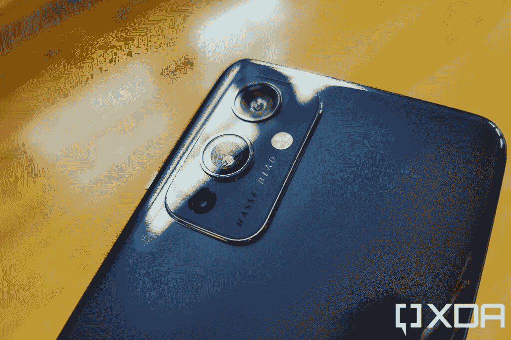
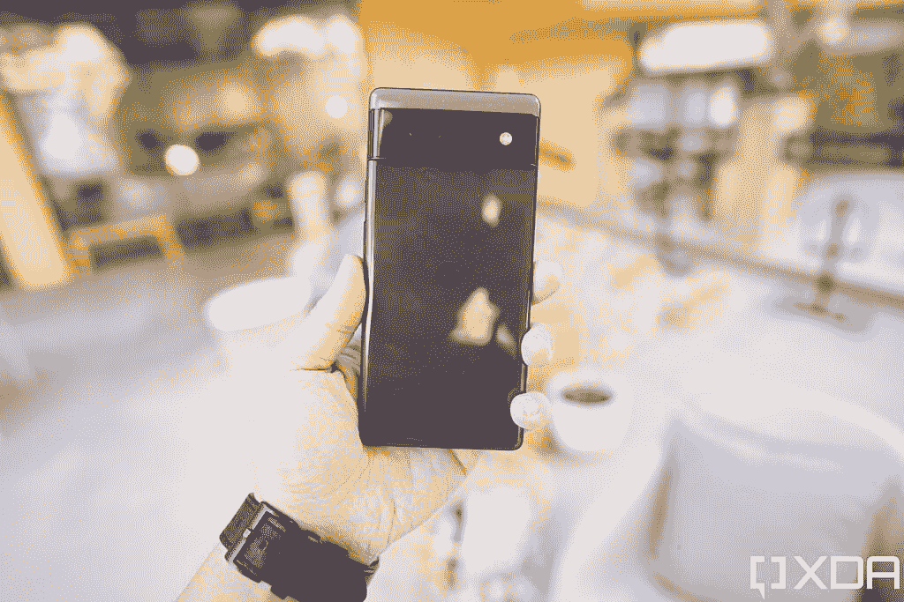
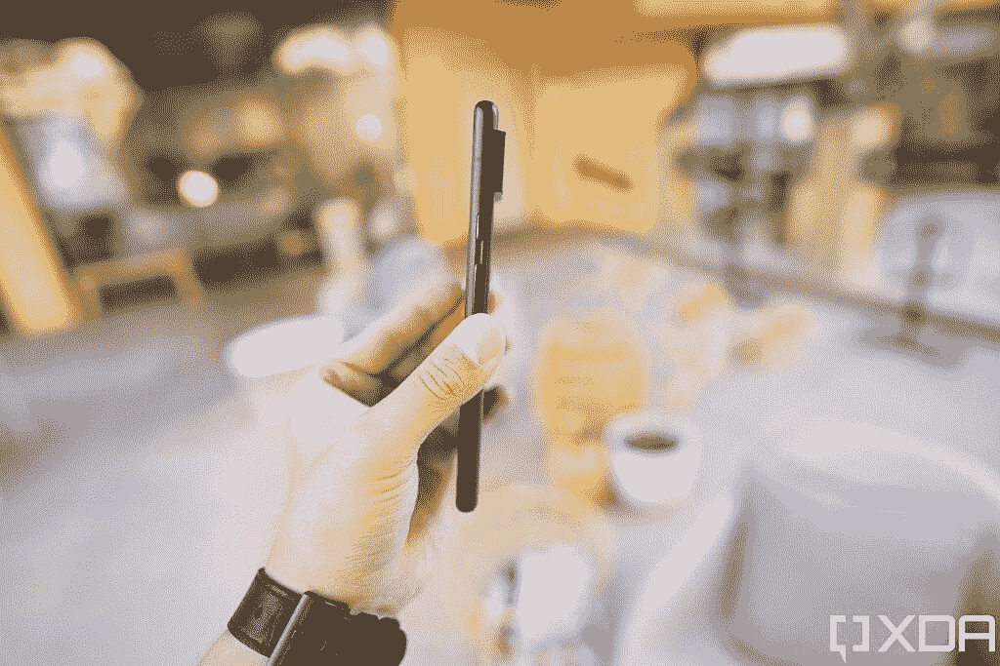
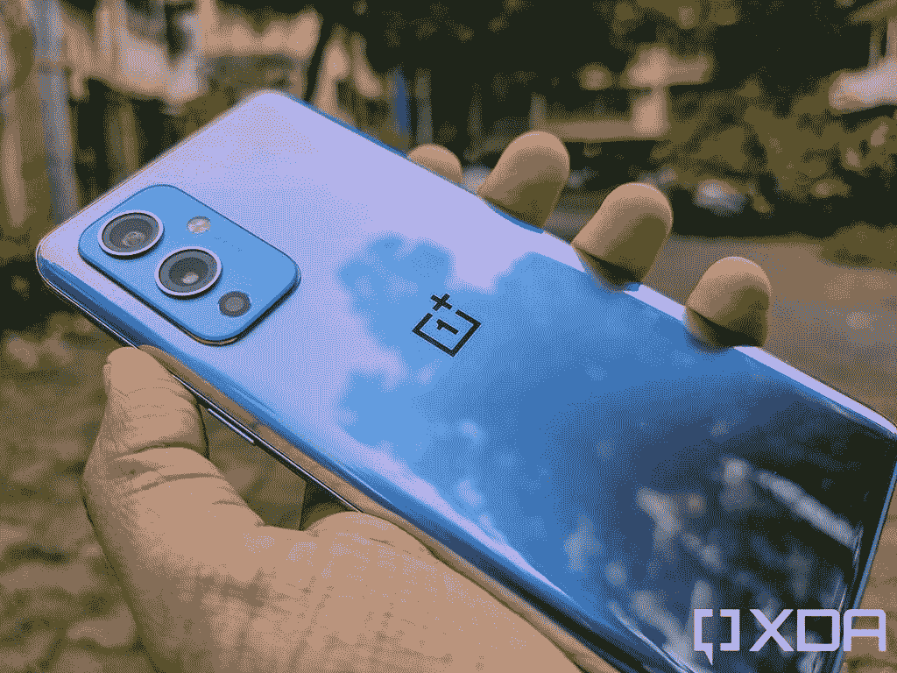

# 谷歌 Pixel 6 vs 一加 9:你该买哪款实惠旗舰？

> 原文：<https://www.xda-developers.com/google-pixel-6-vs-oneplus-9/>

像素 6 是谷歌 2021 年的价值旗舰。它包含了许多令人兴奋的东西，包括谷歌全新的张量 SoC。您还可以获得行业领先的相机设置。所以，这款手机有很多让人喜欢的地方。然而，如果你想买一部新的智能手机，并且在 Pixel 6 和[一加 9](https://www.xda-developers.com/oneplus-9/) 之间感到困惑，我们可以帮助你。本文将对比 Pixel 6 和一加 9，看看这两款手机的表现如何。

**浏览本指南:**

## 谷歌像素 6 与一加 9:规格

| 规格 | 像素 6 | 一加 9 |
| --- | --- | --- |
| **尺寸和重量** | 

*   158.6 x 74.8 x 8.9 毫米
*   207 克

 |  |
| **显示** | 

*   6.4 英寸 AMOLED
*   FHD+ (1080 x 2340)
*   居中打孔机
*   90Hz 显示刷新率
*   HDR10+支持
*   高亮度模式
*   1600 万色的全 24 位深度
*   大猩猩玻璃 Victus

 | 

*   6.55 英寸 AMOLED
*   FHD+ (1080 x 2400)
*   左打孔机
*   120Hz 显示器刷新率
*   HDR10+支持
*   1600 万色的全 24 位深度
*   大猩猩玻璃 5

 |
| **SoC** | 

*   谷歌张量八核芯片组

 | 

*   高通骁龙 888 足球俱乐部

 |
| **RAM 和存储器** | 

*   8GB LPDDR5 RAM
*   128GB/256GB UFS 3.1 闪存存储

 | 

*   8GB/ 12GB LPDDR5 RAM
*   128GB/ 256GB UFS 3.1 闪存存储

 |
| **电池&充电** | 

*   4，600 毫安时电池
*   30W 快速充电
*   21W 快速无线充电

 | 

*   4500 毫安时电池
*   65W 快速充电
*   15W 快速无线充电

 |
| **后置摄像头** | 

*   主摄像头:50MP f/1.8 三星 GN1 主摄像头
*   辅助:12MP f/2.2 超宽相机，114 度 FOV

 | 

*   主摄像头:48MP f/1.8 索尼 IMX766 主摄像头，EIS
*   次要:50MP f/2.2 超宽相机
*   第三级:2MP 单色传感器

 |
| **前置摄像头** | 800 万像素 f/2.0 | 1600 万像素 f/2.4 |
| **港口** | USB 类端口 |  |
| **连通性** | 

*   5G NR(低于 6GHz)
*   国家足球联盟
*   蓝牙 5.2
*   C 型端口
*   WiFi 802.11 . b/g/n/AC(2.4 GHz+5 GHz)

 | 

*   5G NR(低于 6GHz 和毫米波)
*   国家足球联盟
*   蓝牙 5.2
*   C 型端口
*   WiFi 802.11 . b/g/n/AC/ax(2.4 GHz+5 GHz)

 |
| **软件** | 

*   安卓 12
*   三年的操作系统更新
*   五年的安全更新

 | 

*   安卓 12
*   三年的操作系统更新
*   四年的安全更新

 |
| **其他特征** | 

*   光学显示下指纹读取器
*   立体声扬声器
*   IP68 防尘防水等级

 | 

*   显示屏下指纹识别器
*   IP68 防水防尘等级(仅适用于 T-Mobile 型号)
*   立体声扬声器

 |

## 设计和展示

 <picture></picture> 

Google Pixel 6

谷歌和一加在分别设计 Pixel 6 和一加 9 时基本上都很谨慎。两款手机本质上都是玻璃三明治。尽管 Pixel 6 采用了铝制框架，但一加 9 采用了塑料框架，这使得手机比 Pixel 更轻，尽管屏幕更大。一加 9 重 192 克，而 Pixel 6 重 207 克。

Pixel 6 背面巨大的摄像头确实引人注目，但两款手机的其余部分与其他所有安卓旗舰产品基本一致。

然而，在显示器前面，事情并不那么相似。尽管 Pixel 6 采用了 6.4 英寸的 90Hz 面板，但一加 9 配备了 6.55 英寸的 120Hz 屏幕。也就是说，这两个面板都是 AMOLED，并且具有全高清+分辨率。无论你最终是购买 Pixel 6 还是一加 9，选择一个屏幕保护装置和手机外壳总是一个好主意。我们为 Pixel 6 和[一加 9](https://www.xda-developers.com/best-oneplus-9-accessories/) 选出了[最佳屏保，也为 Pixel 6](https://www.xda-developers.com/best-pixel-6-pro-screen-protectors/) 和[一加 9](https://www.xda-developers.com/best-oneplus-9-cases/) 选出了[最佳案例。](https://www.xda-developers.com/best-google-pixel-6-pro-cases/)

除非你想要一个 120 赫兹的屏幕，除了一些奇怪的差异，一加 9 和 Pixel 6 在设计和显示上都非常均衡。

## 处理器、内存和存储

 <picture></picture> 

OnePlus 9

谷歌在 Pixel 6 中选择了自己的张量芯片，而一加 9 则搭载了高通旗舰产品骁龙 888 SoC。虽然你会看到骁龙 888 在某些原始基准测试中得分超过张量，但在现实世界中，这两种芯片都不会让你失望。这两种处理器都足够强大，可以处理你扔给它们的几乎任何东西。

在内存和存储方面，Pixel 6 有 8GB 内存和 128GB 或 256GB 的存储空间。然而，一加在一个版本中提供 8GB 内存和 128GB 存储，在第二个版本中提供 12GB 内存和 256GB 存储。然而，12GB 内存型号的一加 9 是官方无处可寻的这些天。

## 操作系统

Pixel 6 在操作系统方面有优势。通常情况下，Pixel 手机会首先获得任何 Android 更新或安全补丁，这就是 Pixel 6 已经运行在 Android 12 上的原因。谷歌还承诺 Pixel 6 将获得有保证的 Android 更新，直到 2024 年 10 月，安全更新直到 2026 年 10 月。相比之下，一加 9 目前运行的是 Android 11，并将在未来几周内获得 Android 12 更新。这款手机还将在 2024 年 3 月之前接收 Android 更新，在 2025 年 3 月之前接收安全补丁。

## 像素 6 vs 一加 9:相机

 <picture></picture> 

Google Pixel 6

Pixel 手机以拍照能力著称，Pixel 6 也不例外。尽管它与上一代 Pixel 手机的相机硬件不同，但这款手机拍摄的照片非常出色。

Pixel 6 上有一个 50MP 主拍摄器，一个 12MP 广角摄像头，一个 8MP 自拍摄像头。另一方面，一加 9 配备了 4800 万像素的主摄像头、5000 万像素的广角摄像头、200 万像素的单色摄像头和 1600 万像素的自拍摄像头。

尽管一加 9 在良好的光线条件下可以从主摄像头和广角摄像头拍摄出出色的照片，但在弱光下它会略显吃力。缺少光学图像稳定功能，在光线不好的情况下肯定没有帮助。

Pixel 6 的主摄像头在良好和恶劣的光照条件下都能拍摄出精彩的照片。它的广角镜头还有待改进，但你仍然可以拍出好照片。

有些人也会喜欢 Pixel 6 的相机功能，比如你在一加 9 上找不到的魔法橡皮擦。最后，两款手机都拍出了像样的自拍。

总体来说，在相机部门，Pixel 6 比一加 9 更有优势。

## 电池和连接

 <picture></picture> 

Google Pixel 6

两款手机的电池容量并没有太大的区别。Pixel 6 的电池容量为 4614 毫安时，而一加 9 的电池容量为 4500 毫安时。所以备用电池也是相似的，两部手机充一次电可以轻松维持一天。中度用户甚至将设法获得超过 1.5 天。

一加 9 在一个方面确实比像素 6 得分高，这就是快速充电。一加手机支持高达 65W 的快速充电，由于内置的快速充电模块，你可以在不到 30 分钟内从 0 到 100。相比之下，尽管 Pixel 6 宣传的容量为 30W，但它只能在 21W 左右快速充电。而且，用快速充电器给手机充满电需要将近两个小时。

在连接方面，虽然 Pixel 6 和一加 9 都支持 5G，但也有一些警告。例如，Pixel 6 仅在美国电话电报公司和威瑞森支持毫米波 5G，T-Mobile 用户无法获得低于 6GHz 的 5G 支持。同样，一加 9 在 T-Mobile 上支持毫米波和低于 6GHz 的 5G，但威瑞森用户将只能获得低于 6GHz 的 5G，美国电话电报公司用户仅限于 4G LTE。

其他连接选项与两款手机上市场上的其他产品非常一致。有 NFC，USB Type-C 口，蓝牙 5.2，Wi-Fi 6(Pixel 6 上的 Wi-Fi 6e)。

## 像素 6 与一加 9:价格和颜色

 <picture></picture> 

OnePlus 9

谷歌 Pixel 6 128 GB 型号的售价为 599 美元，256GB 型号的售价为 699 美元。相比之下，一加 9 的 128GB 型号起价为 729 美元。256GB 型号售价 829 美元，但似乎不再畅销。此外，你可以在各种在线销售中找到低至 599 美元的[一加 9。](https://www.xda-developers.com/best-oneplus-9-deals/)

在颜色选择方面，一加 9 有星光黑和冬季薄雾色，而 Pixel 6 有暴风雨黑、珊瑚色和海洋泡沫色。

## 裁决

Pixel 6 和一加 9 之间的选择将取决于你想从你的手机中得到什么。如果你更喜欢 120Hz 的显示屏，想要更快的充电速度，并需要在 T-Mobile 上使用毫米波 5G，一加 9 是一个更好的选择，特别是如果你能以 599 美元的价格买到它。然而，如果你想要行业领先的相机性能，更好的软件支持，以及美国电话电报公司和威瑞森的 Android 和 mmWave 5G，Pixel 6 将适合你。没有任何促销也比较便宜。

* * *

这两款手机你打算买哪一款？请在评论区告诉我们。同时，如果你也对 Pixel 6 Pro 感兴趣，请务必查看我们的 [Pixel 6 Pro 评测](https://www.xda-developers.com/google-pixel-6-pro-review/)和手机上的[最佳交易](https://www.xda-developers.com/best-google-pixel-6-pro-deals/)。

 <picture></picture> 

Google Pixel 6

Pixel 6 配备了谷歌新的张量芯片、现代设计和旗舰相机。

 <picture></picture> 

OnePlus 9

##### 一加 9

香草一加 9 是为那些谁想要旗舰性能，但不想支付最高美元。它提供了 6.5 英寸 120Hz AMOLED 显示屏，由哈苏调整的三摄像头设置，以及骁龙 888 SoC。