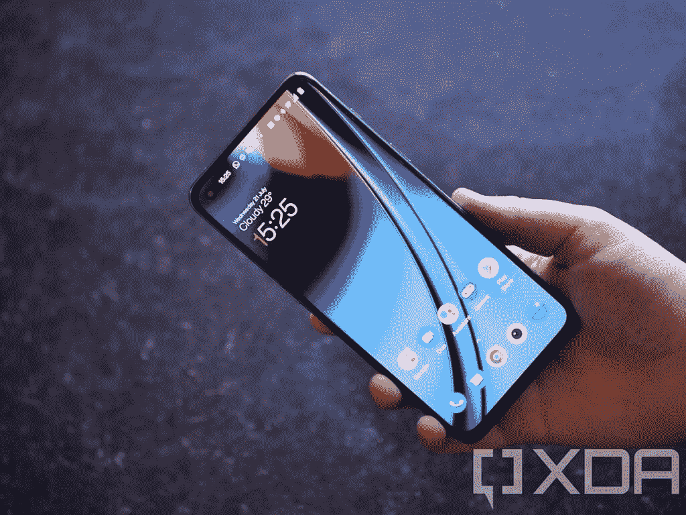
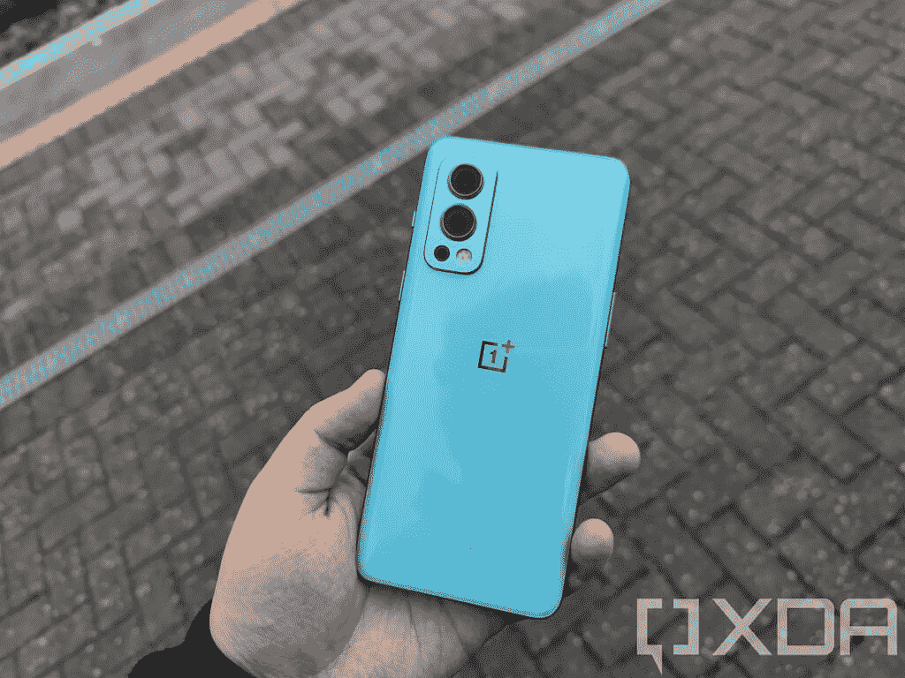
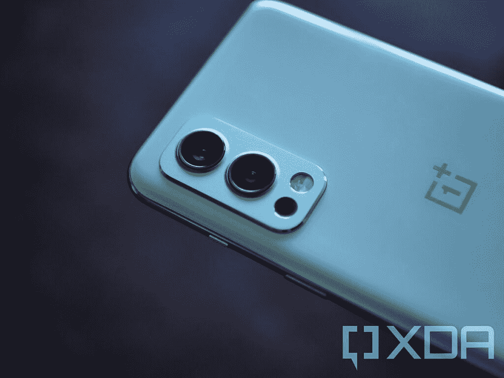

# 谷歌 Pixel 6 vs 一加诺德 2:你该买哪个？

> 原文：<https://www.xda-developers.com/google-pixel-6-vs-oneplus-nord-2/>

凭借其新的 [Pixel 6](https://www.xda-developers.com/google-pixel-6/) 智能手机，谷歌瞄准了价值旗舰爱好者，这一市场一直被一加的高端手机所占据，直到几年前。但随着一加旗舰手机变得更贵，该公司推出了 Nord 系列，以迎合中端和价值旗舰买家。因此，该公司最新的 Nord 系列旗舰产品——[一加诺德 2](https://www.xda-developers.com/oneplus-nord-2-review/)——是谷歌 Pixel 6 的竞争对手之一。

这篇文章将对比谷歌 Pixel 6 和一加诺德 2，看看这两款手机如何相互竞争。

**浏览本指南:**

## 谷歌像素 6 与一加诺德 2:规格

| 规格 | 像素 6 | 一加诺德 2 |
| --- | --- | --- |
| **尺寸和重量** | 

*   158.6 x 74.8 x 8.9 毫米
*   207 克

 | 

*   159.12 x 73.31 x 8.25mm 毫米
*   189 克

 |
| **显示** | 

*   6.4 英寸 AMOLED
*   FHD+ (1080 x 2340)
*   居中打孔机
*   90Hz 显示刷新率
*   HDR10+支持
*   高亮度模式
*   1600 万色的全 24 位深度
*   大猩猩玻璃 Victus

 | 

*   6.43 英寸 AMOLED
*   FHD+ (1080 x 2400)
*   左打孔机
*   90Hz 显示刷新率
*   HDR10+支持
*   大猩猩玻璃 5

 |
| **SoC** | 

*   谷歌张量八核芯片组

 | 

*   联发科天玑 1200 足球赛

 |
| **RAM 和存储器** | 

*   8GB LPDDR5 RAM
*   128GB/256GB UFS 3.1 闪存存储

 | 

*   6GB？8GB/ 12GB LPDDR4X 内存
*   128GB UFS 3.1 闪存存储

 |
| **电池&充电** | 

*   4，600 毫安时电池
*   30W 快速充电
*   21W 快速无线充电

 | 

*   4500 毫安时电池
*   65W 快速充电

 |
| **后置摄像头** | 

*   主摄像头:50MP f/1.8 三星 GN1 主摄像头
*   辅助:12MP f/2.2 超宽相机，114 度 FOV

 | 

*   主摄像头:5000 万像素 f/1.88 索尼 IMX766 主摄像头，OIS
*   辅助:800 万像素 f/2.25 超宽摄像头
*   第三级:2MP 单色传感器

 |
| **前置摄像头** | 800 万像素 f/2.0 | 32MP f/2.45 |
| **港口** | USB 类端口 |  |
| **连通性** | 

*   5G NR(毫米波，低于 6GHz)
*   国家足球联盟
*   蓝牙 5.2
*   WiFi 802.11 . b/g/n/AC/ax(2.4 GHz+5 GHz)

 | 

*   5G NR(低于 6GHz)
*   国家足球联盟
*   蓝牙 5.2
*   WiFi 802.11 . b/g/n/AC/ax(2.4 GHz+5 GHz)

 |
| **软件** | 

*   安卓 12
*   三年的操作系统更新
*   五年的安全更新

 | 

*   安卓 11
*   两年的操作系统更新
*   三年的安全更新

 |
| **其他特征** | 

*   光学显示下指纹读取器
*   立体声扬声器
*   IP68 防尘防水等级

 | 

*   显示屏下指纹识别器
*   立体声扬声器

 |

## 设计和展示

 <picture></picture> 

Google Pixel 6

尽管谷歌 Pixel 6 的价格颇具侵略性，但它看起来很高端，而且与它更大的兄弟——Pixel 6 Pro ()有着相同的设计。这款手机基本上是一个铝制框架的玻璃夹层。该公司还设法使其防水防尘等级达到 IP68。

另一方面，Nord 2 沿袭了一加 9 系列的外观。所以它也是一个玻璃三明治，但为了降低成本，一加选择了塑料框架，诺德 2 没有 IP 等级。

两款手机的整体尺寸也非常相似，但塑料框架使 Nord 2 轻了近 20 克。

在屏幕方面，Pixel 6 和 Nord 2 都有 90Hz 的 AMOLED 面板，分辨率为全高清以上。但是像素面板的尺寸是 6.4 英寸，而 Nord 2 的屏幕是 6.43 英寸。

总的来说，在设计和显示方面，Pixel 6 的 IP 等级和更高级的设计略有优势。购买手机时，别忘了查看我们对[最佳 Pixel 6 保护套](https://www.xda-developers.com/best-google-pixel-6-pro-cases/)和[最佳 Nord 2 保护套](https://www.xda-developers.com/best-oneplus-nord-2-cases/)的推荐。

## 处理器、内存和存储

 <picture></picture> 

OnePlus Nord 2

在这两款手机的 SoC 方面，事情稍微有趣一些。虽然谷歌首次选择在 Pixel 6 中使用自己的芯片——张量，但一加选择了联发科的 Dimensity 1200 SoC。

虽然张量芯片可以在 raw 基准测试中击败 Dimensity 1200，但在 real-like 中，Pixel 6 和 Nord 2 都将提供出色的性能，你不会有任何抱怨。

在其他功能中，Pixel 6 包含 8GB 内存和高达 256GB 的存储空间，而 Nord 2 则有 6、8 或 12GB 内存选项以及 128GB 存储空间。

## 谷歌像素 6 vs 一加诺德 2:相机

 <picture></picture> 

Pixel 6

谷歌在摄像头方面有明显的优势。这款手机配备了行业领先的相机设置，可以在正常和弱光条件下拍摄精彩的照片。它的广角摄像头不如主摄像头令人印象深刻，但它仍将击败 Nord 2 上令人印象深刻的广角摄像头。

相比之下，Nord 2 作为一款中端智能手机拍摄的照片不错，但 Pixel 6 则在另一个层面上。所以如果你拍很多照片，Pixel 6 是一个明确的选择。

谈到 raw 规格，Pixel 6 上有一个 50MP 主摄像头(拍摄 12.5MP 照片)，一个 12MP 广角拍摄器，一个 8MP 自拍摄像头。另一方面，你得到一个 50MP 的主摄像头，一个 8MP 的超广角摄像头，一个 2MP 的单色摄像头，一个 32MP 的自拍摄像头。

## 电池、连接和软件

 <picture></picture> 

OnePlus Nord 2

Pixel 6 和一加诺德 2 的电池容量几乎处于同一水平。Pixel 上有一块 4614 毫安时的电池，而一加手机装有一块 4500 毫安时的电池。因此，在中度到重度使用的情况下，这两款手机都可以轻松使用一天。

也就是说，Nord 2 在快速充电方面具有优势，因为这款手机支持 65W 快速充电，而 Pixel 6 的快速充电功率为 30W(实际为 21W)。然而，Nord 2 不支持无线充电，这是谷歌手机的一项功能。

谈到连接，尽管 Pixel 6 支持毫米波 5G，但仅限于美国，在其他市场，这款手机将只提供低于 6GHz 的 5G。一加 Nord 2 在美国不可用，在任何地方都只支持低于 6GHz 的 5G。其他连接功能，如蓝牙 5.2、NFC、USB Type-C 和 Wi-Fi 6 (6E on Pixel)，在两款手机上都可用。

软件是 Pixel 6 优于 Nord 2 的另一个领域。Pixel 不仅开箱运行 Android 12，手机还将获得三年的 OS 更新。相比较而言，Nord 2 运行的是 Android 11，未来会获得 Android 12 更新。它也将获得两年的操作系统更新。安全更新情况类似，Nord 2 将只获得三年的安全补丁，而 Pixel 将获得五年的安全更新。

## 价格和颜色选项

 <picture></picture> 

Google Pixel 6

一加诺德 2 比 Pixel 6 便宜得多。8GB RAM 型号在英国的定价为 399 英镑，相比之下，Pixel 6 在英国的起价为 599 英镑。

你可以购买灰色 Sierra、蓝色 Haze 和 Pac-Man 限量版的 Nord 2，而 Pixel 6 则有暴风雨黑、珊瑚色和海泡石色。

## 谷歌像素 6 vs 一加诺德 2:判决

 <picture></picture> 

OnePlus Nord 2

鉴于 Pixel 6 和一加诺德 2 之间的价格差异，在 Pixel 和 Nord 之间进行选择取决于你打算在手机上做什么。如果手机摄影不是什么大不了的事情，而且你也不介意不能很快(或者根本不能)获得最新版本的安卓系统，一加诺德 2 是一个不错的选择，它还能为你节省 200 英镑。但如果你想要旗舰级的相机和顶级的软件支持，Pixel 6 是更好的智能手机。

* * *

你打算买哪部手机？请在评论区告诉我们。与此同时，我们还为 Pixel 6 挑选了[最佳屏幕保护器，帮助你保持新手机屏幕的原始状态。](https://www.xda-developers.com/best-pixel-6-pro-screen-protectors/)

 <picture></picture> 

Google Pixel 6

Pixel 6 配备了谷歌新的张量芯片、现代设计和旗舰相机。

 <picture></picture> 

OnePlus Nord 2

##### 一加诺德 2

一加诺德 2 是一款中档智能手机，有很多优点。它性能稳定，摄像头好，充电速度极快。