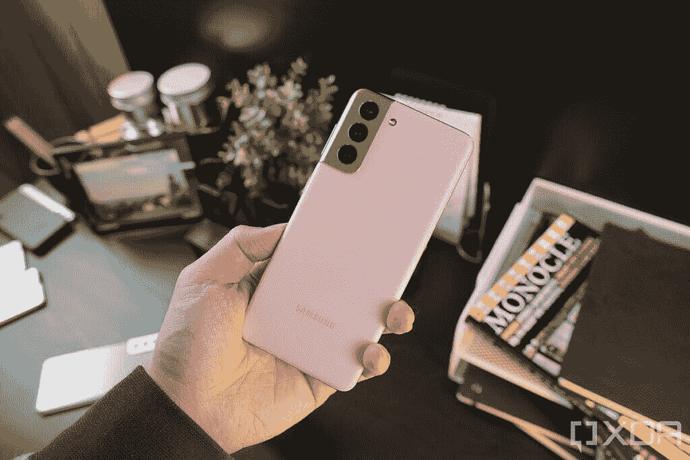

# 谷歌 Pixel 6 vs 三星 Galaxy S21:该买哪款实惠旗舰？

> 原文：<https://www.xda-developers.com/google-pixel-6-vs-samsung-galaxy-s21/>

三星已经成为安卓智能手机领域的领导者之一。除了偶尔失败，该公司一直在生产一些出色的旗舰智能手机。因此，每当另一家 Android 制造商生产旗舰产品时，都会被拿来与三星旗舰产品进行比较。作为同一传统的一部分，现在轮到 [Pixel 6](https://www.xda-developers.com/google-pixel-6/) 在 Galaxy S21 上获得这种待遇了。

这篇文章将对谷歌 Pixel 6 与[三星 Galaxy S21](https://www.xda-developers.com/samsung-galaxy-s21/) 进行对比，看看这两款旗舰如何相互抗衡。

**浏览本指南:**

## 谷歌 Pixel 6 与三星 Galaxy S21:规格

| 规格 | 谷歌像素 6 | 三星 Galaxy S21 |
| --- | --- | --- |
| **尺寸和重量** | 

*   158.6 x 74.8 x 8.9 毫米
*   207 克

 | 

*   151.7 x 71.2 x 7.9 毫米
*   171g

 |
| **显示** | 

*   6.4 英寸 AMOLED
*   FHD+ (1080 x 2340)
*   居中打孔机
*   90Hz 显示刷新率
*   HDR10+支持
*   高亮度模式
*   1600 万色的全 24 位深度
*   大猩猩玻璃 Victus

 | 

*   6.2 英寸 AMOLED
*   FHD+ (1080 x 2400)
*   居中打孔机
*   120Hz 显示器刷新率
*   HDR10+支持
*   1600 万色的全 24 位深度
*   大猩猩玻璃 Victus

 |
| **SoC** | 

*   谷歌张量八核芯片组

 | 

*   高通骁龙 888 足球俱乐部

 |
| **RAM 和存储器** | 

*   8GB LPDDR5 RAM
*   128GB/256GB UFS 3.1 闪存存储

 | 

*   8GB LPDDR5 RAM
*   128GB/ 256GB UFS 3.1 闪存存储

 |
| **电池&充电** | 

*   4，600 毫安时电池
*   30W 快速充电
*   21W 快速无线充电

 | 

*   4000 毫安时电池
*   25W 快速充电
*   15W 快速无线充电

 |
| **后置摄像头** | 

*   主摄像头:50MP f/1.8 三星 GN1 主摄像头
*   辅助:12MP f/2.2 超宽相机，114 度 FOV

 | 

*   主摄像头:1200 万像素 f/1.8 主摄像头，OIS
*   辅助:12MP f/2.2 超宽摄像头
*   第三代:6400 万像素长焦

 |
| **前置摄像头** | 800 万像素 f/2.0 | 10MP f/2.2 |
| **港口** | USB 类端口 |  |
| **连通性** | 

*   5G NR(低于 6GHz，毫米波)
*   国家足球联盟
*   蓝牙 5.2
*   C 型端口
*   WiFi 802.11 . b/g/n/AC(2.4 GHz+5 GHz)

 | 

*   5G NR(低于 6GHz 和毫米波)
*   国家足球联盟
*   蓝牙 5.2
*   C 型端口
*   WiFi 802.11 . b/g/n/AC/ax(2.4 GHz+5 GHz)

 |
| **软件** | 

*   安卓 12
*   三年的操作系统更新
*   五年的安全更新

 | 

*   安卓 11
*   三年的操作系统更新
*   四年的安全更新

 |
| **其他特征** | 

*   光学显示下指纹读取器
*   立体声扬声器
*   IP68 防尘防水等级

 | 

*   显示屏下指纹识别器
*   IP68 防水防尘等级
*   立体声扬声器

 |

## 设计和展示

 <picture></picture> 

Google Pixel 6

Pixel 6 和 Galaxy S21 的设计都没有什么特别之处。但这两款智能手机看起来都很棒，有溢价的外观。虽然 Pixel 6 是玻璃夹层，但与其他 S21 系列手机不同，三星在 S21 上选择了塑料背面。

S21 的塑料背面具有哑光表面，看起来并不便宜。虽然玻璃看起来更好，但塑料在耐用性方面更有优势。由于大多数人都使用手机套，手机的背面无论如何都是隐藏的。当我们谈到保护套的话题时，如果你最终购买了其中一款手机，请确保查看我们精心挑选的[最佳 Pixel 6 保护套](https://www.xda-developers.com/best-google-pixel-6-pro-cases/)和 [Galaxy S21 保护套](https://www.xda-developers.com/best-galaxy-s21-cases/)。

虽然 Pixel 6 是 Pixel 6 系列中较小的手机，但它仍然是一款 6.4 英寸屏幕的巨型手机。另一方面，S21 因其 6.2 英寸的屏幕和更好的屏幕与机身比例而感觉更小。由于其塑料背面和更小的整体尺寸，三星手机也比 Pixel 轻 35 克以上。

虽然 Pixel 6 和 Galaxy S21 都使用 AMOLED 面板，但三星采用了 120Hz 的屏幕，而 Pixel 6 则采用了 90Hz 的显示屏。此外，S21 屏幕变得比像素 6 稍亮。

总体而言，Galaxy S21 凭借其更高的刷新率屏幕和亮度，在显示屏方面略有优势。也就是说，大多数人无法区分 90Hz 面板和 120Hz 面板。

## 处理器、内存和存储

 <picture></picture> 

Samsung Galaxy S21

谷歌今年基于三星 Exynos 2100 开发了自己的芯片，而不是依赖高通的智能手机芯片。这个张量芯片为 Pixel 6 提供动力，这是一个很好的首次尝试。像所有旗舰级芯片一样，它可以轻松处理一切，你不必担心滞后或口吃。该芯片还帮助谷歌在设备上提供几项机器学习和人工智能支持的功能，这在其他智能手机芯片上是不可能的。

三星在美国推出了高通骁龙 888 SoC，其他市场推出了 Exynos 2100 SoC。骁龙 888 是一款顶级的处理器，我们已经在今年的几款手机中看到了它的出色表现。

此外，这两款手机都有 8GB 的内存和 128GB 或 256GB 的板载存储。

## 谷歌 Pixel 6 vs 三星 Galaxy S21:相机

 <picture></picture> 

Google Pixel 6

Pixel 手机以实力著称，但三星旗舰手机在这一领域也不懈怠。因此，Pixel 6 和 Galaxy S21 都能拍摄出令人惊叹的照片，在它们之间进行挑选取决于你更喜欢哪种审美。例如，Pixel 6 照片具有高对比度和较冷的白平衡，而 Galaxy S21 照片具有过饱和的外观和高亮度。

在 raw 相机规格方面，你得到一个 50MP 主拍摄器(拍摄 12.5MP 照片)，一个 12MP 广角相机，和一个 8MP 自拍拍摄器。Galaxy S21 有一个 12MP 主摄像头，一个 12MP 广角摄像头，一个 64MP 长焦摄像头和一个 10MP 自拍摄像头。

总而言之，S21 的长焦拍摄器使手机比 Pixel 6 有一个优势，与 [Pixel 6 Pro](https://www.xda-developers.com/google-pixel-6-pro-review/) 不同，Pixel 6 Pro 没有长焦摄像头。所以如果你喜欢用长焦相机拍很多照片，你最好用三星手机。

## 电池、连接和操作系统

 <picture></picture> 

Samsung Galaxy S21

Pixel 6 装有 4，614 毫安时电池，而 S21 装有 4，000 毫安时电池。这种电池大小的差异影响了两款手机的续航时间。虽然这两款手机一次充电可以轻松供电一整天，但中度用户可以在 Pixel 6 上再偷半天时间，这在 S21 上更难。

Galaxy S21 在快速充电能力方面略有优势，因为这款手机支持 25W 快速充电。虽然 Pixel 6 号称拥有 30W 的快速充电速度，但这款手机最多只能充电 21W。这意味着 S21 将比使用兼容快速充电器的 Pixel 6 充电更快。

在连接方面，S21 支持美国三大运营商——美国电话电报公司、T-Mobile 和威瑞森——的毫米波和低于 6GHz 的 5G。另一方面，Pixel 6 仅在美国电话电报公司和威瑞森支持毫米波 5G，T-Mobile 用户无法获得低于 6GHz 的 5G 支持。

在软件方面，Pixel 6 运行现成的 Android 12。Galaxy S21 配有一个 UI 的 Android 11。但是它已经收到了 [Android 12 和一个 UI 4.0 更新](https://www.xda-developers.com/galaxy-21-oneui-4-esim/)。

此外，Pixel 6 和 S21 都将获得三年的 Android 更新。但 Galaxy S21 将只能获得四年的安全补丁，而 Pixel 6 则需要五年。

## 价格和颜色选项

 <picture></picture> 

Google Pixel 6

谷歌对 Pixel 6 的定价相当激进。128GB 版本的起价为 599 美元。另一方面，S21 的零售价为 799 美元起。这种价格差异使 Pixel 比三星手机有明显优势。

Pixel 6 有三种颜色可供选择——暴风雨黑、珊瑚色和海洋泡沫——而 S21 有四种颜色——幻影紫、幻影灰、幻影白和幻影粉。

## 谷歌 Pixel 6 vs 三星 Galaxy S21:判决

鉴于 Galaxy S21 和 Pixel 6 之间的价格差异，谷歌手机显然是一个更好的选择。但如果你更喜欢 120 赫兹的显示器或长焦相机，并能在打折时买到便宜的三星手机，这也是一笔不错的买卖。另一方面，如果你不在乎这两件事，Pixel 6 是一个非常全面的包，价格也很合理。

这两款手机你打算买哪一款？请在评论区告诉我们。与此同时，不要忘记查看 Pixel 6 和 [Galaxy S21](https://www.xda-developers.com/best-galaxy-s21-deals/) 上的[特价商品，以节省一些钱。我们还为 Pixel 6](https://www.xda-developers.com/best-google-pixel-6-pro-deals/) 和 [Galaxy S21](https://www.xda-developers.com/best-galaxy-s21-screen-protectors/) 挑选了[最佳屏幕保护器，它们可以帮助你保护这些 AMOLED 显示屏免受划伤。](https://www.xda-developers.com/best-pixel-6-pro-screen-protectors/)

 <picture></picture> 

Google Pixel 6

Pixel 6 配备了谷歌新的张量芯片、现代设计和旗舰相机。

 <picture></picture> 

Samsung Galaxy S21

三星 Galaxy S21 是 2021 年新旗舰系列的起点，包装在一个旗舰 SoC 中，以及一个体面的显示器和相机设置。