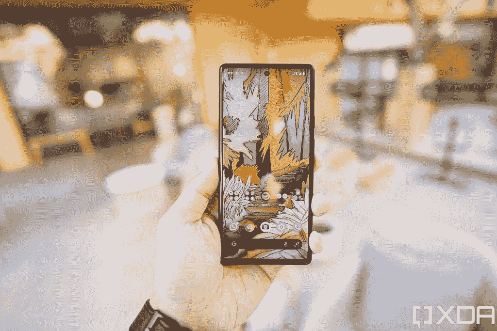
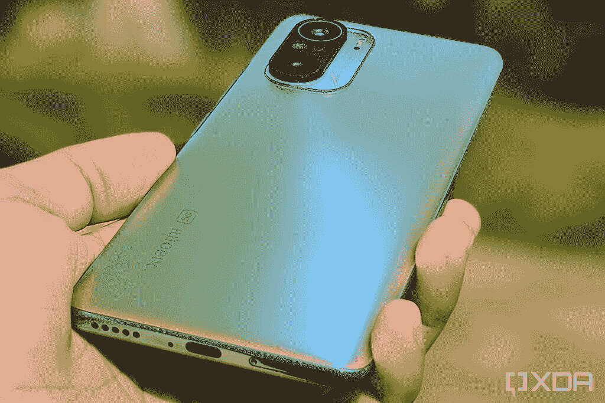

# 谷歌 Pixel 6 vs 小米 Mi 11X Pro:该买哪个？

> 原文：<https://www.xda-developers.com/google-pixel-6-vs-xiaomi-mi-11x-pro/>

谷歌 Pixel 6 是一款超值旗舰产品。但市场上有不少智能手机可以以类似甚至更低的价格与之抗衡。[小米的 Mi 11X Pro](https://www.xda-developers.com/xiaomi-mi-11x-pro-review/) 就是这样一款手机。所以在这篇文章中，我们将谷歌 Pixel 6 与小米 Mi 11X Pro 进行对比，看看这两款手机如何相互抗衡。

**浏览本指南:**

## 谷歌 Pixel 6 vs 小米 Mi 11X Pro:规格

| 规格 | 谷歌像素 6 | 小米 Mi 11X Pro |
| --- | --- | --- |
| **尺寸和重量** | 

*   158.6 x 74.8 x 8.9 毫米
*   207 克

 | 

*   163.7 x 76.4 x 7.8 毫米
*   196 克

 |
| **显示** | 

*   6.4 英寸 AMOLED
*   FHD+ (1080 x 2340)
*   居中打孔机
*   90Hz 显示刷新率
*   HDR10+支持
*   高亮度模式
*   1600 万色的全 24 位深度
*   大猩猩玻璃 Victus

 | 

*   6.67 英寸 AMOLED
*   FHD+ (1080 x 2400)
*   居中打孔机
*   120Hz 显示器刷新率
*   HDR10+支持
*   大猩猩玻璃 5

 |
| **SoC** | 

*   谷歌张量八核芯片组

 | 

*   高通骁龙 888 足球俱乐部

 |
| **RAM 和存储器** | 

*   8GB LPDDR5 RAM
*   128GB/256GB UFS 3.1 闪存存储

 | 

*   8GB LPDDR5 RAM
*   128GB/ 256GB UFS 3.1 闪存存储

 |
| **电池&充电** | 

*   4，600 毫安时电池
*   30W 快速充电
*   21W 快速无线充电

 | 

*   4，520 毫安时电池
*   33W 快速有线充电

 |
| **后置摄像头** | 

*   主摄像头:50MP f/1.8 三星 GN1 主摄像头
*   辅助:12MP f/2.2 超宽相机，114 度 FOV

 | 

*   初级:108 百万像素，f/1.75
*   辅助:800 万像素，f/2.2 超宽摄像头
*   高等教育:500 万，f/2.4 泰勒马克

 |
| **前置摄像头** | 800 万像素 f/2.0 | 20MP f/2.45 |
| **港口** | USB 类端口 |  |
| **连通性** | 

*   5G NR(低于 6GHz，毫米波)
*   国家足球联盟
*   蓝牙 5.2
*   WiFi 802.11 . b/g/n/AC(2.4 GHz+5 GHz)

 | 

*   5G NR(低于 6GHz)
*   蓝牙 5.2
*   WiFi 802.11 . b/g/n/AC/ax(2.4 GHz+5 GHz)

 |
| **软件** | 

*   安卓 12
*   三年的操作系统更新
*   五年的安全更新

 |  |
| **其他特征** | 

*   光学显示下指纹读取器
*   立体声扬声器
*   IP68 防尘防水等级

 | 

*   侧装式指纹读取器
*   立体声扬声器

 |

## 设计和展示

 <picture></picture> 

Google Pixel 6

Pixel 6 和 Mi 11X Pro 都是高端智能手机，它们采用了久经考验的玻璃夹层设计。然而，虽然谷歌手机有一个铝制框架，但小米智能手机却有一个塑料框架。塑料框架对 Mi 11X Pro 没有太大帮助，因为它的屏幕尺寸更大，手机仅比像素轻 10 克左右。它也没有 IP 认证，而 Pixel 6 的防尘防水性能通过了 IP68 认证。

但 Mi 11X Pro 在显示屏方面具有优势，因为与 Pixel 6 的 90Hz 面板相比，这款手机拥有 120Hz 的刷新率屏幕。此外，这两款手机都具有全高清+分辨率，并支持其他显示规格的 HDR10+。不过，Mi 11X Pro 屏幕略大于 6.67 英寸的像素。Pixel 6 采用 6.4 英寸显示屏。

## 处理器、内存和存储

 <picture></picture> 

Xiaomi Mi 11X Pro display under strong sunlight

与之前的 Pixel 手机迭代不同，谷歌在 Pixel 6 和 [Pixel 6 Pro](https://www.xda-developers.com/google-pixel-6-pro-review/) 中使用了自己的张量芯片。该芯片在大多数方面都提供了顶级的性能，但对于高端游戏来说并不是最好的。也就是说，如果你是一个休闲游戏玩家，你不会有任何问题。

另一方面，Mi 11X Pro 配备了骁龙 888 SoC，我们已经在几乎所有其他 Android 旗舰产品中看到过。骁龙芯片已经表明，它几乎可以处理你扔给它的任何东西，包括高端游戏。

两款手机在内存和存储方面完全相同，拥有 8GB 内存和高达 256GB 的 UFS 3.1 存储。

## 谷歌 Pixel 6 vs 小米 Mi 11X Pro:相机

 <picture></picture> 

Google Pixel 6

手机摄影是每个 Pixel 手机都大放异彩的一个领域，Pixel 6 也不例外。这款手机的主摄像头拍摄的照片非常棒，细节和对比度都很好。照片也有准确的颜色。然而，广角射手略显平庸，它甚至不如它的一些竞争对手，包括米 11X Pro。

Mi 11X Pro 的主摄像头也可以拍摄出细节丰富的好照片。尽管如此，照片可以有更好的动态范围，小米的后期处理也导致阴影细节的损失。此外，尽管小米手机的广角摄像头比 Pixel 6 的视野更广，但其照片质量也令人印象深刻。

## 电池、连接和软件

 <picture></picture> 

Xiaomi Mi 11X Pro

Pixel 6 和 Mi 11X Pro 在电池正面类似，分别是 4，614mAh 和 4，520mAh 电池。这体现在电池性能上，因为这两款手机一次充电可以轻松使用一天。但是 Mi 11X Pro 支持 33W 快充，实际上像宣传的那样工作。不过 Pixel 6 宣传的 30W 快充支持更像是 21W 快充。此外，谷歌手机支持无线充电，这是小米手机所不具备的。

这两款手机的连接选项基本一致，但也有一些关键差异。例如，Pixel 6 具有 Wi-Fi 6e，并在美国支持 mmWave 5G，而 Mi 11X Pro 具有 Wi-Fi 6，仅支持两个低于 6GHz 的 5G 频段。小米手机也缺少 NFC。

Pixel 6 在软件部门获得了谷歌的优势，因为它自带 Android 12。该手机还将获得三年的操作系统更新和五年的安全补丁。另一方面，Mi 11X Pro 运行 Android 11，但其软件更新未来目前尚不清楚。

## 定价和颜色选项

 <picture></picture> 

Google Pixel 6

Mi 11X Pro 只在印度销售，谷歌没有在印度销售 Pixel 6，所以很难比较它们的定价。但为了记录起见， [Pixel 6 在美国的起价为 599 美元](https://www.xda-developers.com/best-google-pixel-6-pro-deals/)，而你可以购买起价为 36999 印度卢比(约 492 美元)的 Mi 11X Pro。

每部手机有三种颜色可供选择。Pixel 6 有风暴黑、珊瑚黑和海鲜黑三种颜色，Mi 11X Pro 有天空银、宇宙黑和月球白三种颜色。

## 谷歌 Pixel 6 vs 小米 Mi 11X Pro:判决

 <picture></picture> 

Xiaomi Mi 11X Pro

这两款手机都有理由支持。Mi 11X Pro 更便宜，拥有经过测试的旗舰 SoC，并具有更快的刷新率显示屏。另一方面，Pixel 6 提供了行业领先的相机性能、出色的性能和顶级的软件支持。因此，在这两款优秀的设备之间进行选择，归根结底就是哪个功能对你来说更重要。

然而，最终决定买什么可能在很大程度上取决于你在世界上的什么地方买。印度和中国的用户无法购买 Pixel 6，因此他们别无选择，只能购买 Mi 11X Pro。而美国等地区的用户无法获得 Mi 11X Pro，因此 Pixel 6 仍然是唯一的选择。

* * *

这两款手机你喜欢哪一款？请在评论区告诉我们。如果你最终购买了 Pixel 6，请确保查看我们的[最佳 Pixel 6 保护套](https://www.xda-developers.com/best-google-pixel-6-pro-cases/)和[最佳 Pixel 6 屏幕保护套](https://www.xda-developers.com/best-pixel-6-pro-screen-protectors/)建议，以保护你的手机。

 <picture></picture> 

Google Pixel 6

Pixel 6 配备了谷歌新的张量芯片、现代设计和旗舰相机。

 <picture></picture> 

Xiaomi Mi 11X Pro

##### 小米 Mi 11X Pro

米 11X Pro 是一款功能丰富的旗舰杀手，拥有 120Hz AMOLED 显示屏，骁龙 888，108MP 摄像头等。