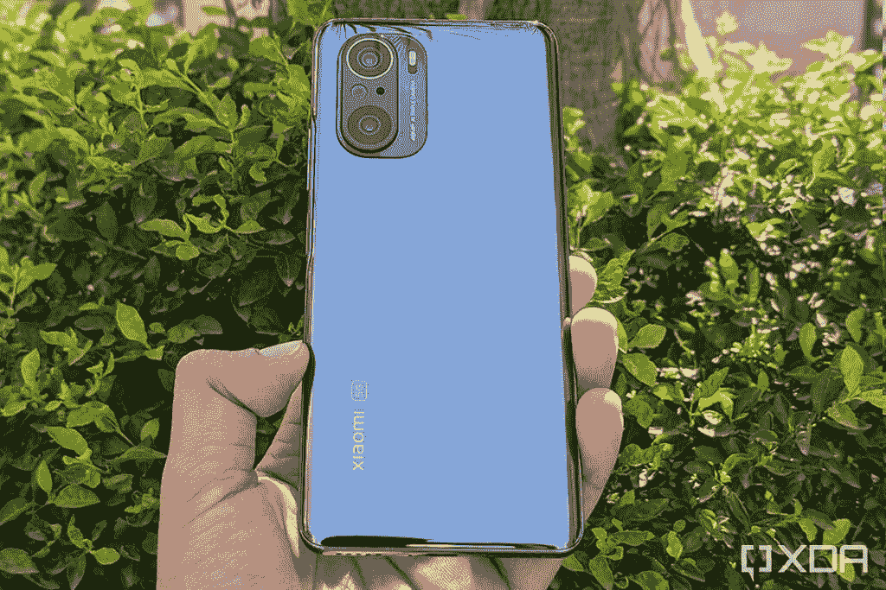
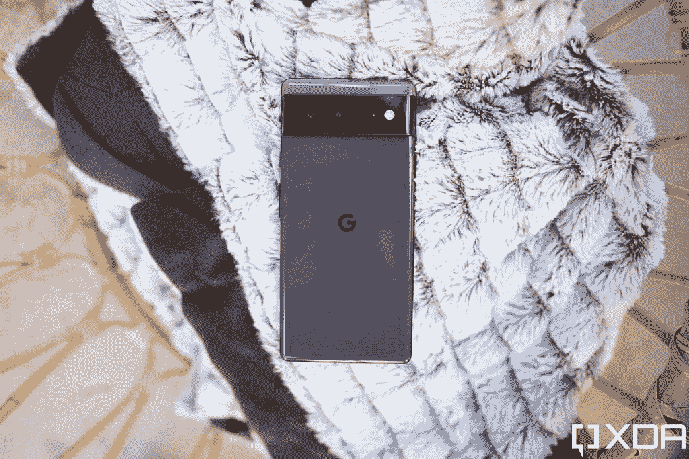
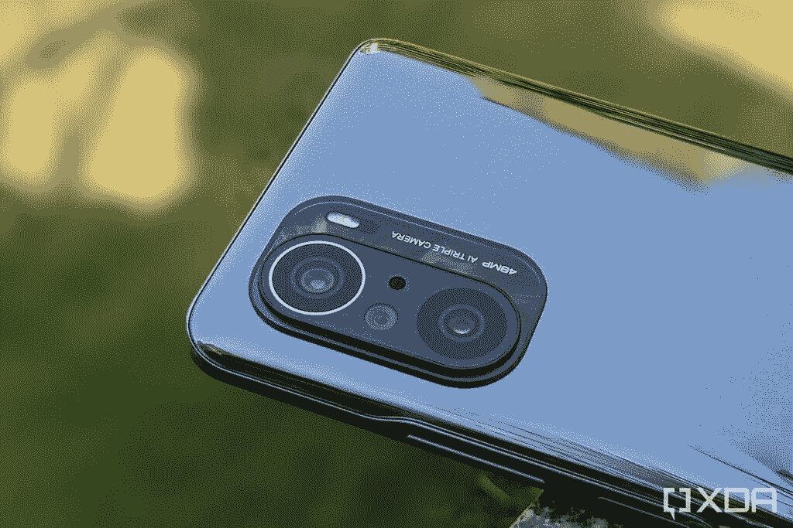
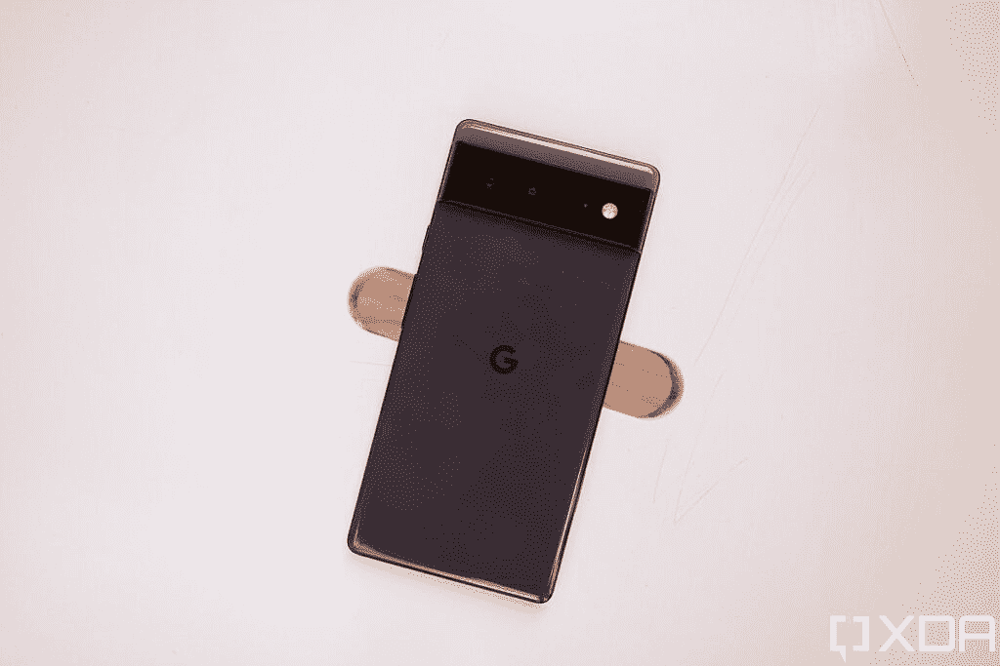

# 谷歌 Pixel 6 vs 小米 Mi 11X:该买哪个价值旗舰？

> 原文：<https://www.xda-developers.com/google-pixel-6-vs-xiaomi-mi-11x/>

谷歌 Pixel 6 凭借其极具竞争力的价格和高端规格，已经成为一款超值旗舰产品。许多消费者对这款手机感到非常兴奋，并考虑在下次购买智能手机时购买。但它不是市场上唯一的超值旗舰。小米的 Mi 11X 是另一款出色的高端智能手机，价格极具竞争力。小米 11X 是同一款智能手机，在中国被称为 Redmi K40，在欧洲被称为 Poco F3。

本文将对[谷歌 Pixel 6](https://www.xda-developers.com/google-pixel-6-pro-review/) vs [小米 Mi 11X](https://www.xda-developers.com/xiaomi-mi-11x-pro-review/) 进行对比，看看这两款手机的实力如何。

**浏览本指南:**

## 谷歌 Pixel 6 vs 小米 Mi 11X:规格

| 规格 | 谷歌像素 6 | 小米 Mi 11X |
| --- | --- | --- |
| **尺寸和重量** | 

*   158.6 x 74.8 x 8.9 毫米
*   207 克

 | 

*   163.7 x 76.4 x 7.8 毫米
*   196 克

 |
| **显示** | 

*   6.4 英寸 AMOLED
*   FHD+ (1080 x 2340)
*   居中打孔机
*   90Hz 显示刷新率
*   HDR10+支持
*   高亮度模式
*   1600 万色的全 24 位深度
*   大猩猩玻璃 Victus

 | 

*   6.67 英寸 Super AMOLED
*   FHD+ (1080 x 2400)
*   居中打孔机
*   120Hz 显示器刷新率
*   HDR10+支持
*   1600 万色的全 24 位深度
*   大猩猩玻璃 5

 |
| **SoC** | 

*   谷歌张量八核芯片组

 | 

*   高通骁龙 870 SoC

 |
| **RAM 和存储器** | 

*   8GB LPDDR5 RAM
*   128GB/256GB UFS 3.1 闪存存储

 | 

*   6/8GB LPDDR5 RAM
*   128GB UFS 3.1 闪存存储

 |
| **电池&充电** | 

*   4，600 毫安时电池
*   30W 快速充电
*   21W 快速无线充电

 | 

*   4，520 毫安时电池
*   33W 快速充电

 |
| **后置摄像头** | 

*   主摄像头:50MP f/1.8 三星 GN1 主摄像头
*   辅助:12MP f/2.2 超宽相机，114 度 FOV

 | 

*   主摄像头:480 万像素 f/1.79 主摄像头
*   辅助:800 万像素 f/2.2 超宽摄像头
*   高等教育:5MP 远程教育，f/2.4

 |
| **前置摄像头** | 800 万像素 f/2.0 | 20MP f/2.45 |
| **端口** | USB 类端口 |  |
| **连通性** | 

*   5G NR(低于 6GHz，毫米波)
*   国家足球联盟
*   蓝牙 5.2
*   WiFi 802.11 . b/g/n/AC(2.4 GHz+5 GHz)

 | 

*   5G NR(低于 6GHz)
*   蓝牙 5.1
*   C 型端口
*   WiFi 802.11 . b/g/n/AC/ax(2.4 GHz+5 GHz)

 |
| **软件** | 

*   安卓 12
*   三年的操作系统更新
*   五年的安全更新

 |  |
| **其他特征** | 

*   光学显示下指纹读取器
*   立体声扬声器
*   IP68 防尘防水等级

 | 

*   侧装式指纹读取器
*   立体声扬声器

 |

## 设计和展示

 <picture></picture> 

Google Pixel 6

谷歌 Pixel 6 和小米 Mi 11X 采用了玻璃夹层设计。但 Pixel 采用了铝制框架，而 Mi 11X 采用了塑料框架。虽然塑料框架有助于小米手机保持重量，但感觉比谷歌手机略低。

谷歌和小米手机的正面基本相似，但两家公司使用了非常不同的摄像头模块设计。

说到显示器，Pixel 6 配备了 6.4 英寸的 AMOLED 屏幕，具有 FHD+分辨率和 90Hz 的刷新率。另一方面，Mi 11X 配备了 6.67 英寸的 Super AMOLED 屏幕，具有 FHD+分辨率和 120Hz 的刷新率。

## 处理器、内存和存储

 <picture></picture> 

Xiaomi Mi 11X

在与高通合作多年后，谷歌今年开发了自己的芯片，并将其用于 Pixel 6。该芯片被称为 Tensor，使用 Exynos 2100 SoC 作为其基础，并融入了谷歌的几项调整，以实现更好的机器学习和人工智能功能。作为旗舰级芯片，Pixel 6 提供了顶级的体验。

小米 Mi 11X 由高通骁龙 870 驱动，这是该公司 2020 年旗舰芯片骁龙 865 的超频版本。虽然它没有骁龙 888 那么强大，但 870 芯片仍然非常强大，并提供出色的性能。

Pixel 6 包装了 8GB 的 RAM 和 128/ 256GB 的其他规格的存储空间。然而，为了控制基本变体定价，小米刚刚在其中放了 6GB RAM。但也有 8GB 内存版本。两种型号都有 128GB 的存储空间。

## 谷歌 Pixel 6 vs 小米 Mi 11X:摄像头

 <picture></picture> 

Google Pixel 6

与其他上一代 Pixel 手机一样，Pixel 6 在摄像头方面表现出色，手机可以拍摄出精彩的照片。无论你是在标准照明还是弱光场景下拍摄，都不会让你失望。

Pixel 6 的背面有两个摄像头——一个 50MP 的主拍摄者，可以拍摄 12.5MP 的照片，一个 12MP 的广角摄像头。相比之下，Mi 11X 的背面有三个摄像头——一个 48MP 主摄像头，一个 8MP 广角摄像头和一个 5MP 微距摄像头。

米 11X 拍出的照片也还过得去，但没有达到 Pixel 6 的水平。这款手机在弱光环境下也很难应对噪音。

Pixel 6 上还有一个 800 万像素的自拍摄像头，Mi 11X 上有一个 200 万像素的前置摄像头。

## 电池、连接和软件

 <picture></picture> 

Xiaomi Mi 11X with a 48MP primary camera

Pixel 6 和 Mi 11X 的电池容量没有太大差异。Pixel 6 配有 4614 毫安时电池，而 Mi 11X 配有 4520 毫安时电池。这两款手机都支持快速有线充电。不过小米手机上没有无线充电支持。

在连接选项方面，谷歌手机支持 5G(美国以外的低于 6GHz，美国的毫米波+低于 6GHz)，4G LTE，Wi-Fi 6e，蓝牙 5.2 和 NFC。相比之下，Mi 11X 仅支持低于 6GHz 的 5G、4G LTE、Wi-Fi 6 和蓝牙 5.1。

软件是 Pixel 6 占据优势的另一个领域，因为它自带 Android 12，并将获得至少三年的操作系统更新和五年的安全补丁。米 11X 运行在 Android 11 上。没有关于手机软件更新未来的消息。

## 定价

 <picture></picture> 

Google Pixel 6

由于小米 Mi 11X 在印度销售，Pixel 6 在那里不可用，我们将使用 Poco F3 欧洲价格与 Pixel 6 进行比较。如前所述，Poco F3 本质上与 Mi 11X 是同一款手机。

在欧洲，8GB + 128GB 的 Pixel 6 零售价为 649 欧元。相比之下，6GB + 128GB 型号的 Mi 11X 起价为 299 欧元。8GB 型号的小米手机售价为 399 欧元。

## 谷歌 Pixel 6 vs 小米 Mi 11X:结论

就价格而言，Pixel 6 和 Mi 11X 都是优秀的智能手机。当然，Mi 11X 明显更便宜，但有了 Pixel 6，你就可以获得业界领先的摄像头和更好的软件支持。也就是说，如果相机性能对你来说不是一个大问题，Mi 11X 是一个很好的选择，将帮助你节省一些钱，同时提供出色的整体性能。

然而，最终决定买什么可能在很大程度上取决于你在世界上的什么地方买。印度和中国的用户无法购买 Pixel 6，因此他们别无选择，只能购买 Mi 11X。而美国等地区的用户无法获得 Mi 11X，因此 Pixel 6 仍然是唯一的选择。

这两款手机你打算买哪一款？请在评论区告诉我们。同时，我们还挑选了[最佳 Pixel 6 保护套](https://www.xda-developers.com/best-google-pixel-6-pro-cases/)和[屏幕保护套](https://www.xda-developers.com/best-pixel-6-pro-screen-protectors/)来帮助你保护你购买的谷歌手机。

 <picture></picture> 

Sorta Seaform

Pixel 6 配备了谷歌新的张量芯片、现代设计和旗舰相机。

 <picture></picture> 

Xiaomi Mi 11X

##### 小米 Mi 11X

小米 11X 是小米最新的平价旗舰产品，配有骁龙 870 SoC、48MP 三摄像头和无广告 MIUI 体验。