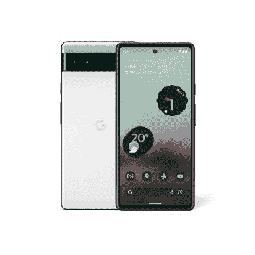

# 谷歌 Pixel 6a 支持 5G 吗？

> 原文：<https://www.xda-developers.com/google-pixel-6a-5g-support/>

谷歌新的 [Pixel 6a](https://www.xda-developers.com/google-pixel-6a-review/) 智能手机以合理的价格提供了许多出色的功能，其中包括 5G 支持。尽管它的名字中没有像 Pixel 5a 5G 那样有 5G，但这款手机确实支持 5G 连接。这是因为它由谷歌张量(Google Tensor)提供支持，这与 Pixel 6 和 Pixel 6 Pro 中使用的芯片组相同，其中包括一个支持 5G 的调制解调器。所以回答主要问题，是的，谷歌 Pixel 6a 支持 5G。这对于解锁和运营商锁定型号的手机都是如此，因此无论你选择哪种型号，你都可以连接到 5G 网络。然而，Pixel 6a 上的 5G 支持带来了一个问题。

## 谷歌 Pixel 6a 5G 支持:6 GHz 以下和毫米波

有不同类型的 5G 网络，只有某些手机倾向于与所有网络兼容。同样，Pixel 6a 的所有型号都不能与所有 5G 网络兼容。谷歌 Pixel 6a 的解锁版本仅适用于低于 6 5G 的网络。甚至包括 T-Mobile 和美国电话电报公司在内的一些美国主要运营商出售的运营商锁定版本也只支持 sub-6 5G，尽管它们的品牌不同。例如，威瑞森将其 Sub-6 5G 品牌称为“全国 5G”，美国电话电报公司称之为“5G”，而 T-Mobile 称之为“扩展范围 5G”。

那些希望通过毫米波 5G 获得 Pixel 6a 的人将不得不转向威瑞森。毫米波 5G 变种比普通型号贵 50 美元，这意味着你必须为威瑞森 Pixel 6a 支付 499 美元，而不是标准的 449 美元。Sub-6 5G 对大多数人来说应该足够了，但如果你碰巧住在一个大城市，并且想要最快的速度，那么拥有 mmWave 5G 支持也很好。

* * *

 <picture></picture> 

Google Pixel 6a

谷歌 Pixel 6a 支持 5G，但并非所有型号都支持快速的毫米波 5G 网络。

如果你正在购买 Pixel 6a，并想知道在哪里可以买到最优惠的价格，那么一定要查看我们收集的[最佳 Pixel 6a 优惠](https://www.xda-developers.com/best-google-pixel-6a-deals/)，以便在网上获得最佳价格。你也可以停下来看看我们收集的[最佳像素 6a 外壳](https://www.xda-developers.com/best-google-pixel-6a-cases/)，为你的设备买一个高质量的外壳。