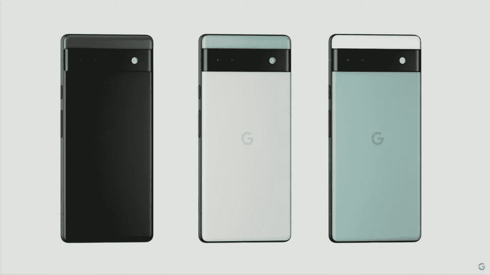

# 谷歌 Pixel 6a 有 eSIM 吗？

> 原文：<https://www.xda-developers.com/google-pixel-6a-esim/>

所以你已经看过商业或广告，对谷歌 Pixel 6a 有点好奇。谁也不会责怪你，这是一部智能手机的发电站，由谷歌的旗舰张量处理器提供动力，并提供了一个极化但独特的设计。当然，你可能已经知道所有的细节，比如它的双 12MP 摄像头和显示指纹识别器，但它是否能接受 eSIM 呢？这是一些人在购买智能手机时可能不会考虑的规格。那么谷歌 Pixel 6a 有激活 eSIM 的能力吗？长话短说，它确实像 2022 年发布的大多数手机一样。但是 eSIM 到底是什么，它是如何工作的？我们去看看。

## 什么是 eSIM？

eSIM 是一种嵌入式 SIM。这意味着 SIM 卡已经是智能手机的一部分，不需要实体 SIM 卡就可以激活。传统上，无线运营商会为你提供一张 SIM 卡，插入你的手机，这样它就可以提供无线服务。那么 eSIM 与传统的 SIM 卡有什么不同呢？显而易见，eSIM 可以多次编程，而传统 SIM 只能编程一次。eSIM 也可以用两个不同的数字进行编程。但是在这种情况下，只能同时使用一个号码。最后，eSIM 没有物理组件，它在手机内部，因此这增加了它的安全性。

## 如何对 eSIM 进行编程？

eSIM 最好的一点是，大多数时候，它可以在自己家里舒适地进行编程。由于它是一个数字组件，无线运营商可以激活服务，而无需客户进入零售店。但有一点需要注意，有些运营商不提供 eSIM 支持，因此在选择激活 eSIM 服务之前，请务必向您的运营商确认。一旦您确认可以使用 eSIM 激活，就该进入下一步了。

首先，你要打开设备，进行设置，并连接到 Wi-Fi 网络。在那里，您需要找到您的嵌入式身份证件(EID)号码。如果你不知道怎么做，你将进入**设置**菜单，进入**关于手机**，向下滚动直到你找到 **SIM 卡状态**菜单，最后向下滚动到 **EID。**选择 **EID** 获取您的号码。您需要将此号码交给您的无线运营商，因此请记下它或将其截图并保存在安全的地方。

一旦无线运营商将 EID 输入他们的系统，您将获得一个二维码。你可以进入**设置**菜单，然后进入**网络&互联网、**，最后进入**模拟人生**。点击“ **+** ”符号，在底部，您应该会看到一个选项，上面写着**下载 SIM 卡。**选择**下一个**，在列表中选择无线运营商，扫描之前发布的二维码。开始下载 eSIM 配置文件，请耐心等待，这可能需要五分钟时间。一旦完成，回到你的**设置**菜单，在**SIM 卡**下，你应该会看到一个无线运营商的 SIM 卡。选择它，打开它，并批准“开关”，从那里，它应该激活。

与标准 SIM 卡相比，激活过程稍微复杂一点，但请记住，这是一个数字 SIM 卡，所以任何时候你想改变服务，你都可以。只要确保你没有与无线运营商签订合同。你可以用新的 eSIM 卡对谷歌 Pixel 6a 进行无限编程。当然，你必须通过上面的程序。另外，如果你想在你的手机里有两个模拟人生，你可以这样做。如果你对此感到好奇，请查看我们的[谷歌 Pixel 6a 双 SIM 卡指南](https://www.xda-developers.com/google-pixel-6a-dual-sim)。

 <picture></picture> 

Google Pixel 6a

Pixel 6a 提供了一种独特的风格，强大的谷歌张量处理器和一个不错的相机。对于一部售价 449 美元的手机，你还能要求什么呢？

既然你已经知道如何编程你自己的 eSIM，也许是时候购买了。目前，Pixel 6a 有一些令人难以置信的交易。只要确保如果你购买它，也拿起一个[保护套](https://www.xda-developers.com/best-google-pixel-6a-cases/)。