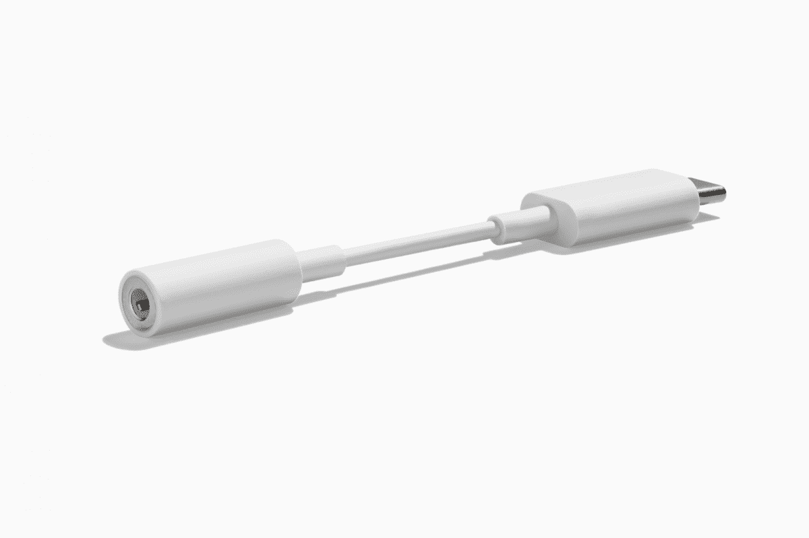

# 谷歌 Pixel 6a 有 3.5mm 耳机接口吗？

> 原文：<https://www.xda-developers.com/google-pixel-6a-headphone-jack/>

# 谷歌 Pixel 6a 有 3.5mm 耳机接口吗？

虽然谷歌 Pixel 6a 在许多方面都比以前的 Pixel A 手机进步了一大步，但实际上它在音频方面仍有不足。

Pixel 6a T1 是一款可靠的中档手机，可以做很多事情。它以更实惠的价格提供了旗舰 Pixel 6 的许多最佳功能(通过[惊人的 Pixel 6a 交易](https://www.xda-developers.com/best-google-pixel-6a-deals/)甚至更实惠)。虽然最新型号在许多方面都比以前的 Pixel A 手机进步了一大步，但实际上它在音频方面存在不足。

为了与旗舰 Pixel 6 和 Pixel 6 Pro 保持一致，新款 Pixel 6a 没有 3.5 毫米音频插孔。所有以前的 Pixel A 系列手机 Pixel 3a、Pixel 4a 和 Pixel 5a——都配有 3.5 毫米音频插孔。但这一长期趋势以 Pixel 6a 告终，这是 Pixel A 系列历史上第一次放弃音频插孔。如果你喜欢用你信赖的有线耳机听音乐，这个消息可能不会让你高兴。但是，您仍然可以使用 USB-C 转 3.5 毫米适配器让有线耳机与 Pixel 6a 配合使用。谷歌在其网站上正式出售一个，你可以在亚马逊上找到大量的第三方选项。然而，携带加密狗可能会很麻烦，所以大多数人最好使用真正的无线耳机。谷歌的新 Pixel Buds Pro 是最好的选择，如果你想要更多的推荐，我们最好的真正无线耳机综合服务有很多令人惊叹的选择。

 <picture></picture> 

Google USB Type C to 3.5mm headphone adapter

##### 谷歌 USB USB-C 转 3.5 毫米耳机适配器

这款小巧的适配器可让您将自己信赖的有线耳机与 Pixel 6a 连接起来。

Pixel 6a 不是第一款取消音频插孔的中端手机，如果最近的趋势有任何迹象，它可能不会是最后一款。例如，三星的 Galaxy A53 也放弃了有线音频连接。

 <picture></picture> 

Google Pixel 6a

谷歌 Pixel 6a 是一款坚固的中档手机，内置旗舰 Tensor SoC 和强大的摄像头。

尽管有其局限性和缺点，Pixel 6a 是市场上最好的中档手机之一。它采用了与 Pixel 6 相同的大胆设计和旗舰 Tensor 芯片组，并提供了出色的相机体验。一定要用外壳保护好你闪亮的新 Pixel 6a。查看我们对[最佳像素 6a 案例](https://www.xda-developers.com/best-google-pixel-6a-cases/)的综述，以获得建议。