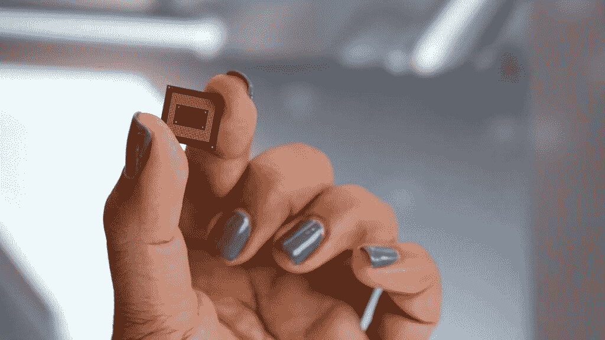

# 谷歌 Pixel 6a vs 摩托罗拉 Moto G 5G (2022 年):一边倒

> 原文：<https://www.xda-developers.com/google-pixel-6a-vs-motorola-moto-g-5g/>

摩托罗拉的中端手机在有限的北美移动领域一直表现不错，其 350 美元的 Moto G 5G 是另一个具有吸引力的价格点。但是谷歌的 A 系列带来了可能是迄今为止最大的挑战。虽然谷歌的 A 系列已经存在多年，但谷歌 Pixel 6a 可以说是搜索巨头有史以来最完美的“旗舰级”A 系列手机。

像素 6a 要贵 100 美元，所以在这个对比中，我们将看到像素 6a 是否真的“足够好”来证明额外的本杰明是值得的。

 <picture></picture> 

Google Pixel 6a

谷歌 Pixel 6a 带回了许多让 Pixel 6 变得很棒的东西，但包装更实惠。

 <picture></picture> 

Moto G 5G

##### Moto G 5G

Moto G 5G (2022)是一款非常实惠的入门级中级车，拥有大屏幕和快速、干净的 Android 软件。

**浏览本文:**

* * *

## Moto G 5G (2022) vs 谷歌 Pixel 6a:规格

|  | 

Moto G 5G (2022)

 | 

谷歌像素 6a

 |
| --- | --- | --- |
| 建设 | 

*   塑料背面和侧面
*   大猩猩玻璃 3 前面板

 | 

*   大猩猩玻璃 3 前面板
*   塑料背面和侧面
*   IP68 防水/防尘等级

 |
| 尺寸和重量 | 

*   165.4 x 75.8 x 9.44 毫米
*   204 克

 | 

*   158.6 x 74.8 x 8.9 毫米
*   207 克

 |
| 显示 | 

*   6.6 英寸 IPS 液晶屏
*   90Hz 刷新率
*   1080 x 2400 像素

 | 

*   6.1 英寸 AMOLED
*   FHD+
*   60Hz 刷新率
*   20:9 宽高比
*   康宁大猩猩玻璃 3

 |
| 社会学 |  |  |
| RAM 和存储 | 

*   4/6GB 内存
*   64GB/256GB 内部存储
*   microSD 卡插槽

 | 

*   6GB
*   128GB
*   没有 microSD 卡插槽

 |
| 电池和充电 | 

*   5000 毫安时电池
*   10W 有线充电
*   盒子里的充电器

 | 

*   4，306 毫安时电池
*   盒子里没有充电器

 |
| 安全性 | 

*   侧装式指纹传感器

 | 

*   光学显示器内指纹传感器

 |
| 后置摄像头 | 

*   50MP/1.8 Main(带 OIS)
*   2MP 深度传感器
*   2MP 宏

 | 

*   主要:1220 万像素主要
*   中学:12MP 超宽

 |
| 前置摄像头 |  |  |
| 港口 | 

*   USB 类型-C
*   3.5 毫米耳机插孔

 |  |
| 连通性 | 

*   5G
*   长期演进
*   wi-Fi 802.11 a/b/g/n/AC(2.4G+5 GHz)
*   蓝牙 5.1

 | 

*   5G
*   长期演进
*   Wi-Fi 802.11 a/b/g/n/ac/6
*   蓝牙 5.1

 |
| 软件 |  |  |
| 价格 |  |  |

* * *

## 谷歌 Pixel 6a vs Moto G 5G:硬件和设计

考虑到 Pixel 6a 和 Moto G 5G 相对较低的价格，两个框架都由塑料制成也就不足为奇了。但谷歌和 Moto 在塑料机身上涂上了更好的涂层，给它带来了更好的质感，这值得称赞。两款手机都有多种颜色，但我们更倾向于 Pixel 6a 的选项，其中包括一种华丽的浅绿色。

Moto G 更大更重，由于其 6.5 英寸的屏幕，高度为 165 毫米，重量为 204 克。相比之下，Pixel 6a 非常小巧，高度仅为 152 毫米，重量为 172 克。两款手机都是弯曲的，因此容易握持，但 Pixel 6a 由于重量更轻，所以更容易握持。

### 显示

Moto G 5G 的屏幕更大，刷新率更快，为 90Hz，但 Pixel 6a 的屏幕在大多数人看来会更有活力，因为它使用了有机发光二极管技术，可以显示比 Moto G 5G 的 IPS 液晶面板更深的红色和黑色。Pixel 6a 屏幕分辨率也更高，为 1080p 分辨率，而 Moto G 5G 的面板仅为 720p 面板。

这两款手机的最大亮度都没有旗舰手机亮，但在阳光下仍然可以看到它们。这些面板在这个价位上绝对没问题。

Moto G 5G 的屏幕更大，刷新率更快，为 90Hz，但由于有机发光二极管技术，Pixel 6a 的屏幕在大多数人看来更有活力

### 社会学

谷歌 Pixel 6a 运行在谷歌自己的张量上，这是谷歌在 2021 年为旗舰 Pixel 6 系列开发的旗舰级芯片。即使现在一岁了，Tensor 仍然非常有能力，特别是在处理机器学习任务方面，这是 Pixel 的面包和黄油。与此同时，Moto G 5G 运行在 Dimensity 700 上，这显然是一款中档芯片。Dimensity 700 的 CPU 时钟分数确实比 Tensor 低，GPU 也少了一个，但它仍然是一个稳定的表现者，可以处理任何日常的智能手机任务。除非你正在做一些高级的事情，比如渲染 4K 视频，否则 Dimensity 700 不会让你失望。

 <picture></picture> 

The Google Tensor.

但它仍然无法与 Tensor 相提并论，Tensor 拥有市场上最好的 ML 功能，包括为 Pixel 提供智能手机中最好的语音听写算法。Pixel 6a 的语音听写非常好，事实上，你可以说出整个句子，手机可以以 99%的准确率拾取它。Moto G 5G 在这方面根本没法比。

### 摄像机

Pixel 6a 在这一领域取得了压倒性的胜利，因为它带来了接近旗舰级别的相机体验，而 Moto G 5G 则带来了非常明显的中端相机体验。Pixel 6a 的主系统由一对覆盖宽焦距和超宽焦距的 12MP 拍摄器组成，而 Moto G 5G 实际上只有一个摄像头，一个 50MP 的主摄像头两侧是一对无用的 2MP 传感器。超宽焦距的缺乏限制了 Moto G 5G 相机的功能。但更重要的是，Pixel 6a 的主摄像头在图像处理方面仅领先数英里，这要归功于张量 SoC，它包括谷歌自己的 ISP(图像信号处理器)来处理图像。几乎在任何情况下，Pixel 6a 都可以拍摄出清晰、平衡、动态的照片，而 Moto G 5G 在任何不理想的光线下都会受到影响。

在自拍方面，Moto G 表现更好，因为它的 1300 万像素摄像头比 Pixel 的 800 万像素摄像头更符合 2022 年的标准。谷歌的计算摄影仍然可以产生一些优秀的自拍，但 8MP 有点不足，如果你放大和像素窥视，你可以开始看到个别像素。

### 内存和其他硬件位

Pixel 6a 目前只有一种配置:6GB 内存和 128GB 存储空间，而 Moto G5G 则有 4GB 内存/64GB 或 6GB 内存/256GB 两种选择。更重要的是，Moto G 5G 支持 microSD 卡以增加内存。这可能有点关键，因为 Pixel 6a 缺乏可扩展内存，并且只有 128GB 的存储空间，这可能会限制一些人。

但谷歌的手机确实具有 IP67 防水和防尘性能，而 Moto G 5G 只有所谓的“防水设计”，没有官方的 IP 等级。Pixel 6a 还拥有立体声扬声器设置，超越了摩托罗拉，而 Moto 设备只有一个底部发射扬声器格栅。但你会得到一个耳机插孔作为回报。

* * *

## 谷歌 Pixel 6a vs Moto G 5G:软件

两款手机都运行 Android 12。Pixel 6a 顶部有谷歌非常古怪和可定制的 Pixel 启动器，而 Moto G 5G 使用摩托罗拉的 My UX 软件，看起来更像普通 Android 的简单版本。与典型的三星软件体验相比，这两款软件都相对干净和轻便，但在我们看来，Pixel 软件更具个性，由于“Material You”主题引擎，它有更多可定制的选项和异想天开的动画。Pixel 独有的许多功能非常有用，其他手机根本无法使用，例如前面提到的出色的语音打字，以及 Pixel 听和识别周围播放的音乐的能力。后者对我很有帮助，因为我经常去咖啡店或酒吧，想知道在放什么歌。我只需扫一眼 Pixel 6a 的锁屏或设置页面，就能看到那里的信息。当然，如果手机听背景音乐的想法让你觉得不舒服，你可以把它关掉。

摩托罗拉的“我的 UX”确实有一些额外的快捷手势，比如快速扭转手机两次以打开手电筒，以及一个直观的滑动手势以快速进入分屏多任务处理。Pixel Launcher 在快捷选项上比较轻。似乎一切都需要轻敲几下。

* * *

## 谷歌 Pixel 6a 与 Moto G 5G:性能

一般来说，对于普通消费者来说，两款手机在启动应用程序、发送电子邮件、浏览 Instagram 等方面的表现大致相同。但是要求更高的用户会注意到张量在任何图像相关方面的优势。Pixel 版本的谷歌助手也比 Moto G 5G 版本更智能，因为 Pixel 版本更容易被触发，并且进行更长时间的上下文对话。

如果你计划做任何类型的创意驱动的任务，如拍摄照片和进行调整，或对视频进行简短编辑以发布到 Instagram 或抖音，Pixel 6a 将是更好、更快的表现者。

然而，Moto G 5G 更大的屏幕和电池可能使它成为更理想的游戏和电影消费机，前提是你使用耳机或耳塞，因为单个扬声器只是一般。如果你在玩游戏，Pixel 6a 的 6.1 英寸屏幕开始感觉有点拥挤。

### 电池寿命

Moto G 5G 在大多数情况下应该可以提供更好的电池寿命，因为它有更大的 5,000mAh 电池，屏幕分辨率略低，为 720p。根据 XDA 的官方评估，Pixel 6a 的电池寿命可能会受到影响。电池寿命绝不是坏的，但它不是 Moto G 5G 应该保证的全天手机。Pixel 6a 也不包括充电器，而 Moto G 5G 则包括充电器，尽管它只是一个微不足道的 20W 充电块，需要 90 多分钟才能充满手机。

总的来说，我们仍然必须给像素 6a 的性能部分，因为张量在做任何语音或图像相关的事情时都要快得多。

* * *

## 谷歌 Pixel 6a vs Moto G 5G:你该买哪个？

虽然 Pixel 6a 贵了 100 美元，但我们必须明确推荐它优于 Moto G 5G。Pixel 6a 相机接近旗舰级质量，而 Moto G 5G 相机即使以中档标准衡量也不足，这对我们许多 XDA 人来说是一件大事。还有 Pixel 软件体验，比如可以使用更智能的谷歌助手。我们也认为 Pixel 6a 是一款更好看的手机，尽管这是主观的。

 <picture></picture> 

Google Pixel 6a

Moto G 5G 需要比 Pixel 6a 便宜 100 美元以上才有机会

这并不是说 Moto G 5G 没有优点:它提供了一个大而现代的 90Hz 屏幕，使阅读电子邮件或观看视频更容易，而且 350 美元的价格是一个非常实惠的选择，几乎属于预算类别，而不是“中端”

最终，Pixel 6a 只是一款整体更好的手机。Moto G 5G 需要便宜 100 多美元，才有机会在这场竞争中胜出。

 <picture></picture> 

Google Pixel 6a

谷歌 Pixel 6a 带回了许多让 Pixel 6 变得很棒的东西，但包装更实惠。

 <picture></picture> 

Moto G 5G

##### Moto G 5G

Moto G 5G (2022)是一款非常实惠的入门级中级车，拥有大屏幕和快速、干净的 Android 软件。