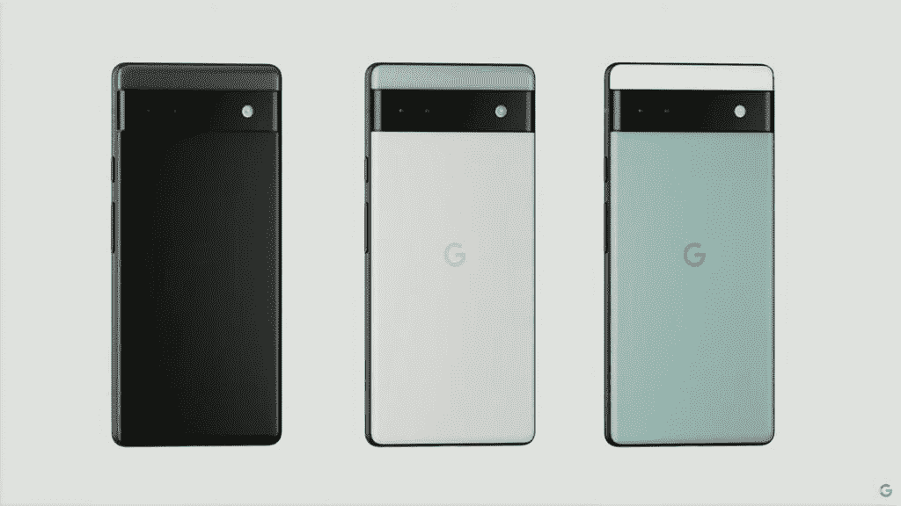
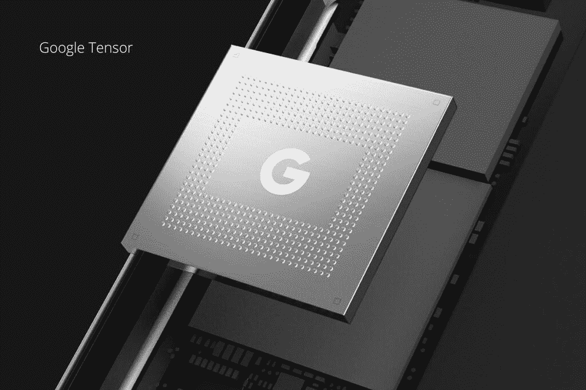
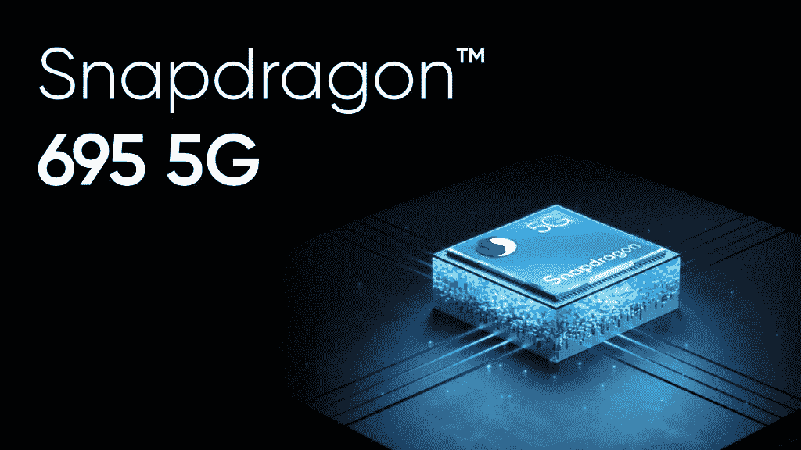
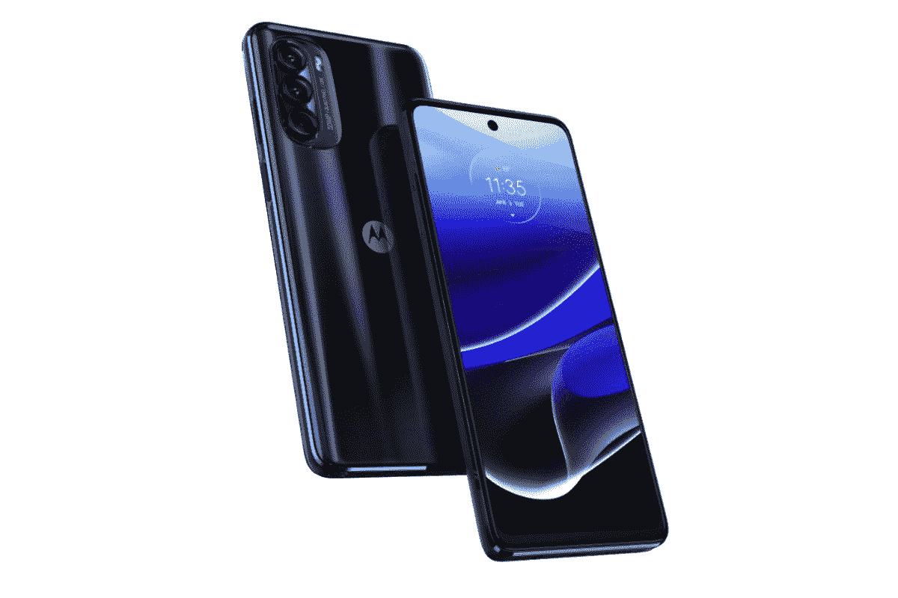

# 谷歌 Pixel 6a vs Moto G 手写笔 5G (2022):应该买哪款中端智能手机？

> 原文：<https://www.xda-developers.com/google-pixel-6a-vs-motorola-moto-g-stylus-5g-2022/>

虽然旗舰设备获得了大多数媒体的关注，但中低端智能手机的空间要有趣得多。制造商被迫在特定的价格范围内设计和决定规格，而不是使用最好的产品。最终，中低端智能手机的成功在于，如果它能以无与伦比的价格超出预期，甚至更好，它是否能提供最佳性价比。

摩托罗拉过去在智能手机领域相当激进，争夺头把交椅。但是，在发布了众多不受公众欢迎的旗舰设备后，它退出了旗舰智能手机领域，重新专注于中低端手机。现在，它创造了一系列彼此难以区分的智能手机，尽管这听起来像是一件坏事，但它实际上表明了该公司有多么专注，现在其大多数手机的价格都低于 400 美元。例如， [Moto G Stylus 5G 2022](https://www.xda-developers.com/motorola-moto-g-stylus-5g-2022-review/) 售价 349 美元，采用时尚设计，高通骁龙 695G 5G 处理器，并支持手写笔。

[Pixel 6a](https://www.xda-developers.com/google-pixel-6a-review/) 是谷歌 2022 年的中端手机，其设计借鉴了更高端的 Pixel 6 和 Pixel 6 Pro。尽管其标价为 449 美元，但这款手机提供了很多东西，并带来了惊喜，因为它由旗舰处理器谷歌自己的张量 SoC 驱动。这使它在中型码头中独一无二，但这足以让它成为王者吗？两款手机都很诱人，但是哪款手机适合你呢？我们可以通过分解整体细节来帮助您做出决定，并揭示手机中一些更细微的部分。这是谷歌 Pixel 6a 对摩托罗拉 Moto G Stylus 5G 2022。

**浏览这篇文章:**

## 谷歌 Pixel 6a vs Moto G 手写笔 5G 2022:规格

|  | 

谷歌像素 6a

 | 

Moto G 手写笔 5G 2022

 |
| --- | --- | --- |
| 建设 | 

*   铝制中框
*   大猩猩玻璃 3 前面板
*   IP67 防水/防尘
*   塑料背板

 | 

*   塑料中框
*   未知的前面板
*   没有 IP 等级
*   塑料背板

 |
| 尺寸和重量 | 

*   152.2 x 71.8 x 8.9 毫米
*   178 克

 | 

*   168.9 x 75.8 x 9.3 毫米
*   215 克

 |
| 显示 | 

*   6.1 英寸有机发光二极管
*   60Hz 刷新率
*   1080 x 2400 像素
*   康宁大猩猩玻璃 3

 | 

*   6.8 英寸 IPS 液晶屏
*   120 赫兹刷新率
*   1080 x 2460 像素
*   未知的

 |
| 社会学 |  | 

*   高通骁龙 695 克 5G

 |
| RAM 和存储 | 

*   6GB / 128GB 内部存储

 | 

*   6GB / 128GB 内部存储
*   8GB / 256GB 内部存储

 |
| 电池和充电 | 

*   4，410 毫安时电池
*   18W 快速充电
*   没有无线充电

 | 

*   5000 毫安时电池
*   18W 快速充电
*   没有无线充电

 |
| 安全性 | 

*   指纹传感器(显示屏内)

 | 

*   指纹传感器(侧面)

 |
| 后置摄像头 | 

*   1220 万像素，f/1.7 主频(带 OIS)
*   12 兆像素，f/2.2 超宽

 | 

*   50 MP，f/1.9 Main(带 OIS)
*   800 万像素，f/2.2 超宽
*   200 万像素，f/2.4 深度

 |
| 前置摄像头 |  |  |
| 港口 | 

*   USB 类型-C
*   没有耳机插孔

 | 

*   USB 类型-C
*   3.5 毫米耳机插孔

 |
| 连通性 | 

*   5G
*   长期演进
*   Wi-Fi 802.11 a/b/g/n/ac/6e
*   蓝牙 5.2

 | 

*   5G
*   长期演进
*   Wi-Fi 802.11 a/b/g/n/ac
*   蓝牙 5.1

 |
| 软件 |  |  |
| 价格 |  |  |

## 建造和设计

对于一部中档手机，在质量方面没有太大的期望。但是，在过去几年中，公司改进了配方，向市场推出了更好的产品，这主要是因为消费者的期望。那么，在寻找手机时，需要考虑哪些因素呢？设计非常重要，因为它是你每天都会看到的东西。制造质量是另一个原因，因为如果你的手机制造不可靠，它可能不会持续很长时间。显示器也是一个需要注意的关键，因为它是你的眼睛大部分时间会停留的地方。手机的性能将是关键。这不仅包括处理器，还包括相机、电池和其他内部组件的功能。

如前所述，谷歌 Pixel 6a 的设计与其 Pixel 6 和 Pixel 6 Pro 兄弟姐妹几乎相同。根据你对 Pixel 6a 设计的想法，这可能是好的，也可能是坏的。Pixel 6a 有一个 6.1 英寸的有机发光二极管显示屏，背面有一个独特的摄像头阵列。相机杆，有时被称为“遮阳板”，看起来像市场上的其他任何东西。遮阳板将手机的后部分成两部分，顶部和底部。这就是谷歌在设计上有点创意的地方，将顶部和底部涂上略微不同的颜色，以创造一种和谐的对比。

 <picture></picture> 

Image via Google

您可以通过查看来自 Google 的图片来更好地感受双色调的色彩美感。除了木炭，谷歌还提供粉笔和鼠尾草作为颜色选择。所有的颜色选择都很低调，但塑料后盖由于抛光处理而显得有点流行。这个设计非常简单，但是如果你不是很喜欢它的外观，可能需要一段时间来适应它。此外，该设计被称为两极分化，支持者和批评者数量相等。因此，如果你没有立即做出反应，并且还在犹豫不决，再给它一些时间可能是个好主意，或者你可以考虑[买一个盒子](https://www.xda-developers.com/best-google-pixel-6a-cases/)来改变它的颜色和外观。

摩托罗拉 Moto G Stylus 5G (2022)有一个 6.8 英寸的 IPS LCD，尽管有一个闪亮的金属外壳，但却是由塑料制成的。塑料手机的好处在于它轻便耐用。你不必担心它会掉下来，背部会有凹痕或裂缝。当然，它的滥用是有限制的，但与金属或玻璃背面的手机相比，耐用性应该要高得多。你可能会在上面的图片中看到，但在背面有一个轻微的曲线，使这款手机很容易拿着。

当你有三个摄像头时，摩托罗拉通过确保摄像头阵列不会从手机背面伸出太多来保持事情尽可能微妙。Moto G Stylus 5G 2022 有一个 3.5 毫米的耳机插孔，它最独特的特点是底部隐藏了一支触控笔。总的来说，这是一个看起来很精致的设计。虽然我们可以通过看一眼人造拉丝金属背面来理解这种说法，但我们会更深入地欣赏一种简单的设计美学，这种美学很容易过度延伸，但却没有。摩托罗拉在走钢丝设计方面做得很好。尽管如此，每款手机都有独特之处，所以在设计时，你只需选择你认为最好看的。

* * *

## 显示

Pixel 6a 具有分辨率为 1080 x 2400 像素的 6.1 英寸平面有机发光二极管显示器。它周围的边框很少，底部有一个轻微的下巴。它在那里，但它不会分散注意力，屏幕顶部的摄像头也不会。说到性能，60Hz 显示器提供了生动的色彩和相对较深的黑色。但由于这是一款中档手机，亮度并不是它的最佳属性。你可以期待室内的东西看起来很棒，但走到外面，你会注意到显示器无法与自然竞争，晴天会导致屏幕看起来褪色。这不是一个大问题，只是当手机在这个价格范围内时需要注意的一个问题。

有机发光二极管显示器确实具有显示器内指纹读取器，这很方便。但有报道称，它在解锁手机时性能较慢。但是，同样，我不会对此太担心，因为对于每一个缓慢的指纹读取器的报告，都有另一个报告说它是好的。作为一个不错的奖励，屏幕确实提供了对 HDR10 和 HDR10+的支持。这对于喜欢用手机看电影的人来说将是一个加分项。总的来说，对于一个中端设备来说，这是一个非常好的屏幕，在你需要的时候，给你你需要的东西。

摩托罗拉 Moto G Stylus 5G 拥有一个 6.8 英寸的 IPS 液晶显示屏，分辨率为 1080 x 2460 像素。显示屏是平面的，边框很薄。显示屏底部边缘有一个小凸缘，屏幕顶部有一个摄像头切口。这些都不会影响体验，也不应该成为问题。IPS 液晶面板非常明亮，即使在阳光最充足的日子也能应对挑战。虽然色彩鲜艳，但它们不会击败 OLED 面板，但 Moto G Stylus 5G 的优势在于其 120Hz 的显示屏。这种刷新率提供了非常流畅的滚动体验，在玩游戏时是一个巨大的优势。即使在全球舞台上，摩托罗拉 Moto G Stylus 5G 也是一种罕见的产品，因为没有多少设备能够以如此低的价格提供 120Hz 的刷新率。即使有，大多数期权也不能在美国购买。

从日常角度来看，两个显示器都绰绰有余。但是有些事情需要考虑。像素 6a 使用可以提供更鲜艳的颜色并且可以更节能的 OLED 面板。它的大小不是最大的，但应该适合大多数用例。Moto G Stylus 5G 有一个 6.8 英寸的大液晶显示屏，虽然它不能产生像有机发光二极管那样鲜艳的色彩，但它的尺寸和 120Hz 的刷新率弥补了这一点。同样，显示将取决于您的个人喜好。但是，无论你选择什么，你都不会错。

* * *

## 表演

Pixel 6a 在芯片组方面有点特殊。当普通的中端设备获得中端芯片时，Pixel 6a 由谷歌的张量处理器提供动力。你会在谷歌的顶级智能手机 Pixel 6 和 Pixel 6 Pro 中找到这种处理器。谷歌张量 SoC 将于 2021 年底发布，并与高通的骁龙 888 和三星的 Exynos 2100 处理器竞争。也就是说，你可能会期望谷歌 Pixel 6a 的性能很高，在大多数情况下，它确实如此。但是我们自己的 Adam Conway 在他的评论中澄清了芯片的行为，指出虽然旗舰 SoC 的所有统计数据都在那里，但由于这里和那里的性能打嗝，体验有时会受到影响。虽然这不是一个持久的问题，但还是要记住。

 <picture></picture> 

Image via Google

摩托罗拉 Moto G Stylus 5G 采用了高通骁龙 695 5G 芯片组，这使其成为一款合适的中端 SoC。但这并不意味着它提供的体验很差，远非如此。多年来，高通一直在微调其芯片组阵容，为每个细分市场提供一款处理器。这些处理器都经过优化，可提供良好的体验。也就是说，在我们对这款手机的评测中，它在日常使用中表现良好。尽管它的基准数据平平，但它仍然处理了我们扔给它的几乎所有东西，唯一的例外是一款名为 *Genshin Impact 的高强度视频游戏。*

 <picture></picture> 

Image via Qualcomm

虽然谷歌 Pixel 6a 提供了更强大的处理器，但这两款设备在正常的日常任务中都能表现良好。虽然速度上可能会有细微的差别，但除非你把手机放在一起，否则你很可能看不出来。如前所述，高通在优化其产品组合方面做得非常出色，高通骁龙 695 5G 也不例外。

* * *

## 摄像机

当谷歌在 2016 年首次推出 Pixel 系列时，它因其令人印象深刻的摄像头和软件优化的使用而受到好评。从那时起，它已经成为 Pixel 手机 DNA 的一部分，每次发布都会带来新的软件技巧和提升相机性能。谷歌 Pixel 6a 也不例外，使用 12MP 主传感器搭配 12MP 超宽传感器。虽然与竞争对手相比，谷歌近年来落后了几步，但它仍能拍出漂亮的照片。相机在白天有它的优势，也可以在晚上使用计算魔法让事物变得生动。当然，这也有局限性，但在大多数情况下，Pixel 6a 在拍摄照片和视频时是一个可靠的表演者。

摩托罗拉 Moto G Stylus 5G 装有三个摄像头，主要拍摄者达到了令人印象深刻的 5000 万像素。有一点你可能应该知道，相机性能从来都不是摩托罗拉的强项。幸运的是，与摩托罗拉过去的设备相比，Moto G Stylus 5G 实际上表现更好一些。白天拍照和视频的时候，东西看起来还不错。如果有投诉，手机的稳定性是相当不一致的。因此，如果你四处走动拍摄视频，事情可能不会像你希望的那样顺利。最后需要注意的是，虽然 Pixel 6a 可以以每秒 30 帧的速度在 4K 拍摄视频，但摩托罗拉只能以 1080p 的速度拍摄。但是，在大多数情况下，照片在大多数情况下都很好，尽管视频并不完美，但它们是有用的。

* * *

## 电池寿命和充电

既然此时你心中已经有了关于这两款手机的大量信息，那么让我们把最后一部分说得简短明了。谷歌 Pixel 6a 有 4410 毫安时的电池，而摩托罗拉 Moto G Stylus 5G 有 5000 毫安时的大电池。Pixel 6a 可以很快过一天，但不会是两天的设备。你也许可以勉强维持两天，但是需要很少的使用和仔细的计划。大多数情况下，你必须每天晚上给它充电。Moto G Stylus 5G 是一个不同的故事，是一个真正的两天设备。在我们中度使用的评测中，这款手机续航两天。如果你正在做一些更激烈的事情，你至少应该能够感到自信，不要在晚上把它放在充电器上。然而，你将不得不在第二天晚些时候充电。这些电池配备了 18W 快速充电功能，不具备无线充电功能。但是，伟大的设备有足够的电池寿命。

* * *

## 谷歌 Pixel 6a vs 摩托罗拉 Moto G 手写笔 5G 2022:你该买哪个？

我们在这里，在完全崩溃之后，现在必须做出选择。但我认为，与其他比较不同，这一次有一个明确的赢家。尽管摩托罗拉 Moto G Stylus 5G 2022 的建议零售价高于谷歌 Pixel 6a，但它并没有提供更多的 Pixel 6a。即使按照它的折扣价，比谷歌 Pixel 6a 的 MSRP 便宜 100 美元，我仍然认为它不值得。谷歌 Pixel 6a 拥有更好的处理器和摄像头，尽管设计很主观，但它仍然提供了可以持续一整天的电池。对大多数人来说，这就够了。如果有兴趣，请使用下面的链接购买手机，或者在谷歌 Pixel 6a 上查看[最新交易。](https://www.xda-developers.com/best-google-pixel-6a-deals/)

如果你需要高刷新率的显示器，两天的电池寿命，或者一支触控笔，摩托罗拉 Moto G Stylus 5G 2022 是必须的。

 <picture></picture> 

Google Pixel 6a

谷歌 Pixel 6a 集旗舰 SoC 和标志性的 Pixel 体验于一身，价格让竞争对手物有所值。

 <picture></picture> 

Motorola Moto G Stylus 5G 2022

##### 摩托罗拉 Moto G 手写笔 5G (2022)

摩托罗拉 Moto G Stylus 5G 也提供了一个全面的包装，这是手机配备触控笔的罕见情况之一。