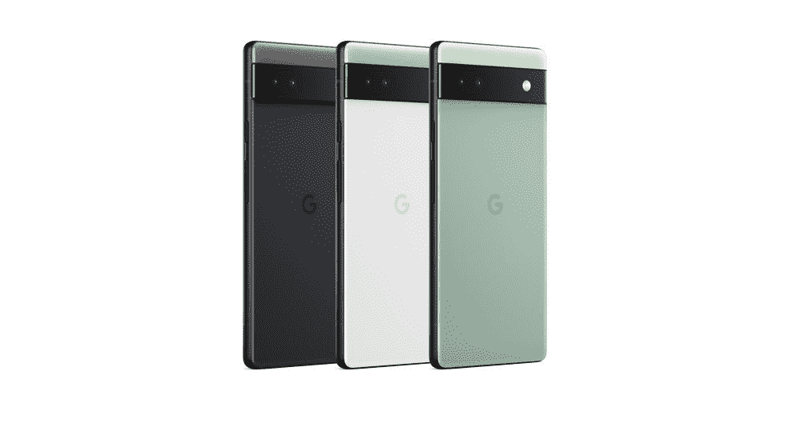
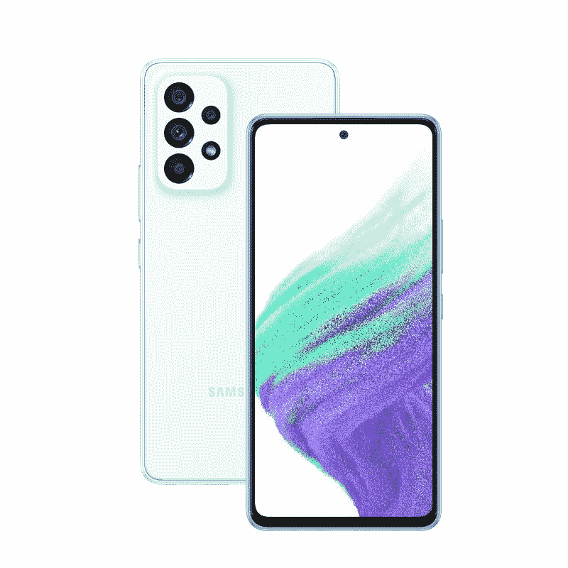
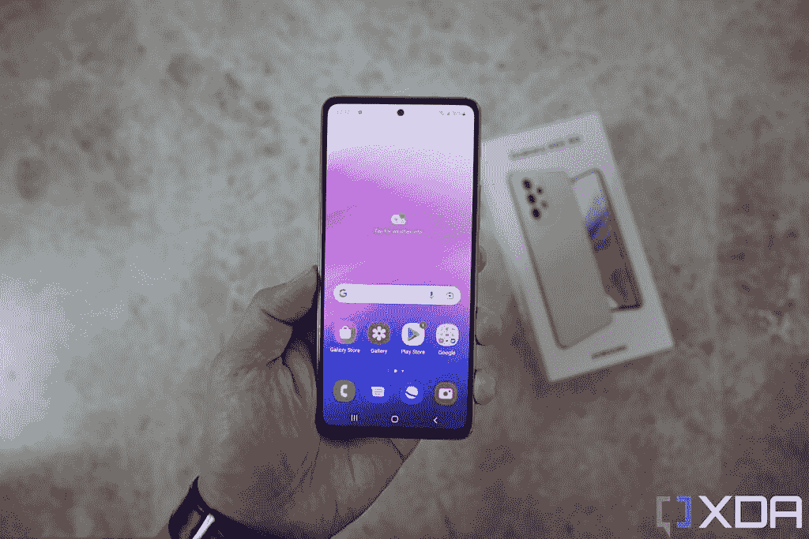

# 谷歌 Pixel 6a vs 三星 Galaxy A53:北美最著名的两款中游侠

> 原文：<https://www.xda-developers.com/google-pixel-6a-vs-samsung-galaxy-a53/>

谷歌 Pixel 6a 是最新的中档手机，也可以说是最好的一款，因为它提供了许多让谷歌 Pixel 6 在去年秋天成为如此优秀的旗舰手机的东西。[然而，三星的 Galaxy A53](https://www.xda-developers.com/samsung-galaxy-a53-5g-hands-on/)也毫不逊色，它在简洁低调的设计中提供了三星华丽的 AMOLED 显示技术。这两款手机都相对紧凑，不仅是那些想省钱的人的理想选择，也是那些不想随身携带笨重旗舰的人的理想选择。

 <picture></picture> 

Google Pixel 6a

谷歌 Pixel 6a 带回了许多让 Pixel 6 变得很棒的东西，但包装更实惠。

 <picture></picture> 

Samsung Galaxy A53

##### 三星 Galaxy A53 5G

Galaxy A53 是三星的中端产品，它带来了身临其境的美丽屏幕和坚固的相机系统。

**浏览这篇文章:**

## 三星 Galaxy A53 5G 与谷歌 Pixel 6a:规格

|  | 

三星 Galaxy A53 5G

 | 

谷歌像素 6a

 |
| --- | --- | --- |
| 建设 | 

*   塑性体
*   大猩猩玻璃 5 前面板
*   IP67 防水/防尘

 | 

*   大猩猩玻璃 5 前面板
*   塑料背面和侧面
*   IP68 防水/防尘等级

 |
| 尺寸和重量 | 

*   159.6 x 74.8 x 8.1mm 毫米
*   189 克

 | 

*   158.6 x 74.8 x 8.9 毫米
*   207 克

 |
| 显示 | 

*   6.5 英寸 Super AMOLED
*   120 赫兹刷新率
*   1080 x 2400 像素

 | 

*   6.1 英寸 AMOLED
*   FHD+
*   60Hz
*   20:9 宽高比
*   康宁大猩猩玻璃 3

 |
| 社会学 | 三星 Exynos 1280 | 谷歌张量 |
| RAM 和存储 | 

*   6GB/8GB 内存
*   128GB/256GB 内部存储
*   microSD 卡插槽(最高 1TB)

 | 

*   6GB
*   128GB
*   没有 microSD 卡插槽

 |
| 电池和充电 | 

*   5000 毫安时电池
*   25W 超级快充
*   盒子里没有充电器
*   没有无线充电

 | 

*   4，306 毫安时电池
*   盒子里没有充电器

 |
| 安全性 | 光学显示器内指纹传感器 | 光学显示器内指纹传感器 |
| 后置摄像头 | 

*   64MP/1.8 主屏幕(带 OIS)
*   12MP/2.2 超宽
*   5 百万像素/2.4 英寸深度传感器
*   5MP/2.4 宏

 | 

*   主要:1220 万像素主要
*   中学:12MP 超宽

 |
| 前置摄像头 | 32MP/2.2 | 800 万像素摄像头 |
| 港口 | 

*   USB 类型-C
*   没有耳机插孔

 |  |
| 连通性 | 

*   5G
*   长期演进
*   wi-Fi 802.11 a/b/g/n/AC(2.4G+5 GHz)
*   蓝牙 5.1

 | 

*   5G
*   长期演进
*   Wi-Fi 802.11 a/b/g/n/ac/6
*   蓝牙 5.1

 |
| 软件 | One UI 4.1(安卓 12) | 安卓 12 |
| 价格 | $349 | $449 |

* * *

## 谷歌 Pixel 6a vs 三星 Galaxy A53:硬件和设计

Pixel 6a 和 Galaxy A53 都是塑料平板手机，看起来和感觉都比“塑料”这个词通常所暗示的要好。特别是谷歌 Pixel 6a，它带回了谷歌 Pixel 6 的设计语言，这几乎受到了普遍的好评。我特别喜欢相机遮阳板条，发现它比典型的相机岛更具视觉冲击力。它也更实用，因为它允许像素 6a 放在桌子上，如果使用的话，不会左右摇摆。

Galaxy A53 是一款更大的手机，6.5 英寸的有机发光二极管屏幕比 Pixel 6a 的 6.1 英寸屏幕更大，但两者都是平板，这使得两款手机都很容易抓握。两款手机都有一些有趣的颜色，你可以从上面的产品渲染图中看到。

### 显示

如上所述，Galaxy A53 的屏幕更大，刷新率也是原来的两倍，能够达到 120 赫兹，而 Pixel 6a 的 6.1 英寸有机发光二极管却停留在 60 赫兹。

这是不可避免的 Galaxy A53 面板好一点，能产生更流畅的动画，但也变得更明亮了。顺便说一下，Pixel 6a 的屏幕非常好。但三星是移动显示技术的世界领导者是有原因的。

 <picture></picture> 

The Galaxy A53's 6.5-inch 120Hz OLED display.

### 处理器

不过，Pixel 在这里获得了一个重大胜利——它运行在 Google Tensor 上，这是一款旗舰级 SoC (granted，2021 年的旗舰产品)，专门用于处理 Google 的机器学习任务。与此同时，Galaxy A53 由三星自己的 Exynos 1280 驱动，这是一款彻头彻尾的中端芯片。考虑到即使是三星的旗舰产品 Exynos SoCs 也一直表现不佳，因此 Exynos 1280 只是过得去，没有什么值得大书特书的。在每个层面上，谷歌张量都是一个更强大的 SoC，你会看到 Pixel 6a 导出视频更快，应用照片过滤器更快，处理语音也更好。事实上，Pixel 6a 拥有同样不可思议的、业界最佳的语音听写功能，这在谷歌 Pixel 6 系列中首次出现，这一切都要归功于 Tensor。

### 内存、扬声器、触觉和其他比特

Pixel 6a 标配 6GB 内存，而 Galaxy A53 的内存范围为 4GB、6GB 或 8GB。我只测试了 8GB 内存版本的 Galaxy A53，即使这样，我也认为这款手机不是最快的。我认为 4GB 内存型号的 Galaxy A53 可能在启动应用程序等日常性能方面表现不佳。Pixel 6a 的 6GB 内存，搭配更好的 SoC，只是带来了更快的应用程序启动。

两款手机都有立体声扬声器，质量差不多，这意味着这两款手机都不会让你很快就想跳过耳机，但考虑到价格点，它们已经足够好了。IP67 防水和防尘也可以在这两款手机上找到。另一方面，Haptics 是 Pixel 6a 的一大胜利，因为它带回了 Pixel 6 系列的旗舰级触觉引擎。银河 A53 的触觉脆弱无力。

* * *

## 谷歌 Pixel 6a vs 三星 Galaxy A53:相机

谷歌 Pixel 6a 从 Pixel 5 和 4 带回了更老的 Pixel 相机硬件——一对 12MP 覆盖宽和超宽——所以你错过了那个可爱的大传感器 GN1 magic，但不用担心，Pixel 的软件图像处理仍然是同类最佳的，Tensor 仍然在这里帮助实现更多的谷歌机器学习 magic，所以 Pixel 6a 的相机样本仍然非常非常好。甚至令人瞠目结舌，如果你考虑到这里的硬件是非常长的牙齿。只需看看下面的样本——每张照片都有出色的动态范围、图像清晰度、色彩和对比度。快门速度也非常快，能够捕捉到移动中的猫。

Galaxy A53 的相机在技术上更胜一筹:主相机是一个 64MP 传感器，配有一个大图像传感器，超宽相机也是一个 12MP，f/2.2 的拍摄者。在真空中，Galaxy A53 相机在其价格范围内相当不错，但它无法与 Pixel 6a 的快门速度响应或在所有照明条件下的一致平衡相匹配。我知道上面的样本不是同一主题的，因此它们不是直接的比较，但请相信我们的话。我们用这两款手机拍了数百张照片，Pixel 6a 相机就在前面。

自拍方面，两个都还行。不管你想不想，三星的自拍相机都会应用一点皮肤软化/美白美化滤镜，而 Pixel 6a 的 8MP 拍摄者在细节上很软，在弱光条件下很吃亏。

* * *

## 谷歌 Pixel 6a 与三星 Galaxy A53:软件和性能

谷歌 Pixel 6a 和 Galaxy A53 都运行 Android 12，但当然，由于 Pixel 是谷歌自己的手机，Pixel 6a 的软件被认为是真正的 Android 版本。Pixel 6a 的软件确实比 OneUI 三星皮肤更智能，让我们的智能手机使用起来更轻松。Pixel 6a 支持前面提到的绝对牛逼的语音听写，它可以做像识别背景中播放的音乐这样的事情。Pixel 还会在天气/日历小部件中自动显示上下文感知项目。

相比之下，Galaxy A53 的 OneUI 有点笨重。有一些三星应用程序形式的膨胀软件。这款手机感觉有点慢，偶尔会有动画口吃，可能是由于 Exynos 芯片性能不佳。甚至打开相机应用程序有时也会比大多数手机多花一拍。而三星的一些软件特长，比如 DeX，在这里就不行了。

然而，Galaxy A53 确实支持在可调整大小的浮动窗口中打开应用程序，我认为这是在手机上进行多任务处理的最佳方式。Pixel 6a 只能分屏多任务，感觉比较死板。但除此之外，没有任何比较，Pixel launcher 只是比运行在这款特定三星手机上的 OneUI 响应更快，更智能，使用起来更愉快。

Pixel UI 比这款三星手机上运行的 OneUI 响应更快、更智能、使用更愉快。

Galaxy A53 缓慢的软件性能也确实阻碍了它的整体性能。很多次，我都错过了拍照的机会，因为相机花了超过一秒半的时间才打开。

Pixel 6a 并非没有缺点——我发现右边音量摇杆上方的电源按钮位置很难够到，因为我用左手拿着手机。因为 Pixel 6a 不支持任何类型的“轻触屏幕关闭屏幕”功能，所以我必须按下电源按钮来锁定手机，每次都需要稍微调整一下手柄。但是那些用右手拿手机的人不会有这样的问题，因为拇指会在那里按下按钮。

* * *

## 谷歌 Pixel 6a vs 三星 Galaxy A53:该买哪个？

几个月前推出的 Galaxy A53 售价为 449 美元，与 Pixel 6a 的价格相同。但或许是预计到 Pixel 6a 的发布，Galaxy A53 最近的价格降至 349 美元。但即使有 100 美元的价格差距，我们也不得不建议大多数人选择 Pixel 6a，除非这 100 美元的额外节省真的很重要。

Pixel 6a 只是一部更好的手机。它拥有更强大的 SoC，更快更灵敏的软件，以及明显更好的拍照体验。

现在，这并不是说 Galaxy A53 除了那些寻求更少花费的人之外没有吸引力。如果你个人不在乎摄像头，而是主要使用手机在屏幕上观看视频、文字等内容，那么 Galaxy A53 更大更亮的屏幕是一个更好的选择。但我们认为，大多数人会关心相机性能和用户界面的流畅性。在大多数情况下，Pixel 6a 是更好的手机。

 <picture></picture> 

Google Pixel 6a

谷歌 Pixel 6a 带回了许多让 Pixel 6 变得很棒的东西，但包装更实惠。

 <picture></picture> 

Samsung Galaxy A53

##### 三星 Galaxy A53 5G

Galaxy A53 是三星的中端产品，它带来了身临其境的美丽屏幕和坚固的相机系统。

如果您打算购买这些设备，我们有配件推荐。您可以查看一些[推荐的 Pixel 6a 交易](https://www.xda-developers.com/best-google-pixel-6a-deals/)，并挑选一个[伟大的 Pixel 6a 案例](https://www.xda-developers.com/best-google-pixel-6a-cases/)。或者，我们也有同样的产品，所以你可以[在交易中](https://www.xda-developers.com/best-samsung-galaxy-a53-deals/)购买 Galaxy A53 5G，如果你已经有了一个，就为它购买一个[好盒子](https://www.xda-developers.com/best-samsung-galaxy-a53-cases/)。