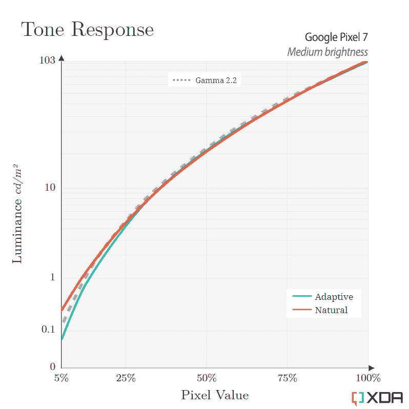
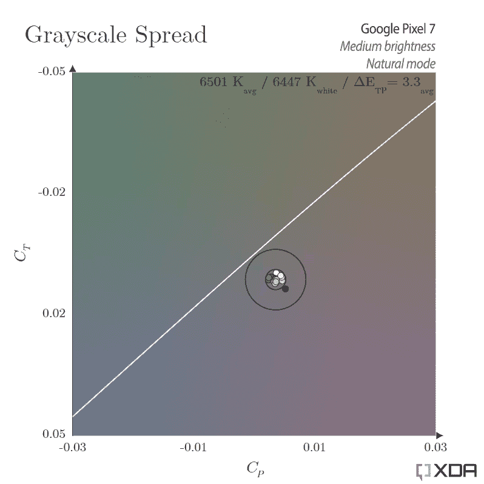
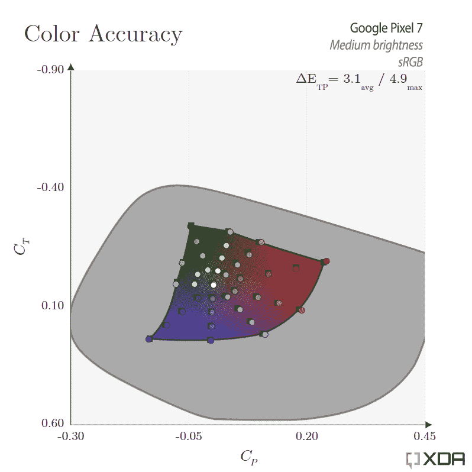

# 谷歌 Pixel 7 显示器评论:缓和期望

> 原文：<https://www.xda-developers.com/google-pixel-7-display-review/>

Pixel 7 售价 599 美元，是谷歌的基础产品，位于该公司的旗舰手机和廉价手机之间。它仍然是 2022 年最划算的手机之一，因为它拥有与 Pro 型号相同的优秀主摄像头传感器和处理能力。如果你想要一个具有谷歌软件体验的有竞争力的傻瓜相机，Pixel 7 是一个很好的选择。

当然，为了提供这样的价格标签，该公司需要在某些地方偷工减料。除了缺少相机镜头之外，显示质量通常是最明显的因素之一，有时这种差异超出了规格表所能告诉你的。在这里，我们将介绍一些削减成本的措施，并确定它们是否物有所值。

***关于这篇评论:**这篇评论中的产品已经被 Google 借出。然而，该公司没有参与这篇文章的内容。*

谷歌 Pixel 7 是对已经非常优秀的 Pixel 6 的改进，是一款非常精致的旗舰手机，而没有过高的价格。

**Display**

6.3 inches, AMOLED, 90Hz, HDR10+, 1400nits

| **优点** | **缺点** |
| 在自然模式下，所有条件下的卓越色彩准确度 | 当以锐角观察时，可见的红蓝色条纹 |
| 显著提高灰度色彩精度 | 屏幕没有达到该公司声称的峰值亮度值 |
| 显著提高深灰色面板的均匀性 | 低亮度下的破碎阴影，尤其是在自适应模式下 |

P *性能可能受单位差异的影响*

## 硬件和功能:相同的有机发光二极管，略有改动

你可能从去年的评论[中听说过](https://www.xda-developers.com/google-pixel-6-pro-display-review/)Pixel 6 上的 OLED 面板是其较弱的组件之一。虽然它的价格相对较高，但有机发光二极管缺乏精致，因为谷歌决定将基本模型降级为刚性的有机发光二极管显示堆栈。谷歌为 Pixel 6 配备的显示屏不如 Pixel 5 ( [很棒](https://www.xda-developers.com/google-pixel-5-display-review/))似乎令人发指，但这是谷歌降价以支持其新相机和内部芯片的必然结果。

可悲的是，今年的基本型号继续使用与 Pixel 6 相同的一代和类型的有机发光二极管，尽管它有一些小的改进。最值得注意的是，谷歌声称 Pixel 7 可以提高 25%的亮度，最高可达 1400 尼特。我还注意到屏幕层压有所改善，有机发光二极管看起来更靠近防护玻璃，当照亮时，屏幕和边框之间的阴影更薄。

谷歌 Pixel 7(右)的反射处理较差，显示凸起的黑色会降低对比度，尤其是在户外。

然而，其二流显示堆栈的其他特征仍然适用。与更优质的有机发光二极管相比，Pixel 7 处理光线反射的能力要差得多，投射出更亮的黑色，降低了屏幕对比度。这在室外尤其明显，但即使在室内照明的情况下也能感觉到。像素限定层下面的黄褐色更加明显，因为较厚的叠层可能已经太厚而不能容纳有效的黑色矩阵。

Pixel 7 有机发光二极管闪烁着红色/蓝色的锐角条纹，通常只在白色 UI 元素中可见。

最令人分心的是从某个角度观看屏幕时出现的红蓝闪烁。即使在短的锐角处也很明显，拇指位置的轻微变化足以显示折射。使用深色模式可以缓解这个缺点，因为这种效果只有在白色的 UI 元素中才真正可见。尽管如此，这并不是可以完全避免的事情，它让谷歌的基本型号手机看起来很廉价。

谷歌像素 7 暗灰色均匀性，在非常暗的 0.01 尼特测量

廉价显示器最常见的缺点之一是暗灰色面板不均匀。这是一个困扰我见过的所有其他刚性有机发光二极管的问题，包括 Pixel 6。然而，令我惊讶的是，我们的 Pixel 7 的均匀性明显是完美的，甚至在最低亮度以下也没有任何区域着色的迹象。我们的面板有可能已经中了有机发光二极管大奖，但我乐观地相信，要么是谷歌加强了质量控制，要么是三星显示大幅改善了制造工艺。

## 亮度和功率测试:交付不足的公司索赔

谷歌像素 7 手动和自动亮度峰值亮度图表

|  | 

全屏

 | 

1%窗口

 | 

80%窗口

 | 

20%窗口

 |
| --- | --- | --- | --- | --- |
| 

巅峰汽车

 | 907 尼特 | 1263 尼特 | 955 尼特 | 1157 尼特 |
| 

高峰手册

 | 464 尼特 | 454 尼特 | 462 尼特 | 455 尼特 |

在谷歌的 Pixel 7 规格页面上，该公司声称这款手机在 5%的窗口尺寸下可以达到 1400 尼特。但经过测量，我们的 Pixel 7 只能输出 1234 尼特的窗口大小，大约少了 12%。谷歌还声称在 100%的窗口尺寸下，峰值亮度为 1000 尼特，但我们只测量到 907 尼特。平均而言，Pixel 7 的亮度仅比 Pixel 6 高 14%，几乎是谷歌 25%声明值的一半。

实际上，这些并不是明显的巨额赤字，但这关系到对公司数据的信任。我看过的大多数显示器通常都高于或低于该公司声称的数字 50 尼特，但这是我记忆中最大的交付不足。

除了这种不一致，谷歌还让 Pixel 7 看起来只比 Pro 机型稍微暗一点。不幸的是，情况并非如此，因为它们之间的差异大于从像素 6 到像素 7 的“升级”。Pixel 7 的峰值手动亮度与去年相同，约为 460 尼特，而 Pro 型号则高达 580 尼特。Pixel 7 Pro 的峰值自动亮度也高得多，在同样的 5%窗口大小下，达到了近 1600 尼特。

谷歌 Pixel 7 亮度与功率图

关于电源效率，Pixel 7 的测量结果几乎与去年的 Pixel 6 相同。然而，与 [Pixel 7 Pro](https://www.xda-developers.com/google-pixel-7-pro-display-review/) 不同，普通 Pixel 7 不会因为增加峰值亮度而受到巨大的功率损失，从而使其效率更高。在 Pixel 7 的峰值发射时，907 尼特的全屏白色，Pixel 7 Pro 比 Pixel 7 多消耗 *50%的功率*，而屏幕面积只有 12.5%大。这在更大程度上证明了 Pro 型号的屏幕是多么耗电，也清楚地表明了 Pixel 7 如何在更小的电池容量下拥有更长的电池寿命。

谈到刷新率，在 60Hz 和 90Hz 驱动模式之间有大约 70 毫瓦的功耗，或者说 Pixel 7 的电池容量每小时增加大约 0.4%。但在 90Hz 和 Pro 型号的 120Hz 之间，差异几乎是 130 毫瓦的两倍。取决于你能感觉到两者之间的差异有多大，让 Pixel 7 以 90Hz 显示可能总体上是更好的设置。Pixel 7 Pro 确实有混合氧化物“LTPO”面板的好处，可以降至 10Hz，尽管 10Hz 和 60Hz 之间的差异只有大约 50 毫瓦。

## 对比度和色调反应测试:无法解析的黑色细节

 <picture></picture> 

Medium brightness

像素 7 色调响应图(中等亮度)

Pixel 7 色调响应图表(自然模式、自适应模式)

谷歌在自适应配置文件和自然配置文件之间使用不同的色调响应曲线，这是从 Pixel 6 系列开始的。开箱即用的自适应校准使用伪行业标准 2.2 伽马响应，在大多数照明条件下提供良好、有力的对比度。然而，自然配置文件使用官方的 sRGB 色调响应，其阴影比 gamma-2.2 浅。你可以在我的 [Pixel 7 Pro 显示器评论](https://www.xda-developers.com/google-pixel-7-pro-display-review/#lab-testing-contrast-amp-tone-response)中阅读关于差异和校准原理的更深入的解释。

像素 7 在它们各自的颜色模式中跟踪比标准稍暗的两个目标。在许多情况下，自然模式实际上可以更好地跟踪 gamma-2.2，因为自适应模式有时看起来太暗了。这在较低的亮度级别时会成为一个问题，因为轮廓的较暗阴影会完全粉碎阴影细节。去年的 Pixel 6 遇到了类似的问题，尽管程度更大。

我仍然建议在自然模式下运行这个面板，以保留黑暗的细节，而专业模型可以在自适应模式下控制阴影。可悲的是，两种颜色模式都在像素 7 上以最小亮度剪裁近黑色，自然模式剪裁颜色低于 3/255 强度，自适应模式剪裁颜色低于 8/255 强度。这种情况甚至会持续到中高亮度，这使得这款手机在观看黑暗电影或编辑黑暗照片时缺乏光泽。

## 色彩准确度和精度测试:大大减少灰度着色

 <picture></picture> 

Medium brightness

像素 7 灰度精度图表(自然模式，中等亮度)

谷歌像素 7 灰度精度图表

|  | 

量滴聪明

 | 

低亮度

 | 

中等亮度

 | 

高亮度

 | 

最大亮度

 |
| --- | --- | --- | --- | --- | --- |
| 

色温。白色的

 | 6502 K | 6523 K | 6447 K | 6530 K | 6446 K |
| 

平均。δE

 | 1.2 | 2.1 | 3.3 | 3.3 | 3.7 |

对于非旗舰有机发光二极管，Pixel 7 在灰度精度方面表现相对较好。我们的单位在大部分情况下显示出非常少的着色，对于深灰色只有很小的向绿色的偏移。与 Pixel 6 相比，这块面板上的着色(缺失)是一个巨大的进步，大多数人在大多数情况下应该不会注意到这种变化。白点也始终准确，在所有亮度级别都保持接近 6500K

当涉及到接近黑色的灰色时，在某些情况下仍然会出现相当数量的紫色着色。这在非常暗的场景中很明显，但需要您在一个黑暗的房间中，具有中到高的显示亮度。有些人可能还会注意到，在低亮度下，屏幕在 90Hz 和 60Hz 之间切换时会有轻微的闪烁。使用自然配置文件可以防止灰色调下降到有问题的亮度水平，从而有助于解决这两个问题。总的来说，在正常使用中，这些对我来说都不是问题，与去年使用 Pixel 6 的体验相比，这是一个明显的进步。

 <picture></picture> 

Medium brightness

像素 7 sRGB 色彩准确度图表(自然模式，中等亮度)

谷歌像素 7 sRGB 色彩准确度图表(自然模式)

像素 7 P3-D65 色彩准确度图表(自然模式)

|  | 

量滴聪明

 | 

低亮度

 | 

中等亮度

 | 

高亮度

 | 

最大亮度

 |
| --- | --- | --- | --- | --- | --- |
| 

平均值。/马克斯·sRGB**δE**

 | 1.5/5.5 | 1.8/3.2 | 3.1/4.9 | 3.6/6.5 | 11/22 |
| 

平均值。/麦克斯·P3-D65**δE**

 | 1.3/3.5 | 1.9/3.6 | 3.2/6.5 | 3.7/7.1 | 11/22 |

对于 sRGB 和 P3 的颜色来说，颜色的准确性是极好的，没有任何单一的误差。在峰值亮度以下，所有颜色误差的测量值都低于 8.0 的δE 值，这对于手机校准来说是非常罕见的。请注意，我使用的是德尔塔 ITP 指标，而不是在许多其他评论中看到的旧德尔塔 CIE2000 指标；新的度量标准更加严格，报告的误差值大约是旧度量标准的三倍。因此，低于 8.0 的δE ITP 值相当准确，而低于 3.0(和高于 1.0)的值只有经过训练的观察者才能注意到。

在峰值自动亮度下可以看到较大的颜色误差，但这是因为屏幕会提高其颜色饱和度，以抵消眩光造成的颜色减少。在实践中，这种提升应该会在明亮的光线下产生更准确的颜色。然而，由于不精确的色调调整，紫色和橙色的色调偏移是明显的(分别向蓝色和红色偏移)。

## 谷歌 Pixel 7 显示屏:最终想法

Pixel 7 屏幕有一些真正好的改进，例如屏幕均匀性和灰度着色的抛光。Android 13 改进的 HDR 播放功能也存在，尽管不如 Pro 机型有效。但是不管这个面板有多精致，我似乎都无法摆脱预算有机发光二极管的感觉。在随意使用时，红色和蓝色的微光对于应该是该公司最新的基础手机来说感觉过时了。我知道谷歌正在以其价格点削弱大多数其他公司，但我认为这一硬件决定贬低了品牌——没有其他电话公司值得它的盐装运这种有机发光二极管的主线基础模型。

不可能让所有人都满意，但对于那些想要谷歌最小、最实惠的高级产品而又不想花 900 美元购买“专业”型号的消费者来说，似乎存在价格差距。最终，599 美元的价格将 Pixel 7 置于尴尬的境地。你可以从许多其他公司找到这种类型的显示器，至少便宜 100 美元。事实上，除了更高的刷新率，Pixel 7 有机发光二极管与 Pixel A 系列手机几乎没有什么不同。另一方面，除非你愿意在 Pixel 7 的预算中再增加 100 美元，否则你真的找不到屏幕技术更好的手机。但是考虑到基本型号的价格与预算 A 系列如此接近，与专业型号的差距有多大，我认为只有将基本型号推广到价格稍高的高级型号，而不是这种怪异的高端预算中间阶层，才是有意义的——否则，Pixel 7 还不如被称为 Pixel 7a Pro。

谷歌 Pixel 7 是对已经非常优秀的 Pixel 6 的改进，是一款非常精致的旗舰手机，而没有过高的价格。