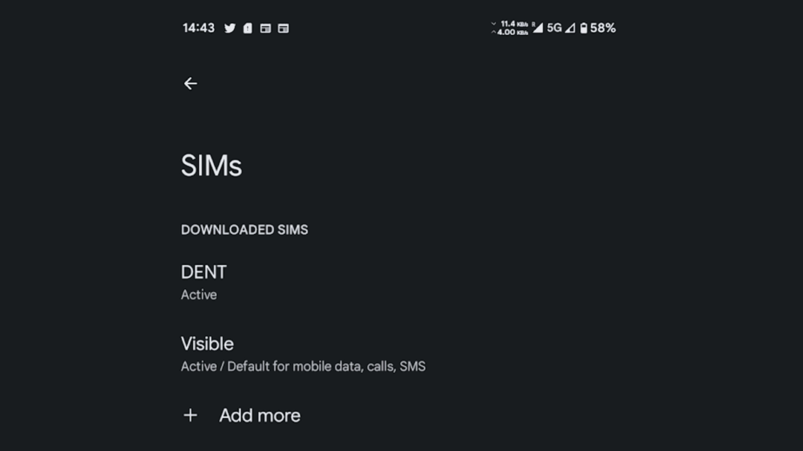

# Android 13 QPR2 Beta 2 更新后，Google Pixel 7 现在支持双 eSIM

> 原文：<https://www.xda-developers.com/google-pixel-7-dual-esim/>

看起来双 eSIM 功能已经在 Pixel 7 上实现了。虽然设备上已存在功能，但这是首次报告两个 eSIMs 同时处于活动状态的情况。对于那些依赖双 sim 卡的人来说，这是一个好消息，但除非你的设备加入了 Android Beta 计划，否则你现在无法利用该功能。

Reddit 上的一名用户发现了这一变化，斯珀的 Mishaal Rahman 通过截图证实了这一变化，截图显示两个配置文件都处于活动状态，具有双重 eSIM 功能。目前还不清楚新的双 eSIM 功能何时启用，但它现在显然可以与运行 [Android 13 QPR2 Beta 2](https://www.xda-developers.com/android-13-qpr2-beta-2-google-pixel/) 更新的谷歌 Pixel 7 配合使用。

 <picture></picture> 

image via [u/luishc77](https://www.reddit.com/user/luishc77/)

虽然更新最初是在月初推出的，但该功能有可能是通过某种后端更改而启用的。我们已经向谷歌寻求澄清，如果有回音，我们会更新这篇文章。至于何时会通过稳定版本向公众发布，预计将在 3 月份的某个时候随着下一个 Pixel 功能的发布而发布。

谷歌最近发布了其 [Android 13 QPR2 Beta 2.1 补丁](https://www.xda-developers.com/android-13-qpr2-beta-21-update-google-pixel/)，为操作系统添加了一些受欢迎的修复。如果有兴趣试用最新测试版的 [Android 13](https://www.xda-developers.com/android-13/) ，你可以随时在测试程序中注册你的兼容设备，并通过无线方式下载更新。截至目前，这些是支持的手机:Pixel 4a，Pixel 4a 5G，Pixel 5，Pixel 5a，Pixel 6 系列或 [Pixel 7 系列设备](https://www.xda-developers.com/google-pixel-7-vs-google-pixel-7-pro/)。

在你试用测试版之前，确保你所有重要的[信息都已备份](https://www.xda-developers.com/how-to-backup-android/)。虽然出现问题并不常见，但总有可能出现问题，所以在涉及到您的信息时，最好是安全的。

* * *

**来源** : [Reddit](https://www.reddit.com/r/GooglePixel/comments/10h3ecm/esim_mep_dual_esim/)

**经由** : [米沙·拉赫曼](https://twitter.com/MishaalRahman/status/1616460371996409861)(推特)