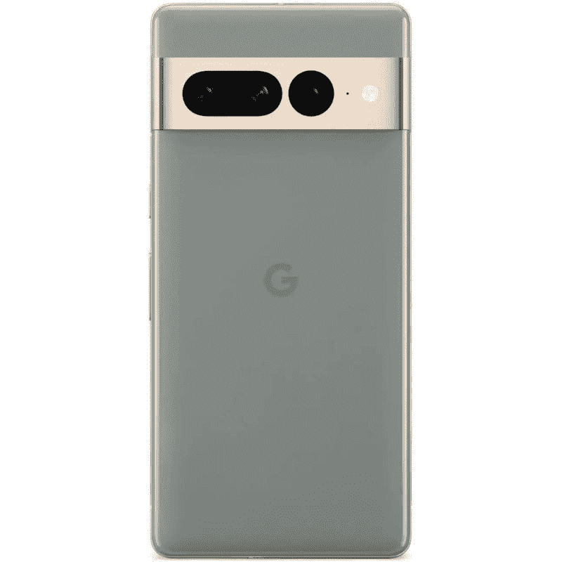

# 谷歌 Pixel 7 系列支持人脸解锁吗？

> 原文：<https://www.xda-developers.com/google-pixel-7-face-unlock/>

谷歌的新 [Pixel 7 和 Pixel 7 Pro](https://www.xda-developers.com/google-pixel-7-pro/) 没有给前代 Pixel 6 系列设备带来任何重大升级，但有一些整洁的补充。我们认为最突出的一个是 Pixel 7 系列的新面部解锁功能。是的，面部解锁功能已经回到了 Pixel 7 阵容，它像宣传的那样工作，尽管有一些警告。因此，如果你想知道是否可以用你的脸解锁 Pixel 7，那么答案是肯定的。

面部解锁功能使用了 Pixel 7 和 Pixel 7 Pro 上新改进的广角 10.8MP 自拍摄像头，并在其背后添加了机器学习模型。这也意味着这里没有像 Pixel 4 中使用的专用 3D 人脸解锁技术。缺乏专用系统可能会造成严重后果，因为 Pixel 7 的面部解锁在漆黑的环境甚至相对黑暗的房间中都不可靠。你可以调高显示屏亮度，在你的脸上投射一些光线，并希望它能起作用，但它比不上带有泛光照明器和红外摄像头的专用 3D 人脸解锁系统。因此，如果你希望一直使用面部解锁功能，请注意这一点，因为当环境照明不理想时，你可能需要依靠指纹解锁和密码解锁。

另外值得注意的是，Pixel 7 和 Pixel 7 Pro 只能使用面部识别从锁屏中解锁手机。对于其他所有事情，包括支付和安全登录，你必须使用老式的指纹扫描仪，或者使用 PIN 或密码。你可能还会发现，当你用面部解锁功能解锁手机时，很难弄清楚为什么你的交易会被拒绝——因为 UX 没有明确提到你需要用指纹、PIN 或密码解锁才能进行支付相关的安全登录。这并不完全是一个交易破坏者，但不可否认的是，它比不上更安全的实现，如苹果 iPhones 上的 Face ID，可以无缝地用于各种类型的解锁。

尽管有其局限性，但我们认为 Pixel 7 系列增加面部解锁是一个受欢迎的举措。当你实际上不能触摸手机显示屏进行身份验证，甚至不能输入 PIN 或密码时，有一种替代的身份验证方法总是很好的。

但不要让缺乏面部解锁改变你的购买决定。新款 Pixel 手机有很多令人喜欢的地方，尤其是 Pixel 7 的起价为 599 美元。你也可以在这些手机上找到一些[划算的交易](https://www.xda-developers.com/best-google-pixel-7-deals/)来节省更多的钱，并在某些情况下使用额外的现金。我们在 [Pixel 7 保护套](https://www.xda-developers.com/best-google-pixel-7-cases/)和 [Pixel 7 Pro 保护套](https://www.xda-developers.com/best-google-pixel-7-pro-cases/)中收集了一些很酷的选项，所以一定要看看它们。

*   <picture></picture>

    谷歌 Pixel 7 Pro

    ##### 谷歌 Pixel 7 Pro

    上的人脸解锁功能可以解锁手机，在光线充足且没有戴口罩或墨镜的情况下效果更好。

*如何看待 Pixel 7 和 Pixel 7 Pro 的人脸解锁功能？请在下面的评论中留言告诉我们。*