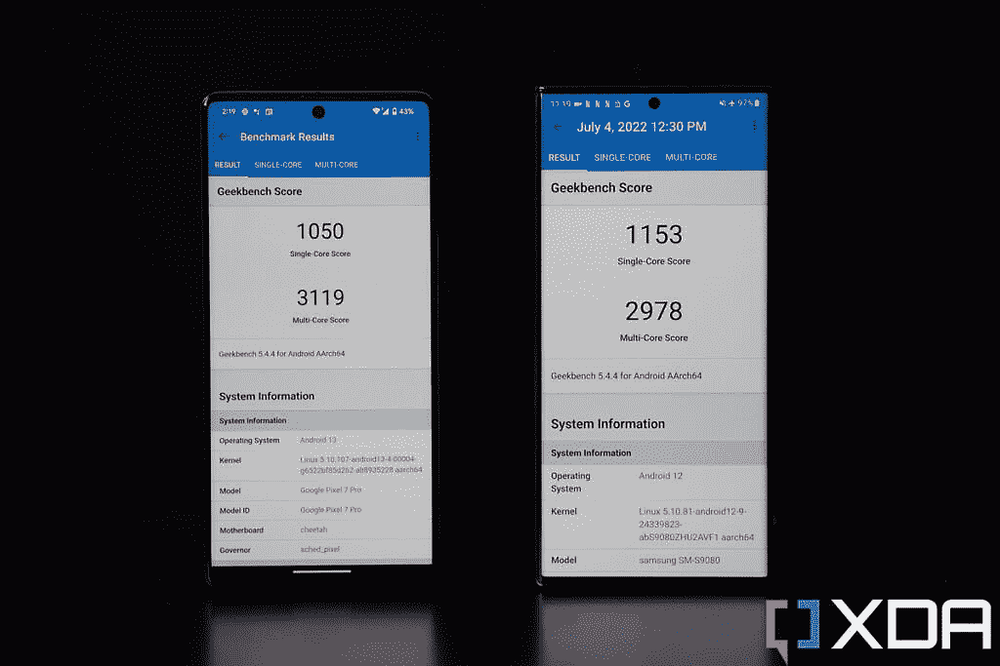

# 谷歌 Pixel 7 Pro vs 三星 Galaxy S22 Ultra:两大安卓巨头对比

> 原文：<https://www.xda-developers.com/google-pixel-7-pro-vs-samsung-galaxy-s22-ultra/>

谷歌像素处于一个有趣的位置。从技术上讲，它是默认的 Android 手机，因为它是由谷歌制造的，但因为三星制造手机的时间太长了，并且在全球范围内拥有如此广泛的影响力，所以在许多普通消费者眼中，Galaxy 手机反而被视为默认的 Android 手机。所以，每次[新的安卓旗舰](https://www.xda-developers.com/best-android-phones/)出来，都要和最新的三星旗舰做比较。

这就是我们在这里要做的:将新推出的优秀的 [Pixel 7 Pro](https://www.xda-developers.com/google-pixel-7-pro-camera-review/) 与仍然“默认”的安卓老大[三星 Galaxy S22 Ultra](https://www.xda-developers.com/samsung-galaxy-s22-ultra-review/) 进行比较。

 <picture></picture> 

Google Pixel 7 Pro

##### 谷歌 Pixel 7 Pro

谷歌 Pixel 7 Pro 提供了一个伟大的多功能相机系统，一个独特的设计和谷歌的第二代硅

 <picture></picture> 

Samsung Galaxy S22 Ultra

##### galaxy s22 ultra

Galaxy S22 Ultra 是目前 Android 领域中最好的，拥有最好的屏幕，最好的变焦摄像头，还有一支 S Pen！

**浏览本文:**

* * *

## 谷歌 Pixel 7 Pro 与三星 Galaxy S22 Ultra:价格和可用性

这两款手机现在都在打折。Galaxy S22 Ultra 几乎在全球所有国家/市场都有售，而谷歌 Pixel 7 Pro 在 17 个国家/市场有售，这意味着 Pixel 7 Pro 在一些市场没有售，包括像中国这样的大型市场。

在美国，Pixel 7 Pro 的起价为 899 美元，Galaxy S22 Ultra 的起价为 1199 美元，两者都是基本 128GB 存储版本。所有型号的定价如下:

*   谷歌 Pixel 7 Pro:
    *   12GB 内存，128GB 存储空间，899 美元
    *   12GB 内存，256GB 存储空间，999 美元
    *   12GB 内存，512GB 存储，1099 美元

*   三星 Galaxy S22 Ultra:
    *   12GB 内存，12GB 存储，1099 美元
    *   12GB 内存，256GB 存储空间，1199 美元
    *   12GB 内存，512GB 存储，1299 美元

然而，经常会有针对 [Pixel 7 Pro](https://www.xda-developers.com/best-google-pixel-7-deals/) 和 [Galaxy S22 Ultra](https://www.xda-developers.com/best-samsung-galaxy-s22-deals/) 的交易，所以如果你对这两款设备感兴趣，一定要去看看。

* * *

## 谷歌 Pixel 7 Pro vs 三星 Galaxy S22 Ultra:规格

| 

规范

 | 

三星 Galaxy S22 Ultra

 | 

谷歌 Pixel 7 Pro

 |
| --- | --- | --- |
| **构建** | 

*   铝制中框
*   大猩猩玻璃 Victus 回
*   大猩猩玻璃 Victus 正面

 | 

*   铝制中框
*   大猩猩玻璃 Victus 回
*   大猩猩玻璃 Victus 正面

 |
| **尺寸&重量** | 

*   163.3 x 77.9 x 8.9mm 毫米
*   229 克

 | 

*   162.9 x 76.6 x 8.9 毫米
*   212 克

 |
| **显示** | 

*   6.8 英寸动态 AMOLED 2X 曲面显示屏
*   可变刷新率高达 1Hz 至 120Hz

 | 

*   6.7 英寸 QHD+120 赫兹 AMOLED
*   10Hz 至 120Hz 之间的可变刷新率

 |
| **SoC** | 

*   国际: Exynos 2200
*   美国、中国、印度等:高通骁龙 8 代 1

 |  |
| **内存&存储** | 

*   8GB/12GB 内存
*   128GB/256GB/512GB/1TB

 | 

*   12GB 内存
*   128GB/256GB/512GB

 |
| **电池&充电** | 

*   5000 毫安时
*   45W USB 供电 3.0 快充
*   15W 无线充电
*   4.5 反向无线充电
*   大多数地区包装盒中没有充电器

 | 

*   5000 毫安时
*   30W 有线快速充电
*   23W 有线快速充电
*   盒子里没有充电器

 |
| **安全** | 超声波显示指纹扫描仪 | 光学显示指纹扫描仪 |
| **后置摄像头** | 

*   **主要:**108 兆像素宽，f/1.8，1/1.33 英寸，OIS，激光自动对焦
*   **二级:** 12MP 超宽，f/2.2
*   **第三:** 10MP 长焦，3 倍光学变焦，f/2.4
*   **四进制:** 10MP，潜望镜，10x 光学变焦，f/4.9

 | 

*   **主要:** 50MP 宽，三星 GN1，f/1.9，1/1.31 英寸
*   **二级:** 12MP 超宽，f/2.2
*   第三级:48MP 潜望镜，f/3.5

 |
| **前置摄像头** | 40MP | 11MP |
| **端口** | USB-C | USB-C |
| **音频** | 立体声扬声器 | 立体声扬声器 |
| **连通性** | 

*   5G(毫米波)
*   支持 2x2 MIMO 的 Wi-Fi 6 (802.11ax)
*   蓝牙 5.2
*   国家足球联盟

 | 

*   5G(毫米波)适用于除美国美国电话电报公司以外的几乎所有地区和运营商
*   支持 2x2 MIMO 的 Wi-Fi 6 (802.11ax)
*   蓝牙 5.2
*   国家足球联盟

 |
| **软件** | Android 12 之上的一个 UI 4.1 | 安卓 13 |
| **其他特性** | 

*   韩国和美国的单一实体 SIM 卡；大多数其他地区的双物理 SIM 卡
*   包括钢笔

 | 

*   某些地区提供双物理 SIM 卡
*   面部解锁

 |

***关于这次对比:**三星香港和谷歌分别给我提供了 Galaxy S22 Ultra 和 Pixel 7 Pro 的评测单元。三星和谷歌在这篇文章中都没有任何投入。*

* * *

## 谷歌 Pixel 7 Pro vs 三星 Galaxy S22 Ultra:硬件和设计

在外观相似的手机海洋中，能够比较两种采用相反设计方法的设备是很棒的。Pixel 7 Pro 是一款弯曲的手机，棱角分明，还有一个笨重的摄像头模块，旨在脱颖而出。与此同时，Galaxy S22 Ultra 是一个四四方方的长方形平板，没有摄像头模块或孤岛——每个单独的镜头都位于手机背面。

外观是主观的，所以由你来决定哪些设备更好看。请记住，我得到了可以说是最无聊的两种颜色 Pixel 7 Pro 和 Galaxy S22 Ultra 都有更活泼、更鲜艳的颜色。

客观地说，我可以说 Pixel 7 Pro 是更容易握持的手机，因为它更轻，边缘更圆。Galaxy S22 Ultra 的硬角确实给了设备“更多”的屏幕，并主动戳进我的手掌。

这两款设备都是精心打造的，具有 clicky 按钮，出色的触觉，由 Gorilla Glass Victus 保护的玻璃机身，以及 IP68 防水和防尘性能。三星为其旗舰产品宣传了一种更强的铝，名为“装甲铝”，而 Pixel 7 Pro 只使用标准铝。除非我故意让两款手机以相同的方式掉落(不，我不会那样做)，否则我不可能判断三星的铝是否真的更强。

### 显示

Galaxy S22 Ultra 屏幕为 6.8 英寸，比 Pixel 的 6.7 英寸稍大，前面提到的那些方形角落进一步增加了显示面积。虽然 Pixel 7 Pro 的显示屏对大多数人来说看起来很棒，但从技术上来说，三星的面板更胜一筹。S22 Ultra 屏幕变得更亮(最高 1800 尼特峰值亮度到 Pixel 7 Pro 的 1500 尼特)；包装更多像素；并且具有更通用的刷新率，可以低至 1Hz(Pixel 7 Pro 屏幕只能降至 10Hz)。除了亮度差异(在强烈的阳光下很明显)之外，其他显示器差异并不太重要。两个屏幕看起来都很棒。

### 硅

Pixel 7 Pro 运行的是谷歌自行设计的(但具有讽刺意味的是由三星制造的) [Tensor G2](https://www.xda-developers.com/google-tensor-g2/) 芯片，而 Galaxy S22 Ultra 运行的是高通骁龙 8 Gen 1 或其自己的 Exynos 2200，具体取决于地区。我没有测试过 Exynos 2200，但我的同事 Adam Conway 测试过，他发现 Exynos 2200 [是一款不太出色的芯片。](https://www.xda-developers.com/samsung-galaxy-s22-exynos-performance-display-issues/)

对于美国的读者来说，芯片组的比较会更接近，因为骁龙 8 Gen 1 是一种有能力的芯片。骁龙 8 Gen 1 和张量 G 之间的基准数据足够相似——老实说，与更新的骁龙 8 Plus Gen 1 或苹果的 A16 Bionic 相比，这两款芯片运行起来都相当温暖——但张量 G2 旨在处理谷歌令人恐惧的良好机器学习算法，这有助于使芯片与众不同。

 <picture></picture> 

GeekBench scores on the Pixel 7 Pro (left) and S22 Ultra (right).

### 电池和其他硬件位

两款手机都配有 5000 毫安时的电池，但在我的测试中，Pixel 7 Pro 的电池续航时间更长，因为它可以让我轻松地一天工作 13-15 个小时(最终电池续航时间仍为两位数)，而 Galaxy S22 Ultra 在工作 13 个小时左右后会让我有些电池焦虑，因为电池电量降至 10%以下。

充电可以有线或无线方式进行。Galaxy S22 Ultra 的有线充电速度(45 瓦)比 Pixel 7 Pro(30 瓦)快，但后者的无线充电速度更快。不管怎样，与我测试过的[【一加】](https://www.xda-developers.com/best-oneplus-phones/)和小米手机相比，这些手机充电都很慢。

每部手机都配有立体声扬声器，但我觉得 Galaxy S22 Ultra 的声学效果更好——更饱满、更响亮。两款手机都装有显示指纹扫描仪，但高通三星的超声波扫描仪比 Goodix 的光学解决方案更快、更谨慎，后者通过屏幕闪烁光线来扫描我们的手指。

Galaxy S22 Ultra 配备了最后一项硬件优势——S-Pen。老实说，我很少使用手写笔，所以我不认为这是 S22 Ultra 的主要优势。但肯定有那些对 S-Pen 深信不疑的人，最终，这是一个免费的奖励，因为三星不会对 S-Pen 收取额外的费用，也不会在不使用时碍事。我将在软件部分详细介绍 S-Pen 的功能。

* * *

## 谷歌 Pixel 7 Pro vs 三星 Galaxy S22 Ultra:相机

多年来，三星和谷歌对手机摄影采取了对立的态度。谷歌一直致力于计算摄影，认为其软件智能足以克服过时的硬件(谷歌没有明确说过这一点，但它对从像素 2 到像素 5 的四代像素使用了相同的老化传感器)。与此同时，三星一直在追逐最新的硬件技术和华而不实的数字——更多的百万像素、更大的传感器和更多的镜头。

在过去的几年里，两家公司都减少了单方面的做法，朝着彼此的方向迈出了一步。谷歌用去年的 Pixel 6 系列升级了 Pixel 相机硬件，甚至采用了三星帮助开创的 Pixel-宁滨和潜望镜相机技术。与此同时，三星开始更多地营销其计算摄影，事实上，并没有真正改变相机硬件，从 Galaxy S21 Ultra 到 S22 Ultra。

这导致每部手机都有出色的相机系统，但每个品牌的原始方法仍然根深蒂固地存在于摄影体验中。Pixel 7 Pro 的出色图像通常是聪明的软件智能的结果，例如相机可以在低光场景中先发制人地收集图像信息，为夜间模式图像做准备。尽管三星最令人印象深刻的相机功能仍然是硬件驱动的，比如令人瞠目结舌的变焦镜头。

### 主摄像机

从主摄像头开始:两个主摄像头的图像传感器尺寸相似(Pixel 7 Pro 为 1/1.31 英寸；S22 Ultra 的 1/1.33 英寸)，但 Pixel 7 Pro 的 GN1 传感器是一个 50MP 拍摄器，它使用四合一像素宁滨来产生 12.5MP 拍摄，而 S22 Ultra 的 108MP 镜头使用 9 合 1 宁滨来产生 12MP 拍摄。

看这些缩小尺寸的照片，它们看起来非常相似。谷歌和三星都有类似的颜色科学哲学，选择稍微调高对比度，给图像更冷的色温(而不是苹果过于温暖的颜色)。

然而，如果我放大照片的实际尺寸进行检查，像素的图像总是更清晰、更细致。这在白天更明显。

HDR 是两个摄像头的焦点，每个手机都能够正确地曝光窗外的景色，同时保持阴影室内区域仍然有些可见。甚至几年前的较小的智能手机相机要么破坏了窗外的景色，要么让室内植物处于完全黑暗中。

### 超宽

超宽战斗在白天非常接近，三星的镜头在书店的白天拍摄中产生了略胜一筹的动态范围，但在晚上，S22 Ultra 的超宽图像在细节上看起来非常柔和。由于图像传感器较小，超宽硬件在这一阶段通常会在弱光条件下受到影响，但 Pixel 的夜间模式能够在一定程度上保持拍摄效果。

### 一款云视频会议软件

Pixel 7 Pro 有一个单变焦镜头，提供 5 倍光学变焦，而三星有两个变焦镜头，分别提供 3 倍和 10 倍光学变焦。但谷歌使用软件智能产生了 10 倍的变焦，这也足够接近光学变焦。本质上，Pixel 7 Pro 将利用其像素密集的 48MP 潜望镜变焦镜头，并裁剪到中间部分，以产生 12MP 10x 变焦镜头。谷歌还将应用其计算摄影算法来进一步清理镜头。它工作得很好，但最终，没有打败光学潜望镜镜头，因为三星的 10 倍变焦更详细一点。如果我们进一步提高到 20 倍变焦或更高，S22 Ultra 的领先优势就会扩大。

### 肖像照

S22 Ultra 有一个额外的变焦镜头，也发挥了肖像。三星的手机可以用主摄像头或 3 倍长焦镜头拍摄人像，后者是拍摄人像的理想焦距。Pixel 7 Pro 的变焦镜头是 5 倍，对于人像来说变焦太长了，所以手机用主相机拍摄人像，并进行数字裁剪。这使得 S22 Ultra 的人像模式更加多样化。

虽然边缘检测都很棒，但我认为 S22 Ultra 的人像有点太亮了。至少对于我东亚朋友的肤色，我觉得 Pixel 7 Pro 做的更好。

### 自拍

任何一部手机自拍都可以。总的来说，我更喜欢 Pixel 比三星更自然的方法，这往往会使我的皮肤变得过于光滑。S22 Ultra 的自拍相机具有更宽的视野，适合那些希望更多地融入框架的人。

两款手机的视频性能也大致相当。Galaxy S22 Ultra 可以拍摄高达 8k 的分辨率，而 Pixel 7 Pro 最高可达 4k，但无论如何后者是更理想的分辨率。在下面的 4k/30 镜头中，稳定性和动态范围非常均匀。

* * *

## 谷歌 Pixel 7 Pro vs 三星 Galaxy S22 Ultra:软件和性能

一些消费者选择 Pixel 而不是其他 Android 手机的一个重要原因是，作为谷歌手机，Pixel 第一天就能获得更新，而其他 Android 手机制造商需要几周甚至几个月才能推出更新。目前，Pixel 7 Pro 运行的是 Android 13，而 Galaxy S22 Ultra 仍运行的是 Android 12。这意味着 S22 Ultra 缺少一些新的 Android 13 功能，如要求新安装的应用程序在发送通知或为某些应用程序指定特定语言之前请求许可。

 <picture></picture> 

Samsung DeX

然而，三星的 OneUI 带来了许多值得注意的软件功能，而谷歌的普通 Android 却没有。例如，OneUI 有一个更强大、更通用的多任务系统，因为手机不仅可以在分屏视图中打开应用程序，还可以在可调整大小的浮动窗口中打开应用程序。三星还为其旗舰设备提供 DeX，该设备将类似桌面的用户界面输出到外部显示器。

Pixel 也有其独有的软件功能，如“正在播放”，它可以主动识别手机附近播放的歌曲，或“直接我的电话”，允许用户在 Pixel 屏幕上直观地浏览企业的电话菜单。

S22 Ultra 为 S-Pen 手写笔提供了额外的软件功能，包括允许 S-Pen 用作相机的蓝牙遥控器，以及通过将手写笔悬停在外语单词上来翻译文本。

### 一般性能

如前所述，这两款手机的硅都是有能力的，设备可以毫无问题地快速移动。作为一款好玩的手机，我更喜欢 Pixel 7 Pro，因为它的手感更舒适，UI 更流畅，但 S22 Ultra 是一款更实用的工作设备，有更多的多任务选项，包括三星 DeX。

这两款手机的游戏或媒体消费体验都很好，尽管 S22 Ultra 的扬声器更好，显示屏更亮，占用空间更多。

* * *

## 谷歌 Pixel 7 Pro vs 三星 Galaxy S22 Ultra:该买哪款手机？

如果你在计分的话，我认为 Pixel 7 Pro 的手感更舒适，但 Galaxy S22 Ultra 的屏幕略好。Pixel 7 Pro 和 S22 Ultra 的主摄像头非常接近，但谷歌手机的超宽更好，而 S22 Ultra 的变焦更好。Pixel 7 Pro 软件在视觉上更具吸引力，并具有一些智能功能，但 S22 Ultra 的软件更加通用，允许我做更多的事情。

这是一个非常接近的电话，但因为有 200 美元的价格差异，这意味着 Pixel 7 Pro 是更有吸引力的设备——前提是 Pixel 在你所在的地方有售。三星更广泛的覆盖范围和零售存在是不可否认的，但如果你住在可以买到 Pixel 的地方，它比 S22 Ultra 更有价值。除非你真的需要 S-Pen。

 <picture></picture> 

Google Pixel 7 Pro

##### 谷歌 Pixel 7 Pro

谷歌 Pixel 7 Pro 提供了一个伟大的多功能相机系统，一个独特的设计和谷歌的第二代硅

 <picture></picture> 

Samsung Galaxy S22 Ultra

##### galaxy s22 ultra

Galaxy S22 Ultra 是目前 Android 领域中最好的，拥有最好的屏幕，最好的变焦摄像头，还有一支 S Pen！