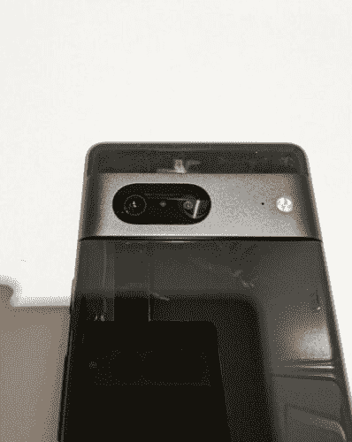

# 所谓的谷歌 Pixel 7 原型以典型的谷歌风格出现在易贝

> 原文：<https://www.xda-developers.com/google-pixel-7-prototype-ebay-leak/>

谷歌智能手机提前几周甚至几个月泄露并不罕见。我们已经看到了原型，我们已经看到了发布前几个月的全面审查，似乎该公司就是不能阻止产品泄漏。现在，一个所谓的谷歌 Pixel 7 原型出现在易贝，上面有该设备开机的照片。此外，这些照片似乎是用谷歌 Pixel 7 Pro 拍摄的。

卖家声称这是谷歌 Pixel 7 的原型，在相机模块上聚焦的照片中设备的反射中，你可以分辨出似乎是 Pixel 7 Pro 在拍照。该列表已从易贝撤下，尽管我们能够在它被撤下之前保存这些照片。

 <picture></picture> 

Google Pixel 7 with Google Pixel 7 Pro in reflection

目前，还不清楚这个人是如何得到 Pixel 7 原型的，但话说回来，我们已经看到该公司多年来的大量泄漏。谷歌 Pixel 手表最近也泄露了，有人[声称在一家餐馆发现了它(和盒子在一起)。](https://www.xda-developers.com/real-world-images-google-pixel-watch-leak/)

我们还不太了解 Pixel 7 系列，尽管有一些传言。我们知道它将封装该公司所谓的“下一代”张量芯片，[最近的泄露表明，这两款设备的显示屏将类似于 Pixel 6 系列](https://www.xda-developers.com/google-pixel-7-pro-pixel-7-use-pixel-6-series-displays/)。相机设计也有一点点变化(尽管变化不大)，Pixel 7 将有黑曜石、雪和柠檬草三种配色。至于 Pixel 7 Pro，它将有黑曜石、雪和榛色。

至于 Pixel 7 的屏幕，据说在 6.2 英寸到 6.4 英寸之间，Pro 的屏幕据说要么是 6.7 英寸，要么是 6.8 英寸。著名行业分析师 DSCC 的罗斯·杨(Ross Young)也声称，Pixel 7 今年将采用更小的 6.3 英寸面板。

鉴于这是几个月前正式销售开始，这可能是我们可以期待看到更多的泄漏和其他动手镜头很快。

* * *

**Via:[/r/Google pixel](https://www.reddit.com/r/GooglePixel/comments/v127zt/google_pixel_7_prototype_128gb_stormy_black)**