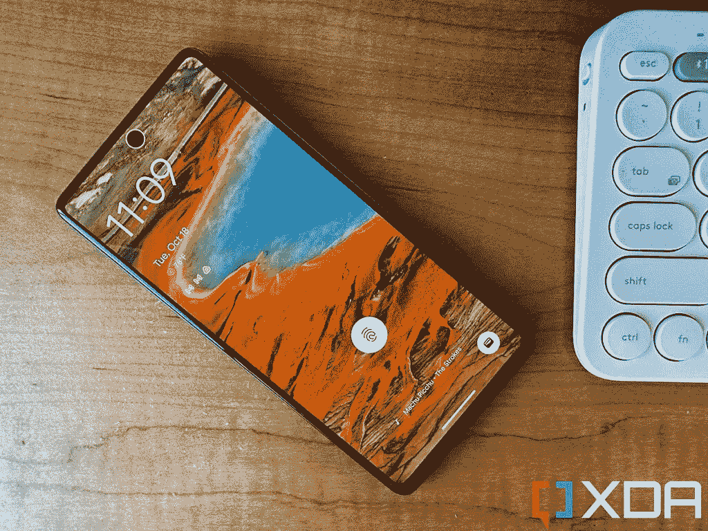

# 谷歌 Pixel 7 评论:Pixel 硬件终于变得足够强大，可以媲美同类最佳软件

> 原文：<https://www.xda-developers.com/google-pixel-7-review/>

自 2016 年诞生以来，[谷歌 Pixel 系列](https://www.xda-developers.com/best-pixel-phones/)提供了出色的软件性能，但硬件却不尽如人意。最初的 Pixel 有一个可笑的厚下巴挡板，没有任何用途(它没有任何按钮或传感器)；第二个像素有显示质量问题；第三个像素在 XL 上有一个可怕的缺口；第四个像素用一个笨重的挡板取代了那个凹槽，挡板上有一个 3D 面部扫描系统，但这个系统并不总是工作正常；Pixel 5 既没有使用旗舰处理器，也没有使用高级制造材料。Pixel 6 带来了变革之风，这是第一款提供漂亮硬件来匹配行业最佳软件的 Pixel 手机。但即便如此，仍有一些硬件问题，包括显示屏不够亮，显示屏内的指纹扫描仪慢得令人沮丧。

凭借 Pixel 7，谷歌进一步完善了这些粗糙的边缘。结果呢？有史以来最精致、最完美的谷歌硬件，真正让人感觉像是旗舰产品。当然，软件体验也很棒，但是你已经知道了。

谷歌 Pixel 7 售价 599 美元，是目前 T2 智能手机中最超值的选择。如果你想买一部新手机，Pixel 7 或者更贵的 [Pixel 7 Pro](https://www.xda-developers.com/google-pixel-7-pro-camera-review/) 应该是你考虑的首选。

 <picture></picture> 

Google Pixel 7

谷歌像素 7 提供了一个优秀的主摄像头，第二代谷歌硅，以及一个卓越的旗舰包的独特和优质的构建质量。

* * *

## 谷歌 Pixel 7 和 Pixel 7 Pro:价格和可用性

*   Pixel 7 和 7 Pro 在大多数北美、欧洲和亚洲市场的各种零售商处广泛销售
*   价格从 599 美元到 1099 美元不等

Pixel 7 和 Pixel 7 Pro 在北美以及欧洲和亚洲的主要市场广泛销售。在美国，消费者可以从谷歌在线商店、百思买、亚马逊或主要运营商在线购买。

价格低于，但总是有 [Pixel 7 的交易可以找到。](https://www.xda-developers.com/best-google-pixel-7-deals/)

*   像素 7:
    *   8GB/128 GB:599 美元
    *   8GB/256 GB:699 美元

*   Pixel 7 Pro:
    *   12GB/128 GB:899 美元
    *   12GB/256 GB:999 美元
    *   12GB/512 GB:1099 美元

谷歌 Pixel 7 售价 599 美元，是目前智能手机中最超值的选择。

* * *

## 谷歌 Pixel 7 和 Pixel 7 Pro:规格

| 

**规格**

 | 

**谷歌像素 7**

 | 

**谷歌 Pixel 7 Pro**

 |
| --- | --- | --- |
| **构建** | 

*   铝制中框
*   光滑背面玻璃
*   大猩猩玻璃 Victus 正面

 | 

*   铝制中框
*   光滑背面玻璃
*   大猩猩玻璃 Victus 正面

 |
| **尺寸&重量** | 

*   155.64 x 73.16 x 8.7mm 毫米
*   195.5 克

 | 

*   162.9 x 76.55 x 8.9mm 毫米
*   212 克

 |
| **显示** | 

*   6.32 英寸 FHD+ (2400 x 1080 像素)有机发光二极管显示屏
*   高达 90Hz 的刷新率
*   1400 尼特

 | 

*   6.7 英寸 QHD+ (3120 x 1440 像素)极化显示屏
*   高达 120Hz 的刷新率
*   1500 尼特

 |
| **SoC** | 谷歌张量 G2 | 谷歌张量 G2 |
| **风筒&储存** | 

*   8GB LPDDR5 RAM
*   128GB/256GB UFS 3.1

 | 

*   12GB LPDDR5 内存
*   128GB/256GB/512GB UFS 3.1

 |
| **电池&充电** | 

*   4355 毫安时
*   30W 有线快速充电，带 USB-PD PPS
*   15W 无线充电
*   大多数地区包装盒中没有充电器

 | 

*   5003 毫安时
*   30W 有线快速充电，带 USB-PD PPS
*   15W 无线快充
*   盒子里没有充电器

 |
| **安全** | 

*   光学显示指纹扫描仪
*   面部解锁

 | 

*   光学显示指纹扫描仪
*   面部解锁

 |
| **后置摄像头** | 

*   双摄像头系统:
    *   主要:50MP 宽，f/1.85，1/1.3 英寸，OIS
    *   次要:12MP 超宽，f/2.2，106 度 FoV

 | 

*   三摄像头系统:
    *   主要:50MP 宽，f/1.85，1/1.3 英寸，OIS
    *   次要:12MP 超宽，f/2.2，125 度视场
    *   第三:48MP 潜望镜，f/3.5，OIS，30x 超分辨率变焦，4.8 倍光学变焦

 |
| **前置摄像头** | 10.8 兆像素，f/2.2 | 10.8 兆像素，f/2.2 |
| **端口** | USB-C | USB-C |
| **音频** | 立体声扬声器 | 立体声扬声器 |
| **连通性** | 

*   5G
*   支持 2x2 MIMO 的 Wi-Fi 6e (802.11ax)
*   蓝牙 5.2
*   国家足球联盟

 | 

*   5G
*   支持 2x2 MIMO 的 Wi-Fi 6e (802.11ax)
*   蓝牙 5.2
*   国家足球联盟

 |
| **软件** | 安卓 13 | 安卓 13 |
| **其他特征** | 

*   双 SIM 卡(nano 和 eSIM)
*   IP68 等级

 | 

*   双 SIM 卡(nano 和 eSIM)
*   IP68 等级

 |

***关于这次评测:*** *谷歌向 XDA 提供了 Pixel 7 和 Pixel 7 Pro 的评测单位。这篇评测是在使用 Pixel 7 Pro 九天之后写的。谷歌没有参与这项审查。*

* * *

## 设计和硬件:一些小的改进

*   6.3 英寸的屏幕比去年的 6.4 英寸面板略小
*   运行在谷歌的第二代芯片 Tensor G2 上
*   正如所料，相机很棒

经过多年来一些平淡无奇(Pixel 4)和真正糟糕(Pixel 3 XL，具有智能手机历史上最丑的屏幕切口)的设计美学之后，谷歌的硬件设计团队对 Pixel 6 系列进行了彻底的改革，引入了视觉上引人注目的独特设计语言，脱颖而出。谷歌明智地决定用 Pixel 7 系列重新运行它。

大型相机遮阳板杆回归，但这一次，它更加突出，材料从玻璃转向闪亮的金属。摄像头杆现在也无缝融入铝制机箱，打造出完美的一体式外观和感觉。

不像一些 Pixel 6 设备有醒目的双色背面，所有 Pixel 7 手机都有纯色:黑曜石色(黑色)、雪色(白色)和柠檬草色(绿色)。我认为我收到的黑色型号是三种型号中最不吸引人的，因为它的光泽，反光更容易吸引指纹污迹。在我看来，白色和绿色的款式好看多了。

### 显示

6.3 英寸的有机发光二极管显示屏比 Pixel 6 略小，这也使得该设备的整体尺寸略小。我已经发现 Pixel 6 是一款非常容易握持的手机，重 197g 的 Pixel 7 更是如此。这是一个平板显示面板，虽然屏幕的边缘略显锐利，但你的手掌感觉到的手机的大部分是圆形和弯曲的。很少会像 iPhone 14s 和 Galaxy S22 Ultras 那样有尖尖的边缘戳到你的手掌。如果你使用像素为 7 的外壳，你甚至不会感觉到粗糙的屏幕边缘。

刷新率“仅仅”是 90Hz，但在我看来动画仍然很流畅。最大亮度增加到 1，500 尼特，即使在户外使用也足够好了。这是对 Pixel 6 的一次重大升级，我白天出门时，Pixel 6 的屏幕会感觉很暗。

### 硅

去年，谷歌推出了自己自主设计的 SoC，命名为 Tensor。就原始性能而言，该芯片不如竞争对手高通硅公司强大，但它旨在处理谷歌的机器学习人工智能任务(如语音和图像识别)，它没有辜负这一承诺。

Pixel 7 自然使用第二代谷歌芯片，命名为[张量 G2](https://www.xda-developers.com/google-tensor-g2/) 。Tensor G2 基于 5 纳米架构，在原始处理能力方面再次落后于 4 纳米竞争对手，如[高通骁龙 8 Plus Gen 1 或联发科 Dimensity 9000](https://www.xda-developers.com/qualcomm-snapdragon-8-plus-gen-1-vs-mediatek-dimensity-9000-plus/) 。但这不会有太大影响，除非你是一个重度游戏玩家，或者在手机上导出编辑过的 4K 视频。

Tensor G2 完全能够处理正常的智能手机任务，如接收手机信号和运行谷歌 Play 商店的应用程序，当使用它执行这些任务时，手机很少会感到缓慢。

但如果你是一个玩图形密集型手机游戏或直接在手机上制作视频的超级用户，那么 Tensor G2 的缺点可能会有问题。我知道会有读者对用手机制作视频的想法嗤之以鼻，但在抖音/Instagram Reels 这一代，我们的数量比你想象的要多。

Pixel 7 在游戏过程中很容易发热，在 20 多分钟的游戏过程中，手机甚至因过热而崩溃。当我通过 Insta360 应用程序导出 360°视频或甚至只是将六分钟的视频长度缩短到 30 秒等视频相关任务时，与在 [iPhone 14 Pro Max](https://www.xda-developers.com/apple-iphone-14-pro-max-review/) 或 [Galaxy Z Fold 4](https://www.xda-developers.com/samsung-galaxy-z-fold-4-review/) 上做同样的事情相比，这个过程很慢。

然而，这些都是边缘情况，更长的等待时间或更温暖的手机回还不够糟糕，我不会向大多数人推荐这款手机。Tensor G2 很好，它带来的智能对我来说比能够在更长时间的峰值图形设置下玩 *Genshin Impact* 更有价值。基准数据实际上也很可观。

### 指纹扫描仪和面部解锁

Pixel 7 和 7 Pro 仍然使用光学显示扫描仪，但谢天谢地，它比去年的型号有了很大的改进。这并不意味着它现在是一个伟大的指纹扫描仪。它仍然比一加设备中的光学扫描仪或三星和 Vivo 旗舰产品中使用的超声波扫描仪慢。只是不再像 Pixel 6 的那么可怕了。

还有面部解锁，它和任何其他亚洲安卓品牌的面部解锁一样有效，这意味着它足够快速和安全，不会为其他人解锁。但它最终还不够安全，不能像苹果的 3D 面部扫描系统那样用于银行应用。

### 内存、电池寿命、充电和其他信息

Pixel 7 只有 8GB 的内存，有 128 或 256GB 的存储空间，而 7 Pro 有 12GB 的内存，尽管两者都是最新的内存标准。我在 Pixel 7 上没有看到任何应用程序循环的问题，即使是半天前坐在后台的那些应用程序。

Pixel 7 上的 4，355 mAh 电池实际上比 Pixel 6 的电池小，但电池寿命一直可以接受，甚至真的很好。我每天早上 7 点开始工作，手机充满电，到晚上 10 点或 11 点，也就是 15 或 16 个小时后，Pixel 7 仍有 10-15%的电池剩余。这意味着手机一次充电可以使用 17 个小时左右。考虑到我是一个重度用户，这是很大的耐力。

对于像我这样习惯了中国安卓手机的人来说，充电(20W 有线或无线)慢得令人痛苦，但如果你是从以前的 Pixel、三星或苹果设备上跳下来的，你不会注意到这一点。请注意，谷歌的包装中不包括充电器，所以在购买新手机时，你可能需要寻找一个[好的 Pixel 7 充电器](https://www.xda-developers.com/best-google-pixel-7-chargers/)。

还有立体声扬声器，触觉强。两者都很好，但不如 iPhone 14 手机或 Galaxy S22 Ultra 提供的一流。IP68 防水和防尘性能使包装更加完美。后者是一个不错的奖励，因为大多数低于 600 美元的手机没有官方的 IP 等级。

* * *

## 相机:和去年的一样好，只是做了一些调整

*   与去年的 Pixel 6 几乎完全相同的相机硬件，但 Tensor G2 确实给摄影带来了微妙的改进
*   主相机拍摄的照片看起来总是很棒
*   有趣的拍摄模式和相机功能

虽然谷歌 Pixel 7 Pro 升级了超宽相机和变焦镜头，但标准的 Pixel 7 基本上恢复了去年设置的相同相机硬件。在背面，它与 Pixel 6 的设置完全相同，而自拍相机已经升级为 1080 万像素的前置摄像头。但没关系，因为 Pixel 6 的摄像头很棒，Pixel 摄像头一直是软件处理而不是硬件实力。

### 主摄像机

主 50MP 相机的 1/1.31 英寸图像传感器尺寸在 2022 年不再能被称为大，但它仍然值得尊敬，并与张量 G2 配对，它几乎在任何光线条件下都可以产生辉煌的图像。在光线较暗的情况下，谷歌仍然会自由地转向“夜视”(又名夜间模式)，但现在速度快得多，因为 Tensor G2 足够智能，只要打开相机应用程序，就可以开始处理图像信息。

正如你所看到的，上面所有的镜头都是一流的，具有出色的动态范围，低噪音，和准确的白平衡。谷歌确实倾向于调高一些对比度和酷照片，但它们是我通常喜欢的图像处理决定。事实上，过去一周我用 Pixel 7 和 iPhone 14 Pro 并排拍了几十张照片，我几乎总是更喜欢 Pixel 拍摄。他们有更好的动态范围，更强烈的色彩，更少的过度锐化。

过去一周，我用 Pixel 7 和 iPhone 14 Pro 并排拍了几十张照片，我几乎总是更喜欢 Pixel 拍摄。

虽然 Pixel 7 没有专用的变焦镜头，但它可以实现非常好的 2 倍变焦，几乎达到光学质量，因为它位于 50MP 传感器的中间——这与 [iPhone 14 Pro](https://www.xda-developers.com/apple-iphone-14-pro-review/) 和[小米 12T Pro](https://www.xda-developers.com/xiaomi-12t-pro-review/) 的像素密集相机相同。

### 内置传感器 2 倍变焦

### 超宽

超宽相机很好，但在弱光场景下细节柔和。这是一个困扰几乎所有手机超宽相机的常见问题，只有少数例外，如 [Oppo Find X5 Pro](https://www.xda-developers.com/oppo-find-x5-pro-review/) (其超宽使用与主相机相同的传感器)。然而，Pixel 7(和 Pixel 6 系列)的一个独特问题是，超宽的视野太窄了(107 度)，根本算不上超宽。尽管如此，下面的超宽样本在文章形式下可能看起来很棒。然而，如果你在平板电脑或笔记本电脑上观看，夜间拍摄的细节非常柔和。

### 肖像和自拍

Pixel 是首批将人像模式引入智能手机的手机之一，谷歌的计算智能能够围绕主题产生令人信服的人工散景。几年前，Pixel 在主体边缘检测和使人工模糊看起来令人信服方面遥遥领先于竞争对手。然而，在过去的几年里，几乎每个手机品牌都迎头赶上。Pixel 7 拍摄的这些人像很好，但我不相信我不能用任何小米、一加或三星手机拍摄这些相同的照片。

值得注意的是，由于 Pixel 7 没有专用的变焦镜头，人像是用主摄像头拍摄的，Pixel 更喜欢用 2x 内置传感器裁剪拍摄，因为标准的 1x 取景太靠后了。但是使用 2 倍内置传感器作物拍摄意味着没有像素宁滨欺骗，因为手机是在标准的 50MP 模式下拍摄的。

我真的很喜欢 Pixel 7 拍摄的自拍，因为它在亚洲手机品牌过于激进的美颜算法和苹果的全天然方法之间取得了平衡，前者可以平滑和淡化皮肤，后者可以显示我脸上所有的瑕疵和黑眼圈。我不想看起来像一个 PS 过的 K-Pop 偶像，但我的皮肤也配不上 iPhone 的残酷诚实。像素似乎找到了中间的方法，让我看起来更自然，但使用了足够的算法技巧来显示每一个皱纹和眼袋。

### 照片取消模糊，电影模式

使用像素相机拍摄的一个有趣的事情是，你可以访问由谷歌的人工智能魔法驱动的有趣的拍摄模式。今年推出的 Pixel 7 系列独有的新功能是照片去模糊，这是去年推出的面部去模糊的演变。谷歌将基本上使用其先进的机器学习来分析由快门速度慢引起的模糊照片，并应用修复。

然而，它并不总是有效的。我想说，如果你有 100 张模糊的照片，谷歌的照片去模糊功能只能尝试修复其中的一半，从这一批照片中，可能有一半会看起来不错。所以你看到的是 25%的成功率，但当它真的起作用时，它是不可思议的——特别是因为这个功能也适用于另一部手机拍摄的旧照片。

电影模式是一种新的视频模式，在对象周围应用人工散景。它工作正常，在主体周围有相当好的边缘检测。但有一个很大的缺陷:你不能调整模糊(人工散景)的强度，默认模糊太强，使主体看起来像是在虚拟变焦背景前。

iPhone 在电影模式下的默认模糊也像这样过于强烈，但不同的是，iPhone 允许你在后期编辑会话中调整模糊效果，直接在手机上或在 Final Cut Pro 中。现在，Pixel 7 上的电影模式有点太假了，我不会考虑使用。但好消息是标准视频非常好，具有高于平均水平的稳定性，自动应用语音隔离算法的强大音频，以及出色的动态范围。下面的视频样本包括白天和晚上的视频，以及电影模式的镜头。

总的来说，Pixel 7 的相机体验非常完美。如果我与类似价格的手机进行比较，这毫无疑问 Pixel 7 是最好的相机系统。如果我去掉任何限定词，将 Pixel 7 与所有挑战者进行比较，那么我认为配备更大图像传感器的小米 12S Ultra 仍然可以在更高的天花板下拍摄出更多信息丰富的镜头；Galaxy S22 Ultra 变焦更好；而且 iPhone 14 Pro 在视频录制方面还是比较好的。但所有这些手机都比 Pixel 7 贵，而且其中两款设备没有在美国销售。

* * *

## 软件:Android 13，如谷歌所愿

*   自带 Android 13 和一些非常有用的像素专用功能
*   尤其是语音听写，它改变了游戏规则
*   但是有两个不可移除的小工具的主屏幕让我很恼火

Pixel 7 开箱即用，搭载了 Android 13。Android 13 并不是 Android 12 那样的重大设计革新/大升级，相反，它是关于改进的。Android 13 的新功能包括一个改进的搜索界面，允许你将搜索结果钉在主屏幕上，总体来说它的行为更智能一些(比如键盘会随着搜索界面自动启动)。

默认情况下，Android 13 现在也不会让新安装的应用程序向你发送通知。相反，应用程序在这样做之前必须征求你的许可。有一些常见的像素功能，如能够识别附近播放的音乐，并在始终显示和锁定屏幕上显示曲目标题。这是我非常喜欢的一个功能，因为我经常在咖啡店和酒吧遇到我想了解更多信息的音乐。

 <picture></picture> 

The Pixel 7 lock screen showing music information at the bottom, while also trying to scan my face at the top.

但对我来说，最重要的功能是 Pixel 出色的语音听写功能，它可以以至少 95%的准确率跟上我的讲话。还有像素专属的命令，比如告诉键盘不用触摸手机就能发送信息。这些功能并不新鲜——从 Pixel 6 的 Android 版本开始就已经存在了——但它们值得在此再次提及，因为它们改变了我使用手机的方式*。*当我使用 Pixel 6 或 Pixel 7 时，我打字比平时少了很多，因为我只使用语音听写来回复信息。

软件体验并不完美。我很恼火 Pixel 主屏幕有两个不可移除的元素:底部的 Google 搜索栏和顶部的日历/时钟小部件。不允许我更改自己的主屏幕感觉很像 iOS！

此外，Pixel 仍然只能通过分屏格式执行多任务。你不能像其他 Android 皮肤一样在一个更小的可调整大小的浮动窗口中打开应用程序。我发现这有局限性，因为当我浏览 Instagram 或 Twitter 时，我经常喜欢在较小的窗口中打开 Slack 或 WhatsApp。

但最终，Pixel 7 的软件是谷歌想要的 Android，它确实积极地让我们的智能手机体验更容易。如果你想从谷歌获得 Android 平台的第一天更新，以及安全补丁的快速更新，这也是你可以考虑的智能手机。谷歌 3 代 Android 更新和 5 年安全更新的更新承诺落后于三星的更新承诺(三星承诺其旗舰机 4 代 Android 更新)，显然落后于 iPhones 通常收到的更新。但就其本身而言，这仍是一个可观的数字，尽管不是同类中最好的。

如果你对售后市场发展感兴趣，Pixel 7 也应该是你购买手机的首选。它仍然是最容易解锁和改装的手机之一。虽然是的，有一些幕后的变化确实使事情有所不同(但不一定很难)，我相信 Pixel 系列产品，特别是 Pixel 7，将仍然是定制 ROM 社区的首选

* * *

## 你应该买谷歌 Pixel 7 吗？

**您应该购买 Pixel 7，如果:**

*   你想买一部 600 美元左右的新手机。
*   你想要像素相机和软件体验，但发现 Pro 899 美元的价格太高。
*   你想要第一天更新的完整 Android 体验。
*   你想要一部智能手机来享受软件改造的乐趣。
*   你想要一部平板智能手机。

**如果:**你不应该买 Pixel 7

*   你想要一个专用的变焦镜头。
*   你已经拥有 Pixel 6 或者 6 Pro 了。

如果你对拥有一部 Pixel 手机有点兴趣，现在是时候加入进来了。Pixel 7 是最精致的安卓手机，也可以说是最智能的智能手机。它 599 美元的起价相对于智能手机领域的其他品牌来说也很便宜，特别是在美国。如果你能在此基础上达成交易，那简直就是锦上添花。

然而，如果你已经拥有了 Pixel 6，那么我认为你不需要升级(除非你能获得一笔不错的以旧换新交易)。Pixel 7 主要改进了夜间摄影和指纹扫描仪。否则，使像素 7 伟大的大部分仍然适用于像素 6。

历经七代之后，Pixel 终于成熟，成为了 iPhone 的一个非常可行的 Android 替代品。

 <picture></picture> 

Google Pixel 7

普通的谷歌 Pixel 7 与高端的 Pro 型号非常相似，但便宜 300 美元，性价比更高。