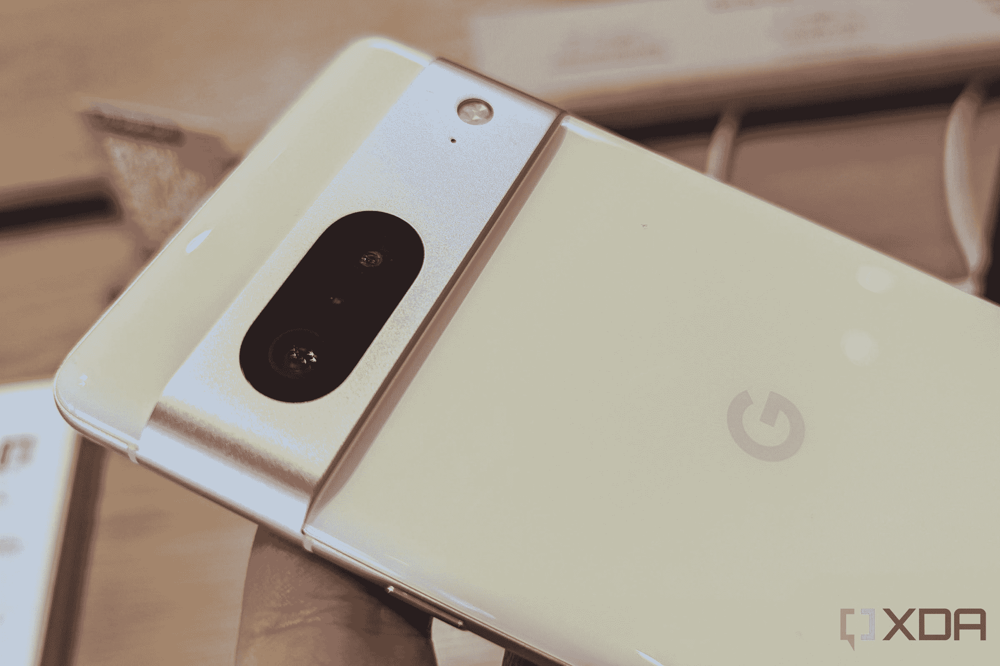

# 谷歌 Pixel 7 vs 苹果 iPhone 14:哪款中端旗舰适合你？

> 原文：<https://www.xda-developers.com/google-pixel-7-vs-apple-iphone-14/>

谷歌 Pixel 7 和苹果 iPhone 14 被认为是你能买到的最好的旗舰智能手机。从它们强大的规格和优质的设计到它们令人惊叹的摄像头和坚固的电池寿命，每款手机都有很多令人喜欢的地方。尽管它们有很多相似之处，但它们没有的一点是定价:Pixel 7 的起价为 599 美元，而 iPhone 14 的起价为 799 美元，相差 200 美元。考虑到它们都是谷歌和苹果旗舰智能手机系列的切入点，问题是:你应该买哪一个？

我们将两款设备进行对比，以帮助您决定购买哪一款。

## Pixel 7 与 iPhone 14:定价和可用性

谷歌 Pixel 7 和苹果 iPhone 14 现在可以从他们的在线商店和主要零售商如亚马逊、百思买和各种运营商那里购买。前者 599 美元起，后者 799 美元起。每个型号的定价如下。

*   像素 7(128 GB):599 美元
*   像素 7(256 GB):699 美元
*   iPhone 14(128 GB):799 美元
*   iPhone 14(256 GB):899 美元
*   iPhone 14(512 GB):1099 美元

## Pixel 7 与 iPhone 14:规格

| 

规范

 | 

谷歌像素 7

 | 

苹果 iPhone 14

 |
| --- | --- | --- |
| 

建设

 | 

*   铝制中框
*   大猩猩玻璃 Victus 回
*   大猩猩玻璃 Victus 正面

 | 

*   铝制中框
*   “陶瓷盾”正面和背面

 |
| 

尺寸和重量

 | 

*   6.13 x 2.88 x 0.34 英寸(155.6 x 73.2 x 8.7mm 毫米)
*   6.95 盎司(197 克)

 | 

*   5.78 x 2.81 x 0.31 英寸(146.7 x 71.5 x 7.8mm 毫米)
*   6.07 盎司(172 克)

 |
| 

显示

 | 

*   6.3 英寸全高清+ AMOLED
*   90Hz 刷新率

 | 

*   6.1 英寸超级视网膜 XDR 有机发光二极管
*   60Hz 刷新率

 |
| 

社会学

 |  |  |
| 

RAM 和存储

 |  | 

*   6GB 内存
*   128GB/256GB/512GB

 |
| 

电池和充电

 | 

*   4355 毫安时
*   20W 有线快速充电
*   20W 无线
*   反向无线充电
*   盒子里没有充电器

 | 

*   3279 毫安时
*   20W 有线快速充电
*   7.5W 无线充电
*   15W MagSafe 无线充电
*   盒子里没有充电器

 |
| 

安全性

 | 

*   光学显示指纹扫描仪
*   面部解锁

 |  |
| 

后置摄像头

 | 

*   **主** : 50MP 宽，三星 GN1，f/1.9，1/1.31 寸
*   **二级** : 12MP 超宽，f/2.2，114 度

 | 

*   **主** : 12MP 宽，f/1.5，1/1.7 寸
*   **二级** : 12MP 超宽，f/2.4，120 度

 |
| 

前置摄像头

 |  |  |
| 

端口

 |  |  |
| 

声音的

 |  |  |
| 

连通性

 | 

*   5G(低于 6GHz 和毫米波)
*   支持 2x2 MIMO 的 Wi-Fi 6e (802.11ax)
*   蓝牙 5.2
*   国家足球联盟

 | 

*   5G(低于 6 GHz 和毫米波)
*   支持 4×4 MIMO 和 LAA 的千兆级 LTE
*   支持 2×2 MIMO 的 Wi-Fi 6 (802.11ax)
*   蓝牙 5.0

 |
| 

软件

 |  |  |
| 

其他功能

 | 

*   双 SIM 卡(nano 和 eSIM)
*   IP68 等级
*   汽车碰撞检测

 | 

*   双 eSIM 支持(美国型号与物理 SIM 卡不兼容)
*   IP68 等级
*   紧急求救信号
*   碰撞检测

 |

## 设计和硬件:变化最小，差异最大

年复一年，无论是 [Pixel 7](https://www.xda-developers.com/google-pixel-7-review/) 还是 [iPhone 14](https://www.xda-developers.com/apple-iphone-14-review/) 都没有在智能手机设计上取得巨大的飞跃。相反，它们与它们的前辈几乎一模一样，尤其是 iPhone。苹果没有重新发明轮子，而是选择将 iPhone 13 的设计带到 iPhone 14 上，并添加了一些新的颜色。这是教科书对这句话的定义，“如果它没坏，就不要修理它。”

谷歌在 Pixel 7 上走了一条类似的道路。它将背面的玻璃相机遮阳板换成了铝制的，音量和电源按钮也稍微向下移动了一些。但除了这些变化，你很难说出它和去年的 Pixel 6 之间的区别。

当你把它们放在一起时，差异就显现出来了。谷歌的 Pixel 7 选择了更多的矩形角落、弯曲边缘和水平摄像头布局。与此同时，苹果的 iPhone 14 坚持采用圆形显示屏，平面侧边，左上角有一个摄像头集群。Pixel 7 还配备了一个简单的打孔切口和显示指纹读取器，而 iPhone 14 则配备了一个凹槽和 Face ID。

iPhone 14 比 Pixel 7 轻得多，分别为 172 克和 197 克，但 Pixel 7 的额外重量并不完全是件坏事。它给人一种高端的感觉，这种感觉在这个价位的手机中并不常见。

很难说哪个设备的颜色最好，因为它们都很无聊。谷歌没有选择在 Pixel 7 系列的背面进行双色处理，所以你只能选择静态黑曜石(又名黑色)、雪花(又名灰色/银色/白色)或柠檬草(又名黄绿色)。iPhone 14 有蓝色、紫色、午夜、星光和产品(红色)。他们都看起来...很好——没有任何异常。

这两款手机都有双发射立体声扬声器，每个都使用耳机和底部发射驱动器。Pixel 7 产生了令人印象深刻的音质和良好的低音，但我想说 iPhone 14 整体上听起来更好，这要归功于它更平衡的声场。你还可以在底部找到每部手机的充电端口，Pixel 7 使用 USB-C，而 iPhone 14 则使用 Lightning。[用不了多久](https://www.xda-developers.com/eu-iphone-usb-c-2024/)iPhone 就会有 USB-C 端口(如果欧盟对此有什么看法的话)，但现在，你需要记得带一根单独的电缆给你的手机充电。

## 显示器:两者都非常坚固

iPhone 14 的 Super Retina XDR 对角线尺寸为 6.1 英寸。这是一台 OLED 面板，分辨率为 2532x1170，亮度高达 1200 尼特。与此同时，Pixel 7 拥有更大的 6.3 英寸有机发光二极管显示屏，分辨率为 2400x1080，亮度为 1400 尼特。谷歌还推出了 90Hz 的刷新率，而苹果坚持 60Hz。

如果你在寻找一个赢家，那就是 Pixel 7。当然，苹果的显示器比谷歌的色彩还原更准确，但你无法击败更高的亮度和更快的刷新率。此外，Pixel 7 可以让你获得一个永远在线的显示屏，而该功能只在苹果更昂贵的 iPhone 14 Pro 系列上保留。

两款手机都覆盖着耐用的玻璃，Pixel 7 采用大猩猩玻璃 Victus，而 iPhone 14 采用苹果的陶瓷保护罩。很难说哪一个更耐用(玻璃就是玻璃，如果你以正确的方式跌落，它会碎掉)，但不管怎样，你已经得到了足够的保护。

## 相机:Pixel 7 更智能，而 iPhone 14 在视频方面更好

Pixel 7 和 iPhone 14 都拥有与前代产品几乎相同的摄像头。谷歌推出了一些新的软件技巧，而苹果修改了其图像处理管道，但除此之外，我们在这里看到非常相似的硬件。

理论上，你会认为 Pixel 7 在拍照方面比 iPhone 14 好得多。在某种程度上，确实如此。50MP 主镜头在任何光线条件下都能拍摄出令人惊叹的照片，具有漂亮的对比度和均衡的曝光。iPhone 14 上的 12MP 主镜头也不差，但它往往会过度曝光需要大量 HDR 的场景。两款手机还都配有 12MP 超宽摄像头，一如既往的方便，但是没有变焦的长焦摄像头。

谷歌的相机也比苹果的更智能，这要归功于魔法橡皮擦、照片去模糊和真实色调等功能。虽然它们都非常方便，但任何重视视频质量的人都会发现 iPhone 14 是适合他们的手机。苹果仍然是智能手机摄像之王，iPhone 14 系列通过电影模式(现在支持 4K 30fps)和动作模式等新功能进一步巩固了这一优势。Pixel 不一定会拍摄糟糕的视频，但它们的质量远远落后于 iPhone。

## 性能:张量 G2 vs A15 仿生

苹果懒得给 iPhone 14 新芯片。相反，它为 iPhone 14 Pro 保留了新的 A16 仿生处理器，并坚持使用 iPhone 13 的 A15 仿生处理器。这不一定是坏的——它仍然是市场上最快的芯片之一，在基准测试和日常使用中，它继续击败许多 Android 手机。

它显然比谷歌新推出的 Tensor G2 芯片强大很多，在 Pixel 7 系列中首次亮相。G 品牌的 SoC 非常敏捷和高效，它为所有软件的机器学习和人工智能任务提供动力。仅此一点就使它成为一个伟大的处理器，并帮助 Pixel 7 感受到快速和流畅，但就原始马力而言，iPhone 14 显然是赢家。

这在你做的几乎所有事情中都很明显(除了机器学习和人工智能之外)。从编辑照片到导出视频，再到杂耍多个应用程序，iPhone 14 可以更好地处理你扔给它的任何东西。如果你大量使用 Pixel 7，过一会儿就会开始窒息，任何涉及内容创作的东西都会感觉比 iPhone 上的慢。iPhone 上的多任务处理也更流畅，但我承认，Pixel 7 内部 8GB 的内存可以很好地处理我的工作负载，这给我留下了深刻的印象。

 <picture></picture> 

Google Pixel 7 in Snow colorway.

## 电池寿命和充电:相似的续航能力，非常不同的充电速度

iPhone 14 的 3，279 毫安时电池的续航时间大约相当于 Pixel 7 的 4，355 毫安时电池在充满电的情况下的续航时间，也就是说，对于中重度用户来说，可以舒适地使用一整天。你通常可以使用 12-13 个小时，这对大多数人来说已经足够了。这两款手机都不是两天的手机，但可靠的全天电池寿命没有任何问题。

显然，理论上，与 iPhone 14 及其小得多的电池相比，Pixel 7 应该是续航冠军。相反，苹果知道如何提高效率，它最新的 iPhone 再次证明了这一点。

这两款手机的不同之处在于充电。iPhone 14 使用 Lightning 线缆最多只能充电 20W，通过 MagSafe 可以充电 15W，使用 Qi 无线充电可以充电 7.5W。Pixel 7 获得了 30W 的 USB-C 充电和高达 21W 的快速无线充电(只要你使用 Pixel 支架)，所以你会更快地恢复充电。在我们的测试中，我们发现 iPhone 14 可以在大约两个小时内从零恢复到 100%，而 Pixel 7 在一个半小时到两个小时之间。

此外，Pixel 7 还提供反向无线充电功能，因此您可以随时随地为耳塞或智能手表等配件充电。iPhone 14 根本没有那个功能，有点可惜。

## 软件:安卓 13 vs iOS 16...不是！

你看，基于 iOS 16 是否比 Android 13 更好来推荐 iPhone 超过一个像素(反之亦然)基本是不可能的。两个平台各有优劣吗？是的。他们各自都很伟大吗？绝对的。归结为个人喜好吗？毫无疑问。

诚然，iOS 和 Android 从未如此相似。多年来，苹果已经开放了平台，允许更多的定制，而 Android 已经慢慢演变成一个更容易使用、使用起来不那么令人讨厌的系统。在 iOS 16 中，苹果增加了一些很棒的新功能，如锁屏定制、升级的对焦模式和直播活动。与此同时，Android 13 改进了谷歌的 Material You 用户界面，使管理应用程序权限变得更容易，并由于效率更高而帮助你的手机运行得更快。

这是两个成熟的操作系统，每个都能够轻松处理您的日常任务。就支持而言，谷歌承诺长达三年的主要 Android 更新，这远远少于苹果历史上对 iPhone 所做的。从这个角度来看，最初于 2017 年 9 月发布的 iPhone 8 可以运行 iOS 16。据此判断，iPhone 14 可能至少会支持到 2027 年。如果你打算长时间保留你的手机，iPhone 将继续得到支持。

## Pixel 7 vs iPhone 14:你该买哪个？

谷歌的 Pixel 7 为 599 美元提供了很多价值，包括出色的软件体验、快速的性能、出色的摄像头和全天电池寿命。iPhone 14 利用了这个等式的某些部分，并使它们变得更好，例如改善的视频质量、更强大的性能和更好的扬声器。但是证明 200 美元的价格上涨来获得这些功能是困难的。

谷歌在 Pixel 7 上表现出色。这是不到 600 美元就能买到的最全面的手机之一。另一方面，苹果的 iPhone 14 可能是 iPhone 13 的最小升级，但它仍然是 iPhone 产品线中一个很好的选择。不管你最终买哪一个，你都会玩得很开心。

关于 Pixel 7 的更多信息，请务必查看我们关于谷歌旗舰产品最佳[外壳](https://www.xda-developers.com/best-google-pixel-7-cases/)和[充电器](https://www.xda-developers.com/best-google-pixel-7-chargers/)的其他指南，以及[最佳交易](https://www.xda-developers.com/best-google-pixel-7-deals/)。