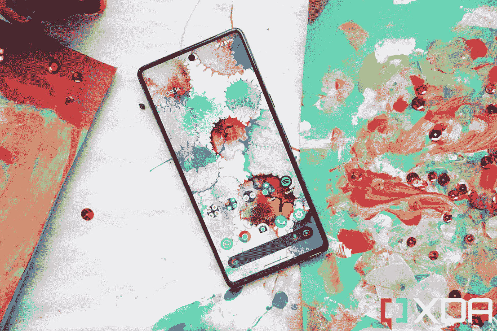

# 谷歌 Pixel 7 vs 三星 Galaxy Z Flip 4:应该买哪款紧凑型旗舰？

> 原文：<https://www.xda-developers.com/google-pixel-7-vs-samsung-galaxy-z-flip-4/>

如果你在市场上寻找一部新手机，并且你更喜欢更紧凑的外形，而不是占据旗舰机空间的平板电脑大小的庞然大物，那么无论是 T2 谷歌 Pixel 7 T3 还是 T4 三星 Galaxy Z Flip 4 T5 都应该很适合你。谷歌 Pixel 7 的显示屏为 6.3 英寸，是市场上最小的手机之一，而 Galaxy Z Flip 4 的显示屏为 6.7 英寸，可以折叠成一个小盒子，甚至可以放进衬衫口袋。

哦，这两款手机都是高度抛光的，并且是随处可见的最好的安卓手机之一。

除了外形因素，这些手机还有其他影响你购买的差异，从价格到功能。

*   谷歌 Pixel 7 是对已经非常出色的 Pixel 6 的改进，是一款非常精致的旗舰手机，价格也不高。T13
*   Galaxy Z Flip 4 是一款翻盖式可折叠手机，结合了昔日手机的紧凑外形和现代 Android 体验。它还配备了最强大的高通芯片组和尖端的可折叠有机发光二极管技术。

## 谷歌 Pixel 7 与三星 Galaxy Z Flip 4:价格和可用性

这两款手机在北美几乎每个运营商或电子产品零售店都有售。在美国，Pixel 7 的售价为 599 美元，而 Z Flip 4 的官方售价为 999 美元。我说后者是“官方”的，因为这款手机一直在销售——事实上，在我写这篇文章时，亚马逊的售价为 900 美元——三星的网站上有非常慷慨的以旧换新优惠。换句话说，这两款手机的价格差异通常小于官方列出的 400 美元差距。然而，谷歌 Pixel 7 也有公平的交易份额。

在北美以外，Galaxy Z Flip 4 更容易找到。与此同时，Pixel 7 的市场较少，但在英国、法国、德国、意大利、西班牙、爱尔兰、荷兰、瑞典、丹麦、挪威、日本、澳大利亚、新加坡、台湾和印度正式销售。如果你不在列表中的国家，你必须从进口商那里购买。

## 谷歌 Pixel 7 vs 三星 Galaxy Z Flip 4:规格

| **规格** | **谷歌像素 7** | **三星 Galaxy Z Flip 4** |
| **重量和尺寸** | 

*   6.9 盎司(197 克)
*   6.1 x 2.9 x 0.3 英寸(155.6 x 73.2 x 8.7mm 毫米)

 | 

*   6.6 盎司(187 克)
*   展开时:6.5 x 2.83 x 0.27 英寸(165.2 x 71.9 x 6.9mm 毫米)
*   折叠后:3.34 x 2.83 x 0.63–0.67 英寸(84.9 x 71.9 x 15.9-17.1 毫米)

 |
| **处理器** | 谷歌张量 G2 | 高通骁龙 8 加第 1 代 |
| **显示屏** | 6.3 英寸有机发光二极管 90Hz 1080 x 2400 | 

*   主屏幕:6.7 英寸有机发光二极管，120 赫兹，1080 x 2640
*   次要:1.9 英寸有机发光二极管，260 x 512

 |
| **摄像机** | 

*   主:50MP，f/1.9
*   超宽:12MP，f/2.2
*   自拍:1080 万像素，f/2.2

 | 

*   主屏幕:12MP，f/2.2
*   超宽:12MP，f/2.2
*   自拍:10MP，f/2.4

 |
| **内存** | 8GB 内存，128/256GB | 8GB 内存，128/256/512GB |
| **电池** | 4355 毫安时 | 3700 毫安时 |
| **软件** | 安卓 13 | Android 13 上的 OneUI 5 |

## 设计和硬件:一个折叠，另一个不折叠...咄

 <picture></picture> 

Google Pixel 7 in Snow colorway.

谷歌 Pixel 7 是一款平板手机，配有 6.3 英寸的平板显示器和弯曲的玻璃背面，突出的是视觉上引人注目的铝制摄像头遮阳板，内置双摄像头系统。与此同时，Galaxy Z Flip 4 是一款蛤壳式可折叠手机(也是玻璃和铝夹层)，配有一个 6.7 英寸的可折叠大屏幕和一个较小的屏幕。Flip 4 在中间点向内水平折叠，合拢成为一个小的矩形盒子。即使有了[保护壳](https://www.xda-developers.com/best-samsung-galaxy-z-flip-4-cases/)，翻盖 4 依然保持紧凑。

当翻盖 4 打开时，它的行为就像任何其他平板手机一样，有两个明显的手感差异。首先，折叠点处屏幕中间的折痕很深，当你的手指滑过它时会分散注意力。第二，Flip 很薄，只有 6.9 毫米。除了这两件事，Flip 4 在展开时的表现基本上就像 Pixel 7 一样。

尽管有更大的显示屏(并有第二块屏幕)，但 Flip 4 比 Pixel 7 轻 10 克(187 克)。尽管如此，Pixel 7 仍然是一款非常轻便小巧的手机，即使你用外壳保护它。

## 显示:交易成功

 <picture></picture> 

Google Pixel 7's display.

两款手机的主屏各有千秋。Z Flip 4 的刷新率为 120 赫兹，高于 Pixel 7 较慢的 90 赫兹，但与 Z Flip 4 的 1200 尼特相比， [Pixel 7 的 OLED 面板](https://www.xda-developers.com/google-pixel-7-display-review/)以 1400 尼特的最大亮度变得更亮。三星的显示屏像素密度略高，但 Pixel 7 的屏幕没有贯穿中间的深沟。一般情况下两个屏幕看起来都很棒。

然而，Flip 4 在外部有一个额外的屏幕，允许手机在关闭时使用。这是一个 1.9 英寸的矩形有机发光二极管屏幕，最适合查看快速信息或通知片段，尽管我的同事亚当·康威[在上面成功地玩了一个第一人称射击游戏](https://www.xda-developers.com/samsung-galaxy-z-flip-4-coverscreen-os-hands-on/)，这要归功于 CoverScreen OS 等应用程序，这些应用程序允许它具有一些附加功能。

外盖屏幕在紧要关头很有用，但最终，对于大多数智能手机任务，你将不得不打开 Flip 4。我认为这是一件麻烦事，其他人也会这样认为。

## 处理器和电池:效率与机器学习

Pixel 7 由谷歌的 Tensor G2 驱动，这是谷歌内部设计的芯片，而 Z Flip 4 运行在高通骁龙 8 Plus Gen 1 上。从技术上来说，后者的芯片总体上更强大，特别是在游戏性能和散热方面。然而，张量 G2 是专门为处理谷歌的机器学习算法而设计的，它创造了奇迹。

我已经彻底测试了这两种芯片，我可以说骁龙 8 Plus Gen 1 更加节能，在执行编辑视频或游戏等图形密集型任务时不会升温太快，并且可以更快地渲染编辑过的视频。但张量 G2 让 Pixel 7 完成了许多智能任务，如一流的语音听写或处理谷歌的高级图像处理(在相机部分详细介绍了后者)。

两款手机都使用 8GB 的 LPDDR5 内存和 UFS 3.1 内存标准。在 Pixel 上，存储容量为 128GB 或 256GB，而 Flip 4 既有 128 GB 又有 512GB 的存储容量。

Pixel 7 有一个相当不错的 4，355 毫安时电池，而 Flip 4 有一个 3，700 毫安时的小电池。谷歌的手机确实因此获得了更长的电池寿命，但由于高效的骁龙 8 加第一代芯片，Flip 4 也不算太差。

## 相机:无法与谷歌竞争

首先要说明的是，三星 Galaxy Z Flip 4 的摄像头相当不错。12MP 宽和超宽相机可以快速对焦，产生强烈的色彩，并且由于手机的可折叠外形，可以兼作巨大的自拍相机系统。

但这没有糖衣:Pixel 7 的摄像头在另一个层面上。我测试了 2022 年发布的每一款旗舰手机，Pixel 7 的主摄像头基于大传感器 50MP 摄像头和谷歌张量驱动的计算摄影的优势，有望获得今年的最佳智能手机摄像头。Pixel 7 的主摄像头拍摄的照片几乎总是具有完美的动态范围，对刺目的高光进行了适当曝光，并在阴影中找到了细节。较大的图像传感器也会产生自然的散景。只看下面的照片样本。

为了充分披露:它们是用 Pixel 7 Pro 的主摄像头拍摄的，但它与标准 Pixel 7 的主摄像头完全相同。

Flip 4 的相机也可以捕捉一些好照片，但景深有点浅，偶尔会吹出高光。然而，Flip 4 折叠成 L 形并保持原位的能力(三星称之为[灵活模式](https://www.xda-developers.com/samsung-galaxy-z-flip-4-flex-mode-walkthrough/))开启了可能性。例如，你可以用它来抓取免提自拍或集体照片，而不需要帮手或三脚架。

## 软件和性能:两个版本的 Android

Pixel 7 运行在 Android 13 上，这是谷歌对 Android 应该是什么样子的愿景。该软件有一个可定制的配色方案，总体来说在动画方面非常华丽，比三星的 One UI Android 皮肤更有趣。

谷歌也不羞于在用户界面中展示其人工智能。例如，位于 Pixel 7 主屏幕顶部的不可移动主小部件将向您显示上下文信息，如即将到来的航班或警报。锁屏会自动显示附近正在播放的歌曲。你可以关闭这种上下文信息(这需要 Pixel 自由访问你的信息和麦克风)，但它们默认打开的事实很好地说明了谷歌对其软件智能有多自豪。

Flip 4 上的 OneUI 远不如主动感知或智能，但它有一个更好的多任务系统，因为 OneUI 允许你在分屏或可调整大小的小窗口中打开应用程序，而 Pixel UI 只能分屏。这意味着如果你经常一次运行多个应用程序，三星的用户界面会更强大一些。

这两款设备的整体性能都很好，因为它们都缺乏动力。我确实发现，如果用力按压，像素往往会变慢一点。有时候，一个应用程序在完全加载之前可能需要一瞬间的时间，在谷歌照片应用程序中修剪视频的长度将需要比平时更长的时间来渲染新文件。看起来 Flip 4，加上高通骁龙 8 和 Gen 1，只是快了一点点。但在我看来，这种差异并没有大到影响太大。

## 谷歌 Pixel 7 vs 三星 Galaxy Z Flip 4:该买哪款手机？

对我来说，这个问题很简单:你认为有一部对折的手机有价值吗？你迷恋市场上最好的可折叠产品之一的技术和炫目因素吗？你是否经常自拍和视频通话，并且觉得找个地方支撑手机很麻烦？如果你的答案是肯定的，Galaxy Z Flip 4 是一个很好的选择。

但如果你对所有问题的回答都是否定的，或者没有强烈的感受，那么 Pixel 7 是更好的选择，因为它更便宜，主摄像头更好，电池寿命更长。

*   谷歌 Pixel 7 是对已经非常优秀的 Pixel 6 的改进，是一款非常精致的旗舰手机，价格不会过高。

*   Galaxy Z Flip 4 是一款翻盖式可折叠手机，结合了昔日手机的紧凑外形和现代 Android 体验。它还配备了最强大的高通芯片组和尖端的可折叠有机发光二极管技术。