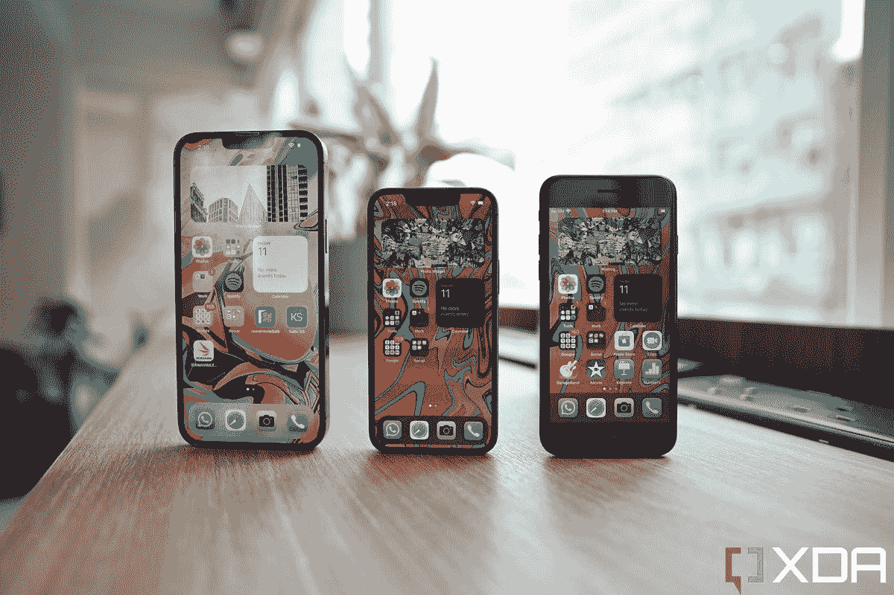
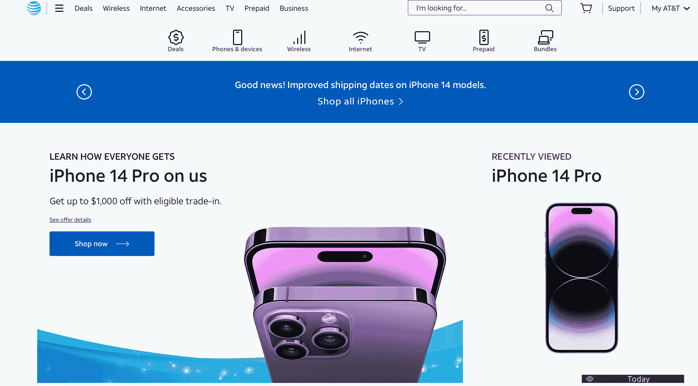
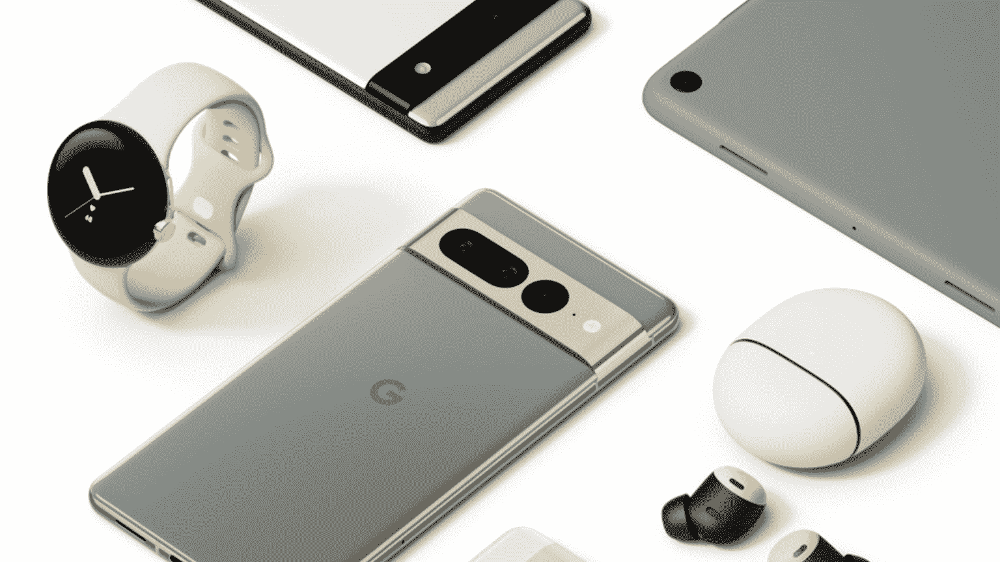

# 传闻中的 Pixel 8a 和 iPhone SE 4 的取消表明没有人想要中端手机

> 原文：<https://www.xda-developers.com/google-pixel-8a-apple-iphone-se-editorial/>

上周，我们看到了一个[重大泄露，揭示了谷歌未来三年像素设备的](https://www.xda-developers.com/2023-2025-google-pixel-roadmap-leak/)计划。这一泄漏揭示了一切，从预期的，如传闻已久的应在几个月后推出的 Pixel foldable，到令人惊讶的，如 2024 年的两款 Pro Pixel 手机和一款潜在的翻盖可折叠手机。

但在我看来，这次泄露中最值得注意的一点可能是，在即将发布的 Pixel 7a 之后，谷歌将缩小其中端“A 系列”的范围。泄露的消息称，谷歌要么将改为两年发布一次，要么完全放弃这条线。这意味着 2024 年没有 Pixel 8a 的计划——或者永远没有。

如果谣言是真的，谷歌不会是第一个缩减生产或完全取消中端手机系列的主要手机品牌。据非常可靠的行业分析师 Kuo Ming-chi 称，继第三代 SE 销量不佳之后，苹果公司很可能[放弃第四代 iPhone SE](https://www.xda-developers.com/apple-iphone-se-4-cancel-postpone/) 的大规模生产。同样，[三星今年也没有发布](https://www.xda-developers.com/samsung-galaxy-s22-fe-canceled/)粉丝版 Galaxy 手机。

从这些决定来看，我认为很明显，对“负担得起，但妥协”版本的旗舰产品的需求没有公司和一些美国科技作家最初认为的那么高。我把我们这些科技作家包括在内，是因为包括 XDA 在内的科技网站普遍支持这些 Pixel A/iPhone SE/Galaxy FE 类型的设备。但越来越多的是，评论界的赞誉并没有给这些手机带来商业上的成功。但这是怎么回事呢？考虑到当今的经济形势，人们难道不想花更少的钱买一部近乎旗舰的手机吗？关于为什么 Pixel 6as 和 iPhone SEs 销量不佳，我有几个受过教育的理论。

## 这些手机只在北美“物有所值”

我们必须解决的第一件事是，像谷歌 Pixel 6a 和第三代 iPhone SE 这样的手机只能在北美被认为是物有所值的(而 Galaxy S21 FE 则完全不是)，因为缺乏许多中国品牌，那里的手机市场有限。客观地说，中国品牌始终比西方或韩国竞争对手更物有所值。例如，为了让价格低于 500 美元，谷歌给了 Pixel 6a 一个 60Hz 的显示屏和塑料机身。与此同时，苹果的第三代 iPhone SE 采用了直接取自五年前的 iPhone 8 的组件设计——其显示分辨率甚至不到 720p。三星的 Galaxy S21 FE？它以可笑的 700 美元推出了一年的硬件——[几乎所有评论，包括 XDA 的，](https://www.xda-developers.com/samsung-galaxy-s21-fe-review/)都警告消费者“不要全价购买”

 <picture></picture> 

The Pixel 6a's display is clearly inferior to the Pixel 6 or Pixel 7's screens. 

相反，在亚洲和欧洲的其他市场，包括印度、英国、西班牙或新加坡，消费者可以以大约相当于 380 美元的价格买到类似于 Poco F4 的东西。它提供了一个 120 赫兹的薄边框有机发光二极管显示器，骁龙 870 SoC，更大的图像传感器，最新的内存和存储标准，以及含充电器的快速充电。

这意味着这些 A/SE/FE 手机在北美市场之外失去了它们的主要卖点——价值。但问题是，尽管有价值主张，这些谷歌/苹果/三星的中间流浪者也没有赢得北美消费者的支持。我认为这与我的下一个观点有关。

## 在北美，有足够的运营商补贴、以旧换新优惠和分期付款计划来吸引消费者购买旗舰机

在当前的经济形势下，人们会认为普通美国消费者的预算更加紧张，因此愿意为一部手机节省 200-300 美元。但事实显然并非如此，因为这些中间游侠显然不卖。

 <picture></picture> 

The iPhone SE (right) looks so outdated compared to flagship iPhones. 

我认为，问题在于，这些设备处于我所说的北美价格中间地带:在 450 美元到 700 美元之间，对于那些真正在财务上挣扎的人来说，它们不够便宜，但这些手机也抄了足够多的近路，它们显然不如旗舰产品，这意味着有更多可支配收入的消费者可能会被说服多花一点钱。

谁在做说服工作？手机运营商，为旗舰手机提供主要补贴和折价优惠。目前，在美国三大运营商的主页上( [AT & T](https://www.anrdoezrs.net/links/100122946/type/dlg/sid/UUxdaUeUpU1001400/https://www.att.com/buy/phones/apple-iphone-14-pro.html) 、 [T-Mobile](https://www.t-mobile.com/cell-phones/brand/apple?icid=MGPO_TMO_P_224LN4IP14_094HGQKOCCUTOFAS32459) 、[威瑞森](https://www.anrdoezrs.net/links/100122946/type/dlg/sid/UUxdaUeUpU1001400/https://www.verizon.com/smartphones/apple-iphone-14-pro/))，主要的宣传材料都在宣传，如果你以旧换新，购买一部符合条件的设备，并签订两年合约，就可以获得一部“免费”的 iPhone 14 Pro。三星有一些最慷慨的以旧换新优惠。就在两个月前，它有一项增强的以旧换新交易，有效地将通常为 999 美元的 Galaxy Z Flip 4 的价格降至 309 美元。

 <picture></picture> 

AT&T's homepage telling consumers they can get an iPhone 14 Pro for free. 

如果你连 309 美元都难以支付呢？三星、百思买或你的信用卡可能会提供分期付款计划。现实是，美国非常受消费主义驱动，永远不会缺少吸引你消费的优惠。正如移动分析师 Avi Greengart 在 Twitter 上发表的意见，为什么有人会选择一款明显劣质的手机，而他们自己并没有真正支付多少钱？

## 向下移动另一个定价层级是一种选择吗？我不太确定

由于消费者已经用他们的钱包表示，他们并不真正关心 450 美元的 Pixel 6a 或 iPhone SE，如果它的旗舰兄弟姐妹只是再多 200-300 美元的话，这些设备的下一步可能是降低价格，进入预算领域。也许 250 美元的 Pixel、iPhone 或 Galaxy S 品牌手机最终会产生足够的价格差距，从而产生影响？我不相信会这样，原因有几个。

首先，将价格降低到 200-300 美元将意味着硬件方面的更多妥协。谷歌、苹果和三星到目前为止还不愿意像一些中国品牌那样以价值的名义牺牲利润率。这些公司如何能够制造一部不使用非常过时的组件的 250 美元的手机？

还有品牌形象的问题。销售低价产品可以快速增加销量，但可能会降低整体品牌的高端地位。这就是包括中国手机品牌在内的各行各业的许多公司推出平价产品子品牌的原因。

我非常怀疑谷歌、三星和苹果都不想通过与廉价产品联系在一起来淡化自己的品牌形象。我甚至可以说，在我们看到苹果产品落入其类别的“预算”部分之前，地狱将被冻结。这是一家出售 19 美元一块布的公司。

## 取消 A 系列没问题，因为谷歌的目标是与苹果竞争

 <picture></picture> 

Google is slowly building its own ecosystem to compete with Apple's. 

让我们回到像素泄漏来结束这篇评论文章。如果 A 系列要退役，我不认为谷歌会损失太多。谷歌一直设想其 Pixel 手机是 Android 对 iPhone 的直接回应，并实现这一目标；谷歌需要更多的溢价，而不是更多的预算。

好消息是，谷歌在缓慢起步后，在过去几年取得了重大进展。Pixel 6 系列是该公司的一个突破，Pixel 7 系列是优质的，经过足够的打磨，有一个强有力的外壳，比今年的 iPhones 更好(我当然这么认为)。谷歌要赶上苹果还有很多工作要做，包括扩大其在全球的零售业务，建立更大的产品生态系统(所有这些谷歌都在积极努力)。但谷歌计划跳过 A 手机，专注于增加第三款旗舰手机，这似乎是一个正确的计划。

 <picture></picture> 

Google Pixel 7

##### 谷歌 Pixel 7 系列

谷歌的新 Pixel 7 和 Pixel 7 Pro 比去年的型号有了很大的改进。两款手机都升级了内部结构，设计也略有不同。

 <picture></picture> 

Apple iPhone SE 3

##### 苹果 iPhone SE 3 (2022)

iPhone SE (2022)是你现在能买到的最实惠的 iPhone。虽然它不是市场上最强大的 iPhone，但它仍然包含了伟大的 A15 仿生芯片，提供了很多价值。

##### 谷歌像素 6a

谷歌 Pixel 6a 与卓越的 Pixel 7 相比没有太大意义，但如果你想节省一点，你可以考虑这款手机。