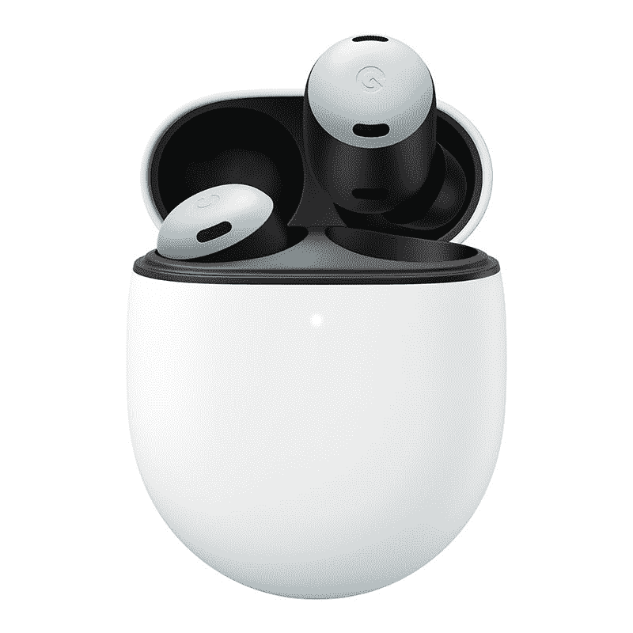

# 谷歌像素芽亲审查:惊人的硬件与可怕的开箱调优

> 原文：<https://www.xda-developers.com/google-pixel-buds-pro-review/>

谷歌在音频领域已经有一段时间了，Pixel Buds Pro 是该公司产品组合中的最新成员。我们以前有过 Pixel Buds，该公司在过去推出了 [Buds-A 系列](https://www.xda-developers.com/google-pixel-buds-a-review/)，作为对类似[谷歌 Pixel 6a](https://www.xda-developers.com/google-pixel-6a-review/) 的补充。Pixel Buds Pro 是谷歌第一次全力以赴的尝试，虽然这是一次令人钦佩的努力，但该公司实际上只是在追赶。

谷歌 Pixel Buds Pro 有几个简洁的功能，使它们超越了其他产品，尽管有一些令人困惑的遗漏。它具有舒适的设计，可以放在耳朵里，有很好的触摸控制，体面的主动降噪，多点支持和长电池寿命。有些东西你可能不会注意到，比如没有像 LDAC 那样高质量的编解码器，也没有内置均衡器。开箱即用的调优很糟糕，所以你要么不需要关心，要么知道你需要改变什么。

简而言之，谷歌 Pixel Buds Pro 在成为优质耳机方面做得很好，但它们价格昂贵，只是代表该公司在追赶，而不是创新该领域。如果这些耳机在一两年前发布，他们仍然只会觉得与竞争对手不相上下。他们做的其他一切*都很好*，音质也很棒(有一些调整)，但正是开箱即用的调音让这些耳机听起来比它们应该的差很多。如果你不是一个音频势利小人，那么你可能不会注意到它，但否则，你可能需要使用像小波这样的应用程序。

 <picture></picture> 

Google Pixel Buds Pro

##### 谷歌像素芽专业版

谷歌 Pixel Buds Pro 是谷歌的一款旗舰耳机，具有大量功能，非常适合，电池续航时间长。

* * *

## 谷歌像素芽亲:规格

| 

规格

 | 

谷歌像素芽专业版

 |
| --- | --- |
| **构建** | 塑料的 |
| **尺寸&重量** | 

*   耳塞(每个):22.33 x 22.03 x 23.72 毫米，带中号耳塞(默认)，6.2 克(带中号耳塞)
*   无线充电外壳:25 x 50 x 63.2 毫米，62.4 克(带耳塞)

 |
| **扬声器驱动器** |  |
| **麦克风** | 

*   每个耳塞有三个麦克风阵列
*   挡风网罩

 |
| **连通性** | 蓝牙 5.0 |
| **电池&充电** | 

*   仅耳塞:
    *   ANC 开启:长达 7 小时
    *   ANC 关闭:长达 11 小时

*   耳塞+外壳:
*   USB-C 充电
*   无线充电
    *   播放一小时收费五分钟
    *   播放三小时收费 15 分钟

 |
| **其他功能** | 

*   支持主动噪声消除(48dB 峰值)
*   触摸控制
*   IPX4 (IPX2 情况)

 |
| **颜色** | 

*   木炭
*   雾
*   珊瑚
*   柠檬草

 |

***关于这次评审:**我在 2022 年 7 月 28 日收到了谷歌 Pixel Buds Pro 给 IrishTech 评审。虽然谷歌将这些耳机发给我们进行审查，但它没有对这一审查的内容提出任何意见。*

* * *

## 谷歌像素芽亲:价格和可用性

Pixel Buds Pro 有四种配色——木炭色、雾色、珊瑚色和柠檬草色——价格为 199 美元/ 199 英镑/€219 英镑。它们现在可以在谷歌自己的商店和亚马逊上购买，包括美国和整个欧洲。

* * *

## 谷歌像素芽专业版:设计

谷歌 Pixel Buds Pro 有一个相当独特的设计，*，尤其是耳塞的*。忽略这个事实，该公司推出了时髦的颜色，如我们收到的可爱的“珊瑚色”对，这些是我们在其他地方没有见过的设计。橙色的顶部用作输入的触摸面板，而耳机本身更长，设计成*拧进耳朵而不是放在耳朵里。*

Pixel Buds Pro 上的触控非常出色

触摸控制也很出色，这在很大程度上要归功于耳塞的大而均匀的表面积。这是一个简单的平面圆形表面，手势很有意义。上下滑动以调节音量，双击以跳过，单击以暂停/播放，按住以切换 ANC 或调用 Google Assistant。所有这些都可以在 Pixel Buds 应用程序中修改(或者在你的 Google Pixel 的设置中)，让你可以控制启用哪些控件。

Pixel Buds Pro 是我用过的最舒适的一副耳机

然而，这些耳机最好的部分是舒适性。这是我用过的最舒服的一副耳机，我一直把它留在耳朵里，直到现在已经死了好几次了。谷歌表示，有一种技术可以帮助消除大多数耳机带来的“塞住耳朵”的感觉，如果启用 ANC，这种感觉肯定会很明显。我不知道这项技术是如何工作的，但感觉就像魔术一样。长时间佩戴它们非常舒适，当我在锻炼时，它们会留在我的耳朵里，这是一个很大的优势。我可以戴着耳机打哈欠和吃东西，它们仍然很舒服。

我不必缩小或放大盒子里提供的其他提示，但如果你需要，还有其他尺寸。耳机永远不会有“一刀切”的解决方案，但只要盒子里有额外的选项，那就没问题。透明模式也很好，尽管我在我用过的任何一副耳机上都觉得这个功能不怎么样。

* * *

## 谷歌 Pixel Buds Pro:音质

当我第一次使用这些耳机时，我之前使用的是[华为 FreeBuds Pro 2](https://www.xda-developers.com/huawei-freebuds-pro-2-review/) 。它们支持 LDAC 编解码器，这是一种高比特率编解码器，支持高达 990Kbps 的音频。你将得到的 MP3 的最高比特率是 320Kbps，这为大量开销留下了空间，但确保你将获得传输到你耳朵的音频的全部质量。在此之前，我使用的是 [Honor Earbuds 3 Pro](https://www.xda-developers.com/honor-earbuds-3-pro-review/) ，它支持 264 Kbps 的 AAC 编解码器。

我最近用过这两款耳机，我认为谷歌 Pixel Buds Pro 听起来完全没问题。当我第一次设置它们时，我听音乐，并假设它们已经默认为 SBC，因为听起来好像我在听低比特率的 MP3 文件。事实证明并非如此，我不明白为什么它们听起来是这样的。

我把这两款耳机和华为 FreeBuds Pro 2 做了对比，一只耳朵戴着 FreeBuds Pro 2，另一只耳朵戴着 Pixel Buds Pro。我听了*的《被槌击碎的手》*和*的《100 gecs* ，这是一首动态范围非常棒的歌曲。我注意到，我在 FreeBuds Pro 2 上可以清楚听到的踩镲声在 Pixel Buds Pro 上几乎听不到。我还注意到 Pixel Buds Pro 的低音线更强，似乎淹没了底鼓。这时候，我突然明白了:这些耳机有一个可怕的开箱即用的调谐。最高频率下降得很厉害，中频有点太高，低音压倒了混音。

就上下文而言，压缩的 MP3 文件是通过移除特定频率范围以上的频率来压缩的。一个 320Kbps 的 MP3 去除了大约 19.5kHz 以上的频率，这不是很重要，因为人类的听觉通常只在 25kHz 时达到最大。但是，将音频压缩到 192Kbps 会移除 18KHz 以上的频率，128Kbps 会移除 16KHz 以上的频率。这两者都是显而易见的。当提到频率范围时有主观性的成分，但是低端指的是低音，高端指的是高音。高音是最能听到钹、高帽和其他高频乐器的地方，尽管去除 10kHz-20kHz 范围内的一些最高频率可能不会立即显现出来。

我发现我可以使用小波来显著提升 19.2kHz 频段，降低 9.6kHz 频段，并显著降低低端，这些耳机变得更加可以忍受。单独提高 19.2kHz 不会对音频产生很大影响，但因为它是一个包含 9.6kHz 以上广泛频率的频带，所以它也提高了回到那里的频率。在这样做之后，它们听起来几乎与我现在使用的任何一副耳机一样，以前我感觉就像是直接在耳朵里听收音机。

当谈到耳机时，调音有多重要真是太疯狂了，令人失望的是，谷歌发运的这些耳机带有这种调音。谷歌承诺为 Pixel Buds 应用程序添加一个完整的五波段 EQ，但在此之前，你必须求助于小波之类的工具来做出这些改变。以前，低音大大超过了音频体验，其余的音频体验感觉空洞。

然而，一旦我应用了我的改变，这些耳机听起来真的真的很好。声音很大，很清晰，而且很舒服。它们非常适合听各种音乐，出色的音频硬件结合*适当的*调谐使它们成为一副出色的耳机。令人失望的是没有很多现成的编解码器支持，但 AAC 是一个通用的，可以在几乎任何东西上工作。

谷歌 Pixel Buds Pro 的硬件令人惊叹，但开箱调试却很糟糕

尽管如此，许多这样的经历仍然是不可原谅的。硬件是惊人的，但它需要一些工作在它的调整。

好的一面是通话质量还过得去。当我在手机上使用这些耳机时，我在任何地方都能完全听得懂，并且在使用它们进行对话时没有任何问题。

* * *

## 谷歌像素芽亲:软件，设置和电池寿命

在软件方面，谷歌 Pixel Buds Pro 受益于简单性和直接的 Android 集成。由于谷歌的快速耳机(顺便说一下，带有快速切换功能的)的存在，设置过程很容易，而且这些耳机的软件控制将被内置到你的手机中——如果你使用 Pixel 的话。如果你没有，那么你可以从谷歌 Play 商店安装谷歌 Pixel Buds 应用程序，它将为你提供与 Pixel 手机相同的界面。

正如你所看到的，有相当多的功能和控制可供选择。你会发现其他耳机*没有*的最大附加功能是谷歌助手。简单地说“嘿，谷歌”就会激活它，你可以问任何你通常会问谷歌助手的问题。如果你需要的话，这是一个很好的检查东西的方法，如果你需要的话，你可以把你的通知读给你听。这样，当你走在繁忙的街道上或拿着东西时，你就不必拿出手机了。

另一个主要新增功能是“多点”，它利用了谷歌的快速配对快速切换技术。本质上，您可以同时连接到最多两台设备，并在两台设备之间无缝转换。如果您正在一台设备上播放媒体，您可以停止在该设备上播放媒体，然后切换到另一台设备并开始播放。然而，如果你在一个设备上接电话，而在另一个设备上看视频，你的耳机会智能地决定切换到接收电话的设备，因为它假设你想接电话。

就电池寿命而言，这款耳机非常出色。我可以把它们放在我的耳朵里一整天，它们就一直走，走，走。说实话，这个外壳感觉需要稍微大一点的电池，尽管这可能是因为我从耳机中获得了太多的生命。

* * *

## 该不该买谷歌 Pixel Buds Pro？

谷歌 Pixel Buds Pro 是一副非常棒的耳机，价格昂贵，与 T2 最好的无线耳机 T3 价格相同。售价 199 美元，远高于 T4 的一加 Buds Pro T5，与三星 Galaxy Buds Pro T7 持平，略低于 AirPods Pro。谷歌通过以旗舰耳机的价格出售这些耳机来发表声明。

值得一提的是，我喜欢谷歌 Pixel Buds Pro *在*做了我的均衡更改后。这些耳机开箱后的调音非常重低音，高音大幅降低，最终产生一种听起来像是低比特率的效果。你可以使用第三方软件来补救，但一般来说，这不是你应该购买产品的优点。据说今年晚些时候谷歌 Pixel Buds 将推出一款五波段 EQ，从那时起，你就应该以这种方式进行修改。

 <picture></picture> 

Google Pixel Buds Pro

##### 谷歌像素芽专业版

谷歌 Pixel Buds Pro 是谷歌的一款旗舰耳机，具有大量功能，非常适合，电池续航时间长。

如果你不认为自己是一个音响发烧友，那么你会喜欢谷歌 Pixel Buds Pro。当谈到音频时，我有点势利，因为我有音乐背景，但这也意味着我知道我能改变什么来使这些耳机听起来很好。如果你认为你不会在意，那么这绝对是一副很好的耳机。或者，您可以复制我的设置，他们可能也会为您修复它们。