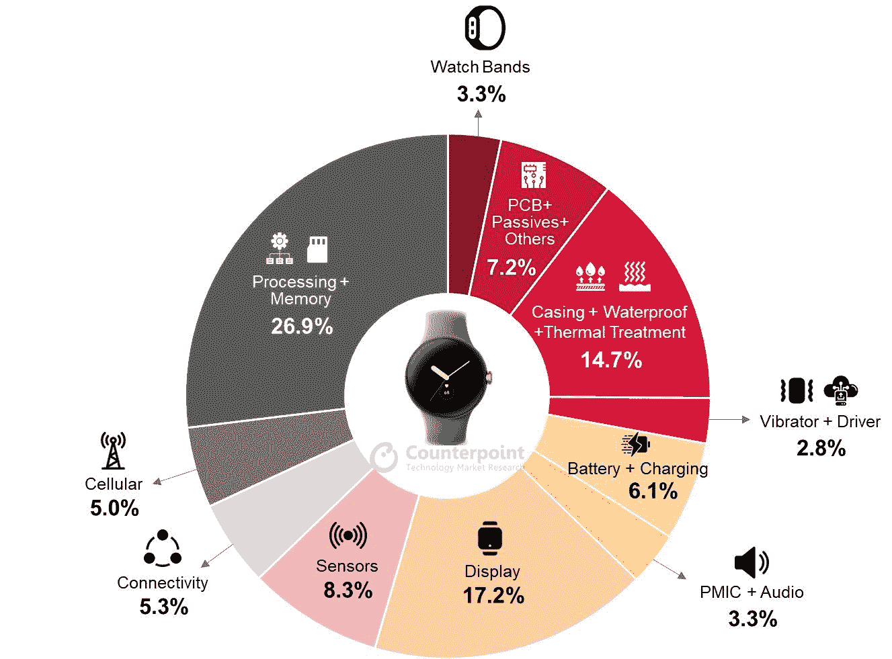

# Pixel Watch BoM 分析报告显示，谷歌的制造成本非常低

> 原文：<https://www.xda-developers.com/google-pixel-watch-bom-report/>

作为消费者，想知道制作一件优质产品到底花了多少钱是正常的。一份新报告揭示了谷歌制造自己的智能手表的第一次飞跃及其代价(或缺乏代价)。

根据 *Counterpoint* 的 BoM 分析，目前估计谷歌仅花费约 123 美元来制造一款 [Pixel 手表](https://www.xda-developers.com/google-pixel-watch-review/)。BoM 分析已经分解了可穿戴设备的每一部分，并确定该手表的处理器和内存内容相当于谷歌总成本的近 27%。令一些人叹息的是，Pixel Watch 确实使用了更老的三星处理器 Exynos 9110 来加强它。正如大多数人可能会假设的那样，如果该公司选择更好的芯片，Pixel 手表可能会提供更多的回报(更快更流畅)。唉，消费者必须接受 1.1GHz 双核芯片组。

还有 MIMXRT595S 协处理器以及 2GB RAM 和 32GB 内部 Kingstone 存储。

 <picture></picture> 

Source: Counterpoint

Pixel Watch 的每一部分占了谷歌必须支出的份额。

Pixel 手表的玻璃圆顶显示屏是下一个选择，估计占总制造成本的 17%。这款手表的 1.2 英寸显示屏分辨率为 450x450，由定制的 3D 康宁玻璃包裹。虽然这款设备在某些情况下可能没有问题(最多只有腰部高度)，但 Pixel 手表破裂仍是一种令人心痛的可能性。

Pixel 手表中的传感器被带入讨论，因为分析估计这些传感器占谷歌必须支付的成本的近 8%。由于 Pixel 手表与 Fitbit 的强大[集成](https://www.xda-developers.com/google-pixel-watch-fitbit-integration/)，以及两家公司为创造智能和无缝体验所做的工作，许多人都在关注 Pixel 手表。两种连接选项:LTE 蜂窝和 Wi-Fi 估计仅占总成本的 10%。

此外，294 毫安时的电池只能使用 24 小时左右，估计只占总成本的 6%。即使在我们对该产品的评测中，Pixel Watch 的电池寿命也很糟糕，如果你经常使用它，经常需要你全天充电。

希望在未来，谷歌将继续改善 Pixel Watch 的整体性能和体验。或许创造的成本会更接近消费者所能承受的成本。虽然带蓝牙/Wi-Fi 的 Pixel Watch 售价 349.99 美元，LTE 版本售价 399.99 美元，但成本上涨最有可能归因于与创建该设备有关的一切，如软件和其他技术。

来源:[对位法](https://www.counterpointresearch.com/bom-analysis-google-pixel-watch-costs-123-make/)