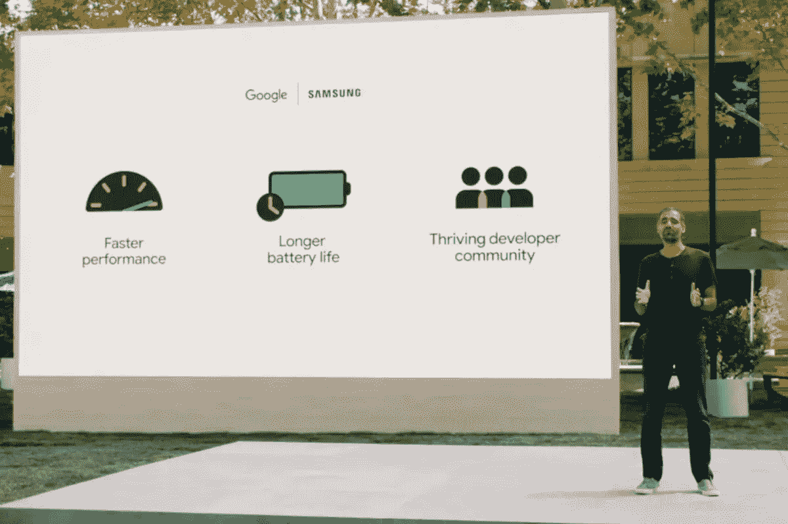
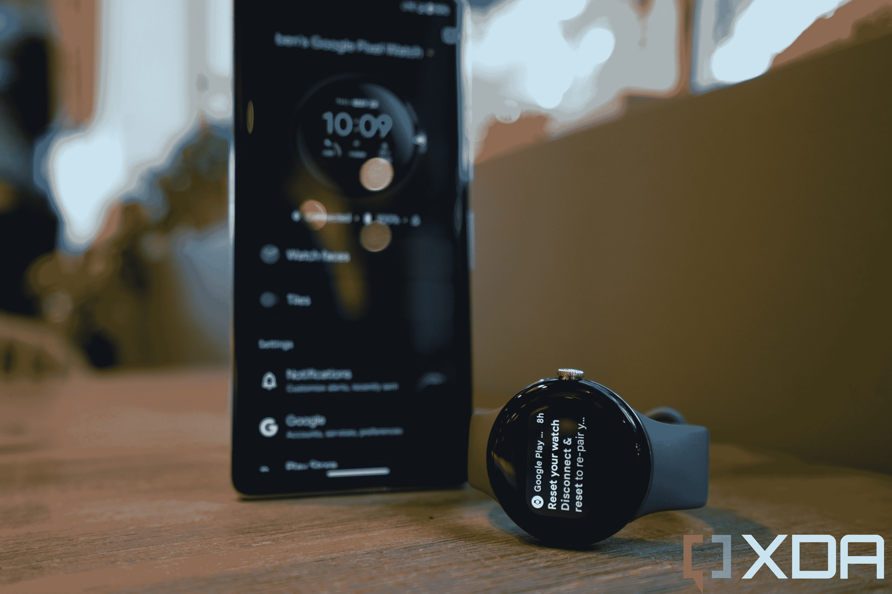
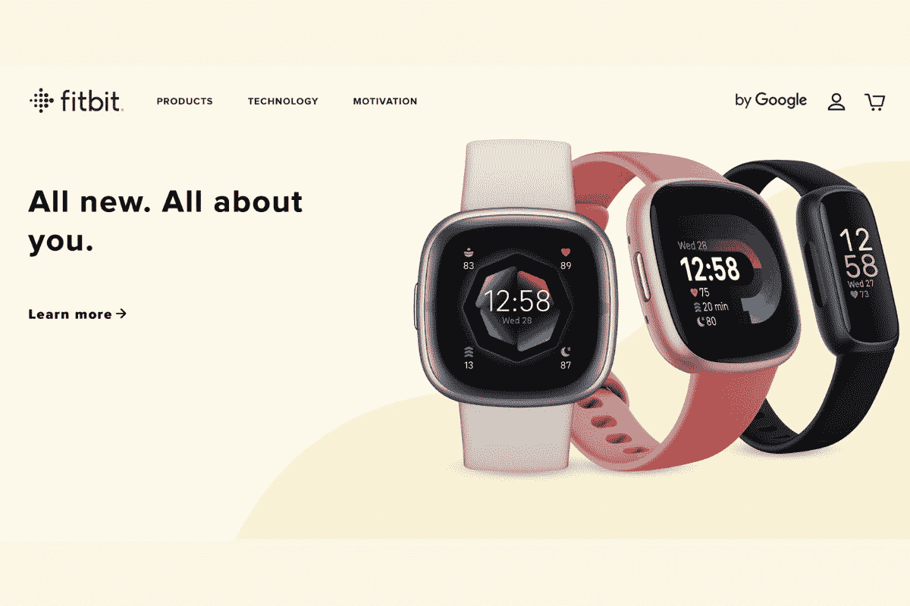

# 谷歌的 Fitbit 集成需要在 Pixel 手表上做得更好

> 原文：<https://www.xda-developers.com/google-pixel-watch-fitbit-integration/>

自 2014 年谷歌在谷歌 I/O 大会上推出 Android Wear(现名为 Wear OS)以来，谷歌一直在宣传其对智能手表的愿景，以及手腕佩戴的迷你电脑将如何丰富我们的生活。谷歌的想法是正确的——智能手表被认为是我们今天许多人不可或缺的日常工具——但将这个想法变成现实的是其他公司，尤其是竞争对手苹果。就连推动可穿戴行业崛起的另外两个品牌——三星和 Fitbit——也在很大程度上没有使用谷歌的可穿戴软件。

谷歌知道它必须纠正方向，它通过与三星合作推出去年的 Galaxy Watch 4 系列实现了这一点。谷歌基本上给了这家韩国科技巨头新 Wear OS 软件的独家优先权，并让 Bixby 继续作为这些手表的默认语音助手，这表明哪家公司在谈判中具有讨价还价的优势。但在谷歌/三星合作重振 Wear OS 的同时，谷歌还有另一个计划在进行中:彻底收购 Fitbit，这一过程耗时两年。

 <picture></picture> 

Google and Samsung's partnership being announced at Google I/O 2021

在接受 [*The Verge*](https://www.theverge.com/23389978/google-pixel-watch-wearables-fitbit-future) 采访时，谷歌硬件高级副总裁里克·奥斯特洛(Rick Osterloh)证实，收购 Fitbit 主要是为了其健康和健身平台，本质上，谷歌多年来一直想制造自己的智能手表，但要么不知道如何或没有耐心从头开始开发健康和健身软件，所以它一直等到有一个好的软件可供购买。

谷歌采取的这条捷径——我们将收购竞争对手，让他们为我们制造产品——似乎不是对付苹果的最佳方法，苹果的产品经过了改进和完善，主要是因为它在库比蒂诺管理严密，控制着产品开发周期的每个方面。这一点在谷歌有史以来第一款自制智能手表 Pixel Watch 上得到了体现。

上个月与出色的 [Pixel 7 系列](https://www.xda-developers.com/google-pixel-7-pro-review/)一起推出的 Pixel Watch 被认为是谷歌对 Apple Watch 的回应，Apple Watch 是一种可与 Android 设备(甚至只是 Pixel 设备)无缝合作的可穿戴设备，并按照谷歌的设想提供身临其境的 Android 体验。无论是定价、营销方式，甚至是硬件设计， [Pixel Watch 都旨在挑战 Apple Watch](https://www.xda-developers.com/google-pixel-watch-vs-apple-watch-series-7/) 。

但在连续三周每天使用谷歌 Pixel Watch 后，我认为 Pixel Watch 错过的比它击中的多，谷歌需要找到一种更好的方式来整合 Fitbit，不仅是作为 Pixel Watch 平台的一部分，也是在其 Alphabet 公司保护伞下的品牌明智之举，因为就目前而言，Fitbit 的整合正在损害 Pixel Watch 和 Fitbit 最近的产品。

## Pixel 手表的体验感觉并不顺畅，部分原因是 Fitbit 碍事

我喜欢 Apple Watch(当我在 Android 设备上时，我会主动想念它)的原因之一是它与 iPhone 的无缝协同，以及苹果作为一个整体的大生态系统。当我戴着 Apple Watch 时，它感觉像是 iPhone 的延伸。我可以在我的可穿戴手腕上留下语音备忘录，一秒钟之内，同样的备忘录就会同步到我的 iPhone 上。设置新的 Apple Watch，或者将现有的 Apple Watch 与新的 iPhone 配对，总是轻而易举的事情——只需扫描类似云的代码，点击几个提示，允许几个权限，手表就可以使用了。

 <picture></picture> 

The Google Pixel Watch thinking it's not paired to a Pixel 7 Pro when it is, in fact, paired.

Pixel 手表不提供这种体验。从一开始，设置体验就感觉脱节。当我用最近设置的 Pixel 7 Pro 第一次给 Pixel Watch 通电时，系统提示我下载 Pixel Watch 应用程序以开始配对。考虑到谷歌在*同一个活动*上发布了这些产品，并为视频评论者将这些产品*打包在一个盒子里，*Pixel Watch 应用程序没有预装在 Pixel 7 Pro 上似乎是一个疏忽。有了 Apple Watch，就不需要下载应用程序了——你需要连接的一切都已经在 iPhone 上了。

但这还不是全部。安装 Pixel Watch 应用程序只允许配对手表，并启动一些基本设置。在设置过程的中途，我被告知要安装 Fitbit 应用程序来设置健康和健身跟踪。在我开始使用 Pixel 手表之前，我必须*下载两个应用程序*？

因为我过去使用过 Fitbit 设备，所以我可以在应用程序安装后立即登录我的 Fitbit 帐户，并继续配对过程。如果你从未使用过 Fitbit 设备，准备好再花三分钟注册一个 Fitbit 账户。

### Fitbit 带来了出色的健康和健身跟踪功能，但它的同步系统是我测试过的所有可穿戴设备中最差的

我在最后一段提到我过去是 Fitbit 的用户，因为我认为它用我测试过的最准确的睡眠跟踪算法制造了坚实的硬件。那么我为什么不再戴 Fitbit 了呢？因为它的同步过程是我测试过的所有可穿戴设备中最慢、最不可靠的。它不仅速度慢(即使是像更换表带/表盘这样简单的任务也可能需要两分钟的同步时间，更新固件通常需要 30-40 分钟，在此期间，Fitbit 应用程序会要求你不要关闭应用程序)，而且往往不可靠和不可靠。事实上，多年来我一直在推特上谈论我对 Fitbit 软件的不满。

> 我非常喜欢 Fitbit 的产品，但它总是需要 14 次“同步”，至少需要三到四分钟才能与应用程序同步。
> 
> 还有更新固件？我的 Fitbit Versa 2 已经尝试了 40 分钟，哈哈。我甚至不能在手机屏幕更新的时候关掉它
> 
> —本(@ bencsin)[2020 年 3 月 21 日](https://twitter.com/bencsin/status/1241302186832711680?ref_src=twsrc%5Etfw)

对于 Fitbit 设备，等待 30-40 分钟进行固件更新并不罕见。

> 这提醒了我为什么我最终会每次都停止使用 Fitbit。
> 
> —理查德·赖(@ richardlai)[2020 年 6 月 15 日](https://twitter.com/richardlai/status/1272502640245538818?ref_src=twsrc%5Etfw)

由于 Pixel Watch 基本上依赖 Fitbit 软件来进行大部分的健身和健康跟踪，我可以确认 Fitbit 的利弊在 Pixel Watch 体验中是存在的。睡眠追踪精准，健身追踪正点。但所有恼人的 Fitbit 同步怪癖都在这里。尽管我的 Pixel 手表几乎一直都在 Pixel 7 Pro 旁边，但每次我进入 Fitbit 应用程序时，它都需要同步一分钟，然后当天的健身数据才会出现在应用程序上。我也必须去 Fitbit 应用程序，因为如果我试图检查最基本数据以外的任何东西(比如我想检查昨天的步数)，手表会要求我去手机上的 Fitbit 应用程序。

最糟糕的是，我的 Pixel Watch 出于某种原因认为它没有连接到我的 Pixel 7 Pro，尽管它显然是连接的。我的手表上有一个持续的、不可移除的通知，要求我重新配对手表一周。要重新配对，我必须在工厂重置手表(我已经做了两次)，所以我不会去打扰。我将只是盯着通知，声称在可预见的未来它是断开的(虽然它不是)。

无缝可穿戴体验，这不是。

## Fitbit 现在感觉像一个跛脚鸭品牌，其产品突然降级为子品牌

你知道 Fitbit 最近发布了一对新的智能手表吗？没有吗？我不怪你。Fitbit 在 8 月 24 日通过新闻稿宣布了这些产品，而就在前一天，这一宣布还被一条推特调侃了一番。这些不是公布的预算产品。不，它们是 Fitbit Versa 4 和 Sense 2，是(或曾经是)Fitbit 高端旗舰产品系列的继承者。特别是最初的 Fitbit Sense 是一款雄心勃勃的智能手表，配有业内第一个皮肤电活动(EDA)传感器来跟踪压力，它是在一个精致的虚拟主题演讲中推出的，看起来像是苹果或谷歌组装的东西。

 <picture></picture> 

Fitbit's new products, launched via a press release. 

这种非正式的发布并不是不应该的，因为 Sense 2 和 Versa 4 都是该系列中以前设备的字面降级，取消了 Wi-Fi、谷歌助手和第三方应用支持等关键功能。为什么会有公司这么做？因为 Fitbit 现在是谷歌的子品牌，子品牌永远不会比母品牌优先。Fitbit 手表实际上被削弱了，所以它们不会抢走 Pixel 手表的风头。

这是无可回避的:在可预见的未来，Pixel Watch 显然是谷歌投入可穿戴资源的地方。现在最好的 Fitbit 产品是小众产品，试图迎合更注重预算的细分市场。

## 好消息是什么？Pixel 确实解决了这个问题，所以 Pixel 手表也应该在 10-20 年后解决这个问题

目前，Pixel 手表仍然可以被认为是最好的 Android 可穿戴设备之一，因为标准不是很高。Pixel Watch 仍然提供了优质的设计，能够召唤谷歌助手和回复短信(这听起来像是一个基本的要求，但许多 Android 可穿戴产品无法做到这一点)，而且它在跟踪锻炼方面非常棒，前提是你要处理好 Fitbit 的同步问题。但它显然离谷歌想要的位置还很远 Android 的 Apple Watch，只是工作正常，感觉像是 Pixel 体验的无缝部分。

好消息是谷歌应该能够做到这一点，因为它在 Pixel 系列上做到了——经过了七代。我的同事亚当·康威和我最近都给 Pixel 7 系列打了高分(他评测了 Pro 型号，我测试了 [standard Pixel 7](https://www.xda-developers.com/google-pixel-7-review/) )，我们都分别得出结论，这些是谷歌最完美和最高端的设备，最终无愧于从第一天起就赋予 Pixel 的“Android 世界的 iPhone”这个绰号。

希望 Pixel 手表不会花七年时间到达同一个地方。

谷歌 Pixel 手表是谷歌的第一款智能手表，它有很多优点和缺点。